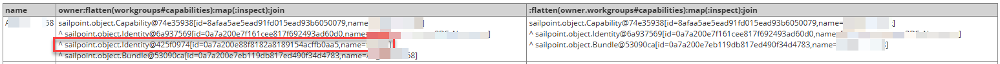
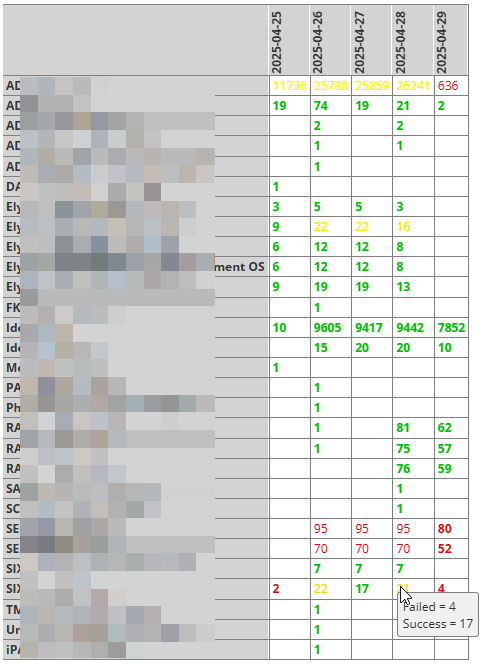
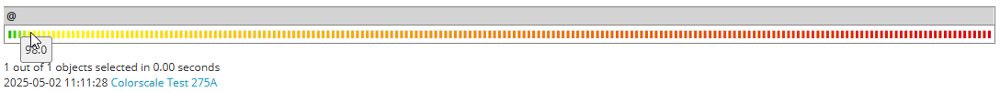
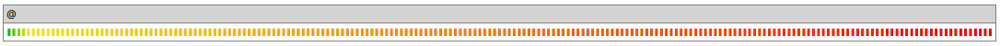
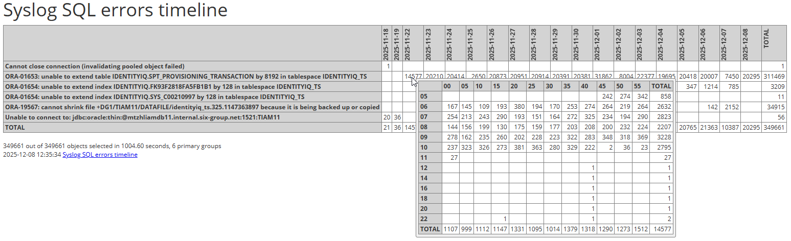
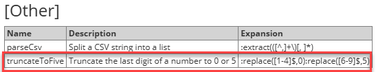
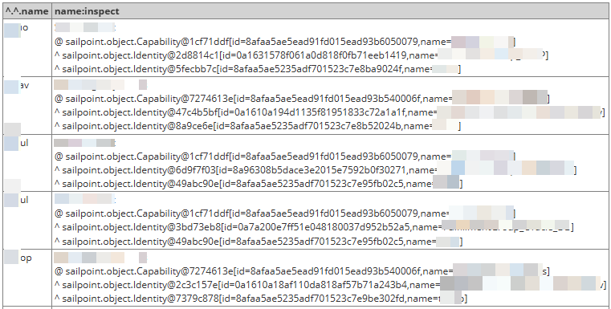
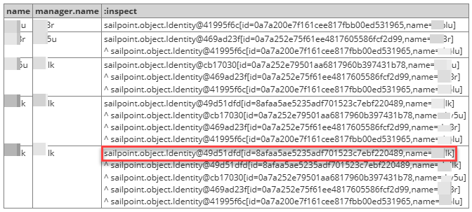

# OrionQL Reference

The OrionQL mini language allows to specify *expressions* that do queries and computations on objects and data. This document describes the constructs provided by OrionQL.

> [!IMPORTANT]
> Note that while there *is* special OrionQL functionality for IIQ objects (like accessing extended attributes), the OrionQL is not limited to IIQ objects but can be applied to *any* type of objects.

In the following, we will refer to OrionQL expressions simply as *expressions*.

> [!IMPORTANT]
> Note the following convention that is used in this reference:
>
> [Processing instructions](#processing-instructions) that *can* be used without arguments are referenced by their name only (Example: *[sort](#sort)*). All other instructions are referenced with a pair of parentheses appended to their name (Example: *[group()](#group)*).

Contents:

- [Expression syntax](#expression-syntax)
  - [Basic expressions](#basic-expressions)
  - [Composite expressions](#composite-expressions)
  - [Parenthesized expressions](#parenthesized-expressions)
  - [Literals](#literals)
    - [String literals](#string-literals)
    - [Number literals](#number-literals)
    - [Time offset literals](#time-offset-literals)
    - [Boolean literals](#boolean-literals)
    - [Null values](#null-values)
  - [Empty expressions](#empty-expressions)
  - [OrionQL operators](#orionql-operators)
    - [Arithmetic operators: +, -, \* and /](#arithmetic-operators-and)
      - [Date arithmetic](#date-arithmetic)
    - [Comparison operators: ==, !=, <, <=, > and >=](#comparison-operators-and)
    - [Expression alternatives: |](#expression-alternatives)
  - [Assignment syntax](#assignment-syntax)
  - [Escaping characters](#escaping-characters)
  - [Macros](#macros)
  - [Whitespace and comments](#whitespace-and-comments)
- [Attribute accessors](#attribute-accessors)
  - [Tolerant attribute access](#tolerant-attribute-access)
  - [Pseudo attributes](#pseudo-attributes)
  - [Back-navigation](#back-navigation)
    - [The this reference](#the-this-reference)
    - [Parent references](#parent-references)
    - [Understanding and debugging back-navigation chains](#understanding-and-debugging-back-navigation-chains)
  - [The unwrap operator](#the-unwrap-operator)
- [Processing instructions](#processing-instructions)
  - [Object lookup and database query](#object-lookup-and-database-query)
    - [Lookup types](#lookup-types)
    - [Parameterless lookups](#parameterless-lookups)
    - [Parameters](#parameters)
      - [Query type](#query-type)
      - [Attributes clause](#attributes-clause)
      - [Filter template](#filter-template)
      - [Query options](#query-options)
    - [Examples](#examples)
    - [Possible future extensions](#possible-future-extensions)
  - [Collection operations](#collection-operations)
    - [map()](#map)
    - [flatten()](#flatten)
      - [Standard flatten operation](#standard-flatten-operation)
      - [Recursive flattening](#recursive-flattening)
      - [Combined operation](#combined-operation)
      - [Referencing the parent iterations](#referencing-the-parent-iterations)
      - [Flattening as pattern matching](#flattening-as-pattern-matching)
    - [union()](#union)
    - [join](#join)
    - [sort](#sort)
    - [select()](#select)
    - [evict() (not yet implemented)](#evict-not-yet-implemented)
    - [size](#size)
  - [Aggregation and indexing instructions](#aggregation-and-indexing-instructions)
    - [count](#count)
    - [group()](#group)
    - [index()](#index)
    - [get()](#get)
    - [sum, avg, max and min](#sum-avg-max-and-min)
  - [Text manipulation](#text-manipulation)
    - [format() and html()](#format-and-html)
    - [link()](#link)
    - [heat](#heat)
    - [table() and htable()](#table-and-htable)
    - [grid](#grid)
    - [barchart and linechart](#barchart-and-linechart)
    - [pprint](#pprint)
    - [toXml](#toxml)
    - [parseXml](#parsexml)
    - [match()](#match)
    - [extract()](#extract)
    - [replace()](#replace)
    - [upcase and downcase](#upcase-and-downcase)
  - [Miscellaneous instructions](#miscellaneous-instructions)
    - [env](#env)
    - [switch()](#switch)
    - [partition() (not yet implemented)](#partition-not-yet-implemented)
    - [construct()](#construct)
    - [now and date()](#now-and-date)
      - [Date offset calculations](#date-offset-calculations)
      - [Date parsing](#date-parsing)
      - [Date literals](#date-literals)
    - [cache(), recache() and swapcache()](#cache-recache-and-swapcache)
    - [inspect](#inspect)
    - [cluster (not yet implemented)](#cluster-not-yet-implemented)
    - [eval() (not yet implemented)](#eval-not-yet-implemented)
- [Templates](#templates)
  - [Quoting](#quoting)
  - [Format](#format)
  - [Default value](#default-value)
  - [Conditional formatting](#conditional-formatting)

# Expression syntax

OrionQL provides a comprehensive set of constructs that can be used to access and transform object data – so-called *accessors*. They are described in their own sections about [attribute accessors](#attribute-accessors) and [processing instructions](#processing-instructions), which make up the main content of this document. *This* section describes how accessors can be combined into *OrionQL expressions*.

> [!IMPORTANT]
> A*ccessors* are called this way since, on an abstract level, they *access* some information based on the object given to them. This is especially apparent for [attribute accessors](#attribute-accessors), which *access* object attributes, but on an abstract level *any* computation can be considered as *accessing* some information that is present in the data *in some way*.

Here is a short summary of the OrionQL syntax – the details will be covered in the following subsections:

- The central and most used construct in OrionQL are [basic expressions](#basic-expressions). They use an intuitive and compact, left-to-right readable *chain* notation to connect accessors into processing pipelines that step by step transform input into output.
- Basic expressions can be combined using operators, forming [composite expressions](#composite-expressions).
- Composite expressions can be enclosed into [parentheses](#parentheses) to use them anywhere a basic expression or even a single accessor is expected.

In addition to the above, OrionQL provides a notation for [literals](#literals).

To give you an upfront impression of what to expect in this guide, here are some expression examples:

**Expression examples**

```
owner
owner.email
targetId:Identity
(:now-created)/3600.0
```

## Basic expressions

In its most basic form, OrionQL expressions are chains of accessors connected by dots:

> [!IMPORTANT]
> In front of a *processing instruction*, the dot is redundant and normally omitted – the leading colon of the processing instruction naturally serves as the delimiter between the accessors.

The chained accessors form a pipeline which from its left takes as input the object to which the expression is applied and on its right end emits the result of the expression evaluation. As the data passes through this pipeline from left to right, the result of each accessor forms the input of the successive one. Example:

```
owner.displayName
```

This expression returns the *displayName* of the *owner* of the input object – by first taking from the input object the *owner*, and from that one the *displayName*.

> [!IMPORTANT]
> As soon as an accessor in the chain returns `null`, the pipeline execution stops and the result of the overall expression is `null`.

As mentioned in the introduction, OrionQL provides two types of accessors, which are described in their own sections:

1. *[Attribute accessors](#attribute-accessors)* access object attributes. They are represented by the name of the attribute they access.  
   In the examples above `owner`, `email` and `targetId` are attribute accessors.
2. *[Processing instructions](#processing-instructions)* create their result by applying some function to the input object. They are represented by a colon followed by the processing instruction's name and possibly a pair of parentheses with parameters.  
   In the example above, `:Identity` is a processing instruction.

> [!IMPORTANT]
> The *first*, and in most cases the *only* accessor in a basic expression can be a [literal](#literal).

Besides [back-navigation](#back-navigation) references provided by OrionQL on each object, which are accessed through attribute accessors, it's especially the *[processing instructions](#processing-instructions)* that make up for most of OrionQL's power. Describing them will fill the main part of this document.

## Composite expressions

By combining basic expressions with operators, composite expressions are formed:

The following operators are available:

|   Precedence | Operators            | Function                 |
|-------------:|:---------------------|:-------------------------|
|            1 | \*, /                | Multiplication, Division |
|            2 | +, -                 | Addition, Subtraction    |
|            3 | ==, !=, <, <=, >, >= | Comparison               |
|            4 | |                    | Expression alternative   |

Composite expressions are evaluated from left to right, obeying the precedence listed in the table, which follows the rules known from arithmetic. The operators are explained in [OrionQL operators](#orionql-operators).

## Parenthesized expressions

By enclosing a composite expression in parentheses, it can be used anywhere an accessor or a basic expression is expected.

An obvious use for this is controlling the operator precedence in arithmetic calculations as known from mathematics and other programming languages:

```
(:now-created)/3600.0
```

However, parentheses are often used also around expression alternatives.

## Literals

OrionQL provides a notation for literals of various types that can be used anywhere a basic expression is expected. Technically, a literal is an accessor that always returns the same value.

> [!IMPORTANT]
> Literals can be followed by other accessors, what can be useful in certain cases. But naturally they can only be located at the *start of a basic expression*.

These are the literal types provided by OrionQL:

### String literals

A string literal is character sequence enclosed in double quotes. Double quotes and other special characters can be included into string literals by following the escaping rules described [here](#here).

**Examples**

```
"abc"
"first line\nsecond line"
"Say \"hello\"!"
```

### Number literals

Number literals allow to specify Integers, Long integers and Doubles using the familiar notation known from, e.g., Java:

**Examples**

```
15
-12L
1.0
```

### Time offset literals

Time offset literals provide a dedicated notation to express time intervals in seconds, minutes, hours and days (combinations are accepted) to use them in [date arithmetic](#date-arithmetic):

**Examples**

```
1h
1h10m
```

### Boolean literals

Boolean values can be specified using the literals `true` and `false`.

### Null values

The literal `null` specifies a `null` value.

## Empty expressions

An expression that contains no accessor at all is also a valid OrionQL expression. It returns its input.

The natural representation of an empty expression is the empty string. It can be used wherever the syntax permits an empty string – for instance in [template substitution placeholders](#template-substitution-placeholders):

```
${}
```

 Where the syntax does not allow an empty string, an empty expression can be specified by either an empty pair of parentheses or by using a single dot:

**Empty expressions**

```
()
.
```

Which version is used is probably a matter of taste, but I recommend the single dot as it is the most intuitive representation for the *current input object*. The following example adds a time offset to the input object (which is expected to be a `Date`):

```
.+1h
```

> [!IMPORTANT]
> Syntactically, the dot is *two* empty expressions connected by a dot. However, since both empty expressions are optimized away when the expression is compiled, what remains is an empty expression.

## OrionQL operators

OrionQL provides the following operators to combine [Basic expressions](#basic-expressions) into [Composite expressions](#composite-expressions):

### Arithmetic operators: +, -, \* and /

Arithmetic operators allow to combine basic expressions using Addition, Subtraction, Multiplication and Division. They are used as known from mathematics, however the following specific rules apply:

- Strings that are valid numbers are implicitly converted into the correct number type (Integer, Long integer or Double).
- Integer and Double types can be mixed in arithmetic operations, causing the result to be of type Double.
- No arithmetic operations on Long integers are supported except adding/subtracting them to/from a `Date` (see [Date arithmetic](#date-arithmetic) below).
- Multiplying a number (Integer, Double or a string that is a valid number) as the left operand with a string that is *not* a valid number as the right operand will result in a string that contains the right operand repeated the specified number of times (you may know this from Python).
- If one of the operands is `null`, the result is also `null`.

#### Date arithmetic

In addition to the *calendar based* offset calculations provided by the [now() and date()](#now-and-date) instructions through their *offset* parameter, OrionQL supports the following calculations with `Date` values:

1. Subtracting two `Date` values returns the time distance between them in seconds.
2. Adding or subtracting an Integer to/from a `Date` adds/subtracts the respective number of seconds to/from it.[^\*]
3. Adding or subtracting a Long integer to/from a `Date` adds/subtracts the respective number of milliseconds to/from it.[^\*]

[^\*]: Usually, instead of adding/subtracting numbers to/from `Date` values, the time offsets are specified using the special time offset literals syntax explained in [time offset literals](#time-offset-literals):

**Examples**

```
created+10s
:now-1h
```

> [!IMPORTANT]
> Note the subtle difference between the above arithmetic calculations and the *calendar based* offset calculations provided by the [now() and date()](#now-and-date) instructions:
>
> - :now-1h
> - :now(-1h)

### Comparison operators: ==, !=, <, <=, > and >=

All six comparison operators return a boolean result. The following rules apply:

- Comparison for (in)equality using the operators `==` and `!=` is defined for all types including `null`.
  - If one of the operands is a string, the other one is also converted to a string before comparison.
  - Otherwise only operands of the same type can compare equal.
- The true comparison operators ==, !=, <, <=, > and >= operate only on *comparable* types (that is, numbers and strings).

### Expression alternatives: |

Expression alternatives are a powerful and pragmatic way to handle situations where data is to be taken from one of several sources depending on which one can deliver it. Here are two examples:

**Examples**

```
owner|application.owner
:sort(modified|created desc)
```

The expression alternative works as follows: All expressions that have been chained together using pipe symbols (|) are evaluated from left to right until the first one returns returns a non-`null` value. This value is then returned as the result of the alternatives chain, and no more expressions are evaluated.

> [!IMPORTANT]
> Read the pipe symbols (|) as *or*, working similar to Python's `or` operator.

A frequent application of expression alternatives is to ensure a non-`null` value by supplying a literal as alternative:

```
type|"--null--"
```

> [!IMPORTANT]
> Expression alternatives can also be used as a quick (and sometimes dirty) way to handle object polymorphism – that is, for getting information from different types of objects that may appear as input. A more formal and correct way for this might be the [switch](#switch) instruction.

## Assignment syntax

Certain OrionQL instructions, e.g. [construct()](#construct), allow or require expressions to be prepended by an assignment-like syntax:

This syntax is used to attach additional information to the expression that will be examined by the instruction when using the expression. In case of the mentioned [construct()](#construct) instruction, for instance, this information determines to which key(s) the expression result will be assigned.

> [!IMPORTANT]
> This syntax can also be used by application code. The [Generic Query](/spaces/OCA/pages/268671184/The+Generic+Query), for instance, uses it for the definition of synthetic attributes, aggregation and rule arguments, and for naming output table columns.

## Escaping characters

OrionQL uses certain characters as syntax elements. For example:

- A dot serves as attribute delimiter.
- A comma can serve as the separator between parameters in a parameter list.
- A closing parenthesis finishes a construct opened with the corresponding opening parenthesis.
- A pipe symbol separates expression alternatives.

Whenever a character that would be recognized by OrionQL as syntax element needs to be specified, this can be done by escaping it with a backslash (`\`). The backslash character, consequently, must be escaped too. Examples:

```
arguments.TaskDefinition\.runLengthAverage
:match(\\busr[0-9a-z]+\\b)
```

The first example retrieves the `TaskDefinition.runLengthAverage` attribute from a `TaskDefinition` (yes, they *have* a dot in the attribute name). The regular expression in the second example uses the word boundary matcher `\b` to restrict the expression from matching parts of a word.

Note however, that thanks to the syntax awareness of the [templating mechanism](#templating-mechanism), embedding a *pair* of literal parentheses into a formatting template doesn't require the closing parenthesis to be escaped to prevent it to be interpreted as the `format` instruction's closing parenthesis, so the following code works fine:

```
assignedRoles:map(:format(${displayName} (${name})))
```

However, you might need escaping in special cases like this one:

```
owner:format(${displayName} \"${nickname}\"))
```

> [!IMPORTANT]
> Note: When embedding OrionQL expressions into Java or Beanshell code like OrionQL rules, in addition to that Java's escaping rules for string literals must be applied, so every double quote and evera backslash have to be prepended by a backslash. As a particular consequence, any backslash has to be doubled again. So, the single backslash used in the word boundary matcher `\b` in the regular expression from the example above would turn into four backslashes! (If you are not scared enough, imagine the eight backslashes you have to write to match a single literal backslash from input using a regular expression!)

OrionQL recognizes the special escape sequence `\n`, translating it into a newline character. This can be used to embed newline characters into [formatting templates](#formatting-templates). In addition, Unicode characters can be specified using the special escape sequence `\xxxx` where *`x`* is a hexadecimal digit.

## Macros

OrionQL allows to define and reuse code snippets through a macro mechanism. This mechanism performs a simple text substitution, replacing macro references with their expansions. Macro parameters are not supported.

> [!IMPORTANT]
> To use macros, the application code needs to provide a macro library to OrionQL. (Consult the application to see which macros are available.)

Macro references consist of the macro name enclosed in a pair of dollar signs. The following example uses the macro `toDayString` to format the *created* attribute to an ISO day string (yyyy-MM-dd):

```
created.$toDayString$
```

For this, the macro expansion of `toDayString` is defined as follows:

```
:format(${%yyyy-MM-dd})
```

As a result, the above code is expanded during compilation into:

```
created.:format(${%yyyy-MM-dd})
```

> [!IMPORTANT]
> Note the redundant dot before the colon starting the processing instruction. It wouldn't normally be written in regular OrionQL code although syntactically allowed. During compilation it is optimized away.

Macro references are allowed wherever an accessor is expected, that is, at the start of a basic expression and after a dot. In addition, macro references are also recognized in [formatting templates](#formatting-templates). When the expression compiler encounters a macro reference, it replaces it with the *expansion text* and continues compilation starting with the substituted text.

> [!IMPORTANT]
> Since they perform only plain text substitution, macros provide considerable freedom about what they can expand into. Particularly, when allowed by the syntax of the construct containing the macro reference, macro expansions can even contain multiple expressions and [assignment syntax](#assignment-syntax). This means, it is, for instance, possible to define a macro containing *several* column definitions that can be used in the [Generic Query's](/spaces/OCA/pages/268671184/The+Generic+Query) *Output* field as well as in a [table()](#table) instruction.

Macros can contain references to other macros. Be sure however to not define macro loops – this will lead to infinite expansion!

## Whitespace and comments

For better readability, OrionQL code can be laid out on multiple lines in an indented format: If a line ends with a backslash (`\`), OrionQL ignores the line break together with any whitespace following it at the start of the next line.

> [!IMPORTANT]
> There are certain places where syntax elements are *required to immediately follow each other*, not allowing for escaped line breaks in between. These cases are noted in the documentation below.

The following code shows how this can be used to enhance code readability:

```
assignedRoles:map(\
 :format(${displayName} (${name}))\
)
```

OrionQL will compile this code as if it were provided in its raw form:

```
assignedRoles:map(:format(${displayName} (${name})))
```

In addition to escaping line breaks, OrionQL allows comments. Similar to SQL, two dashes (`--`) are used as the leading delimiter. Comments can be either:

- *line comments*, extending until the end of line, or
- *inline comments*, extending until a semicolon (`;`)

When OrionQL finds a comment, it also ignores the whitespace surrounding it as follows:

- space characters preceding the comment are ignored
- any whitespace following the comment is ignored

> [!IMPORTANT]
> The whitespace-eating around comments allows:
>
> - to visually separate comments from the surrounding code
> - to keep the indentation in code blocks containing line comments
>
> (Stating the latter differently, an end-of-line line *comment* acts like an end-of-line *backslash*.)
>
> Another implication is that line-end comments may optionally be terminated by a semicolon.
>
> However, keep in mind when using training comments, that comments eat *any* number of line breaks that follow them, so they cannot be used as the delimiter to start a new expression. Particularly, do never use trailing comments in macros!

The following example demonstrates *line* and *inline* comments:

```
-- Macro toXmlExtended
:format(\
 ${:toXml -- standard XML representation (it ends with a line break -> no need to add another one); }\
 ${       -- append all attributes that contain XML text
  attributes\
  :select(like("value", "^<\\?xml"))\
  :map(:format(${-- attribute name; key} = ${value}))\
  :join()  -- avoid empty lines between XMLs (XMLs already end with line break)\
  ,}\
)
```

> [!IMPORTANT]
> Comments are only permitted in OrionQL code but not in *embedded* text like CerberusLogic selectors, join glue, formatting templates or placeholder format specifications and default values.

# Attribute accessors

Attribute accessors are at the heart of OrionQL, obtaining data by accessing object attributes.

> [!IMPORTANT]
> In case of a `Map`, an *attribute access* is interpreted as a *map access* using the *attribute name* as the *key*.
>
> Note that extended attributes are accessed transparently like regular attributes: If the object class provides *no* getter method for the specified attribute *but* a method `getAttributes()`, an extended attribute is assumed and `getAttributes()` is called, followed by a *map access*. (The downside of this is that misspelled attribute names will be detected only for classes without extended attributes.)

An attribute access is written by specifying the respective *attribute name*:

**Examples**

```
owner
disabled
personnel_area
```

The examples are equivalent to the following Java API calls (the getter methods are invoked using the Java reflection API):

- `getOwner()`
- `isDisabled()`
- `getAttributes().get("personnel_area")`

> [!IMPORTANT]
> Note that some classes in the IIQ API *seem* to have extended attributes when looking at the XML that contains an `<Attributes>` element, but in reality they don't have a `getAttributes()` method. Instead, the `<Attributes>` map is accessed using a different method like `getArguments()` or `getVariables()` (see, for instance, `TaskDefinition` or `Workflow`). So, to access the desired values, the maps need to be accessed explicitly:
>
> `arguments.name`  
> `variables.name`
>
> This explicit access also works for classes with extended attributes by accessing the attribute `attributes`, however there is not much reason to do so.

Some IIQ object classes provide getters taking a Sailpoint *Resolver* as parameter to do lazy loading, these are supported as well. However, if a parameterless getter *also* exists, it will take precedence (Example: `ProvisioningPlan.AbstractRequest.getApplication()`). It is nevertheless always possible to get at the referenced object or object collection by following the attribute access with a [lookup](#lookup).

Besides the getters discussed up to now, several classes in the IIQ API provide getters taking a parameter that is not a *Resolver* but is used to select the data returned by the getter. Take as an example `Identity.getActiveRoleAssignments()`. To invoke getters of this type, the attribute name needs to be followed with a pair of parentheses containing an expression that returns the value to invoke the getter with. Example:

```
activeRoleAssignments(^.name)
```

This expression returns all active role assignments of the `Identity` object it is applied to for the role that is the [parent](#parent) of it.

With all variations, attribute accessors are described by the following syntax diagram (the question mark will be explained in the subsection below):

## Tolerant attribute access

In certain cases, the objects supplied to an accessor may be of different types of which some do not define the attribute of interest, at the same time not defining also a `getAttributes()` method. Or a [parent navigation](#parent-navigation) needs to be done, not knowing if there *is* a parent. To avoid getting an exception in such cases but instead receive a `null` value, the attribute name can be followed by a question mark.

This indicates to the attribute getter that you know what you are doing, and it will return `null` in these cases instead of throwing an exception to warn you about the possible error.

## Pseudo attributes

The OrionQL runtime allows applications to "implant" additional attributes into the objects submitted to expression evaluation. These *artificial attributes* are accessed just like the regular attributes (and take precedence over them in the case of identical names). Consult the documentation of the application hosting your expressions about which artificial attributes are available in your case.

> [!IMPORTANT]
> Technical background
>
> For expression evaluation, the OrionQL runtime wraps the objects into wrapper objects (`OrionQL.Proxy`). Besides their primary function of making OrionQL applicable to any object, the proxy objects also carry context and other information used during expression evaluation like the [back-navigation](#back-navigation) references and caches. The proxies also carry the artificial attributes.

## Back-navigation

While the expression evaluation advances through the accessor pipeline (see section [Expression syntax](#expression-syntax)), it does sort of *navigating* the object hierarchy, changing the *current object* from stage to stage. It starts with the object the expression was applied to and reaches the expression result after the last stage. Since this way every stage has as input only the result of the preceding stage, any other information that was accessible to the earlier stages is out of reach. (This is especially true when iterating over child collections since the object operated upon in this case is a *single element* of the child collection, and neither the parent object nor the collection itself are in scope any more.)

To preserve access to this information, the OrionQL runtime keeps track about the path traversed by the expression evaluation so far and provides the following two mechanisms to navigate back.

### The `this` reference

The pseudo attribute `@` can be used to access the object to which the entire expression was applied to:

```
@
```

Note that except in special cases where you *want* to throw away the evaluation result of the preceding part of the expression, a `this` reference makes sense only at the start of an expression (either the whole expression or one embedded in it in a nested construct).

There are two uses for a `this` reference:

1. In a nested expression, to get at the initial input object. This effectively *undoes* the navigations done before the construct that contains the expression.  
   An example would be simple conditional formatting: The expression  
   `owner:format(${@.name} is owned by ${name})`  
   returns `null` if `owner` is `null`, as opposed to  
   `:format(${name} is owned by ${owner.name})`  
   which *always* renders the template.
2. To specify a non-empty expression when the input object *itself* is needed, that is, in fact *no* expression should be applied to it. You will often use this in the [Generic Query](/spaces/OCA/pages/268671184/The+Generic+Query).  
   Note that in cases where an empty expression is syntactically also allowed like in [formatting templates](#formatting-templates), both variants are often equivalent – however there is an important but subtle difference between them to never forget about: Since `@` undoes any navigation performed *before* the construct containing the expression, they yield different results, if there is one. This is exactly the use case 1 above, see the example. As a general rule, from a notational perspective using `@` is preferred over the empty expression when both are equivalent, as it is a more prominent representation of the input object.

Note that the `this` operator always returns a proxy (see the info box *Technical background* in the section [Pseudo attributes](#pseudo-attributes) above. In most cases you won't need to care about this, however for the other cases there is an explicit [unwrapping operator](#unwrapping-operator).

### Parent references

From the current object in an iteration, it is possible to reach out into the outer object tree by using the *parent navigation* pseudo attributes that are available for every object.

> [!IMPORTANT]
> The object from which the collection currently iterated upon was retrieved by a linear *attribute access chain* is called the *parent* of the current object.

Besides accessing the *direct* parent of the current object via the pseudo attribute `^` and possibly going further up by *chaining* such navigations with dots like for *any* attribute access, additional constructs are available to allow larger "jumps" in the parent chain. In summary, the following parent navigations are available:

- `^` navigates to the immediate parent of an object (`^.^` will navigate to the parent of the parent and so on)
- `^^` navigates directly to the topmost object
- `^className` navigates up the parent chain directly to the object of the given class
- `^^className` navigates up the parent chain directly to the *topmost* object of the given class

> [!IMPORTANT]
> Note that if it is *expected* that the parent navigation may fail, the navigation specifier can be followed by a [question mark](#question-mark) to have it return `null` instead of throwing an exception when there is no parent to navigate to.

Examples:

```
^.displayName
^.^.^.displayName
^^.displayName
^Identity.displayName
^^Identity.displayName
```

Note that the *parent object* is generally *neither* the collection containing the object, nor the object that *owns* this collection, but the object from which the collection was retrieved through a *linear access chain* (like `owner.workgroups`). As a result, parent references always reach back as far as they can, giving access to the object rooting the whole object tree of the outer scope.

> [!IMPORTANT]
> This means that parent relationships are exclusively established by *iterations* and thus generally *don't* reflect the *object model's* parent relationships. Instead, they reflect the *iteration hierarchy of your expression*.

Let's look at an example, considering the following access path from an `IdentityRequest` to the list of the attribute requests carrying each role request:

```
provisionedProject.iiqAccountRequest.attributeRequests
```

When iterating over these attribute requests, each of them will have the `IdentityRequest` as its parent, not the IIQ account request as in the object model. So, within the iteration, `^` will get you directly to the `IdentityRequest` object – the object you were dealing with before. This is not only intuitive, it also gives you access to everything that was available from there using a single parent navigation instead of up to four if parent references reflected the object model. The account request then, for instance, can be accessed by using `^.provisionedProject.iiqAccountRequest`.

Establishing parent relationships based on the *iteration topology* of your expression instead of the *object model* prevents polluting expressions with uncountable parent navigations without limiting the general reachability of the objects contained in the entire object tree.

More often than not, your expression is evaluated by application code that itself does some iteration over, for instance, a query result. It may even do nested iterations. If everything is programmed correctly, the parent chain extends from within your expressions into these iterations as well, giving you access to the application code's objects on top of what was given to your expression directly.

Note that parent references always returns a proxy (see the info box *Technical background* in the section [Pseudo attributes](#pseudo-attributes) above. In most cases you won't need to care about this, however for the other cases there is an explicit [unwrapping operator](#unwrapping-operator).

### Understanding and debugging back-navigation chains

It can be demanding to understand the parent relationships in complex cases like nested iterations that might span multiple instructions or even reach outside the actual OrionQL code. To help with this, OrionQL provides the special *[inspect](#inspect)* instruction which prints out parent chains.

## The *unwrap* operator

As stated above, [back-navigation](#back-navigation) references always return a proxy. Remember from the info box *Technical background* in the section [Pseudo attributes](#pseudo-attributes) above, that to evaluate expressions, objects are wrapped into OrionQL proxies.

Normally you don't have to worry about the wrapping stuff since OrionQL handles it for you transparently, unwrapping the object before returning the result of the expression evaluation. Also, as soon as you access other data from the reference like e.g. an attribute, the result will anyway be a real object, not a proxy. However, there are cases where you need to be aware of the details that are going on behind the scenes.

> [!IMPORTANT]
> When OrionQL expressions are evaluated, proxies are always passed through the expression pipeline verbatim. This is important since they carry important information in form of the parent chains that would get lost otherwise. Suppose feeding the result of a [flatten()](#flatten) instruction into [select()](#select) to select an object from an object tree. In most cases losing its parent chain would be undesirable. (Of course, if the select() instruction is the last one in the expression, the object *will be* unwrapped before the expression result is returned, meaning you can use the parent information only *within* the expression.)

In situations where, within an expression, you need to unwrap an object from its proxy, you can use the *unwrap* operator. It returns its input object, unwrapping it if necessary:

```bash
@​@
```

The unwrap operator, if needed, can be applied to any result obtained so far like `@.@@` or `^.@@`. Occasions where explicit unwrapping is really needed are rare however, I need to come up with a good example.

# Processing instructions

As stated above, the processing instructions built into OrionQL make up for most of its power. They will be described in the following sections. We will refer to them in the following text as *instructions* or *operations*, dependent on the context.

## Object lookup and database query

The lookup instruction uses its input to lookup data in the database or an application provided lookup table. The simplest and most prominent example is translating a name or ID into the corresponding IIQ object.

> [!IMPORTANT]
> Caching database query results
>
> Note that, in addition to the caching done by IIQ/Hibernate, for non-streaming queries the OrionQL engine caches all database results for later use, so the same query will never be done twice during the lifetime of the cache. The latter is controlled by the application code executing OrionQL code in a balance of memory consumption and performance.
>
> The caching has important implications regarding the composition of the overall code into which OrionQL expressions are embedded: While it is always faster to query a single object attribute than to load the entire object and get the attribute from it, so it is generally a good idea to optimize the expressions accordingly, the gain will turn into a loss if there is *another* expression in the same execution that loads the object anyway since in this case *two* database accesses will be done instead of only one that could serve both uses. In such a situation, instead of optimizing the query, the expression that needs only a single attribute should also access the whole object and query the attribute from *it*. (The same applies if you don't need the object but several of its attributes: Use the same lookup fetching *all* needed attributes in all places, and access the needed attribute from the returned `Map`.)

Due to its versatility, the lookup instruction is one of the most complicated ones, so we will provide a syntax diagram for it upfront and look at the details in the following sections:

> [!IMPORTANT]
> Note that no [whitespace](#whitespace) is allowed before the `?`, `>` and `[` [query type](#query-type) flags as well as before the `{` character opening an [attributes clause](#attributes-clause).

For a better overview, the [attributes clause](#attributes-clause) was inlined in the diagram while, the options clause was moved to its own syntax diagram:

Let's discuss the lookup constructs permitted by this syntax. We will walk the diagram from left to right.

### Lookup types

Looking at the syntax diagram from its left end, two main types of lookup instructions can be distinguished:

1. lookups identified by a (Sailpoint Object) class name
2. lookups identified by the name of an application provided lookup table

The first type is the most common case and performs a database query, while the second type performs a lookup in an application provided lookup table (a `Map` submitted by the application code to the OrionQL runtime using `OrionQL.Proxy.setLookupTable()`) to be used for application defined value translations or prefetching data.

Both types are distinguished by the case of the first letter after the colon. An uppercase letter signals a class name (e.g. `Identity`) while a lowercase letter signals a lookup table.

### Parameterless lookups

In the easiest case, the lookup instruction consists of only the class name respective lookup name and has no parameters. This causes the input object to be used as the lookup key directly, interpreting it as the name or ID of the object referenced from the database (the input must be a `String` in this case) or as the key to look up in the application provided lookup table (in this case, the input must match the key type of this `Map`). Examples:

```
:Identity
:trouxApplicationName
```

The first example will load from the database the `Identity` object that is identified using the input as name or ID. The second example will translate the input (probably a `long` value referencing a `SIX_EAM_APPLICATION`) to the Troux application name using an application provided mapping named `trouxApplicationName`.

### Parameters

To steer the behavior of the lookup instruction in more complex scenarios, parameters are used. For application defined lookups, only a key [template](#template) can be specified, allowing to format several values into a composite key string. In the following example, taking an `IdentityEntitlement` as input, an entitlement is retrieved from the lookup table *entitlement* using a composite key that consists of *endpoint*, *attribute name* and *value* separated by double colons like this (the composite key format is defined by the application code):

`AD::memberOf::CN=...`

```
:entitlement(${appName}::${name}::${value})
```

Having discussed *key templates*, the complexity of application defined lookups is already exhausted. The remaining discussion will therefore be about database queries only. (You will probably *never* use anything else, btw..)

#### Query type

Immediately after the opening parenthesis, an optional flag character specifies one of the four possible types of database lookups:

- No flag means that the query returns a single object (equivalent to the IIQ methods `context.getObject()` and `context.getUniqueObject()`) – or `null` if there is none or more than one.

The other three query types handle selection conditions that select multiple objects. In the order of going upwards the syntax diagram:

- A [ flag causes a list to be returned containing all objects satisfying the selection condition (equivalent to the IIQ method `context.getObjects()`). The flag must be matched by a ] character immediately before the instruction's closing parenthesis, having the whole construct resemble a Python list comprehension.
- A > flag causes the instruction to return a stream of all objects satisfying the selection condition (equivalent to the IIQ methods `context.search()`), not collecting them upfront in a list. The > character resembles the output redirection operator of the Unix shell that streams a command's output into a file.
- A ? (question mark) flag denotes that only the number of objects satisfying the selection condition should be returned.

> [!IMPORTANT]
> Streaming queries vs. list queries
>
> There is no difference in the database query result produced by queries using `[]` (called *"list queries"*) or `>` (called *"streaming queries"*). The two query types, however, have some important differences that make them suitable for different purposes.
>
> The general rule is that in most cases, notably when the instruction is immediately followed by some processing instruction (see [Collection operations](#collection-operations) and [Aggregation and indexing instructions](#aggregation-and-indexing-instructions)), you will be served best by using `>` since not only it is easier to write, but having `[]` to build and cache a list only to *once* iterate over it is a waste of computing resources. In addition, streaming queries can efficiently handle large result sets by fetching the objects while they are being processed. A *special* use for them is searching for specific data constellations (e.g. finding the *first* record matching some criteria), since they allow to stop row retrieval before the end of the result set.
>
> On the other hand, if you need the same query result set *repeatedly*, you will normally be better served by a list query since it queries the database only once and caches the result, which is not the case for streaming queries. (Note that – except you know what you are doing – you must *never* try to cache the result of a streaming query since the stream will yield the result set exactly once, being empty on each subsequent use. There is, however, *no* problem with caching the result of *processing* a stream.)
>
> There is another use for list queries. They can be used in the Generic Query to work around its foreground execution time limit: If your query takes longer to execute and fetch the result set than the Generic Query allows, you would normally need to use background execution to get the full result. You can avoid this inconvenience if you know that the query will complete within the time the browser waits for the response by applying the following trick: By writing the query as a *list* [Expression query](/spaces/OCA/pages/269125092/Generic+Query+Reference#GenericQueryReference-ObjectQueryDSLExpressions), you prevent the Generic Query from seeing the first record before *all* records are fetched. Since after the first record the Generic Query allows the processing to run for at minimum another 10 seconds, the complete result set can be processed.

We will look at the remaining syntax elements of the different lookup types in the following sections.

> [!IMPORTANT]
> Looking at the syntax diagram, you will notice that the *filter template* is optional even for queries selecting multiple objects. This is a perfectly valid situation: Having no *filter template* means that the query is done by name or ID. (The input object needs to be a String for this, of course.)
>
> Since it would commonly return a single object in this case, you may however wonder what this could be useful for. Apart from object classes where the name is *not* unique, there are indeed applications for this:
>
> - For instance, the query `:Identity([{assignedRoles.name}])` returns a list of the names of the roles assigned to the `Identity` with the name or ID given as input. (Be aware however, that due to the outer join performed behind the scenes, not an empty list but a list containing a single `null` value will be returned if there are *no* roles assigned to the identity at all.)
> - Or you might, for some reason, want to *always* get a list (with one object or empty), for instance to always have a non-`null` result.

#### Attributes clause

Without an *attributes clause*, the lookup instruction returns the result of the database query as *objects*. However, building the objects costs time and makes the query by roughly a factor of 10 slower than the raw database access. If the objects are not needed but only *attributes* of them, this overhead can be avoided. To do this, specify the desired attribute(s) as a comma separated list enclosed in curly braces before the filter template (if present) like already shown in the syntax diagram above:

Specifying a single attribute will have the lookup instruction return its value directly while specifying several attributes will cause a `Map` with key value pairs to be returned. For obvious reasons no *attributes clause* can be specified for a counting query.

> [!IMPORTANT]
> Note that, as in `context.search(class, options, attributes)`, an *attribute name* can also contain dots, causing a join to be performed behind the scenes. Suppose what you need is the object's name and its owner's displayName:
>
> `{name,owner.displayName}`
>
> Note that when selecting multiple attributes like in this example, to access the attribute with embedded dots from the returned `Map`, the dot needs to be [escaped](#escaped) using a backslash to make the dot part of the name.
>
> Using the dot notation, joins on collection attributes are possible as known from the behavior of `context.search(class, options, attributes)`.

> [!IMPORTANT]
> The attributes clause's effect of avoiding to fetch *objects* affects only to the object immediately targeted by the search, not the objects contained or referenced in its attributes: The attributes specified in the *attributes clause* are *always* returned with their correct types (this is how `context.search(class, options, attributes)` works). This means that, for instance, `{owner}` will return an `Identity` *object*; to get only the owner's `name` and `displayName` the clause must be written as `{owner.name,owner.displayName}` (causing a join being done behind the scenes). Similarly, `{attributes}` will return an `Attributes` object (a `Map`) containing whatever attributes the object has, which can be objects themselves. There is no way object creation can be avoided in this case since the objects are already present in serialized form in the `ATTRIBUTES` CLOB.
>
> Note that the `attributes` object is fetched implicitly as soon as an attribute is requested that has no dedicated getter method.

#### Filter template

*Filter templates* are used for database lookups when the selection cannot be done by name or ID. In this case the selection must be specified using a [Sailpoint Filter Expression](https://community.sailpoint.com/t5/Technical-White-Papers/Filters-and-Filter-Strings/ta-p/76012), provided as a *filter template*. *Filter templates* are Sailpoint Filter Expressions with embedded placeholders representing values to be substituted from the input object. The template syntax is explained in section [Templates](#templates).

As an example consider the situation from the example at the beginning of this section with no application provided lookup table available. The entitlement must be loaded from the database in this case. To do this, we would use:

```
:ManagedAttribute(application.name==$"appName" && attribute==$"name" && value==$"value")
```

Filter templates become even more interesting when using selection conditions in list and streaming queries to retrieve entire collections of objects.

> [!IMPORTANT]
> Resolving objects like shown in the example above in a loop can put a load of small queries onto the database and severely slow down the overall processing. You want to instead fetch all the objects that will possibly have to be resolved in a single big query upfront, building an in-memory lookup table and using this for the lookups. Even if the application code does not give support by doing this preparation for you, this is possible by performing the query inline on first need to build an in-memory index and cache it, and then using this index to retrieve the objects:
>
> ```
> :cache(${appName}.entitlements,:ManagedAttribute(>application.name==$"appName"):index(attribute#value,@)):get(name#value)
> ```
>
> This fetches all entitlements for the endpoint *appName*, [indexes](#indexes) them by *attribute* and *value* [stores the index in the cache](#stores-the-index-in-the-cache) with the key *appName*.entitlements and [looks up](https://confluence.localdomain.com/display/OCA/ObjectQueryDSL+Reference#ObjectQueryDSLReference-get()) the entitlement in the index using *name* and *value*.
>
> The example uses a streaming query to build the index, avoiding to create and cache an intermediate list of the entitlements that will be of no use after the index has been built.

#### Query options

The optional *query options* clause (for your convenience repeating here the small syntax diagram from above) allows to define the order in which the selected objects will appear in the result set and/or to limit the number of objects fetched:

An example use is to fetch the newest object satisfying the selection condition:

```
created desc,1
```

The case of a *result limit* of 1 is handled specially: Instead of a list or stream of objects according to the query type, the first object in the result set is returned directly, or `null` (instead of an empty list or stream) if *no* objects satisfy the selection condition. All other numbers will have the instruction return the list or stream the normal way.

> [!IMPORTANT]
> Since the streaming variant is easier to write due to not requiring a closing ], it's recommended to use it in favor of the list variant for a *result limit* of 1.

Note that the *options clause* is only applicable to list and streaming lookup instructions as the only ones handling selections that return multiple objects. It cannot be applied to the flagless single-object lookup since it will always consider a result set containing more than one object ambiguous and return `null`.

### Examples

Can we delete this?

```
:Identity
:Identity({email})
:Identity(id==$"targetId")
:Application(?owner.id==$"id")
:Application([{name}owner.id==$"id"])
:ManagedAttribute(application.name==$"appName" && attribute==$"name" && value==$"value")
:trouxApplicationName
:entitlement(${appName}::${name}::${value})
```

### Possible future extensions

> [!IMPORTANT]
> This does not belong into a user guide, but I don't see a better place to keep this information currently.

It might be a useful metaprogramming feature (that would otherwise require using [eval](#eval))) to provide a variant of the *lookup* instruction that can be invoked by the name *lookup* and takes the *class name* resp. *lookup name* as its first parameter. This would also allow to have the documentation be more consistent in the instruction having a regular name and declaring the syntax we currently have as *syntactic sugar*. Being able to specify the *class name* resp. *lookup name* as parameter would also allow to handle possible name clashes with other instructions.

Another possible extension is to allow the application program to register *functions* as lookups, so they can be called by OrionQL code through a lookup call. It would then also make sense to allow, instead of a lookup *key template*, *multiple* function call arguments to be specified as OrionQL expressions. Eventually, this could emerge into a sort of *plugin architecture* for extending OrionQL with application specific functions, and maybe database persistence could use the same approach to decouple the core language from it.

## Collection operations

Collection operations produce their result by processing a collection given as input.

> [!IMPORTANT]
> What is a collection?
>
> In short, a collection (more precisely, an *Iterable*) is everything you *use* as a collection. That is, *whatever* you give as input to one of the collection operations will be *treated* as a collection:
>
> - If it's a collection like those contained in collection attributes such as `assignedRoles`, this is obvious.
> - If it's a `Map`, it's assumed that you want to iterate over its entries, so the `Map`'s entry set is used as input.
> - If it's a scalar, a multivalue attribute is assumed that only *happened* to contain a *single value*. This value is wrapped into a collection containing it as the only element.
> - If it's `null`, it is represented as an empty collection.
>
> You might initially be worried about the implicit transformations, fearing unexpected side effects. In fact however, OrionQL faithfully follows your data model expertise and carries out your intentions codified in the expressions. This prevents bothering you with explicit conversions and gives you great power. Be warned however, that if you don't know what you are doing, you won't get many hints about what's wrong with your expressions. As with any great power, the responsibility is yours.

### map()

The *map* operation, known from functional programming as applying some function to all elements of a list and returning the results as a new list, takes an expression as its single parameter:

It iterates over all elements of the input collection, applying the expression to each of them and collecting the results in a collection that is returned as result.

### flatten()

The *flatten* instruction allows to iterate over objects selected from an object tree. It takes as parameters one or more expressions, separated by hash characters (#), that define the *path* to the objects. Each expression can optionally be followed by a recursion configuration:

The result of the *flatten* instruction is a collection that contains all the objects addressed by the *path* given to the instruction.

> [!IMPORTANT]
> In functional programming the *flatten* operation is known as producing, from a list of lists of objects, *one* big list of *all* the objects contained in the lower level lists, this way *flattening* the original list *hierarchy* into a single, *flat* list. (In technical terms this means that it does a *nested iteration* and collects the objects encountered on the lower level into a single list.)
>
> The OrionQL *flatten* instruction is a generalized version of this pattern in that it does
>
> 1. an *arbitrarily deep* nested iteration that is
> 2. *controlled by expressions* that, for each level, return the collections to iterate over in the level below.
>
> In addition, it can walk chains of object relationships by *recursively* applying the related expression over and over.

In simple words, the *flatten* instruction performs, in a single step, a *nested iteration* over an object tree, yielding *all* the objects on the lowest iteration level in a *single* big collection. The following sections give more detailed explanations. For the start, we will ignore recursion.

#### Standard *flatten* operation

Without recursion modifiers, the *flatten* instruction walks an object tree using fixed nested iterations. *Fixed* means, that at each level a *fixed* expression is evaluated *once*, that returns the collection to iterate over on the next lower level.

This is best illustrated by pseudocode. Let's unroll the following flattening instruction into pseudocode:

```
:flatten(expression1#expression2#expression3)
```

What the above instruction effectively does is the following:

```
function flatten(input, expression1, expression2, expression3):
    for level1object in input.evaluate(expression1):
        for level2object in level1object.evaluate(expression2):
            for level3object in level2object.evaluate(expression3):
                yield level3object
```

In the above pseudocode, *yield* means that the object is included into the instruction's output.

Using *yield* instead of having the pseudocode collect all the objects into a result collection to be returned at the end ist intentional: In fact, the *flatten* instruction does *not* collect the objects, instead what it returns is a *virtual* collection, defining only the nested iterator. None of the iterations is even *started* until the consumer of the instruction's output (normally the instruction following the *flatten* instruction) starts retrieving objects from the collection. (As a consequence, the *flatten* operation itself is extremely cheap and there is no performance gain from [caching](#caching) its result.)

> [!IMPORTANT]
> Parent chains
>
> A very important aspect related to the *virtual* nature of the collection returned by the flattening operation is that the objects in this collection are *still located at their original positions* in the object tree (more precisely: *iteration hierarchy*), so that all *[parent relationships](#parent-relationships)* are still intact and can be navigated. This is explained in more detail below.

Note that an expression can also be the *empty expression*, causing the respective iteration to occur over the object itself (which obviously is expected to be a collection). This is frequently the case for the first expression if the *flatten* instruction is fed a collection – like the result of a database query. (An alternative approach is to place the database query inside the *flatten* instruction as the first expression.)

#### Recursive flattening

*Recursive* flattening means iterating over *recursive* object relationships. A recursive relationship is one that is available *again* from the object that has been navigated to through the relationship. This is commonly the case when both objects are of the same type, however this is not a requirement.

Recursive relationships link objects into *chains* (or *trees*, when the target of the relationship is a *collection* of objects), and these data structures are what is "flattened" into a single collection of objects.

> [!IMPORTANT]
> An example for a recursive relationship is the *manager* relationship of the `Identity` class: The manager of an `Identity` can have a manager himself, that in turn can have a manager and so on, so the *manager* relationship links the `Identity` objects into a chain (more precisely a *tree*, but the bottom-up traversal always produces a *chain*).
>
> This way, repeatedly traversing the *manager* relationship starting from some Identity object will produce a list of Identity objects. The traversal ends by either having the Identity being its *own* manager or *not* having a manager. We call this traversal *recursive*since it's the *same* relationship (*manager*) that is traversed over and over until the termination condition is detected.

Recursive flattening is controlled by the two recursion modifiers that can optionally follow the expression – the asterisk (\*) and the plus sign (+). Both modifiers differ in *if* the relationship must be navigated *zero* or more times (\*) or *one* or more times (+) to reach the object to yield.

> [!IMPORTANT]
> In simple terms, the \* recursion modifier will include the initial object into the output, and the + modifier will not.

> [!IMPORTANT]
> If you are familiar with regular expressions, you will see the analogy to the regular expression \* and + quantifiers that can optionally follow a regular expression to have it match *zero or more times* resp. *one or more times*. (The analogy will become even more apparent below when we'll interpret the *flatten* operation as pattern matching on an object tree.)

Note that the relationship can, instead of a single object like in the above *manager* case, also return a collection. An example for this is the *inheritance* relationship of the `Bundle` class. This does not make a difference for the *flatten* instruction since it *always* treats what is returned by the expressions as a *collection* to iterate over, so the special case is instead the case when the expression returns a *scalar* (see the box *What is a collection?* at the top of [Collection operations](#collection-operations)). As a result, recursive flattening is kind of a double, or two-dimensional flattening – in the depth *and* breadth of the object tree – whereas standard flattening examines only the breadth.

To illustrate recursive flattening, let's unroll the following flattening instruction into pseudocode:

```
:flatten(expression*)
```

What this instruction effectively does is the following (assuming the `for-in` construct to be *null-tolerant*):

```
function flatten(input, expression):
    yield input
    for child in input.evaluate(expression):
        flatten(child, expression)
```

Note the recursive call here, reflecting the recursive traversal of the relationship represented by `expression`. The recursion ends when the expression returns no more objects. (In addition, the *flatten* instruction prevents circular object relationships to cause an endless loop by checking each object before traversing for not having been already traversed on a higher level. The pseudocode does not show this.)

> [!IMPORTANT]
> As the pseudocode shows, the tree is traversed *depth-first*: Before moving to the next sibling of an object, its children are yielded (recursively).

The recursion modifiers can be followed by one or two parameters to *explicitly* limit the recursion depth before the hard termination conditions apply:

1. An Integer specifying the maximum recursion depth
2. A CerberusLogic selector to be evaluated for every object after yielding that signals the end of the object chain to traverse

Without any of these parameters, the recursion stops either at the end of the chain (that is, when the relationship doesn't return any object) or when a loop is detected (that is, when the yielded object has been navigated through before).

> [!IMPORTANT]
> Infinite recursion
>
> A flattening instruction is allowed to return an infinite collection: Since the collection returned by the *flatten* instruction is purely virtual, it is not built in advance but its elements are computed one by one as the consumer requests them when iterating. Therefore, if the consumer uses an explicit termination condition (e.g. using *[select()](#select)*), this will cause the iteration to stop even for an infinite collection.

> [!IMPORTANT]
> Computing sequences
>
> Although the flattening instruction has not been built for that, it can be used to generate sequences of, for instance, numbers or [Date](#date) values. This can be useful in certain situations like in the example provided for the [*heat*](#heat) instruction

#### Combined operation

Standard and recursive flattening can be combined in the same instruction: Since recursion modifiers are per-expression, a single flattening instruction can contain both recursive and non-recursive traversals.

As an example, let's iterate over all entitlements granted by a role and all of its inherited and required roles:

<details>
<summary>Example: Iterating over the entitlements of a role</summary>

Ignoring for the beginning the *required* and *inherited* roles relationships, the entitlements granted by a role can be extracted from its profiles. Each profile contains constraints, and assuming that the constraints always are of type *containsAll*, the entitlement values are contained in the constraint's value. (Note the implicit conversion of the multivalue attribute `value` to a collection.) This gives us a nested iteration represented by the following instruction:

```
:flatten(profiles#constraints#value)
```

The collection produced by this instruction for the role given as input contains all the values from all constraints in all of the role's profiles. (For a *SIX entitlement role* there will be exactly *one* entitlement, but the more general IIQ object model dictates how to traverse it.)

Adding inheritance and requirements to the picture requires us to start the iteration by collecting all inherited and required roles. Since each required or inherited role can in turn again have required and inherited roles, this will be a recursive iteration. For each role coming out of the recursive iteration (including the input role itself, so we need to use the \* recursion specifier), the above flattening is executed. This leaves us with the following instruction:

```
:flatten(:union(inheritance,requirements)*#profiles#constraints#value)
```

> [!IMPORTANT]
> This example shows that the expressions used in `:flatten()` do not need to be simple attribute accesses like in the first example. *Any* expression is allowed – besides chained attribute accesses even database lookups or any other processing instructions and composite expressions.

Note that the objects which the above *flatten* instruction yields to its output are, despite we are iterating over the *entitlements* granted by the role, not the entitlements themselves (which are of type `ManagedAttribute`), but the entitlement *values*, which are of type `String`. As such, they do not carry the complete information about the entitlement, which includes also application (endpoint) name and attribute name. This information was available in the upper iteration levels, but it is still available through [parent references](#parent-references). This is a very important concept, so it will now get a [dedicated section](#dedicated-section).

</details>

#### Referencing the parent iterations

An important property of the *flatten* operation is that when walking the object tree, it keeps track of the [parent relationships](#parent-relationships) between the objects on the nested iteration levels, making them accessible via *parent references*. This allows to access the complete context in which an object was encountered.

> [!IMPORTANT]
> Without repeating what was written in the linked section, it is important to understand that parent references are *not* a reflection of the *object model* but of the *iteration hierarchy* given to the *flatten* instruction. Alternatively, it can also be seen as a trace of the *access path* that led to the current object.

The importance of the parent concept is especially obvious in the role entitlements example above since the entitlement *values* that are contained in the result collection are mere Strings that have no meaning without the associated *attribute name* and the *application*. These are available only from the *constraint* respective *profile*, and thanks to the parent references, for every *value* this information can be retrieved from the corresponding outer levels of the nested iteration. They are available as the constraint's `property` attribute and the profile's `application` attribute:

```
^.property
^.^.application
```

The following example illustrates the use of parent references to fetch the EAM application from the `ManagedAttribute` objects.

<details>
<summary>Example: Iterating over the entitlements of a role (continued)</summary>

To show each role's entitlements, the query maps the output of the flattening instruction using a *format* instruction. To retrieve the entitlement's EAM application, a database lookup on the `ManagedAttribute` class is done:

```
:ManagedAttribute({six_eam_application}application.name == $"^.^.application.name" && attribute == $"^.property" && value == $"@")
```

[Roles and entitlements](https://identitiq.localdomain.com/identityiq/rulerunner/rulerunner.jsf?rule=six_generic_query&title=Roles+and+entitlements&className=Bundle&filter=displayName.contains%28+%22MDE%22+%29+%26%26+%21+type.in%28%7B+%22EntitlementRole%22%2C+%22OrganizationalRole%22+%7D%29&ordering=displayName&output=created%3D%3Aformat%28%24%7B%25yyyy-MM-dd%2Ccreated%7D%29%0Atype%0Adisabled%3Ddisable_move_date%7Cdisabled%0AID%3Dname%0Aname%3DdisplayName%0ASIX_EAM_APPLICATION%0Aentitlements%3D%5C%0A+%3Aflatten%28%3Aunion%28inheritance%2Crequirements%29*%23profiles%23constraints%23value%29%5C%0A+%3Amap%28%3Aformat%28%5C%0A++%7B%24%7B%3AManagedAttribute%28%7Bsix_eam_application%7Dapplication.name+%3D%3D+%24%22%5E.%5E.application.name%22+%26%26+attribute+%3D%3D+%24%22%5E.property%22+%26%26+value+%3D%3D+%24%22%40%22%29%7D%7D+%5C%0A++%24%7B%40%7D+%5C%0A++%5B%24%7B%5E.property%7D%2F%24%7B%5E.%5E.application.name%7D%5D%5C%0A+%29%29%5C%0A+%3Ajoin)

Note that this query does a separate database lookup for *each* entitlement, what is acceptable for small result sets. When the result set gets larger however, using an in-memory cached lookup table populated by *one big query* might be a better approach.

</details>

> [!IMPORTANT]
> The parent relationships are not only available for the objects *yielded* by the flattening instruction, but also *within it* for the objects on each iteration level. The following query uses a parent reference on the second iteration level to get back to the `ObjectConfig` object to access from its `configAttributes` attribute the `roleTypeDefinitions` to iterate over. As a result, the flattening instruction can do the outer iteration on the `objectAttributes` and the inner iteration on the `roleTypeDefinitions`, allowing to render the full matrix spanned by them by grouping by their names – as `^.name` and `name`. What remains to be done is place an asterisk into each cell for which the role type definition does not declare the attribute as disallowed (see the *Output* filed). This is the flattening instruction that iterates over all possible `objectAttributes` and `roleTypeDefinitions` combinations:
>
> ```
> :flatten(objectAttributes#^.configAttributes.roleTypeDefinitions)
> ```
>
> [Bundle type allowed attributes](https://identitiq.localdomain.com/identityiq/rulerunner/rulerunner.jsf?rule=six_generic_query&title=Bundle+type+allowed+attributes&className=ObjectConfig&filter=name+%3D%3D+%22Bundle%22&subquery=%3Aflatten%28objectAttributes%23%5E.configAttributes.roleTypeDefinitions%29&output=%3Acache%28disallowedAttributes%2C%5C%0A++%3Aflatten%28%5E.%5E.configAttributes.roleTypeDefinitions%23disallowedAttributes%29%5C%0A++%3Aindex%28%5E.name%23%40%2C%22%22%29%5C%0A%29%3Aget%28name%23%5E.name%29%7C%22*%22&grouping=%5E.name%0Aname&layout=Matrix+%28rotate+headers%29)

The parent chain does not end at the boundary of the *flatten* operation, but naturally extends into the outside expression by the *input object* being set as the parent for the top level iteration. In the first example above, `:flatten(profiles#constraints#value)`, `^.^.^` would reference the role that was given to the *flatten* instruction as input. This way, you can always reach out to the full iteration history up to the root object.

There is, however, one important detail to understand when reaching out of a *flatten* instruction into the parent iteration space:

- The *flatten* instruction always sets its *input object* as the parent of the objects iterated upon at the top level – this is different from the normal behavior of using the `this` object for this purpose, as it is done by all other instructions, e.g. [map()](#map).
- The `this` object, if different from the input object, is made available as the *parent* of the input object. (As a result, using the input object as the parent of the top level iteration just creates an additional hop in the parent chain.)

Setting the *input object* instead of the `this` object as the parent of the top level iteration is done to achieve consistency with the way the parent relationships work *within* the flattening operation. Let's look again at this example:

```
:flatten(profiles#constraints#value)
```

When reading it backwards, we have:

1. Each of the objects yielded by the instruction (each *value*) has as its parent the object from which the `value` attribute was taken (that is, the *constraint*).
2. Each of the constraints has as its parent the object from which the `constraints` attribute was taken (that is, the *profile*).
3. Each of the profiles has as its parent the object from which the `profiles` attribute was taken. This is the object that was fed into the flatten instruction (the *role*) – which is *not necessarily* the `this` object at the point where the flattening instruction was invoked.

In other words, the parent navigation *inside* the flattening instruction *always* goes back the path through which the collection iterated upon was retrieved, and it never reaches out farther than what is visible inside the instruction's parentheses.

> [!IMPORTANT]
> About empty paths
>
> If the path is empty, the parent object of an iteration *is* the collection iterated upon. Consider the following instruction that iterates over a collection of collections that is given to it:
>
> ```
> :flatten(#)
> ```
>
> It contains two empty paths to retrieve the collections to iterate upon – one before the # and one after it. This means, that it expects as input a collection and does the top level iteration on the input object *itself*, and that it does the inner iteration on the objects contained in it – also *themselves*.
>
> Remember in this context that everything that is *not* a collection where one is expected is *treated* as one, as explained in the info box on top of [Collection operations](#collection-operations).

To provide an example where the parent chain details discussed above matter, consider the following two expressions that both iterate over the capabilities an object owner obtains through his workgroups. So, while both expressions effectively do the same iteration, the parent relationships are different by the first variant having the owner as an additional hop and the second one immediately referring to the `this` object of the expression:

```
  

```

```
owner:flatten(workgroups#capabilities)
:flatten(owner.workgroups#capabilities)
```

The screenshot below shows the additional hop via the `owner` that is created by the first expression. The query uses the *[inspect](#inspect)* instruction that is provided as a debugging aid:



[Role owner workgroup capabilities](https://identitiq.localdomain.com/identityiq/rulerunner/rulerunner.jsf?rule=six_generic_query&title=Role+owner+workgroup+capabilities&className=Bundle&filter=%21type.in%28%7B+%22EntitlementRole%22%2C+%22OrganizationalRole%22+%7D%29+%26%26+owner.notNull%28%29&ordering=displayName&selector=Bundle%28%29.accept%28%0A+any%28+%22owner.workgroups%22+%29%0A%29&output=name%0Aowner%3Aflatten%28workgroups%23capabilities%29%3Amap%28%3Ainspect%29%3Ajoin%0A%3Aflatten%28owner.workgroups%23capabilities%29%3Amap%28%3Ainspect%29%3Ajoin&maxRows=10)

#### Flattening as pattern matching

A helpful view on the flattening operation is to see it as matching a *path pattern* to an object tree. Let's call this path pattern a *generalized path*.

Instead of thinking in nested iterations, the argument of the *flatten* instruction is then seen as a *generalized path* that selects, from the whole object tree, the objects of interest. The *generalized path* can be described by the following syntax diagram (which is a simplified version of the corresponding part of the *flatten* instruction's syntax diagram provided above):

To put the diagram into prose, this is how to interpret a *generalized path*:

- The *generalized path* is made up of *path segments* separated by # characters.
- Each path segment matches, by its *expression*, a *linear path*(linear navigation) from an object to a collection.
- The # match collections, this way marking *branch-out points* of the generalized path: In these locations the path branches out into multiple arms (one per collection element).
- A path segment that contains a *recursion specifier* can be matched (navigated) *one or more times* (recursion specifier `+`) or *zero or more times* (recursion specifier `*`).

Applying such a generalized path to an object tree yields, as one big collection, the contents of all collections whose path is matched by this generalized path.

For illustration, let's take apart the example from the section [above](#above):

```
:flatten(:union(inheritance,requirements)*#profiles#constraints#value)
```

The generalized path used in the instruction is composed of the following path segments:

- `:union(inheritance,requirements)*` – this path segment matches the path to the input object itself (the role given to the *flatten* instruction) as well as the paths to all collections reachable through any number of `inheritance` and/or `requirements` relationships, thus yielding to the next path segment the input object together with the whole tree of inherited and required roles attached to it.
- `profiles` – this path segment matches the path to the collection reachable through the `profiles` relationship, thus yielding to the next path segment all profiles of the role.
- `constraints` – this path segment matches the path to the collection reachable through the `constraints` relationship, thus yielding to the next path segment all constraints of the profile.
- `value` – this path segment matches the path to the collection reachable through the `value` relationship, thus yielding to the next path segment all values of the constraint.

What the *flatten* instruction yields (we are reading the path from right to left now) are therefore all values from all constraints of all profiles of the input object and all its inherited and/or required roles.

By reading through the above list, you will hopefully see evolving before your inner eye the object tree that starts with the input object, linking to all inherited and required roles (recursively), and from each role to all its profiles, all profiles' constraints and all constraints' values. Navigating the tree back shows the parent relationships.

### union()

The *union* operation returns the elements of one or more collections as a single collection. It takes as parameters the expressions producing the input collections.

Note that, as stated in the box at the beginning of this section, *whatever* the expressions return is *treated* as collections. As a result, the instruction also accepts scalar values and silently skips `null` values:

**Example**

```
:union(firstname,lastname):join( )
```

This expression returns `firstname` and `lastname` concatenated by a blank, transparently handling `null` values.

### join

The *join* instruction, named after the Python string method `join()`, concatenates the string representations of the elements of a collection into a String by gluing them together using either a newline character or the character sequence given as parameter.

The string representation of `null` is the empty string.

### sort

The *sort* instruction sorts the elements of a collection – either by value (if no parameters are given) or by one or more expressions computed on them.

Irrespective of the ascending or descending sort order, the `null` value is always sorted before all other values.

### select()

The *select* instruction returns selected elements from the collection given to it as input, either in a new collection or directly if a single element is requested. If no element is selected, the result is `null`.

The instruction takes two optional parameters with one of them being mandatory:

- The *result limit* is an integer limiting the maximum number of elements to return. If it is 1, the return type of the instruction changes from collection to the element type (`null` is returned in this case if no element has been selected).  
  (Not implemented: If *result limit* is negative, the specified number of elements is taken from the *end* of the collection of elements matching the selector. The input collection is not allowed to be infinite in this case.)
- The *selector* is a [CerberusLogic](/spaces/OCA/pages/218112789/CerberusLogic+Reference) selector expression. It is applied to each element of the input selection to determine if it should be included into the result.

### evict() (not yet implemented)

The *evict* instruction is an extension of the [*select*](#select) instruction. It returns, in addition to what *select* returns, as a second value, a copy of the input collection with the selected elements removed. (Technically, its return value is a collection of size 2 containing the two return values.) For obvious reasons, this instruction can handle only on *finite* collections.

The typical use of this instruction is in conjunction with *cache/recache/swapcache* to maintain a list of data that can be added to and consumed from. The associated usage pattern looks like follows (*Synthetic attributes* field of the Generic Query):

```text
-- adding element to cached list
_=:recache(data,:union(:cache(data?),element))

-- consuming element from cached list
element,remaining=:cache(data):evict(1)
_=:recache(data,remaining)
```

> [!IMPORTANT]
> The `_` variable name follows the Python convention for representing a value that is to be discarded.

Once *evict* is implemented, both instructions should probably be described in the same section.

### size

The *size* instruction returns the number of elements in the collection given to it. If the input object is a string, the number of characters in it is returned:

## Aggregation and indexing instructions

The following instructions facilitate working with keyed data, represented by potentially multilevel mappings. The first three instructions collect – according to the given key definitions – the objects from the input collection into a mapping while the fourth instruction accesses the contents of a mapping using the key definitions given to it.

The key definitions are specified as expressions that will be applied to the objects – either the ones to *aggregate* (`count()`, `group()` and `index()`) or the one with which to *query* the mapping (`get()`).

If only one key definition is specified, this corresponds to a simple, single-level *key-value* mapping. Otherwise, the keys correspond to the different levels of a multi-level (nested) mapping.

Three different aggregation instructions are provided, permitting to either count the objects having the same key (`count()`), collect them in groups (`group()`) or to produce an index that associates each key with the corresponding object (`index()`, the keys need to be unique for that to succeed). Except for counting, a mapper expression can be specified to have the mapping contain, instead of the object itself, the result of applying the mapper expression to it (see also [map()](#map)). Note that if no mapper is specified, the result will contain the objects wrapped into proxies, so their original parent relationships will be accessible. To have the mapping contain the objects themselves, unwrap them using the `this` mapper expression (@).

The following subsections provide the syntax diagrams for all four instructions.

### count

The *count* operation produces from the input collection a mapping in which every key holds the number of objects having the same key. In the simplest case of a single-component key the result is a flat key-count mapping, while for a multi-component key a multilevel mapping is produced. If the `>` flag is specified, the mapping will have its keys sorted. Null values are not accepted as keys in this case.

> [!IMPORTANT]
> The `>` flag, if specified, must immediately follow the opening parenthesis. No [whitespace](#whitespace) is allowed.

If the instruction is used without parameters, the objects themselves are used as keys.

### group()

The *group* operation produces from the input collection a mapping in which every key holds a collection containing all objects having the same key. In the simplest case of a single-component key the result is a flat key-collection mapping, while for a multi-component key a multilevel mapping is produced. If the `>` flag is specified, the mapping will have its keys sorted. Null values are not accepted as keys in this case. Without a mapper expression, the objects will be represented in the mapping by proxies, otherwise the mapping will contain the result of applying the mapper expression to each object.

> [!IMPORTANT]
> The `>` flag, if specified, must immediately follow the opening parenthesis. No [whitespace](#whitespace) is allowed.

### index()

The *index* operation produces from the input collection an index in which every key returns directly the object identified by this key. In the simplest case of a single-component key the result is a flat key-value mapping, while for a multi-component key a multilevel mapping is produced. If the `>` flag is specified, the mapping will have its keys sorted. Null values are not accepted as keys in this case. Without a mapper expression, the objects will be represented in the mapping by proxies, otherwise the mapping will contain the result of applying the mapper expression to each object.

> [!IMPORTANT]
> The `>` flag, if specified, must immediately follow the opening parenthesis. No [whitespace](#whitespace) is allowed.

### get()

The *get* instruction retrieves from a potentially multilevel mapping the value pointed to by the (single- or multi-component) key computed from the `this` object. The key is computed by applying the specified expression(s)..

Note that unlike other instructions, the *get* instruction doesn't apply its expressions to its input object but to the `this` object. This is due to the fact that the input object is the mapping to retrieve data from, so getting the keys used for the retrieval from *it* is generally not useful. Indeed, the source of the keys is commonly the object from which the mapping was derived as is explained below.

The *get* instruction is most commonly used in conjunction with `index()` to substitute frequent database lookups by a single large database query with caching this data indexed in an in-memory lookup table that is then (repeatedly) used for the lookups. The approach uses the following pattern:

> [!IMPORTANT]
> `:cache(keytemplate,dbquery:index(...)):get(...)`

In this expression, the lookup table is retrieved from the cache and given to `get()` to perform the lookup. On first access, when the lookup table is not present in the cache, it is created by fetching and indexing the respective data (*dbquery* represents the [lookup instruction](#lookup-instruction), it gets the expression's input object as input). The lookup table is then fed to the `get()` as input, and the lookup is done with the key(s) computed from the `this` object.

In the expression above, like in most cases, the `this` object (the input of the whole expression) will be the one from which the lookup table was derived, so this naturally does the *one step back* one would commonly expect for evaluating the the key expressions. However, keep in mind that the *get* instruction doesn't do a *one step back* but jumps to the start of the expression. So, if `cache()` is not at the start of the expression, the expressions given to `get()` have to account for that.

### sum, avg, max and min

The four aggregation instructions *sum*, *avg*, *min* and *max* compute aggregates from a collection given as input. The aggregates computed are self-explanatory. The instructions follow a common syntax diagram:

If an expression is specified, the aggregate function is computed on the values returned by the expression for the collection elements. Without an expression, the aggregate function is computed on the elements themselves.

## Text manipulation

The following instructions do various forms of text processing.

### format() and html()

The *format* and *html* instructions format its input into a string by rendering a [formatting template](#formatting-template), replacing all placeholders with the values referenced by them. They take the template string as its only parameter:

Template strings are used by other instructions as well and are also available for separate evaluation, so they are described in their own section [below](#below).

The difference between *format* and *html* is that *html*HTML escapes all placeholder values and marks the formatting result as HTML so that it will not be escaped again later. This allows to safely create arbitrary HTML. The placeholders are used in the following way:

- The normal placeholder (`${expression}`) is used for normal text and will undergo normal HTML escaping.
- The quoting placeholder (`$"expression"`) is used for HTML attributes and will format its value as a correct HTML attribute.

### link()

The *link* instruction is a versatile instruction to format its input into an HTML element carrying additional information like:

1. an HTML hyperlink
2. a tooltip
3. color or other CSS style properties

> [!IMPORTANT]
> The *link* instruction uses the [environment variable](#environment-variable) `baseurl`, if available, to render links specified with a relative URL as *absolute*.

Unlike the HTML <a> element that served as the initial blueprint for this instruction, the *link* instruction does not use the standard HTML `title` attribute to render the tooltip but instead uses custom HTML and CSS. This provides for additional flexibility:

1. The user can copy text from the tooltip.
2. The tooltip accepts HTML code, allowing to render complex content like tables etc..
3. The tooltip can be locked for inline display. (The corresponding control can optionally be hidden to save space, unless a hyperlink is used.)

The rendering of the HTML construct is controlled by up to four [formatting templates](#formatting-templates):

At minimum the first two templates must be given. Their use is as follows:

- The *href template* generates the hyperlink. All placeholders will have their values URL-encoded.  
  If no hyperlink should be generated, the template should be either # or -. The difference between the two is that – hides the tooltip locking control.
- The *text template* generates the text to display. It works identical to the *html* instruction: All placeholders will have their values HTML-encoded (unless already generated as valid HTML).  
  If the generated text is empty, a filled circle (⬤) is rendered. This can be used for generating heatmaps (see the [heat instruction](#heat-instruction) below).
- The optional *tooltip template* generates the tooltip text. It works identical to the *html* instruction: All placeholders will have their values HTML-encoded (unless already generated as valid HTML).  
  If no hyperlink is to be generated, for saving output space the generation of the tooltip locking control can be disabled by setting the *href template* to – instead of #. Its function will then be taken over by the link text.  
  If the tooltip is empty, no tooltip HTML code will be generated at all.
- The optional *style template* generates CSS style information:
  - If the rendered style text contains a colon (:), it is used verbatim as the HTML `style` attribute.
  - Otherwise it is interpreted as a color value, and a `style` attribute for this color is generated.

Template strings are used by other instructions as well and are also available for separate evaluation, so they are described in their own section [below](#below).

For an example use see the [grid](#grid) instruction below.

### heat

The *heat* instruction transforms a number into a CSS color value by using linear interpolation between specified colors. It can be used in *link* or *html* instructions to use colors for presenting information in a more easily understandable form, or to add an additional dimension to an already dense output representation of multidimensional data without requiring additional space. Its name derives from the [heatmap diagrams](https://r-graph-gallery.com/heatmap) used in data visualization. (Corresponding to the term "heat", the default color scale spans from blue (0) to red (100) if the instruction is used without parameters.)

The following syntax diagram shows how to use the instruction:

The specified colors span a color space *linked to a numeric range*, so that numeric values within this range can be mapped to color values by linear interpolation between the surrounding fixpoints. The fixpoints are defined as follows:

- The mandatory *rgb color value* is a [CSS color value](https://www.w3schools.com/colors/colors_picker.asp) specifying the red, green and blue color component values between 00 and ff, like `#ffff00` (red + green = yellow).
- The optional *range* value is an integer specifying the length of the numeric interval between the previous color and this one (default: 100). For the first color, this value specifies the start of the color scale (default: 0).

Two builtin grey values cover the case when the numeric value is outside the range defined by the color mapping:

- dark gray (#808080): *below range*
- light gray (#c0c0c0): *above range*

The *heat* instruction needs at least two colors to work. If fewer colors are specified, the missing ones are supplied by the instruction using the following builtin colors:

- The first color defaults to blue (#0000ff), bound to the numeric value 0.
- The second color defaults to red (#ff0000), bound to the numeric value 100.

> [!IMPORTANT]
> If a single color is specified, only the second color will be supplied by the instruction.

If more than two colors are given, the resulting color space contains of multiple color interpolation segments stringed together like the segments of a stacked bar graph. This allows to define any desired color mapping curve. The example query below, for instance, uses a nonlinear color mapping as `:heat(#ff0000,#ffff00=98,#00ff00=2)` to emphasize provisioning problems by mapping (read from right to left) 100-98% success rate (0-2% failure rate) to the colors between green (#00ff00) and yellow (#ffff00) and 98-0% success rate (2-100% failure rate) to the colors between yellow (#ffff00) and red (#ff0000).

<details>
<summary>Example: Provisioning transaction counts timeline by endpoint colored</summary>



[Provisioning transaction counts timeline by endpoint colored](https://identitiq.localdomain.com/identityiq/rulerunner/rulerunner.jsf?rule=six_generic_query&title=Provisioning+transaction+counts+timeline+by+endpoint+colored&className=Expression&filter=%3AProvisioningTransaction%28%3E%7Bcreated%2CapplicationName%2Cstatus%7D%0A+applicationName.notNull%28%29+%26%26+%21integration.in%28%7B+%22SimulateProvisioning%22%2C+%22Filtered%22+%7D%29+%26%26%0A+created+%3E+%24%22%3Anow-7d%22%0A%29&grouping=applicationName%0A%3Aformat%28%24%7B%25yyyy-MM-dd%2Ccreated%7D%29%0A%3Aformat%28%24%7Bstatus%7D%29&postprocessing=Level%282%29.accept%28%0A+%22value%3Alink%28-%2C%24%7B%3Asum%28value%29%7D%2C%24%7B%3Apprint%7D%2C%24%7B%28100.0*%28Success%7C0%29%2F%3Asum%28value%29%29%3Aswitch%28%5E0.0%24%3D%5C%22color%3A+%23df0000%3B+font-weight%3A+bold%3B%5C%22%2C%5E100.0%24%3D%5C%22color%3A+%2300bf00%3B+font-weight%3A+bold%3B%5C%22%2C%3Aheat%28%23df0000%2C%23ffff00%3D98%2C%2300bf00%3D2%29%29%7D%29%22%0A%29&layout=Matrix+%28rotate+headers%29)

The query uses an additional twist to provide even more clarity by marking the 0 and 100% edge cases in **bold**, using a *switch* instruction to match those two edge values with anchored regular expressions and supplying for them explicit CSS style strings specifying `color` and `font-weight`. The *heat* instruction is embedded as the *default* case:

```
:switch(^0.0$=\"color: #df0000; font-weight: bold;\",^100.0$=\"color: #00bf00; font-weight: bold;\",:heat(#df0000,#ffff00=98,#00bf00=2))
```

Note also that the *success percentage* calculation preceding the *heat* instruction uses a default value of 0 when there are *no* `Success` cases (that is, `Success` returns `null`):

```
(100.0*(Success|0)/:sum(value))
```

Without this default, the `null` value would cause the calculation to return `null` as well, resulting in no style being computed and the number appearing in plain black.

> [!IMPORTANT]
> Understanding and debugging color scales
>
> The following query might come handy in understanding and debugging a colorscale definition:
>
> [Colorscale Test 275A](https://identitiq.localdomain.com/identityiq/rulerunner/rulerunner.jsf?rule=six_generic_query&title=Colorscale+Test+275A&className=Expression&filter=100%3Aflatten%28%28%40-0.5%29*%2C200%29%3Amap%28%3Alink%28-%2C%5C275A%2C%24%7B%7D%2C%24%7B%3Aheat%28%23df0000%2C%23ffff00%3D98%2C%2300bf00%3D2%29%7D%29%29%3Ajoin%28%29&output=%40)
>
> It uses a recursive *flatten* instruction to compute a sequence of numbers (in this case computing a `Success` value in 200 0.5% steps from 100 downwards to 0, so that the failure rate increases from 0 to 100%):
>
> ```
> 100:flatten((@-0.5)*,200)
> ```
>
> This sequence is then mapped to a sequence of *links* using the following instruction:
>
> ```
> :link(-,\275A,${},${:heat(#df0000,#ffff00=98,#00bf00=2)})
> ```
>
> These links are the joined together by empty strings.

The output shows that with increasing failure rate the color first changes very quickly from green to yellow (2% failure rate is already yellow), and from then on continuously changes to red, reaching red at 100% failure rate with orange at approximately 50% failure rate:



The bars in the diagram are rendered using the Unicode character *heavy vertical bar*, which is encoded in *OrionQL* using its hexadicimal value as \275A.

If the colors are intended for coloring text, a slightly darker yellow will enhance the readability. The following colorscale is recommended:

```
:heat(#ef0000,#f0e800=98,#00bf00=2)
```



[Colorscale Test 275A](https://identitiq.localdomain.com/identityiq/rulerunner/rulerunner.jsf?rule=six_generic_query&title=Colorscale+Test+275A&className=Expression&filter=100%3Aflatten%28%28%40-0.5%29*%2C200%29%3Amap%28%3Alink%28-%2C%5C275A%2C%24%7B%7D%2C%24%7B%3Aheat%28%23ef0000%2C%23f0e800%3D98%2C%2300bf00%3D2%29%7D%29%29%3Ajoin%28%29&output=%40)

These values have been used in the [OrionLibrary](https://identitiq.localdomain.com/identityiq/rulerunner/rulerunner.jsf?rule=six_generic_query&title=OrionLibrary&className=Configuration&filter=name.startsWith%28+%22OrionLibrary%22+%29&subquery=%3Acache%28%24%7Bname%7D%2C%5C%0A+attributes%3Aindex%28%3Ekey%3Amatch%28%5C%5C%24%28description%5C%29%24%29%7C%22expansion%22%23key%3Areplace%28%5C%5C%24.*%2C%29%2Cvalue%29%5C%0A%29.expansion&computations=category%3Dkey%3Aswitch%28%5C%0A+%5C%5Cd%3D%22Text+shortening%22%2C%5C%0A+HiddenDetails%3D%22Details+popup+rendering%22%2C%5C%0A+%5Ecompute%3D%22Computations%22%2C%5C%0A+%5Eto%3D%22Formatting%22%2C%5C%0A+%5ElinkTo%3D%22Link+rendering%22%2C%5C%0A+%5Equery%3D%22Queries%22%2C%5C%0A+columns%24%3D%22Column+definitions%22%2C%5C%0A+Format%3D%22Format+definitions%22%2C%5C%0A+%5Ered%7C%5Egreen%7C%5Eyellow%7C%5Eorange%7C%5Eblue%7C%5Emagenta%7C%5Egrey%3D%22Color+definitions%22%2C%5C%0A+.%2B%5C%5C.%3D%3Amatch%28%5B%5E.%5D%2B%29%3Aformat%28Class+%24%7B%3Amatch%28.%29%3Aupcase%7D%24%7B%3Amatch%28.%28.*%5C%29%29%7D%29%2C%5C%0A+%22%5BOther%5D%22%5C%0A%29&output=Name%3Dkey%0ADescription%3D%3Acache%28%24%7B%5E.name%7D%29.description%3Aget%28key%29.%24softWrap60%24%0AExpansion%3Dvalue&grouping=%5E.name%0Acategory&layout=Multiple+tables) macro definitions. For a uniform appearance, it is recommended to consistently use only these colors whereever red, green and yellow is needed.

</details>

### table() and htable()

The *table* and *htable* instructions each transform a collection into an HTML table. They can be used to format collection data into table cells or [tooltips](#tooltips).

The *htable* instruction differs from the *table* instruction in that it places the table headers on the left side and shows the records from-left-to-right as *columns*(the so-called *horizontal* table layout), while the *table* instruction uses the familiar *vertical* layout with the table headers on the top and the records shown from-top-to-bottom as rows. The advantage of the horizontal layout is that it gives a more compact layout when the table headers are wider than the cell contents or there are fewer records than fields.

Both instructions take as parameters one or more expressions that define the fields to display. The expressions can optionally be prepended by a field label using [assignment syntax](#assignment-syntax):

As the delimiter between expressions normally a comma is used, however the instructions also accept newline characters to allow reusing [macros](#macros) that were written to be used in the *Output* field of the [Generic Query](/spaces/OCA/pages/268671184/The+Generic+Query).

### grid

The *grid* instruction transforms an – at minimum two levels deep – `Map` into one or more HTML tables divided by captions, creating the rows from the top-level keys and the columns from the second-level keys. It is the equivalent of the four [Generic Query's](/spaces/OCA/pages/268671184/The+Generic+Query) four Matrix layouts and can be used to format `Map` data into table cells or [tooltips](#tooltips).

The instruction can be used with or without parameters and is described by the following syntax diagram:

The parameters control the behavior of the instruction as follows:

1. The *cell mapper*, which can be missing (empty), is an OrionQL expression to be used for each cell to convert the value obtained from the mapping into the cell content. If no cell mapper is specified, the instruction uses `:pprint`, `:join` or no cell mapper depending on the type of the cell data.
2. The *totals* flag serves to to indicate to the instruction that the specified *cell mapper* returns numeric data and row/column totals should be computed. It should be omitted when no *cell mapper* is specified, as in this case the type of cell data is automatically determined.
3. The *rotate* flag requests the rotation of the column headers.
4. A number specifies the number of caption levels to generate. If omitted, a single grid is generated.

If the instruction is used without parameters, it generates output equivalent to the [Generic Query's](/spaces/OCA/pages/268671184/The+Generic+Query) Matrix layout:

1. A single table is created with the two top levels of the `Map` defining the rows and columns.
2. The cell value is formatted according to its type:
   1. If the input `Map` contained more than two levels, the cell value is a `Map` and formatted using `:pprint`.
   2. If the cell value is a collection, it is formatted using `:join`.
   3. Any other cell value is used directly.
3. If the cell value is numeric, totals are computed

<details>
<summary>Example: Syslog SQL errors timeline</summary>



[Syslog SQL errors timeline](https://identitiq.localdomain.com/identityiq/rulerunner/rulerunner.jsf?rule=six_generic_query&title=Syslog+SQL+errors+timeline&className=Expression&filter=%3ASyslogEvent%28%3E%7Bcreated%2Cmessage%2Cstacktrace%7D%0A+stacktrace.contains%28+%22java.sql.SQLException%22+%29%0A%29&grouping=stacktrace%3Amatch%28java.sql.SQLException%3A+*%28.*%5C%29%29%0Acreated.%24toDayString%24%0Acreated%3Aformat%28%24%7B%25HH%7D%29%0Acreated%3Aformat%28%24%7B%25mm%7D%29.%24truncateToFive%24&postprocessing=Level%282%29.accept%28%0A+%22value%3Alink%28-%2C%24%7B%3Asum%28value%3Asum%28value%29%29%7D%2C%24%7B%3Agrid%7D%29%22%0A%29&layout=Matrix+%28rotate+headers%29&runInBackground=on)

This query reads SyslogEvents related to SQL errors, grouping them by message, date, hour and minute, truncating the minute to 5-min-intervals using this macro:



The result is a four-level mapping with the outer two levels constituting the top level matrix which is shown on the result page, and the lower two levels constituting the intraday matrices.

To have the top level matrix show, in its cells, only day *totals* and hide the intraday matrices into popups, the cell values (→ Level 2) are transformed by the *Groups postprocessing* into *links* containing as *link text* the *day total* computed by a two-level `sum()` and as popup the matrix rendered by `grid`:

```javascript
Level(2).accept(
 "value:link(-,${:sum(value:sum(value))},${:grid})"
)
```

Defining the cell conversion as macro, the postprocessing becomes more understandable, turning into

```javascript
Level(2).accept(
 "value.$toSumWithHiddenDetailsGrid$"
)
```

</details>

### barchart and linechart

The *barchart* and *linechart* instructions create, from single- or multi-series numeric data, HTML text that displays as barchart or linechart. The charts are created using sequences of space characters with colored background.

The difference between the *barchart* and *linechart* instructions is, apart from the appearance, that multi-series data is *stacked* in the barchartand *overlaid* in the linechart (that is, the series share a common origin).

The following syntax diagram describes how to use the chart instructions. It looks more difficult than it actually is:

As the diagram shows, in the easiest case the instructions can be used without parameters, causing them to transform a number into a *black* single-series chart using a scale factor of 1. In the general case, the following parameters apply:

1. An (optional) *scale factor* (integer or floating point) to multiply the series values with to convert them into chart units (one chart unit = the width of a *thinspace*).
2. Zero or more *expressions* defining the series. Each expression can optionally be marked, using [assignment syntax](#assignment-syntax), with an asterisk (`*`) or a *label/color specification*. The following rules apply:
   1. If an expression is marked with an asterisk, it is expected to return a `Map` containing multi-series data (the keys are the series *labels* and the values the series *values*).  
      The expression may be [empty](#empty) when the `Map` is supplied as input directly.
   2. If zero expressions are specified, the input must be numeric and is used directly, as the *only* series.
   3. If a label is specified for a series, it is used in its value tooltip. Otherwise the tooltip contains only the value. (Series coming from a `Map` use the *keys* as labels.)
   4. If no color is specified for a series (what is unavoidable for series coming from a `Map`), the instructions choose an automatic color (*black* in case of a single series chart).

The colors can be specified in any of the following ways (letters need to be lowercase):

1. as color names (red, green, skyblue etc.)
2. as six-digit hexadecimal RGB numbers (e.g. 00c0a0)

### pprint

The *pprint* instruction pretty-prints a (potentially multilevel) `Map`. The entries will be output in the key order of the map – this will be random except if the map uses sorted keys.

The optional boolean parameter `render frame` controls the rendering of the curly braces frame for of the outermost map (default: *false*).

### toXml

The *toXml* instruction creates an XML text representation of the object given to it.

### parseXml

The *parseXml* instruction creates an object from the XML representation given to it:

### match()

The *match* instruction takes a regular expression pattern as parameter and searches for a match of it in the input object (or its string representation):

If no match is found, `null` is returned, otherwise the result is as follows:

1. If the regular expression contains no captures, the text matched by the pattern is returned.
2. If the regular expression contains *named* captures, a `Map` is returned, containing the matched text for each capture.
3. If the regular expression contains a single (unnamed) capture, the text matched by this capture is returned. (This allows to anchor the match at certain markers in the input string without including the markers into the result.)
4. If the regular expression contains multiple (unnamed) captures, a List containing the corresponding matches is returned.

For regular expressions, see the [Java regular expression](https://docs.oracle.com/en/java/javase/11/docs/api/java.base/java/util/regex/Pattern.html) reference or this primer: [Using Regular Expressions](/spaces/OCA/pages/265180942/Using+Regular+Expressions).

### extract()

The *extract* instruction takes a regular expression pattern as parameter and returns a list of all its matches it finds in the input object (or its string representation):

If no match is found, an empty list is returned. Otherwise the list contains one element for each match, which – depending on captures contained in the regular expression – will be of type `String`, `Map` or `List` as described for [match()](#match).

For regular expressions, see the [Java regular expression](https://docs.oracle.com/en/java/javase/11/docs/api/java.base/java/util/regex/Pattern.html) reference or this primer: [Using Regular Expressions](/spaces/OCA/pages/265180942/Using+Regular+Expressions).

### replace()

The *replace* instruction takes a regular expression pattern and a replacement string as parameters and performs the equivalent of the Java String method [replaceAll()](https://docs.oracle.com/en/java/javase/11/docs/api/java.base/java/lang/String.html#replaceAll(java.lang.String,java.lang.String)), returning the input object, which must be a string, with all matches of the regular expression replaced according to the replacement string:

The replacement string can reference captures in the regular expression using the notation `$n` as described in the the Java documentation for [Matcher.appendReplacement()](https://docs.oracle.com/en/java/javase/11/docs/api/java.base/java/util/regex/Matcher.html#appendReplacement(java.lang.StringBuffer,java.lang.String)). As a result, dollar signs or backslashes in the replacement string to be treated literally must be escaped by backslashes.

For regular expressions, see the [Java regular expression](https://docs.oracle.com/en/java/javase/11/docs/api/java.base/java/util/regex/Pattern.html) reference or this primer: [Using Regular Expressions](/spaces/OCA/pages/265180942/Using+Regular+Expressions).

### upcase and downcase

The *upcase* and *downcase* instructions convert their input to upper respective lower case. They take no parameters:

## Miscellaneous instructions

### env

The *env* instruction gives access to the environment variables that may have been provided to OrionQL by the application code. (The application code is free *if* and *which variables* it wants to provide to OrionQL.)

OrionQL Code running in the [Generic Query](/spaces/OCA/pages/268671184/The+Generic+Query) has access to the *Rule Runner Environment* (see [Writing Rules for the Rule Runner](/spaces/OCA/pages/279282091/Writing+Rules+for+the+Rule+Runner)), which contains, in addition to all arguments of the proxy rule that invoked the Generic Query (if any), the following values:

- `baseurl` – the base URL of the Rule Runner page
- `hostname` – the hostname of the application server that is executing the rule
- `username` – the name of the Identity that submitted the rule form for execution

The *env* instruction is described by the following syntax diagram:

If the instruction is invoked without parameters, it returns the complete environment map. This is a rather unusual use case and intended only for introspection.

When invoked with a variable name, which is the normal case, the instruction returns the value of the specified environment variable. Example:

```text
:env(username)
```

### switch()

The *switch* instruction evaluates one of several expressions given to it, controlled by a *discriminating attribute*: The value of the discriminating attribute is tested against regular expressions to determine the expression to evaluate.

The instruction is described by the following syntax diagram:

If no *attribute expression* is provided, the input value itself is used as the discriminating attribute. The result of the instruction is obtained by evaluating the expression associated with the first regular expression that finds a match in the discriminating attribute. If no match is found, the *default expression* is evaluated if present, otherwise `null` is returned.

Typical applications for the *switch* instruction are labelling and performing computations that depend on object type or other data. The following example demonstrates labelling: The `value` is prepended with either a `+` or a – depending on the operation:

```
:format(${op:switch(Add="+","-")}${value})
```

### partition() (not yet implemented)

The *partition* instruction is the numeric counterpart of the [*switch*](#switch) instruction: It evaluates one of several expressions given to it by matching a *comparable* (usually *numeric*) *discriminating attribute* to the range associated with that expression.

The instruction is described by the following syntax diagram:

The thresholds, which must be given in ascending order, are specified as expressions, which are normally [literals](#literals). They define a series of *adjacent ranges*, linking the lower bound of each range to the expression to evaluate when the value of the *discriminating attribute* falls within that *that* range.

If no *attribute expression* is provided, the input value itself is used as the discriminating attribute. The result of the instruction is obtained by evaluating the *last* expression which's threshold is less or equal to the value of the discriminating attribute. If no such expression exists, the *default expression* is evaluated if present, otherwise `null` is returned.

Typical applications for the *partition* instruction are labelling. The following example demonstrates this:

```
assignedRoles:size:partition(0="low",10="medium",100="high")
```

### construct()

The *construct* instruction allows to collect multiple values into a `Map`. It supports

- single key assignment
- list deconstruction
- map merge

It is described by the following syntax diagram:

The `Map` is constructed by evaluating each of the expressions, and for each one adding to it one or more key-value pairs like follows:

- If the expression is specified ***without* an assignment prefix**, the expression's source code is used as the key to put the expression result into the result. This is normally used when the expression is a simple attribute name.
- If the expression is specified ***with* an assignment prefix**, the prefix determines the key(s) under which the expression result is stored:
  - If the assignment is to a **name**, this name is used as the key to put the expression result into the result.
  - If the assignment is to a **comma separated list of names** (escaping each comma with a backslash to not conflict with the commas that separate expressions), the expression result is interpreted as a collection, and the elements of the collection are assigned one after another to the listed keys (*collection decomposition*). Unused collection elements are discarded, and if there are more names than collection elements, these keys will be mapped to the value `null`.
  - If the assignment is to the **special name \***, the expression result is interpreted as a `Map`, and its contents are merged into the result (*map decomposition*).

All expressions are evaluated in the order they are specified, so that on key collisions expressions closer to the right overwrite the result of those closer to the left. This can be used to merge information from different sources.

### now and date()

> [!IMPORTANT]
> Here and in the following, `Date` denotes a timestamp, consisting of a date *and* time, represented by the `java.util.Date` class.

The *now* and *date* instructions return `Date` values and allow date and time calculations. The following operations are available:

- Return the current date:  
  `:now  
  :now()`
- Return a date literal. Examples:  
  `:date(2025-08-11)`  
  `:date(2025-08-11T08:36:54)`
- Parse a string given as input into a date. Example:  
  `:date(dd.MM.yyyy)`
- Convert an epoch value (seconds or milliseconds) given as input into a `Date`. Numbers and strings are accepted. Examples:  
  `:date(Ts)`  
  `:date(TQ)`
- Apply an offset to the current date or the date given as input, truncating the value to the unit of the offset and doing correct calendar calculations. Examples:  
  `:now(-0d)  
  :date(+1Y)`

> [!IMPORTANT]
> Note that as described in [Date arithmetic](#date-arithmetic), OrionQL also supports direct arithmetic operations on `Dates`, what allows to apply offsets *in plain* without calendar calculations and truncating. As a result, you have different options to move in time, see [Date offset calculations](#date-offset-calculations) below:
>
> - `:now-5` goes back five milliseconds from now
> - `:now-5s` goes back five seconds from now
> - `:now-1h` goes back one hour from now
> - `:now(-1h)` goes back one hour from the start of the current hour
> - `:now(-0h)` goes back to the start of the current hour
> - `:now(-0d)` goes back to midnight
> - `:now-1d` goes back 24 hours
> - `:now(-1Y)` goes back to the start of the previous year
> - `:now-365d` goes back one year (approximately)
> - `:now(-0W)` goes back to Monday midnight
> - `:now(-0w)` goes back to Sunday midnight
> - `:now-7d` goes back one week
> - `:now(-7d)` goes back one week to midnight
> - `:now(-1Y):date(+11M):date(+23d)` goes back to last Christmas (Dec 24 00:00)
>
> In addition, subtracting from a `Date` value *another* `Date` value is also possible and returns the spanned time range in seconds. (The difference must not be greater than approximately 68 years since the value is returned as Integer.) As an example, evaluating the following expression evaluated on a *ProvisioningTransaction* returns its duration in seconds:
>
> `modified-created`

Both instructions differ in that `:now()` always refers to the current `Date`, ignoring its input, and `:date()` always refers to a `Date` that was either specified as literal or is taken from input.

The *now* instruction is described by the following syntax diagram:

It returns the current `Date`, optionally applying an offset. The details are described below.

> [!IMPORTANT]
> The two variants `:now` and `:now()` are equivalent.

The *date* instruction is described by the following syntax diagram:

It allows to specify a `Date` literal, to convert its input to a `Date` or to apply an offset to a `Date` given as input. The details are described below.

#### Date offset calculations

To have it mentioned in *one* place – there are *two different* ways to apply an offset to a `Date`, of which only the first one listed below is tied to the instructions discussed here.

> [!IMPORTANT]
> For the examples we will assume that the `Date` to apply the offset to is the `created` attribute of the object to which the expression is applied. However, any `Date` value as returned by `:now()` or `:date()` can be used except that, when using `:now()`, there is no need to follow it with `:date()` to apply the offset – instead the offset can be specified in the `:now()` instruction directly.

1. Using the `offset` parameter of the *now* or *date* instruction. This truncates the `Date` value to the unit of the offset parameter before applying the offset, thereby allowing to anchor at the start of time boundaries like hours, days or years. Correct calendar calculations are performed, so that irregularities like DST switches and leap years are accounted for.  
     
   The offset parameter accepts the following time units. Note that in contrast to the [time offset literals](#time-offset-literals) used in [date arithmetic](#date-arithmetic), only a single unit and no combinations are accepted:  

   | Unit   | Explanation                    |
   |:-------|:-------------------------------|
   | s      | seconds                        |
   | m      | minutes                        |
   | h      | hours                          |
   | d      | days                           |
   | w      | weeks (week start on Sunday\*) |
   | W      | weeks (week start on Monday\*) |
   | M      | months                         |
   | Y      | years                          |

     
   \* Remember as follows: Monday (W) > Sunday (w)  
     
   Examples:  
   `created:date(-0d)`  
   `created:date(+10Y)`
2. Adding or subtracting a time offset using [date arithmetic](#date-arithmetic) – specifying the offset either directly in seconds (Integer) or milliseconds (Long integer) or using the specialized [time offset literal](#time-offset-literal) notation using units of days (`d`), hours (`h`), minutes (`m`) and seconds (`s`). Examples:  
   `created-1s`  
   `created+1d10s`  
   `created-100L`

#### Date parsing

To parse a string representing a `Date`, use the *date* instruction, specifying the format of the input string according to [SimpleDateFormat](https://docs.oracle.com/en/java/javase/11/docs/api/java.base/java/text/SimpleDateFormat.html).

The special format `TQ` (see String [Formatter](https://docs.oracle.com/en/java/javase/11/docs/api/java.base/java/util/Formatter.html#syntax)) will have the instruction to expect epoch milliseconds as input (numeric or string) and convert this value to a date. If the epoch value is in seconds, use the special format `Ts` instead.

See the examples at the beginning of this section.

#### Date literals

To specify a `Date` literal, use the *date* instruction, giving it an ISO string in the format `yyyy[-MM[-dd['T'HH[:mm[:ss[.SSS]]]]]]`. (Note the T separating the date and time part.) The literal can be specified with any precision, so that the following literals are all valid:

- `:date(2025)`
- `:date(2025-08)`
- `:date(2025-08-11)`
- `:date(2025-08-11T08)`
- `:date(2025-08-11T08:36)`
- `:date(2025-08-11T08:36:54)`
- `:date(2025-08-11T08:36:54.622)`

### cache(), recache() and swapcache()

The *cache* instruction is used to prevent values from being recomputed repeatedly. It takes two parameters – a template expression for the cache key and the expression, the result of which should be cached. It will, for any cache key, evaluate the expression only on first invocation, and after that always return the cached value, not evaluating the expression again:

The *cache* instruction can be used without the *expression* parameter if the execution flow ensures that another *cache* instruction for this key has been already executed before, which has cached a value by evaluating an expression. An error is thrown however if the cache does *not* contain an entry and no expression was specified.

If it's unsure that the execution flow has cached a value previously but you know what you are doing, you can have the instruction return `null` instead of warning you with an exception by placing a question mark after the key template (requesting a *tolerant cache access* similar to [tolerant attribute access](#tolerant-attribute-access)). An alternative approach to return `null` instead of throwing an exception would be to specify the expression as `null`, however this would prevent a later *cache* instruction to set a different value since the `null` value would be cached. You *can* use this approach however when the cache is only written by the *recache* instruction described below.

Since the *cache* instruction effectively gives names to expressions, it can be also seen as a global variables mechanism.

The *recache* and *swapcache* instructions extend the caching mechanism to make these global variables updateable: They *always*update the cache by evaluating the expression given in the second parameter:

So in effect, these instructions are not about *caching* (which is *avoiding* computations), but instead they use the caching mechanism to memorize data in the processing flow for later. Both instructions differ in what they return:

- The *recache* instruction returns the value that was computed by `expression` and put into the cache (similar to the *cache* instruction's behavior).  
  It is normally used when processing a sequence of *different type records* (say, log messages) to memorize data from one type of record (say, "processing application xxx") to have them available when processing other types of record (say, "setting new owner to yyy"). The usage pattern is as follows (for better illustration a using *name* for the key template):
  1. Set the value using `:recache(name,expression)`
  2. Get the value using `:cache(name)`
- The *swapcache* instruction returns the value that was in the cache *before* the value computed by `expression` was put into it (`null` when no value was cached as is normally the case on first invocation).  
  It is normally used when processing a sequence of *same type records* (say, *run* and *update* audit events) to make data from the current record available to the next. The usage pattern is as follows (for better illustration a using *name* for the key template):
  - Get the value from the previous record and store new value for the next record in one step using: `:swapcache(name,expression)`

The caching instructions use a *[key template](#key-template)* to construct the key used to store the result of evaluating the expression in the cache. The key is used as follows:

- For the *cache* instruction, if the cache contains the key, the associated value (which may be `null`) is returned immediately. Otherwise the *expression* is evaluated and the result placed into the cache and returned.
- The *recache* and *swapcache* instructions *always* examine the expression and store the result in the cache, overwriting any previously stored value. They return either the new (*recache*) or the old (*swapcache*) value.

> [!IMPORTANT]
> The lifetime of the cache is controlled by the application code that executes your expressions. After the cache has been cleared, the *cache* instruction will transparently recompute the expression on next use, but the usage patterns of *recache* and *swapcache* will generally break.

Note that there is no need to cache the results of [database lookups](#database-lookups) since they are cached automatically (except streaming queries since they cannot be reused).

### inspect

The inspect instruction is not intended to be used in regular code. It serves as a debugging aid to understand [parent chains](#parent-chains) when writing OrionQL code, since in complex nested iterations this can be demanding.

The inspect instruction produces a string with the printout of the parent chain of its input object. It is described by the following syntax diagram:

There is normally no need to specify parameters for this instruction, but doing so allows to customize its output. The parameters have the following meaning:

- *formatting template*: An OrionQL [template](#template) for formatting the objects in the chain into a descriptive string. By default, `toString()` is used.
- *glue*: A string used to concatenate the outputs for all objects analogous to the `glue` parameter of the *[join](#join)* instruction. As in *join*, the default is a newline character.

The instruction examines the input object's [back navigation references](#back-navigation-references) and creates an output listing:

1. The input object
2. The `this` object (if different from the input object), marked with @
3. All parent objects up to the top, each one marked with ^.

Note that in the produced output the parent chain extends to the bottom with the input object at the top. Here is an example:



[inspect demo](https://identitiq.localdomain.com/identityiq/rulerunner/rulerunner.jsf?rule=six_generic_query&title=inspect+demo&className=Identity&filter=identitytype+%3D%3D+%22employee%22&subquery=%3Aflatten%28workgroups%23capabilities%29&output=%5E.%5E.name%0Aname%3Ainspect&maxRows=10)

This query iterates over the capabilities obtained by employees via workgroups and shows the *inspect* output for the capability's name. (Note that usrxy gets the SIXFulfilment capability via two workgroups.)

The following example uses *inspect* to show the parent chain generated by a recursive flattening. It selects an employee and walks up the manager chain, producing a table with one row per Identity (starting from the employee). For reference, each Identity's manager is listed in the second column. The manager chain is usrxy → usrxy → usrxy → usrxy. usrxy is his own manager, so the parent walk ends after yielding usrxy the second time (see the last row and the red frame):



[inspect manager chain](https://identitiq.localdomain.com/identityiq/rulerunner/rulerunner.jsf?rule=six_generic_query&title=inspect+manager+chain&className=Expression&filter=%3AIdentity%28%3Eidentitytype+%3D%3D+%22employee%22+%26%26+managerStatus+%21%3D+true%2C1%29&subquery=%3Aflatten%28manager*%29&output=name%0Amanager.name%0A%3Ainspect)

The cells in the third column list, on top, the current manager that was reached in the travel up the manager chain (in the first row, the employee itself is listed), followed by its parents – which are the Identities through which this Identity was reached when traveling up, that is, the subordinates down to the employee we started with. It looks counterintuitive to have the subordinates be the parents of the managers, but this is a result of how the traversal was done.

### cluster (not yet implemented)

The *cluster* instruction uses a clustering algorithm to group the elements of a collection into *buckets* by similarity. It returns a mapping of *cluster keys* to these buckets. It is described by the following syntax diagram:

If the instruction is invoked with an expression, the expression is evaluated for every object and used as input for the clustering algorithm, otherwise the object itself is used. In both cases what is put into the cluster bucket is the object itself.

The input to the clustering algorithm, that is either the result of the expression or the object itself, is required to be either a *string* or a *collection of strings*.

For each cluster, a *cluster key* is computed that represents the objects in this cluster. It has the same type as the input that was given to the clustering algorithm (either *string* or *collection of strings*).

### eval() (not yet implemented)

The *eval* instruction takes as argument a [formatting template](#formatting-template) and, when invoked, renders that template, compiles it as an OrionQL expression and executes it. It is described by the following syntax diagram:

This is a dangerous instruction, and its implications need to be well understood. You will probably not need it often, soon or *at all*, but *when* you need it, your options are usually limited, and workarounds are ugly.

# Templates

The templating mechanism built into OrionQL allows to compose strings by embedding one or more values into a text. It is used internally by certain instructions but is available for use by application code too.

Templates obey a simple syntax, being composed of the text to render with the variable parts represented by placeholders like in the following example:

```
Hello ${firstname}!
```

When rendering the template, the text is copied literally while all placeholders are substituted by the values they reference. In the example above, the placeholder is substituted by the value of the `firstname` attribute of the input object:

*Hello Hartmut!*

> [!IMPORTANT]
> Syntax awareness and escape sequences
>
> As explained [above](#above), characters that would otherwise be interpreted as OrionQL syntax elements by the construct that uses the filter template must be escaped by backslashes. However, to support the use of formatting templates for text that is susceptible to contain such characters like [Sailpoint Filter expressions](#sailpoint-filter-expressions), some syntax awareness has been built into the templating mechanism to have it recognize parenthesized constructs and string literals to obviate the need for escaping in most cases:
>
> - An unescaped opening parenthesis must be matched by an unescaped closing parenthesis. Within the parenthesized construct, the recognition of any syntax elements except placeholders is suspended. Nested parentheses are supported.
> - An unescaped double quote establishes a string literal to be closed by another unescaped double quote. The whole text including the enclosing double quotes is copied as-is, without recognition of any syntax elements, *including* placeholders.
>
> In most cases, this behavior will allow you to use OrionQL constructs containing templates without worrying about escaping. Even [formatting](#formatting) a template that contains parenthesized text doesn't require escaping the closing parenthesis like in this example: `owner:format(${displayName} (${name}))`. In special cases, however, you might need to be aware of the details and escape certain characters to achieve the desired behavior.
>
> A special escape sequence `\n` can be used in a template to specify a literal newline character without embedding a real newline character into it.

Since placeholders use OrionQL expressions, in addition to accessing simple object attributes they are able to do complex transformations and even database lookups. This is illustrated by the following example that can be applied to an `Identity` object:

```
The following roles are currently assigned to ${name}: ${assignedRoles:map(name):join(, )}
```

Besides evaluating OrionQL expressions, placeholders can optionally format their result in certain ways and deliver default values. They use the following syntax:

We'll explain more details about the placeholder syntax in the following sections.

## Quoting

There are two types of placeholders, both using the same basic syntax and differing only in the enclosing of the placeholder parameters:

1. Simple placeholders, using the form `${...}`
2. Quoting placeholders, using the form `$"..."`

The name *quoting placeholders* and their syntax came from where they were first used – for inserting *strings* into Sailpoint Filter Expressions as correctly escaped *quoted strings* (a *simple placeholder* enclosed into double quotes like `"${...}"` could potentially render incorrect results due to certain characters not being escaped).

In addition to quoting *strings*, the *quoting placeholder* syntax is also used for values of other types that require special formatting when being inserted into Sailpoint Filter Expressions:

- `Date` values (using the `DATE$milliseconds` syntax)
- Collections (using the `{...}` *List* syntax)

> [!IMPORTANT]
> On an abstract level *quoting placeholders* can be seen as performing an *alternative formatting* for the inserted value, while *simple placeholders* do the *default* insertion.

Besides formatting Sailpoint Filter Expressions, formatting templates are also used for other types of text:

- HTML (HTML escaping and formatting HTML attributes). This is used in the [html](#html) and [link](#link) instructions.
- URLs (inserting URL parameters). This is used in the [link](#link) instruction.

The following table summarizes how simple and quoting placeholders perform the substitution in the different contexts:

| Context                                                   | Simple placeholder (`${...}`)                          | Quoting placeholder (`$"..."`)                                                                                                                                                                                                          |
|:----------------------------------------------------------|:-------------------------------------------------------|:----------------------------------------------------------------------------------------------------------------------------------------------------------------------------------------------------------------------------------------|
| Default (used for rendering Sailpoint Filter expressions) | The formatted value\* is inserted *as is*              | `Date` values are inserted as `DATE$milliseconds` <br/> `Collection` values are inserted as `{...}` containing a comma separated list of the collection elements as *quoted strings* <br/> Other values are inserted as *quoted string* |
| HTML                                                      | The formatted value\* is HTML escaped before insertion | The value is formatted as HTML attribute                                                                                                                                                                                                |
| URL                                                       | The formatted value\* is URL encoded before insertion  | *same as simple placeholder*                                                                                                                                                                                                            |

\* see section [Format](#format) below

> [!IMPORTANT]
> Note that quoting placeholders do not accept `null` values.

## Format

Using the optional *format* parameter allows the value returned by the expression to be formatted using the standard Java formatting functions:

- For values of any type, a [format specifier](https://docs.oracle.com/en/java/javase/11/docs/api/java.base/java/util/Formatter.html#syntax) recognized by Java's [String.format()](https://docs.oracle.com/en/java/javase/11/docs/api/java.base/java/lang/String.html#format(java.lang.String,java.lang.Object...)) method can be used.
- For `Date` values, two variants are available:
  1. The above method with a *format* parameter that starts with `%t` or `%T` (see [JDK documentation](https://docs.oracle.com/en/java/javase/11/docs/api/java.base/java/util/Formatter.html#dt)).
  2. A [SimpleDateFormat](https://docs.oracle.com/en/java/javase/11/docs/api/java.base/java/text/SimpleDateFormat.html) specification prefixed with `%` to mark it as *format* parameter.

The format parameter is optional and is recognized by starting with a `%` character. This character is naturally present in the first case but must be explicitly added to a `SimpleDateFormat` specification (and will be stripped off before using it).

> [!IMPORTANT]
> The format specifier, if present, must immediately follow the placeholder's opening brace or double quote character. No [whitespace](#whitespace) is allowed.

> [!IMPORTANT]
> Default conversion
>
> Without a format specification, the value will be converted to a String representation using a default conversion:
>
> - Values of type `java.util.Date` values are formatted as `yyyy-MM-dd HH:mm:ss`, for example `2023-04-18 16:41:18`.
> - Values of other types will be converted using their `toString()` method.

## Default value

If the optional *default value* parameter is not given, a `null` value returned from the expression evaluation will be rendered as the string `null`. Otherwise, the string specified as the default value is used (it may be empty).

## Conditional formatting

The JDK formatting functions used for formatting are themselves a templating mechanism, embedding format specifiers in text. This can be used to add text to the formatted value that is not rendered when the value is `null`.  In the following example, the goal was to add a colon and a space after `value`. As can be seen, the naive approach with the colon and space following the placeholder fails to omit theadditional text when `value` is missing:

|                        | Formatting template                         | Rendering when value == "Success"      | Rendering when value == null    |
|:-----------------------|:--------------------------------------------|:---------------------------------------|:--------------------------------|
| Naive approach         | <br/>```<br/>${value,}: ...<br/>```<br/>    | <br/>```<br/>Success: ...<br/>```<br/> | <br/>```<br/>: ...<br/>```<br/> |
| Conditional formatting | <br/>```<br/>${%s: ,value,}...<br/>```<br/> | <br/>```<br/>Success: ...<br/>```<br/> | <br/>```<br/>...<br/>```<br/>   |

In cases where the value needs to be *prepended* or *surrounded* by text, so that the format string doesn't start with a format specification, it needs to be prepended with an additional percent sign to mark it as a format specification. The additional percent sign is removed however by OrionQL before giving it to `String.format()`. Consider the following example where the goal was to place `value`, if not `null`, in square brackets before the rest of the output:

|                        | Formatting template                           | Rendering when value == "Success"       | Rendering when value == null     |
|:-----------------------|:----------------------------------------------|:----------------------------------------|:---------------------------------|
| Naive approach         | <br/>```<br/>[${value,}] ...<br/>```<br/>     | <br/>```<br/>[Success] ...<br/>```<br/> | <br/>```<br/>[] ...<br/>```<br/> |
| Conditional formatting | <br/>```<br/>${%[%s] ,value,}...<br/>```<br/> | <br/>```<br/>[Success] ...<br/>```<br/> | <br/>```<br/>...<br/>```<br/>    |

```
  

```
