# A Gentle Introduction to the Generic Query

This guide will give you a quick introduction into the Generic Query and its concepts. While you will see a couple of examples for using OrionQL ([Introduction](/spaces/OCA/pages/218112777/A+Gentle+Introduction+to+OrionQL+Expressions), [Reference](https://confluence.localdomain.com/display/OCA/ObjectQueryDSL+Reference)) and CerberusLogic ([Introduction](/spaces/OCA/pages/218135343/A+Gentle+Introduction+to+CerberusLogic), [Reference](https://confluence.localdomain.com/display/OCA/ObjectCheckerDSL+Reference)), this guide is not intended to teach you these languages, so when it's time to do so, refer to the linked documents for learning more.

You will quickly recognize that, while using CerberusLogic is kind of optional, you cannot use the Generic Query to its full capacity without a good knowledge of OrionQL - it is the fundament on which the Generic Query rests. So, while in the beginning you will barely notice using a DSL at all, at some point you might feel handicapped by not being an OrionQL expert. It might be a good idea then to put reading this guide aside for a moment and walk through the OrionQL introduction first.

> [!IMPORTANT]
> OrionQL is functional programming applied
>
> Let's rephrase, at this place, from the OrionQL introduction, the exciting perspective that expects you:
>
> OrionQL is not only powerful, it's *fun*! It's functional programming *applied*: Expressions can be combined into larger expressions by simply stuffing them together. There are even expressions that take other expressions as parameters. Since everything in OrionQL is an expression, the combination possibilities are virtually endless, and arbitrarily powerful transformations can be easily created from only a few simple and easy to remember building blocks.

As always, simple tasks are easy to solve, while complex tasks require more labor and thought. This is true as well for the Generic Query, so we will start with the simple scenarios. This way you will enjoy a flat learning curve but nevertheless get the full picture of what you can do with the Generic Query. If anything will be unclear along the way, feel free to refer also to the [Generic Query Reference](/spaces/OCA/pages/269125092/Generic+Query+Reference) at any time.

The examples will be provided as links that you can open directly to see and execute the query. At the same time the query inputs will be shown in a tabular form directly. For brevity, only the fields relevant for the query will be shown. All links will point to the SIX IAM INT environment, so you should be able to access them, having logged in with the needed permissions. Try and play with the queries on your own to get most out of this introduction.

Here is your pathway:

- [Linear query basics](#linear-query-basics)
  - [Listing objects](#listing-objects)
  - [Keeping your queries](#keeping-your-queries)
  - [Showing the XML](#showing-the-xml)
  - [Showing more attributes](#showing-more-attributes)
  - [Traversing object relationships](#traversing-object-relationships)
  - [Formatting output](#formatting-output)
  - [Using collection attributes](#using-collection-attributes)
  - [Resolving objects](#resolving-objects)
  - [Retrieving additional data](#retrieving-additional-data)
  - [Dissecting strings](#dissecting-strings)
  - [Using selection rules](#using-selection-rules)
  - [Using synthetic attributes](#using-synthetic-attributes)
- [Unfolding collection expressions](#unfolding-collection-expressions)
  - [Flattening the output](#flattening-the-output)
  - [Filtering child objects](#filtering-child-objects)
  - [Dissecting objects](#dissecting-objects)
- [Grouping queries](#grouping-queries)
  - [Counting objects](#counting-objects)
  - [Introducing the matrix view](#introducing-the-matrix-view)
  - [Creating timelines](#creating-timelines)
  - [Dissecting values](#dissecting-values)
  - [Checking correlations](#checking-correlations)
  - [Categorizing objects](#categorizing-objects)
  - [Analyzing logs](#analyzing-logs)
  - [Arranging objects in two dimensions](#arranging-objects-in-two-dimensions)
  - [Unfolding maps](#unfolding-maps)
  - [Creating timelines, take #2](#creating-timelines-take-2)
- [Advanced techniques](#advanced-techniques)
  - [Dealing with null values and Enums](#dealing-with-null-values-and-enums)
  - [Escaping](#escaping)
  - [Date filters](#date-filters)
  - [Pre-queries](#pre-queries)
  - [Collapsing columns](#collapsing-columns)
  - [Limiting column width](#limiting-column-width)
  - [Abbreviating fields](#abbreviating-fields)
  - [Inline aggregation](#inline-aggregation)
  - [Prefetching data](#prefetching-data)
  - [Flattening](#flattening)
  - [Free iteration](#free-iteration)
  - [Reading from OrionQL expressions](#reading-from-orionql-expressions)
  - [Reading data from endpoints](#reading-data-from-endpoints)
  - [Dynamic attribute access](#dynamic-attribute-access)
- [A heavyweight example](#a-heavyweight-example)
- [Summing up and where to go from here](#summing-up-and-where-to-go-from-here)
  - [Reading input from rules](#reading-input-from-rules)
  - [Splitting large output into multiple tables](#splitting-large-output-into-multiple-tables)
  - [Filtering the grouping result](#filtering-the-grouping-result)
  - [Keeping detail in aggregated queries](#keeping-detail-in-aggregated-queries)
  - [Rendering tables in popups and table cells](#rendering-tables-in-popups-and-table-cells)
  - [Using color](#using-color)
  - [Creating charts](#creating-charts)
  - [Recursive flattening](#recursive-flattening)
  - [List and map decomposition](#list-and-map-decomposition)
  - [Conditional formatting](#conditional-formatting)
  - [Memorizing data](#memorizing-data)
  - [Using macros](#using-macros)
  - [Making queries linkable](#making-queries-linkable)
  - [Composite expressions](#composite-expressions)
  - [Computing aggregates](#computing-aggregates)
- [Appendix](#appendix)

If, after seeing this long list, you are concerned about the time it will cost you to work through this whole document from top to bottom, remember that you can stop the journey at any time and use what you learned – and it will already save you time. But don't forget to resume your learning – this tool can transform your work and your understanding of IIQ. Besides that, the patterns you learn will broaden your horizon and make you a better thinker, programmer and problem solver – and *this will stay with you forever* (in contrast to, maybe, the Generic Query).

# Linear query basics

This type of queries is what is mostly associated with the term *query*: A tabular listing of objects, one per row, in a defined order and with the object information laid out in columns. This is the simplest use of the Generic Query, so we will start here.

## Listing objects

As a warmup, let's list some entitlements:

[Entitlement catalog](https://identitiq.localdomain.com/identityiq/rulerunner/rulerunner.jsf?rule=six_generic_query&title=Entitlement%20catalog&className=ManagedAttribute&filter=application.name%20%3D%3D%20%22IdentityIQ%20Prod%22&ordering=value&output=value&layout=1)

| Field name   | Input                                 |
|:-------------|:--------------------------------------|
| Title        | Entitlement catalog                   |
| Object class | ManagedAttribute                      |
| Filter       | application.name == "IdentityIQ Prod" |
| Ordering     | value                                 |
| Output       | value                                 |

Executing this query we get a table with a single column, listing the entitlements for the selected endpoint in alphabetical order:

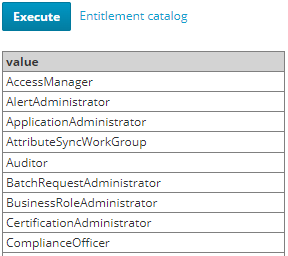

After the result has been loaded, it can be scrolled very quickly. More, by using the browser's *Search* function (Ctrl-F), information can be highlighted and an overview of the matches displayed in the scrollbar. This is very convenient when analyzing data.

## Keeping your queries

Well, we'll *not* create a new query here but instead will explain a very useful technique to work with the Generic Query.

If you have executed the above query or looked at the above screenshot, you may have noticed the link that appeared to the right of the Execute button. This link contains all input made in the form encoded as URL parameters. As a consequence, when invoked it will open the form with all input fields already prefilled. There are two uses for this:

- By dragging the link to your browser bookmarks, you can save the query for later use.
- By clicking the link, the form will be opened in a new tab with all input already filled in. This allows to continue working on the query while keeping its current version and result for reference.

Especially the second point constitutes a very efficient strategy to create and debug queries: Instead of doing everything in the same form, changing inputs back and forth and, on every execution losing the previous result, you open the query in a new tab to try the modifications.

There is a specific reason why the link cannot be opened in a new tab by the usual right click procedure (*clicking* it will open a new tab anyway, so there is no need at all for the right click procedure) and why bookmarking the query requires *dragging* the link. (You need to have your bookmarks bar visible for that, go to the three-dots-menu → Favorites → three-dots-menu → Show favorites bar to enable it.)

The reason is that the link is a so-called [bookmarklet](https://en.wikipedia.org/wiki/Bookmarklet), meaning that the *target* of it is a Javascript snippet. When it is invoked, it takes the host name from the URL of the *actual* page and adds to it the path and parameters encoded in the bookmarklet to compose a new URL that will then be opened in a new tab. As a result, these bookmarks can be used on *any* SIX IAM environment but nowhere else.

As a result these links cannot be sent to other people - the receivers will be unable to open them. Instead, send them the URL from the URL bar, which is always updated with the form inputs when executing the query.

> [!IMPORTANT]
> Warning!
>
> Keep this in mind when saving your queries:
>
> - If you bookmark the page on which you executed the query, the bookmark will always take you to the same server, so you cannot use it for different IIQ environments.
> - Bookmarklets *don't* have an icon, so when you see a Generic Query bookmark *with* an icon in your browser bookmarks, it's a server specific bookmark.
> - To send queries to other people, copy the URL from the URL bar after executing the query.

## Showing the XML

Crafting queries is often an explorative process, especially when confronted with a new object class. Of course, the [IIQ object model reference](https://identitiq.localdomain.com/identityiq/doc/javadoc/index.html) is the definitive source, together with the `ObjectConfig` that lists all the extended attributes. But a quicker way to identify interesting information is often to look at the object XML. You probably have used the IIQ *Debug Pages* extensively already. Displaying the XML is very easy with the Generic Query as well, and it offers some important benefits over the *Debug Pages*:

- Several objects can be shown on the same page for quick scrolling. This is very handy, especially when complemented with the browser's *Search* function (Ctrl-F) that will highlight the matches in *all* the objects in one go.
- Object selection conditions of any kind can be applied.
- Object changes can be easily tracked by keeping the current tab with the XML output open and - with a single click - opening a copy of the query in a new tab.
- The page will *never time out* and thus stay for reference and copying of old state as long as you need it.

To display the XML of an object, simply write `:toXml`.

[Entitlement catalog XML](https://identitiq.localdomain.com/identityiq/rulerunner/rulerunner.jsf?rule=six_generic_query&title=Entitlement%20catalog%20XML&className=ManagedAttribute&filter=application.name%20%3D%3D%20%22IdentityIQ%20Prod%22&ordering=value&output=%3AtoXml&layout=1)

| Field name   | Input                                 |
|:-------------|:--------------------------------------|
| Title        | Entitlement catalog                   |
| Object class | ManagedAttribute                      |
| Filter       | application.name == "IdentityIQ Prod" |
| Ordering     | value                                 |
| Output       | :toXml                                |

This query will produce a table containing a single column containing, for each object, its XML:

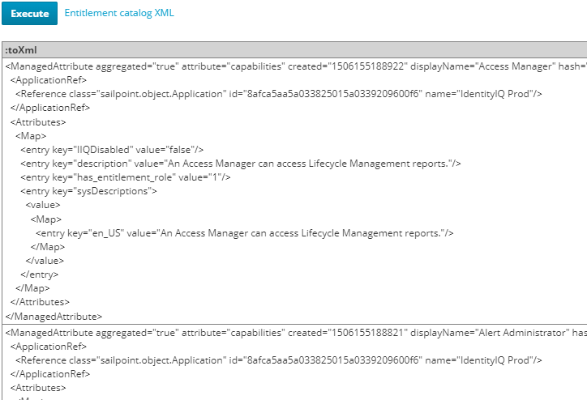

Note that when displaying object XML using the Generic Query, you are not *limited* to this. After all, the XML is only *one* column in the output, and you can add more columns with whatever you need. For instance, to have a better overview, you might want to add a `name` column in front of the XML. Or you might want to display the XML of a *related* object in a second column (e.g. when examining the SIX\_HR `Link` objects, display also the associated `Identity` object). Combine this with Ctrl-F and you feel the power behind this way of working!

> [!IMPORTANT]
> Pretty-printing object attributes
>
> A related technique that can be handy for getting an overview over your data is *pretty-printing* attribute maps: Often, like in the case of `Identity` objects, the object's XML representation can get huge, and you might be only interested in the object's *attributes*. Simply specifying `attributes` for output in a column will most often not yield the most suitable representation. Instead, OrionQL's *pprint* instruction can be used to format the `attributes` *Map*:
>
> [Entitlement attributes](https://identitiq.localdomain.com/identityiq/rulerunner/rulerunner.jsf?rule=six_generic_query&title=Entitlement%20attributes&className=ManagedAttribute&filter=application.name%20%3D%3D%20%22IdentityIQ%20Prod%22&ordering=value&output=value%0Aattributes%3Apprint&layout=1)
>
> | Field name   | Input                                 |
> |:-------------|:--------------------------------------|
> | Title        | Entitlement catalog                   |
> | Object class | ManagedAttribute                      |
> | Filter       | application.name == "IdentityIQ Prod" |
> | Ordering     | value                                 |
> | Output       | value attributes:pprint               |
>
> This query will list the entitlements together with their attributes, formatted as name value pairs (with nested maps formatted in Map syntax):
>
> 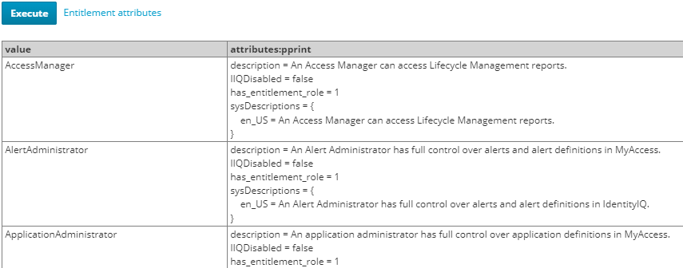
>
> Since there is less syntactic overhead in the Map representation compared to XML, the output is smaller as well as easier to read.
>
> Note that the attributes are not sorted alphabetically. If you want to have a sorted output, first reindex the mapping with key sorting:
>
> ```text
> attributes:index(>key,value):pprint
> ```

## Showing more attributes

When scrolling the result of our first query, you will probably get the impression that it contains a mixture of different types of entitlements. Let's add a column to check this:

[Entitlement catalog](https://identitiq.localdomain.com/identityiq/rulerunner/rulerunner.jsf?rule=six_generic_query&title=Entitlement%20catalog&className=ManagedAttribute&filter=application.name%20%3D%3D%20%22IdentityIQ%20Prod%22&ordering=value&output=type%0Avalue&layout=1)

| Field name   | Input                                 |
|:-------------|:--------------------------------------|
| Title        | Entitlement catalog                   |
| Object class | ManagedAttribute                      |
| Filter       | application.name == "IdentityIQ Prod" |
| Ordering     | value                                 |
| Output       | type value                            |

Indeed, we see different types of entitlements:

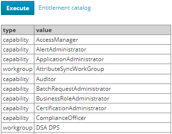

Adding attributes to the output is as easy as adding a line to the *Output* field. Looking at the XML from the previous example, you might identify more attributes to see in the output.

Concerning the different entitlement types in our query, you can now either add a filter condition for the `type` attribute to see only part of the entitlements, or add an ordering for `type` as the first criterion to have the entitlements grouped by type.

## Traversing object relationships

The objects making up an application's data are interconnected. Consequently, the IIQ API allows traversing from one object to related ones by exposing the related objects in object *attributes*.

As an example, let's add to our entitlement catalog the entitlement owner and its manager. The entitlement's owner (an `Identity` object) is available in the `owner` attribute, and the manager of an Identity in its `manager` attribute (it's again an `Identity` object). With the owner's manager, we already have a two-step object navigation. For chaining the attribute accesses, the familiar *dot notation* is used: `owner.manager`.

With both Identity objects at hand, it would *not be* a good idea to specify them for output *directly* because their string representations wouldn't render into nice output. Instead, we'll show the `name` attribute (user ID) for each of them. Again, the familiar dot notation is used, which gives us this query:

[Entitlement catalog](https://identitiq.localdomain.com/identityiq/rulerunner/rulerunner.jsf?rule=six_generic_query&title=Entitlement%20catalog&className=ManagedAttribute&filter=application.name%20%3D%3D%20%22IdentityIQ%20Prod%22&ordering=value&output=value%0Aowner.name%0Aowner.manager.name&layout=1)

| Field name   | Input                                 |
|:-------------|:--------------------------------------|
| Title        | Entitlement catalog                   |
| Object class | ManagedAttribute                      |
| Filter       | application.name == "IdentityIQ Prod" |
| Ordering     | value                                 |
| Output       | value owner.name owner.manager.name   |

For every entitlement we now see the owner and the owner's manager:

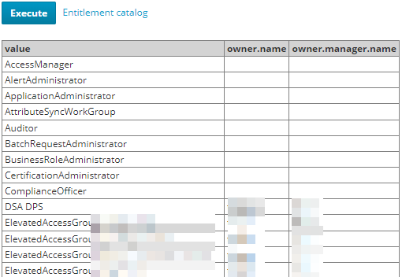

The output looks like it could be enhanced. We'll tweak it a bit in the next example.

## Formatting output

The output of the last query is unsatisfactory in two ways:

- The expressions don't make up for good column titles. Particularly, they widen the columns unnecessarily, what may be especially painful when a query has many columns.
- The user ID is a rather cryptic identification of an employee. We might want to represent them in a more human readable way.

While getting additional information about the identities into the output could be done by adding more columns such as `owner.firstname`, `owner.lastname`, `owner.manager.firstname` and so on, in this example we want to keep the two identities in one column each. So we'll use *formatting* to get a nice representation for them following the pattern *firstname* *lastname* (*user ID*), *department*.

[Entitlement catalog](https://identitiq.localdomain.com/identityiq/rulerunner/rulerunner.jsf?rule=six_generic_query&title=Entitlement%20catalog&className=ManagedAttribute&filter=application.name%20%3D%3D%20%22IdentityIQ%20Prod%22&ordering=value&output=value%0Aowner%3Downer%3Aformat(%24%7Bfirstname%7D%20%24%7Blastname%7D%20(%24%7Bname%7D)%2C%20%24%7Bdepartment%7D)%0Amanager%3Downer.manager%3Aformat(%24%7Bfirstname%7D%20%24%7Blastname%7D%20(%24%7Bname%7D)%2C%20%24%7Bdepartment%7D)&layout=1)

| Field name   | Input                                                                                                                                                       |
|:-------------|:------------------------------------------------------------------------------------------------------------------------------------------------------------|
| Title        | Entitlement catalog                                                                                                                                         |
| Object class | ManagedAttribute                                                                                                                                            |
| Filter       | application.name == "IdentityIQ Prod"                                                                                                                       |
| Ordering     | value                                                                                                                                                       |
| Output       | value owner=owner:format(${firstname} ${lastname} (${name}), ${department}) manager=owner.manager:format(${firstname} ${lastname} (${name}), ${department}) |

Note that the closing parentheses behind the `${name}` placeholders for the user ID need not be escaped by a backslash to prevent them being interpreted as the closing parentheses of the *format* instruction, as the templating mechanism by default requires parentheses to pair.

Thanks to the short titles, the columns now fit the width of the data they contain:

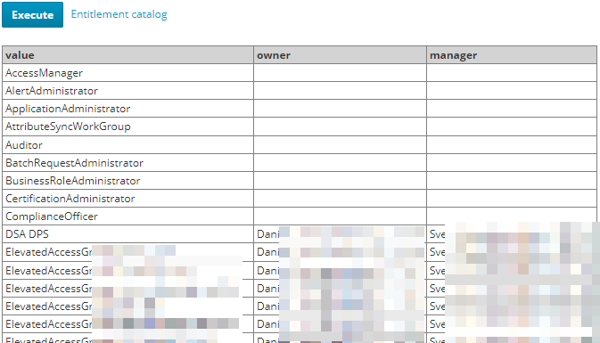

We will return to the entitlement catalog later but let's, for a moment, put it aside to look at collection attributes. The Identity class will be a good candidate to be used for the next example since it has several of them.

## Using collection attributes

Until now, the attributes we used in our queries each contained only a single value. In contrast to that, *collection attributes* contain *collections* of values, reflecting *containment* or *to-many relationships*.

> [!IMPORTANT]
> There are even so-called *multivalue* attributes that can contain either a single value directly or a list containing multiple values. (An example for this is the attribute `value` in many classes, other examples are the schema-defined entitlement attributes of `Link` objects.) The Object Query Framework allows to handle these attributes in a uniform way by transparently converting a single value to a collection when used as one.

Accessing a collection attribute will, instead of a single value or object, return a *collection* of objects (which is commonly a *List*), so there are some principal differences in handling them. Let's look what this means.

The `Identity` class has, among others, the following collection attributes:

- `assignedRoles`
- `workgroups`
- `capabilities`

Let's list some identities with their assigned roles, workgroups and capabilities. The attributes are easy to access but without an explicit conversion, the default conversion would be `List.toString()`, and we wouldn't be very happy with the output (try it yourself!). To apply an explicit conversion, we have to:

1. convert each collection element to the representation we want to have for (without this, again `toString` is used which is often not appropriate)
2. concatenate the object representations into a string in some suitable way

To convert each element of a collection, creating a new collection with the results, OrionQL's *map* operation is used. It takes as parameter a conversion, which is an OrionQL expression, and applies it to each element, returning a new collection containing the results. The *join* operation will concatenate the elements of a collection into a string - without an argument separating them with newlines.

For the workgroups and capabilities we will use the `name` attribute as representation, but for the assigned roles we want to have the `displayName` as well, so for it we need to use a *format* instruction, providing it a template with attribute placeholders that will be substituted for each role:

[Identity details](https://identitiq.localdomain.com/identityiq/rulerunner/rulerunner.jsf?rule=six_generic_query&title=Identity%20details&className=Identity&filter=department%20%3D%3D%20%22DEP001%22&ordering=name&output=name%0Afirstname%0Alastname%0AassignedRoles%3Amap(%3Aformat(%24%7Bname%7D%20%24%7BdisplayName%7D))%3Ajoin%0Aworkgroups%3Amap(name)%3Ajoin%0Acapabilities%3Amap(name)%3Ajoin&layout=1)

| Field name   | Input                                                                                                                                 |
|:-------------|:--------------------------------------------------------------------------------------------------------------------------------------|
| Title        | Identity details                                                                                                                      |
| Object class | Identity                                                                                                                              |
| Filter       | department == "DEP001"                                                                                                               |
| Ordering     | name                                                                                                                                  |
| Output       | name firstname lastname assignedRoles:map(:format(${name} ${displayName})):join workgroups:map(name):join capabilities:map(name):join |

Without having provided explicit column titles, the expressions will be used:

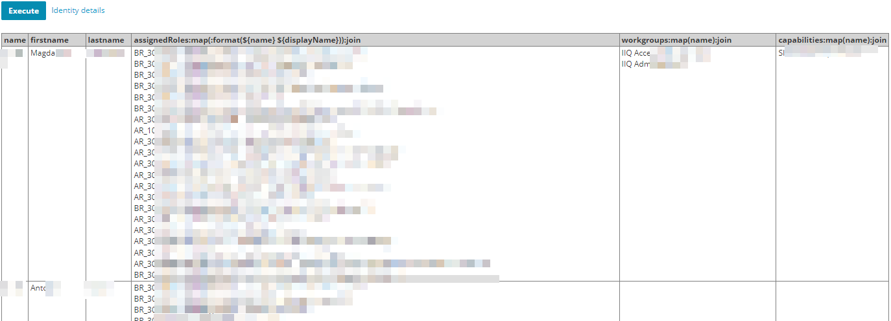

The

```
:map(name):join
```

type of patterns is a common idiom when dealing with collection attributes in the Generic Query, and you will soon type it automatically. More often than not, the *map* instruction however will use a *format* instruction instead of a single attribute. For instance if you are dealing with a collection of `AttributeRequest`s, you might use:

```
:map(:format(${op} ${name} ${value:join(\n  )})):join
```

You will soon use this type of constructs equally fluently.

> [!IMPORTANT]
> Note the special way the `AttributeRequest`'s *value* - which is a multivalue attribute (see box above) - is formatted here: The expression `value:join(\n )` contained in the placeholder accounts for the fact that `value` can contain, instead of a scalar value, also a *list* of these. The expression works like follows:
>
> - In the case of a single value, using it as a collection (as implied by giving it to the *join* instruction) will implicitly convert it into a list with it as the only element, and the result will be equivalent to `${value}` as there is no other element to concatenate.
> - If the value is actually a *list*, the elements will be concatenated by the string `"\n  "`, causing them, starting from the second element, to be on a new line each, indented with two spaces. The placeholder `${value}` would create a standard list representation of the form `[element, element...]` on a single line instead.

## Resolving objects

Not all object relationships can be directly queried using the IIQ API. In most cases, the reason for this is that *intentionally* no reference constraint was implemented to achieve a decoupling. You wouldn't want, for instance, audit records prevent deleting the objects they reference, nor deleting these objects cause deletion of the audit records.

To follow these weak references, they can be resolved by using an OrionQL *lookup* instruction. The easiest case is a query by name or ID, so as an example let's list some roles together with their `role_manager` (the attribute contains an `Identity` *ID*), representing it by the *user ID*:

[Application roles and role managers](https://identitiq.localdomain.com/identityiq/rulerunner/rulerunner.jsf?rule=six_generic_query&title=Application%20roles%20and%20role%20managers&className=Bundle&filter=type%20%3D%3D%20%22ApplicationRole%22&output=type%0Aname%0AdisplayName%0Arole_manager%3AIdentity.name&layout=1&maxRows=100)

| Field name   | Input                                             |
|:-------------|:--------------------------------------------------|
| Title        | Application roles and role managers               |
| Object class | Bundle                                            |
| Filter       | type == "ApplicationRole"                          |
| Output       | type name displayName role\_manager:Identity.name |
| Maximum rows | 100                                               |

We have limited the number of roles to 100 since we are interested only in some example output.

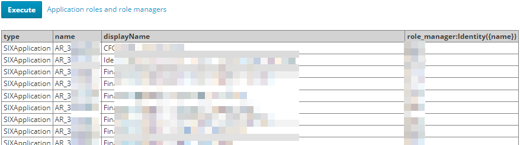

If the selection *cannot* be done by name or ID as, for instance, for `ManagedAttribute` objects, an explicit filter can be specified in the lookup instruction. We will use a filter expression in the next section, although for selecting a *list* of objects instead of a *single* object. However the principle is the same.

> [!IMPORTANT]
> The lookup instruction in this example loads the role managers as `Identity` objects although we are interested in their user IDs only (`name` attribute). The overhead of building a whole `Identity` object for a single attribute only can be avoided by telling the lookup instruction to load only the `name` attribute:
>
> [Application roles and role managers](https://identitiq.localdomain.com/identityiq/rulerunner/rulerunner.jsf?rule=six_generic_query&title=Application%20roles%20and%20role%20managers&className=Bundle&filter=type%20%3D%3D%20%22ApplicationRole%22&output=type%0Aname%0AdisplayName%0Arole_manager%3AIdentity(%7Bname%7D)&layout=1&maxRows=100)
>
> | Field name   | Input                                                |
> |:-------------|:-----------------------------------------------------|
> | Title        | Application roles and role managers                  |
> | Object class | Bundle                                               |
> | Filter       | type == "ApplicationRole"                             |
> | Output       | type name displayName role\_manager:Identity({name}) |
> | Maximum rows | 100                                                  |
>
> While the performance impact of loading the objects and the effect of avoiding this wasn't noticeable in this example, it may make a big difference in other cases.

## Retrieving additional data

Even more than for *to-one* object relationships, only a *fraction* of the virtually unlimited number of *to-many* relationships between objects are exposed as object attributes in the IIQ API. Imagine, for instance, the list of `AuditEvent`s written during the processing of an `IdentityRequest`. The query possibilities are virtually endless.

However, like for resolving weak object references (see the preceding example), by using OrionQL's *lookup* instruction it's very easy to get access to object collections not directly reachable by API methods. The lookup instruction performs a database query and returns the result as a collection.

> [!IMPORTANT]
> You may notice at this point that this way, there is no principal difference between object relationships directly accessible through methods of the IIQ API and object relationships requiring a database access for resolution: The lookup instruction makes them equal, working just like a collection attribute (which lets Hibernate do the database query for you behind the scenes).

As an example let's list managers with their subordinates. We'll represent the subordinates in the following format: *firstname* *lastname* (*user ID*), *department*. Besides explicitly supplying a column title, for better understanding the expression has been formatted into multiple lines using indentation, taking advantage of the Rulerunner's *hidden linebreak* feature. The `:map(:format(...)):join` pattern is the same that you already saw in the *collection attributes* example above:

[Managers and subordinates](https://identitiq.localdomain.com/identityiq/rulerunner/rulerunner.jsf?rule=six_generic_query&title=Managers%20and%20subordinates&className=Identity&filter=managerStatus%20%3D%3D%20true&ordering=name&output=name%0Afirstname%0Alastname%0Adepartment%0Asubordinates%3D%5C%0A%20%20%3AIdentity(%3E%7Bname%2Cfirstname%2Clastname%2Cdepartment%7D%5C%0A%20%20%20%20manager.id%20%3D%3D%20%24%22id%22%20%26%26%5C%0A%20%20%20%20identitytype%20%3D%3D%20%22employee%22%5C%0A%20%20)%5C%0A%20%20%3Amap(%3Aformat(%24%7Bfirstname%7D%20%24%7Blastname%7D%20(%24%7Bname%7D)%2C%20%24%7Bdepartment%7D))%5C%0A%20%20%3Ajoin&layout=1&maxRows=10)

| Field name   | Input                                                                                                                                                                                                                                             |
|:-------------|:--------------------------------------------------------------------------------------------------------------------------------------------------------------------------------------------------------------------------------------------------|
| Title        | Managers and subordinates                                                                                                                                                                                                                         |
| Object class | Identity                                                                                                                                                                                                                                          |
| Filter       | managerStatus == true                                                                                                                                                                                                                             |
| Ordering     | name                                                                                                                                                                                                                                              |
| Output       | name firstname lastname department subordinates=\   :Identity(>{name,firstname,lastname,department}\     manager.id == $"id" &&\     identitytype == "employee"\   )\   :map(:format(${firstname} ${lastname} (${name}), ${department}))\   :join |
| Maximum rows | 10                                                                                                                                                                                                                                                |

To not waste time when for this example query, the number of output rows is limited to 10.

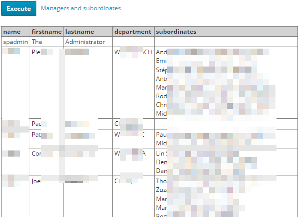

Using lookup instructions in column expressions is a very powerful feature, since it gives you access to the whole database. Any number of database queries can be executed for each single row with almost no effort.

## Dissecting strings

Let's return to our entitlement catalog query above where we showed the entitlement owners and their managers. Instead of the owner's manager we now want to show the owner deputies which are stored as a comma separated list of user IDs in the `deputy_owner` attribute of the entitlement.

In addition to resolving the weak references the user IDs constitute, this requires us to first extract them from the comma separated string. [Regular expressions](/spaces/OCA/pages/265180942/Using+Regular+Expressions) come to help: We use the *extract* instruction to get all matches of a regular expression as a list. A simple pattern, matching any nonempty sequence of characters that are not commas or spaces, is sufficient for the purpose.

Having this list, we can apply what we already know about processing collections using *map* and *join*. This time however, the *map* instruction has more work to do since the input it is fed is not a collection of objects but a collection of strings that first need to be turned into objects using a lookup instruction. So, the *map* instruction contains a sequence of processing steps - resolving the object and formatting it. For better readability we again format the column expression into multiple lines with indentation, using the Rulerunner's *hidden line breaks* feature:

[Entitlement catalog](https://identitiq.localdomain.com/identityiq/rulerunner/rulerunner.jsf?rule=six_generic_query&title=Entitlement%20catalog&className=ManagedAttribute&filter=application.name%20%3D%3D%20%22IdentityIQ%20Prod%22&ordering=value&output=value%0Aowner%3Downer%3Aformat(%24%7Bfirstname%7D%20%24%7Blastname%7D%20(%24%7Bname%7D)%2C%20%24%7Bdepartment%7D)%0Adeputies%3Ddeputy_owners%5C%0A%20%20%3Aextract(%5B%5E%2C%20%5D%2B)%5C%0A%20%20%3Amap(%5C%0A%20%20%20%20%3AIdentity%5C%0A%20%20%20%20%3Aformat(%24%7Bfirstname%7D%20%24%7Blastname%7D%20(%24%7Bname%7D)%2C%20%24%7Bdepartment%7D)%5C%0A%20%20)%5C%0A%20%20%3Ajoin&layout=1)

| Field name   | Input                                                                                                                                                                                                                         |
|:-------------|:------------------------------------------------------------------------------------------------------------------------------------------------------------------------------------------------------------------------------|
| Title        | Entitlement catalog                                                                                                                                                                                                           |
| Object class | ManagedAttribute                                                                                                                                                                                                              |
| Filter       | application.name == "IdentityIQ Prod"                                                                                                                                                                                         |
| Ordering     | value                                                                                                                                                                                                                         |
| Output       | value owner=owner:format(${firstname} ${lastname} (${name}), ${department}) deputies=deputy\_owners\   :extract([^, ]+)\   :map(\     :Identity\     :format(${firstname} ${lastname} (${name}), ${department})\   )\   :join |

Since most entitlements in this query have only a single owner deputy, the screenshot doesn't show examples with two deputies - they are near the bottom of this large table:

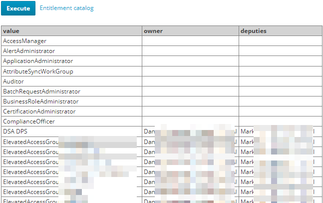

You might have expected this query to run significantly slower than the earlier one due to the lookups performed for *every* entitlement, but this is not the case: Since overall only a few identities are referenced, and they are all cached by OrionQL, only a few queries are executed in fact. Even the Hibernate cache is not consulted more than once for any user ID. (A similar statement applies to the earlier query where we already asked every entitlement for its owner `Identity`, but that time it was Hibernate that did the caching.)

> [!IMPORTANT]
> Be sure to examine the [OrionQL Reference](https://confluence.localdomain.com/display/OCA/ObjectQueryDSL+Reference) to learn about the use of regular expression captures with the *match* and *extract* instructions for more advanced data extraction.

## Using selection rules

*Selection rules* permit to check conditions on objects that are difficult or impossible to check in the database. When a rule set consisting of one or more CerberusLogic rules is provided in this field, the iterated upon objects will each be checked against it. This way, additional selection conditions can be applied.

> [!IMPORTANT]
> For performant queries, always try to narrow down the selection as far as possible using a *Filter* and leave only the remaining selection tasks to the *Selection rules*. The filter will be evaluated already in the database, preventing nonmatching objects to be fetched at all.

> [!IMPORTANT]
> If possible, always prefer to put the selection condition into the rule header, since it will be checked *before* synthetic attributes and collection expressions have been computed.

Let's find out if there are entitlements with owner deputies from a different department than the owner. For this, we extend our last query with a selection rule that checks, for each entitlement, if there is *any* deputy whose department is *not equal* to that of the entitlement owner.

To check the deputies, we copied the part of the *deputies* column expression that extracts the user IDs and converts them to `Identity` objects into the *any* selector. Removing the hidden line breaks gave us better readability for the CerberusLogic syntax, sacrificing the readability of the OrionQL expression.

For each deputy `Identity` in the list we check if the department is not equal to the entitlement owner's department. To access the latter we need a reference - normal values in this place would be interpreted as literals. The reference first navigates back to the entitlement using a *parent reference* (`^`) - since we computed the list of deputies from the entitlement, this is the parent for all the list elements - and form the entitlement to the owner, finally accessing the department:

[Entitlements with differing owner and deputy departments](https://identitiq.localdomain.com/identityiq/rulerunner/rulerunner.jsf?rule=six_generic_query&title=Entitlements%20with%20differing%20owner%20and%20deputy%20departments&className=ManagedAttribute&filter=application.name%20%3D%3D%20%22IdentityIQ%20Prod%22&selector=ManagedAttribute(%0A%20%20any(%20%22deputy_owners%3Aextract(%5B%5E%2C%20%5D%2B)%3Amap(%3AIdentity)%22%2C%0A%20%20%20%20ne(%20%22department%22%2C%20ref(%20%22%5E.owner.department%22%20)%20)%0A%20%20)%0A).accept()&output=value%0Aowner%3Downer%3Aformat(%24%7Bfirstname%7D%20%24%7Blastname%7D%20(%24%7Bname%7D)%2C%20%24%7Bdepartment%7D)%0Adeputies%3Ddeputy_owners%5C%0A%20%20%3Aextract(%5B%5E%2C%20%5D%2B)%5C%0A%20%20%3Amap(%5C%0A%20%20%20%20%3AIdentity%5C%0A%20%20%20%20%3Aformat(%24%7Bfirstname%7D%20%24%7Blastname%7D%20(%24%7Bname%7D)%2C%20%24%7Bdepartment%7D)%5C%0A%20%20)%5C%0A%20%20%3Ajoin&layout=1)

| Field name      | Input                                                                                                                                                                                                                         |
|:----------------|:------------------------------------------------------------------------------------------------------------------------------------------------------------------------------------------------------------------------------|
| Title           | Entitlement catalog                                                                                                                                                                                                           |
| Object class    | ManagedAttribute                                                                                                                                                                                                              |
| Filter          | application.name == "IdentityIQ Prod"                                                                                                                                                                                         |
| Ordering        | value                                                                                                                                                                                                                         |
| Selection rules | ManagedAttribute(   any( "deputy\_owners:extract([^, ]+):map(:Identity)",     ne( "department", ref( "^.owner.department" ) )   ) ).accept()                                                                                  |
| Output          | value owner=owner:format(${firstname} ${lastname} (${name}), ${department}) deputies=deputy\_owners\   :extract([^, ]+)\   :map(\     :Identity\     :format(${firstname} ${lastname} (${name}), ${department})\   )\   :join |

As it turns out, indeed some entitlements have an owner deputy that is from a different department than the owner. The summary line shows how many objects were checked in total:

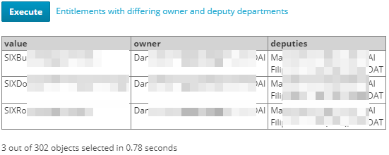

## Using synthetic attributes

The last query is a good candidate to show the use of *Synthetic attributes*. In essence, synthetic attributes are *variables* you can define for the results of computations that are expressed as either OrionQL expressions or CerberusLogic rules. The variables will be accessible in the same way as as normal object attributes, masking attributes with the same name, if any. Hence the term synthetic *attributes*.

The above query suffers from containing the same computation twice: The list of owner deputies is needed for the object selection (*Selection rules*) as well as for listing the deputies in the *deputies* column (*Output* field). While this does not cause a big performance penalty thanks to the fact that the results of database queries are cached, and only the relatively fast in-memory operations are executed twice, having the same expression twice makes the query more complex than it needs to be. So, let's factor out the common part into a synthetic attribute.

> [!IMPORTANT]
> Due to the fact that synthetic attributes are computed only *after* the object has passed the rule header checks, we need to move the selection condition from the rule header to the *accept* clause now.

[Entitlements with differing owner and deputy departments](https://identitiq.localdomain.com/identityiq/rulerunner/rulerunner.jsf?rule=six_generic_query&title=Entitlements%20with%20differing%20owner%20and%20deputy%20departments&className=ManagedAttribute&filter=application.name%20%3D%3D%20%22IdentityIQ%20Prod%22&computations=deputies%3Ddeputy_owners%5C%0A%20%20%3Aextract(%5B%5E%2C%20%5D%2B)%5C%0A%20%20%3Amap(%3AIdentity)&selector=ManagedAttribute().accept(%0A%20%20any(%20%22deputies%22%2C%0A%20%20%20%20ne(%20%22department%22%2C%20ref(%20%22%5E.owner.department%22%20)%20)%0A%20%20)%0A)&output=value%0Aowner%3Downer%3Aformat(%24%7Bfirstname%7D%20%24%7Blastname%7D%20(%24%7Bname%7D)%2C%20%24%7Bdepartment%7D)%0Adeputies%3Ddeputies%5C%0A%20%20%3Amap(%5C%0A%20%20%20%20%3Aformat(%24%7Bfirstname%7D%20%24%7Blastname%7D%20(%24%7Bname%7D)%2C%20%24%7Bdepartment%7D)%5C%0A%20%20)%5C%0A%20%20%3Ajoin&layout=1)

| Field name           | Input                                                                                                                                                                                |
|:---------------------|:-------------------------------------------------------------------------------------------------------------------------------------------------------------------------------------|
| Title                | Entitlement catalog                                                                                                                                                                  |
| Object class         | ManagedAttribute                                                                                                                                                                     |
| Filter               | application.name == "IdentityIQ Prod"                                                                                                                                                |
| Ordering             | value                                                                                                                                                                                |
| Synthetic attributes | deputies=deputy\_owners\   :extract([^, ]+)\   :map(:Identity)                                                                                                                       |
| Selection rules      | ManagedAttribute().accept(   any( "deputies",     ne( "department", ref( "^.owner.department" ) )   ) )                                                                              |
| Output               | value owner=owner:format(${firstname} ${lastname} (${name}), ${department}) deputies=deputies\   :map(\     :format(${firstname} ${lastname} (${name}), ${department})\   )\   :join |

The query is now considerably more understandable, delivering the same output:


We will see another use for synthetic attributes when we get to grouping, using CerberusLogic rules then.

# Unfolding collection expressions

In this section, we'll cover an extension for linear queries that is a concept important enough to justify a section on its own: Unfolding master-detail relationships.

We encountered master-detail relationships already when working with collection attributes and OrionQL collection expressions: They represent, for an object, multiple related objects (often called *child objects*), and outputting them in a column required us to first apply some mapping operation to the collection and then concatenating the result of it into a string - commonly creating a *multiline* cell. The data representation we got this way in the queries is fundamentally different from how master-detail data is commonly queried in SQL (using a *join*) or represented in an Excel table that both dedicate a row on its own to each detail object, replicating the master object in all those rows.

Moving a collection expression from the *Output* field (where it is part of a column expression) to the *Collection expression* field causes the Generic Query to *unfold* the child collections into separate rows. Technically, the collections returned by the collection expression for every object will be iterated upon, feeding their elements into the remaining query processing *in place of* the original object. In other words, the query result will be made up of, instead of the *primary* objects, all their *child* objects (*secondary* objects). As a result, the primary objects will *not* be part of the query result any more. They will be available, however, from each of the secondary objects through parent references.

Unfolding child collections allows, besides creating *join*-like output and applying selection rules on the child object level, to also handle some challenges the IIQ object model offers. When we'll come to grouping in the next section, you will see even more uses for it.

## Flattening the output

This is the obvious case: Suppose we want, for some identities, list all capabilities granted to them directly and indirectly through workgroups as a flat list with one row per combination of identity and capability. To get more insight, we also want to have an indication telling if the capability is granted directly or indirectly. The flattened capabilities are obtained via the `capabilityManager` identity attribute. For identifying direct capabilities, we compute a synthetic attribute `isDirectCapability` with the value "true" if the capability is contained in the identity's capabilities and the empty string otherwise, using an CerberusLogic *attribute computation rule*:

[Identity capabilities](https://identitiq.localdomain.com/identityiq/rulerunner/rulerunner.jsf?rule=six_generic_query&title=Identity%20capabilities&className=Identity&filter=department%20%3D%3D%20%22DEP001%22&subquery=capabilityManager.effectiveCapabilities&computations=Attribute(%20%22isDirectCapability%22%20).accept(%0A%20%20%22true%22%2C%0A%20%20in(%20%22%40%22%2C%20%22%5E.capabilities%22%20)%0A).accept(%20%22null%22%20)&output=%5E.name%0Aname%0AisDirectCapability&layout=1)

| Field name            | Input                                                                                                |
|:----------------------|:-----------------------------------------------------------------------------------------------------|
| Title                 | Identity capabilities                                                                                |
| Object class          | Identity                                                                                             |
| Filter                | department == "DEP001"                                                                              |
| Collection expression | capabilityManager.effectiveCapabilities                                                              |
| Synthetic attributes  | Attribute( "isDirectCapability" ).accept(   "true",   in( "@", "^.capabilities" ) ).accept( "null" ) |
| Output                | ^.name name isDirectCapability                                                                       |

> [!IMPORTANT]
> Note that when using a *Collection expression*, the *Synthetic attributes* will not be any more computed on the primary object but on the secondary objects instead.

The Output contains one row per identity and effective capability as returned by the capability manager. As it turns out, the capability manager fails to remove duplicates:

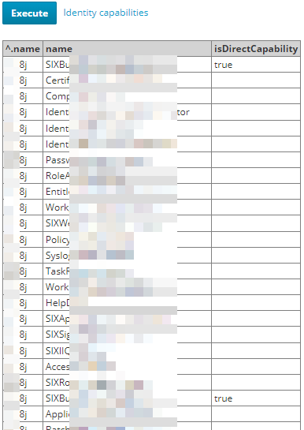

> [!IMPORTANT]
> To remove the duplicates from the output, we can postprocess the `effectiveCapabilities` using an OrionQL grouping and extracting the grouping keys from it. As we are at mangling the data already, we also sort the capabilities by name:
>
> [Identity capabilities](https://identitiq.localdomain.com/identityiq/rulerunner/rulerunner.jsf?rule=six_generic_query&title=Identity%20capabilities&className=Identity&filter=department%20%3D%3D%20%22DEP001%22&subquery=capabilityManager.effectiveCapabilities%3Acount(%40)%3Amap(key)%3Asort(name)&computations=Attribute(%20%22isDirectCapability%22%20).accept(%0A%20%20%22%5C%22true%5C%22%22%2C%0A%20%20in(%20%22%40%22%2C%20%22%5E.capabilities%22%20)%0A).accept(%20%22%5C%22%5C%22%22%20)&output=%5E.name%0Aname%0AisDirectCapability&layout=1)
>
> |                       |                                                                      |
> |:----------------------|:---------------------------------------------------------------------|
> | Collection expression | capabilityManager.effectiveCapabilities:count(@):map(key):sort(name) |
>
> The duplicates are gone now, and the capabilities are sorted by name:
>
> 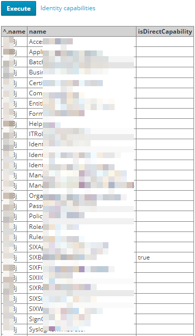

## Filtering child objects

Feeding the child objects into the normal query processing by using a *Collection expression* allows to apply *Selection rules* to them for filtering. Let's show the `assignedRoles` for some identities, showing only the assigned roles that are owned by that identity:

[Self-owned assigned roles](https://identitiq.localdomain.com/identityiq/rulerunner/rulerunner.jsf?rule=six_generic_query&title=Self-owned%20assigned%20roles&className=Identity&filter=department%20%3D%3D%20%22DEP001%22&subquery=assignedRoles&selector=Identity().accept(%0A%20%20eq(%20%22owner%22%2C%20ref(%20%22%5E%22%20)%20)%0A)&output=%5E.name%0Aname%0Aowner.name&layout=1)

| Field name            | Input                                            |
|:----------------------|:-------------------------------------------------|
| Title                 | Self-owned assigned roles                        |
| Object class          | Identity                                         |
| Filter                | department == "DEP001"                          |
| Collection expression | assignedRoles                                    |
| Selection rules       | Identity().accept(   eq( "owner", ref( "^" ) ) ) |
| Output                | ^.name name owner.name                           |

As expected, only the 26 out of total 633 assigned roles are shown that have the first and last columns equal:

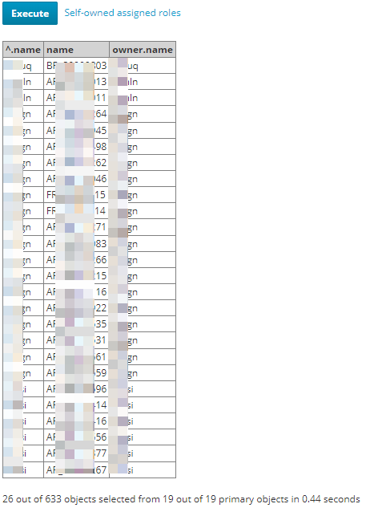

> [!IMPORTANT]
> It is also possible to filter collections in OrionQL. This can be used if you don't want to flatten the output:
>
> [Self-owned assigned roles)](https://identitiq.localdomain.com/identityiq/rulerunner/rulerunner.jsf?rule=six_generic_query&title=Self-owned%20assigned%20roles&className=Identity&filter=department%20%3D%3D%20%22DEP001%22&output=name%0AassignedRoles%5C%0A%20%20%3Aselect(eq(%20%22owner%22%2C%20ref(%20%22%5E%22%20)%20))%5C%0A%20%20%3Amap(%5C%0A%20%20%20%20%3Aformat(%24%7Bname%7D%20(%24%7Bowner.name%7D))%5C%0A%20%20)%5C%0A%20%20%3Ajoin&layout=1)
>
> |                       |                                                                                                                       |
> |:----------------------|:----------------------------------------------------------------------------------------------------------------------|
> | Collection expression |                                                                                                                       |
> | Selection rules       |                                                                                                                       |
> | Output                | name assignedRoles\   :select(eq( "owner", ref( "^" ) ))\   :map(\     :format(${name} (${owner.name}))\   )\   :join |
>
> This will also show identities that have so self-owned roles assigned:
>
> 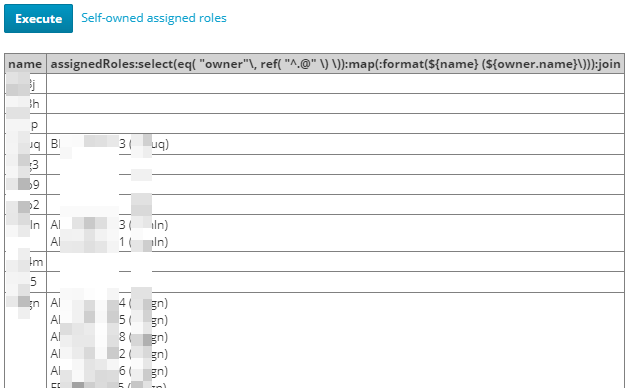

## Dissecting objects

While in the preceding examples we were examining child objects that have an own representation within the database schema, using collection expressions becomes even more interesting when applied to child collections with no database representation of their own but contained in CLOBs: Many IIQ classes contain collections that are *only* available through collection attributes in the API. Notable examples are `Application` with its sub-objects, `Configuration` and `ObjectConfig`.

Let's list in tabular form the `Bundle` attributes as defined in the `ObjectConfig` for this class by taking apart the object, iterating over its `objectAttributes` attribute:

[ObjectConfig Bundle](https://identitiq.localdomain.com/identityiq/rulerunner/rulerunner.jsf?rule=six_generic_query&title=ObjectConfig%20Bundle&className=ObjectConfig&filter=name%20%3D%3D%20%22Bundle%22&subquery=objectAttributes&output=categoryName%0Aname%0AdisplayName%0Atype%0AnamedColumn%0AextendedNumber%0Adescription&layout=1)

| Field name            | Input                                                                     |
|:----------------------|:--------------------------------------------------------------------------|
| Title                 | ObjectConfig Bundle                                                       |
| Object class          | ObjectConfig                                                              |
| Filter                | name == "Bundle"                                                          |
| Collection expression | objectAttributes                                                          |
| Output                | categoryName name displayName type namedColumn extendedNumber description |

This representation is much more usable and searchable than the out-of-the-box one:

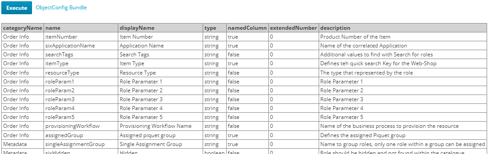

Using this technique, insightful representations can be generated for various aspects of the IIQ installation.

# Grouping queries

In the linear queries we examined up to here, each object satisfying the selection conditions was written to the output table immediately, *row by row*, in the sequence of the object iteration. Instead of creating linear tabular output like this, grouping queries collect the objects according to the specified grouping criteria, and after processing all objects convert the collected result to an output representation.

Let's incrementally get familiar with what opportunities this opens.

## Counting objects

The easiest grouping query is counting objects by a single grouping criterion. This is nothing spectacular and can be easily done in SQL too, in addition running much quicker due to the aggregation being done directly in the database. It's however a good warmup and can also be quite useful sometimes.

Returning to our initial entitlement catalog query, after seeing that there are multiple entitlement types, we might have been interested in *which* types there are, and how many entitlements we have for each of it. For this, we add the `type` attribute into the *Grouping expressions* field. Leaving the *Output* field empty will cause the objects *counted* instead of being *collected* into the output:

[Entitlement types](https://identitiq.localdomain.com/identityiq/rulerunner/rulerunner.jsf?rule=six_generic_query&title=Entitlement+types&className=ManagedAttribute&filter=application.name+%3D%3D+%22IdentityIQ+Prod%22&grouping=type)

| Field name           | Input                                 |
|:---------------------|:--------------------------------------|
| Title                | Entitlement types                     |
| Object class         | ManagedAttribute                      |
| Filter               | application.name == "IdentityIQ Prod" |
| Grouping expressions | type                                  |

Not having specified a different layout, we get a textual representation of the grouping result:

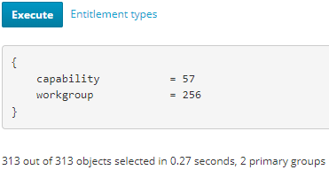

Notice the summary line that is present at the bottom of each query output, giving useful additional information.

> [!IMPORTANT]
> To get a nice tabular representation instead of plain text, the *Matrix* layout introduced in the next section can be used with a small trick: Since it requires a second grouping to render the columns, we will add a *literal* expression that returns the same value for all objects, this way also providing the column heading. "Grouping" objects by a literal is certainly a bit of a hack, but it shows how you can exploit the flexibility of the Generic Query and the underlying framework after having gained a good understanding of them to render your data into the representation that best fits your purpose:
>
> [Entitlement types](https://identitiq.localdomain.com/identityiq/rulerunner/rulerunner.jsf?rule=six_generic_query&title=Entitlement+types&className=ManagedAttribute&filter=application.name+%3D%3D+%22IdentityIQ+Prod%22&grouping=type%0A%22count%22&layout=Matrix)
>
> | Field name           | Input                                 |
> |:---------------------|:--------------------------------------|
> | Title                | Entitlement types                     |
> | Object class         | ManagedAttribute                      |
> | Filter               | application.name == "IdentityIQ Prod" |
> | Grouping expressions | type "count"                          |
> | Grouping layout      | Matrix                                |
>
> While the automatically created TOTAL *column* is quite superfluous here, the TOTAL *row* can be helpful indeed:
>
> 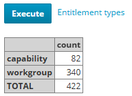

As said, this example wasn't particularly impressive. The picture changes, however, as soon as you use multiple grouping criteria or grouping criteria that cannot be computed in the database, as we will show in the next examples.

> [!IMPORTANT]
> About sorting the result set
>
> In most cases when doing grouping queries, there is no reason to specify an *Ordering* to sort the objects in the database since the final output will anyway be determined by the ordering of the grouping key values. Apart from causing unnecessary work in the database in this case, sorting may even be counterproductive, since it will remove the small amount of randomness you have in your data set when for a quicker response you limit its size by using *Maximum rows* while prototyping a new query. There *is*, however, one exclusion from this rule: When objects are *not counted only* but *grouped*, and the order in which they appear in their buckets matters, an *Ordering* should be used.
>
> An alternative that helps to avoid the database sorting of the *entire* result set is is to use *Groups postprocessing* to sort the buckets.

## Introducing the matrix view

Grouping objects is not limited to a single criterion. Using more grouping criteria results in a *hierarchically nested* mapping, as you can confirm by switching the *Grouping layout* of this section's query back to empty.

Particularly, when there are two grouping criteria, the grouping constructs a *two-level* mapping, which can be presented in a *Matrix* layout. The first criterion will yield the rows, and the second one the columns. We'll use a prominent example to show the benefit of this way to present data - role assignments: Let's get an overview which roles are assigned to the members of our team. Instead of using the identities' and roles' `name` attributes for the grouping, which would be the initial straightforward approach, we will *format* these objects into a more human-readable representation to get more telling row and column headers. You already know that from each assigned role the identity can be reached using a parent reference (`^`):

[DEP001 assigned roles](https://identitiq.localdomain.com/identityiq/rulerunner/rulerunner.jsf?rule=six_generic_query&title=DEP001+assigned+roles&className=Identity&filter=department+%3D%3D+%22DEP001%22&subquery=assignedRoles&grouping=%3Aformat%28%24%7BdisplayName%7D+%28%24%7Bname%7D%29%29%0A%5E%3Aformat%28%24%7BdisplayName%7D+%28%24%7Bname%7D%29%29&layout=Matrix+%28rotate+headers%29)

| Field name            | Input                                                                |
|:----------------------|:---------------------------------------------------------------------|
| Title                 | DEP001 assigned roles                                               |
| Object class          | Identity                                                             |
| Filter                | department == "DEP001"                                              |
| Collection expression | assignedRoles                                                        |
| Grouping expressions  | :format(${displayName} (${name})) ^:format(${displayName} (${name})) |
| Grouping layout       | Matrix (rotate headers)                                              |

A representation like this reveals patterns easily. The totals column and row provide additional information:

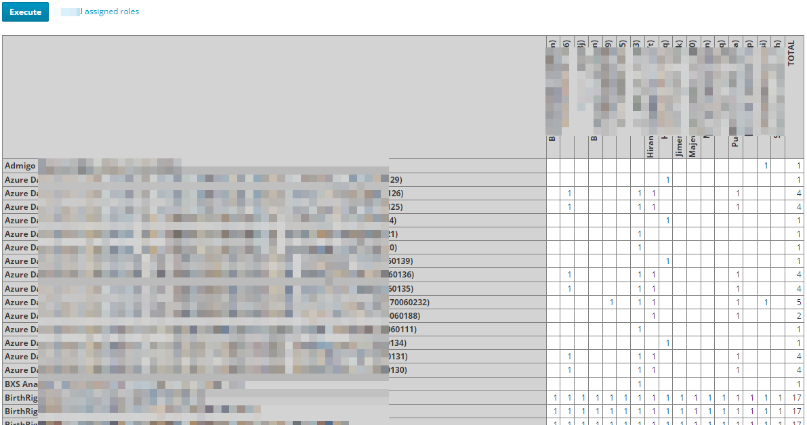

## Creating timelines

A handy application of matrix views are timelines. As an example, let's return to our entitlement catalog and see how many of the entitlements were created per year. For this, we format the `created` attribute using the *year* component only:

[Entitlement matrix](https://identitiq.localdomain.com/identityiq/rulerunner/rulerunner.jsf?rule=six_generic_query&title=Entitlement+matrix&className=ManagedAttribute&filter=application.name+%3D%3D+%22IdentityIQ+Prod%22&grouping=type%0A%3Aformat%28%24%7B%25yyyy%2Ccreated%7D%29&layout=Matrix)

| Field name           | Input                                 |
|:---------------------|:--------------------------------------|
| Title                | Entitlement types                     |
| Object class         | ManagedAttribute                      |
| Filter               | application.name == "IdentityIQ Prod" |
| Grouping expressions | type :format(${%yyyy,created})        |
| Grouping layout      | Matrix                                |

The result will show us the number of entitlements created per year for each type, including the totals for both dimensions:

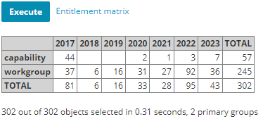

> [!IMPORTANT]
> If there are more than two grouping criteria, the *top most* two will be used to render the matrix, and all remaining ones will be rendered within the cells using a text layout.

Besides creating timelines like these, the matrix layout can be used to easily discover correlations between the grouping criteria. Before getting to an example, let's look at another technique that can be helpful when analyzing data.

## Dissecting values

The names of the *workgroup* type entitlements reported by our initial entitlement catalog example after the `type` column was added suggest that there are different types of workgroups, and we might be interested to count how many we have for each workgroup type. Again [regular expressions](/spaces/OCA/pages/265180942/Using+Regular+Expressions) come to help - they allow us to extract part of a string.

For this query, we will remove the capabilities from the query by adding a filter that selects only the workgroups. Then we will extract the *workgroup type* as the prefix of the entitlement name (`value`) up to the first underscore (`_`). By *including* the underscore in the pattern we ensure that values *not* containing one will *not* deliver a match. This allows us to supply a custom value for them by adding an *expression alternative* with a literal "other". The literal will group them into this category:

[Entitlement types](https://identitiq.localdomain.com/identityiq/rulerunner/rulerunner.jsf?rule=six_generic_query&title=Entitlement+types&className=ManagedAttribute&filter=application.name+%3D%3D+%22IdentityIQ+Prod%22+%26%26%0Atype+%3D%3D+%22workgroup%22&ordering=value&grouping=value%3Amatch%28%5B%5E_%5D%2B_%29%7C%22other%22)

| Field name           | Input                                                        |
|:---------------------|:-------------------------------------------------------------|
| Title                | Entitlement types                                            |
| Object class         | ManagedAttribute                                             |
| Filter               | application.name == "IdentityIQ Prod" && type == "workgroup" |
| Grouping expressions | value:match([^\_]+\_)|"other"                                |

As reward, we get the following output:

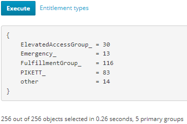

## Checking correlations

Counting objects by two criteria is a quick way to check for correlations between the criteria, and outliers, simply by looking at the Matrix output. No math!

We'll use the technique from the previous example to check how the role types in our system correlate with the role name prefixes.

[Bundle type and name prefix matrix](https://identitiq.localdomain.com/identityiq/rulerunner/rulerunner.jsf?rule=six_generic_query&title=Bundle+type+and+name+prefix+matrix&className=Bundle&filter=%21+type.in%28%7B+%22EntitlementRole%22%2C+%22OrganizationalRole%22+%7D%29&grouping=type%0Aname%3Amatch%28...%29&layout=Matrix)

| Field name           | Input                                                |
|:---------------------|:-----------------------------------------------------|
| Title                | Bundle type and name prefix matrix                   |
| Object class         | Bundle                                               |
| Filter               | ! type.in({ "EntitlementRole", "OrganizationalRole" }) |
| Grouping expressions | type name:match(...)                                 |
| Grouping layout      | Matrix                                               |

The query doesn't finish within the foreground execution time limit, however we already get an impression of the situation:

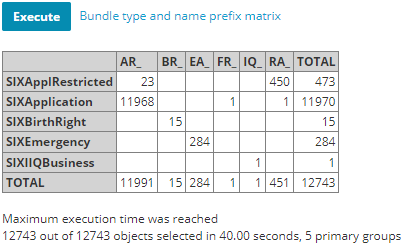

To get the full result, you can execute the query in the background or use an expression as data source, fetching only the bundles' `type` and `name`.

## Categorizing objects

Let's do another grouping to show how objects can be categorized using more complex computations that we have used so far. This time we want to get an overview about the sizes of access requests we have, measured in the number of roles ordered.

Grouping the `IdentityRequest` objects by the *exact* number of roles ordered would, however, fragment the result, preventing it from providing much insight. What we therefore need is to create some size categories which we can use for the grouping. We will use an OrionQL attribute computation rule for this since it allows value computations depending on condition checks.

Apart from this, the query demonstrates a couple of other noteworthy techniques not demonstrated so far:

- The number of roles ordered in the access request is computed as a synthetic attribute `numRoles` since it needs to be examined several times in the attribute computation rule for the `requestSize` synthetic attribute. The Generic Query will execute the two blocks of attribute computations in separate passes, so that the second block has access to the synthetic attributes computed by the first one.
- The computation of `numRoles` is done by *counting* the identity request items by `application` and `operation`, followed by accessing the count for application *IIQ* and operation *Add* with two chained *attribute accessors* that retrieve the "attribute" `IIQ` followed by `Add` from the two-level mapping produced by *count*.
- Since the IdentityReqest's `operation` attribute has an Enum type, it needs to be formatted as string to be accessible in the mapping using a string.
- IdentityRequests containing only role *removals* will not produce a value for *Add*, having the corresponding attribute accessor return `null`. An expression alternative with the literal value 0 is appended to the expression that supplies the value for the `numRoles` synthetic attribute in this case. (It would not be set otherwise, causing an error when accessing it later, as the `IdentityRequest` class does not have an attribute `attributes` containing an *attributes map* holding attributes not defined by the class.)
- The labels used for the size categories have been chosen carefully to alphabetically sort in the desired sequence. (The rows and columns of the matrix are sorted in ascending key order.)
- To collapse all departments of each business unit into a single row, we replace in the target identity's `department` attribute everything that follows the first minus (`-`) with an asterisk (`*`). (Alternatively, we could have used *match* to extract the part up to the first minus, giving a slightly different result, but we have used *match* already in an earlier example.)

By sorting the identity requests by descending creation timestamp and limiting their number to 1000, we select the latest 1000 access requests. (We'll meet this number again in the output - in the *total totals* cell at the bottom right of the matrix.)

> [!IMPORTANT]
> There is a safeguard built into the query to handle the situation when the Identity referenced by `targetId` has been deleted in the meantime: An expression alternative with the string literal "null" provides a non-null value in this case to avoid the NullPointerException that the grouping would otherwise raise.

[Access request sizes by departments](https://identitiq.localdomain.com/identityiq/rulerunner/rulerunner.jsf?rule=six_generic_query&title=Access+request+sizes+by+departments&className=IdentityRequest&filter=source+%3D%3D+%22LCM%22+%26%26%0Atype+%3D%3D+%22AccessRequest%22&ordering=created+desc&computations=numRoles%3Ditems%3Acount%28application%23%3Aformat%28%24%7Boperation%7D%29%29.IIQ.Add%7C0%0A%0AAttribute%28+%22requestSize%22+%29.accept%28%0A++%22%5C%220%5C%22%22%2C+eq%28+%22numRoles%22%2C+0+%29%0A%29.accept%28%0A++%22%5C%221%5C%22%22%2C+eq%28+%22numRoles%22%2C+1+%29%0A%29.accept%28%0A++%22%5C%222%5C%22%22%2C+eq%28+%22numRoles%22%2C+2+%29%0A%29.accept%28%0A++%22%5C%223+...+5%5C%22%22%2C+lt%28+%22numRoles%22%2C+6+%29%0A%29.accept%28%0A++%22%5C%22less+than+10%5C%22%22%2C+lt%28+%22numRoles%22%2C+10+%29%0A%29.accept%28%0A++%22%5C%22less+than+20%5C%22%22%2C+lt%28+%22numRoles%22%2C+20+%29%0A%29.accept%28%0A++%22%5C%22more%5C%22%22%2C+ge%28+%22numRoles%22%2C+20+%29%0A%29%0A&grouping=targetId%3AIdentity%28%7Bdepartment%7D%29%3Areplace%28-.*%2C-*%29%7C%22null%22%0ArequestSize&layout=Matrix+%28rotate+headers%29&maxRows=1000)

| Field name           | Input                                                                                                                                                                                                                                                                                                                                                                                                                               |
|:---------------------|:------------------------------------------------------------------------------------------------------------------------------------------------------------------------------------------------------------------------------------------------------------------------------------------------------------------------------------------------------------------------------------------------------------------------------------|
| Title                | Access request sizes by departments                                                                                                                                                                                                                                                                                                                                                                                                 |
| Object class         | IdentityRequest                                                                                                                                                                                                                                                                                                                                                                                                                     |
| Filter               | source == "LCM" && type == "AccessRequest"                                                                                                                                                                                                                                                                                                                                                                                          |
| Ordering             | created desc                                                                                                                                                                                                                                                                                                                                                                                                                        |
| Synthetic attributes | numRoles=items:count(application#:format(${operation})).IIQ.Add|0 <br/> Attribute( "requestSize" ).accept(   "\"0\"", eq( "numRoles", 0 ) ).accept(   "\"1\"", eq( "numRoles", 1 ) ).accept(   "\"2\"", eq( "numRoles", 2 ) ).accept(   "\"3 ... 5\"", lt( "numRoles", 6 ) ).accept(   "\"less than 10\"", lt( "numRoles", 10 ) ).accept(   "\"less than 20\"", lt( "numRoles", 20 ) ).accept(   "\"more\"", ge( "numRoles", 20 ) ) |
| Grouping expressions | targetId:Identity({department}):replace(-.\*,-\*)|"null" requestSize                                                                                                                                                                                                                                                                                                                                                                |
| Grouping layout      | Matrix (rotate headers)                                                                                                                                                                                                                                                                                                                                                                                                             |
| Maximum rows         | 1000                                                                                                                                                                                                                                                                                                                                                                                                                                |

Despite loading only 1000 objects, the query takes some time to execute:

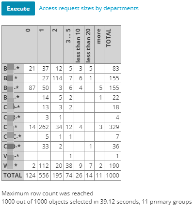

> [!IMPORTANT]
> The query can be considerably sped up by avoiding the overhead of building the `IdentityRequest` objects. To do this, use an OrionQL expression as input to do the database query, fetching only the attributes of interest as in the following query. By counting the identity request items for the identity request that match the application *IIQ* and the operation *Add*, we get the value for `numRoles` directly from the database:
>
> [Access request sizes by departments](https://identitiq.localdomain.com/identityiq/rulerunner/rulerunner.jsf?rule=six_generic_query&title=Access+request+sizes+by+departments&className=Expression&filter=%3AIdentityRequest%28%3E%7Bid%2CtargetId%7Dsource+%3D%3D+%22LCM%22+%26%26+type+%3D%3D+%22AccessRequest%22%2Ccreated+desc%29&computations=numRoles%3D%3AIdentityRequestItem%28%3FidentityRequest.id+%3D%3D+%24%22id%22+%26%26+application+%3D%3D+%22IIQ%22+%26%26+operation+%3D%3D+%22Add%22%29%0A%0AAttribute%28+%22requestSize%22+%29.accept%28%0A++%22%5C%220%5C%22%22%2C+eq%28+%22numRoles%22%2C+0+%29%0A%29.accept%28%0A++%22%5C%221%5C%22%22%2C+eq%28+%22numRoles%22%2C+1+%29%0A%29.accept%28%0A++%22%5C%222%5C%22%22%2C+eq%28+%22numRoles%22%2C+2+%29%0A%29.accept%28%0A++%22%5C%223+...+5%5C%22%22%2C+lt%28+%22numRoles%22%2C+6+%29%0A%29.accept%28%0A++%22%5C%22less+than+10%5C%22%22%2C+lt%28+%22numRoles%22%2C+10+%29%0A%29.accept%28%0A++%22%5C%22less+than+20%5C%22%22%2C+lt%28+%22numRoles%22%2C+20+%29%0A%29.accept%28%0A++%22%5C%22more%5C%22%22%2C+ge%28+%22numRoles%22%2C+20+%29%0A%29%0A&grouping=targetId%3AIdentity%28%7Bdepartment%7D%29%3Areplace%28-.*%2C-*%29%7C%22null%22%0ArequestSize&layout=Matrix+%28rotate+headers%29&maxRows=1000)
>
> | Field name           | Input                                                                                                                                                                                                                                                                                                                                                                                                                                                                       |
> |:---------------------|:----------------------------------------------------------------------------------------------------------------------------------------------------------------------------------------------------------------------------------------------------------------------------------------------------------------------------------------------------------------------------------------------------------------------------------------------------------------------------|
> | Object class         | Expression                                                                                                                                                                                                                                                                                                                                                                                                                                                                  |
> | Filter               | :IdentityRequest(>{id,targetId}source == "LCM" && type == "AccessRequest",created desc)                                                                                                                                                                                                                                                                                                                                                                                     |
> | Ordering             |                                                                                                                                                                                                                                                                                                                                                                                                                                                                             |
> | Synthetic attributes | numRoles=:IdentityRequestItem(?identityRequest.id == $"id" && application == "IIQ" && operation == "Add") <br/> Attribute( "requestSize" ).accept(   "\"0\"", eq( "numRoles", 0 ) ).accept(   "\"1\"", eq( "numRoles", 1 ) ).accept(   "\"2\"", eq( "numRoles", 2 ) ).accept(   "\"3 ... 5\"", lt( "numRoles", 6 ) ).accept(   "\"less than 10\"", lt( "numRoles", 10 ) ).accept(   "\"less than 20\"", lt( "numRoles", 20 ) ).accept(   "\"more\"", ge( "numRoles", 20 ) ) |
> | Grouping expressions | targetId:Identity({department}):replace(-.\*,-\*)|"null" requestSize                                                                                                                                                                                                                                                                                                                                                                                                        |
> | Grouping layout      | Matrix (rotate headers)                                                                                                                                                                                                                                                                                                                                                                                                                                                     |
> | Maximum rows         | 1000                                                                                                                                                                                                                                                                                                                                                                                                                                                                        |
>
> The query takes only a fraction of the time after this refactoring:
>
> 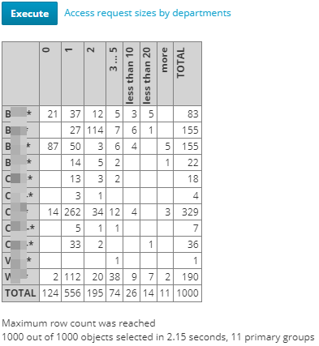

## Analyzing logs

Timelines can be a powerful tool to understand what's going on in the system. The possibilities are virtually endless, including analyzing task runs, provisioning transactions, account creations or audit events. We won't introduce a new feature in this section as we have already created a timeline above. However let's raise the awareness for the usefulness of this technique by applying it to logs.

Let's analyze the Syslog events from the last 24 hours. For selecting this timeframe, we make use of the fact that the *Filter* is in fact an OrionQL template, so we can use parameter placeholders in it. We will subtract one day from *now*.

> [!IMPORTANT]
> An alternative syntax for offset calculations is to give the offset as argument to the *now* instruction. Instead of applying the offset in plain, the instruction will first truncate the time to the unit of the offset and do regular calendar calculations afterwards. As an example, writing `:now(-1d)` will go back to yesterday 00:00.
>
> Hint: An offset of zero will go back to the start of the current hour, day, month, year and so on:
>
> - `:now(-0h)`
> - `:now(-0d)`
> - `:now(-0M)`
> - `:now(-0Y)`

Formatting the `created` timestamp accordingly, we have the events counted by day and clock hour:

[SyslogEvent timeline](https://identitiq.localdomain.com/identityiq/rulerunner/rulerunner.jsf?rule=six_generic_query&title=SyslogEvent+timeline&className=SyslogEvent&filter=created+%3E+%24%22%3Anow-1d%22&grouping=classname%0A%3Aformat%28%24%7B%25yyyy-MM-dd+HH%2Ccreated%7D%29&layout=Matrix+%28rotate+headers%29)

| Field name           | Input                                        |
|:---------------------|:---------------------------------------------|
| Title                | SyslogEvent timeline                         |
| Object class         | SyslogEvent                                  |
| Filter               | created > $":now-1d"                         |
| Grouping expressions | classname :format(${%yyyy-MM-dd HH,created}) |
| Grouping layout      | Matrix (rotate headers)                      |

The following result was drawn from production, since on INT, after 17000 processed events, the query exceeds the 40 seconds foreground execution limit, resulting in an incomplete matrix:

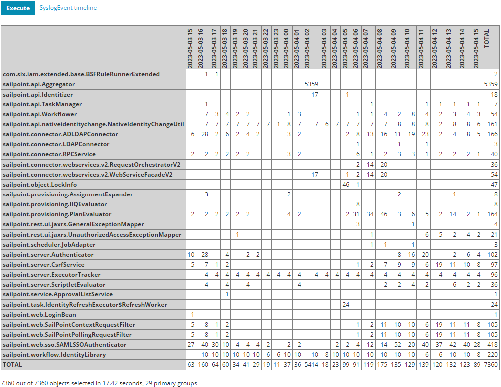

## Arranging objects in two dimensions

Until now, we grouped objects only to *count* them. However, the *Matrix* layout is a much more general mechanism - *it arranges objects in a two-dimensional grid* into rows and columns. It only *happened* that until now these objects were *counts*. Now let's, instead of counting objects, indeed *group* them.

For this, we will have to provide an *Output* specification that describes how the objects are to be represented in the output. This can either be an OrionQL *expression* (often simply returning an object *attribute*), or an OrionQL *formatting template* that creates a string representation of the object by filling out placeholders. In any case, in contrast to linear queries that accept multiple expressions for *Output* (describing the output *columns*), grouping queries accept only a single item here.

> [!IMPORTANT]
> Note that, as we are talking about *grouping* here, there can be *multiple* objects in a grid location. They will be shown in the cells on individual lines, creating multiline cells.

Let's display, from the audit log, a timeline of the automatic deprovisionings of additional entitlements for the Mainframe endpoint, showing the affected identities.

[AutoReconciliation remove timeline for endpoint](https://identitiq.localdomain.com/identityiq/rulerunner/rulerunner.jsf?rule=six_generic_query&title=AutoReconciliation+remove+timeline+for+endpoint&className=AuditEvent&filter=action+%3D%3D+%22six_reconciliation_decision%22+%26%26%0Asource+%3D%3D+%22remove%22+%26%26%0Aapplication+%3D%3D+%22Mainframe%22&output=target&grouping=attributeValue%0A%3Aformat%28%24%7B%25yyyy-MM-dd%2Ccreated%7D%29&layout=Matrix+%28rotate+headers%29)

| Field name           | Input                                                                                    |
|:---------------------|:-----------------------------------------------------------------------------------------|
| Title                | AutoReconciliation remove timeline for endpoint                                          |
| Object class         | AuditEvent                                                                               |
| Filter               | action == "six\_reconciliation\_decision" && source == "remove" && application == "Mainframe" |
| Output               | target                                                                                   |
| Grouping expressions | attributeValue :format(${%yyyy-MM-dd,created})                                           |
| Grouping layout      | Matrix (rotate headers)                                                                  |

The query has been executed in PROD, additionally applying a date cutoff, to avoid having it contain simulation results. So we see that any additional entitlements that are discovered are removed persistently:

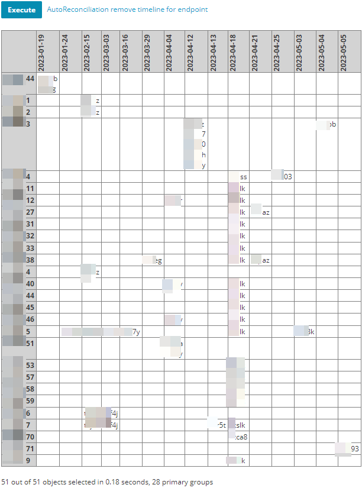

## Unfolding maps

The above technique - showing data in a two-dimensional grid layout - is not limited to grouping objects fetched by a query but has a more general nature that we will illustrate with another example that does something unexpected: We'll present the data contained in a stream of `Map`s in a *tabular* view by taking the maps apart and re-arranging the key-value pairs into rows and columns. While the maps can be read from *any* origin - even computed by a grouping OrionQL expression - let's use a *simple* example here: *attribute* maps.

> [!IMPORTANT]
> We chose *attribute* maps for this demonstration because these maps are available out of the box. But remember, that you can mangle this way *any* map you get hold of or produce yourself.

In the very beginning of this guide, when displaying object XML, it was mentioned that *maps*, in particular, *attribute* maps, can be formatted using the *pprint* instruction. Formatting them into text may, however, not yield the ideal representation, and a tabular layout might provide a more convenient representation.

Turning a sequence of maps into tabular form is very easy to achieve: Treating the `Map`s as sequences of key-value pairs allows to arrange the values gathered from all objects into a tabular layout with a column per attribute and a row per object by simply *unfolding* all the maps (using the *Collection expression* field) and applying to the resulting stream of key-value pairs a two-level grouping to yield the rows and columns for a *Matrix* layout. This will be done by choosing appropriate *Grouping expressions* (the parent object of the attribute being reached through a *parent reference*). This sounds complicated first, but once you get used to this way of distributing data over a two-dimensional pane, it will start feeling quite natural and you will see this pattern everywhere. It is a very powerful technique.

As an example, let's list all `Mainframe` accounts with their attributes in tabular form by unfolding their `attributes` maps and grouping the attribute values by account (`nativeIdentity`) and attribute name (`key`):

[Mainframe Accounts](https://identitiq.localdomain.com/identityiq/rulerunner/rulerunner.jsf?rule=six_generic_query&title=Mainframe+Accounts&className=Link&filter=application.name+%3D%3D+%22Mainframe%22&subquery=attributes&output=value&grouping=%5E.nativeIdentity%0Akey&layout=Matrix)

| Field name            | Input                      |
|:----------------------|:---------------------------|
| Title                 | Mainframe Accounts              |
| Object class          | Link                       |
| Filter                | application.name == "Mainframe" |
| Collection expression | attributes                 |
| Output                | value                      |
| Grouping expressions  | ^.nativeIdentity key       |
| Grouping layout       | Matrix                     |

The primary grouping by the account's `nativeIdentity` will give the rows, and the secondary grouping by `key` will give the columns:

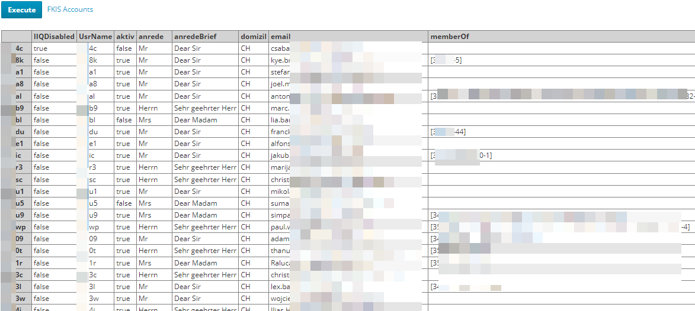

Note that there will be no traces in the output for accounts *without* attributes and attributes not present on *any* account.

> [!IMPORTANT]
> If needed, *Selection rules* can be used to remove attributes from the output.

> [!IMPORTANT]
> Note that if the primary grouping criterion is *not* unique like, for instance, when using the name of the identity to which the account belongs (there may be multiple accounts correlated to some identity), the attributes from *all* the identity's accounts will be concatenated into multiline cells. So, apart from the loading of the `Identity` objects considerably slowing down the query, this is not a good idea. If you you want to query, for instance, `AD Direct` accounts, and don't like the long row headers `nativeIdentity` yields, select another unique account attribute like `sAMAccountName` or use postprocessing to shorten the value instead of trying to use the identity name.

> [!IMPORTANT]
> Another example for using this technique is querying the current HR data as delivered to SIX IAM from `SAP_HR`. Compared to the original XML, the tabular output will be much smaller and more convenient to look at. To have the query run fast enough, use an Expression data source to avoid loading the `Link` *objects*: [HR data](https://identitiq.localdomain.com/identityiq/rulerunner/rulerunner.jsf?rule=six_generic_query&title=HR%20data&className=Expression&filter=%3ALink(%3E%7Battributes%7Dapplication.name%20%3D%3D%20%22SAP_HR%22)&subquery=%40&output=value&grouping=%5E.Personnel_number%0Akey&layout=2)

You might consider the technique shown here to be a quick hack for the task at hand (displaying objects with their attributes) and might prefer to use a linear query instead, *explicitly* listing the attributes as defined in the account schema. You are certainly right about the hack, and defining the columns explicitly also gives you more control about the column order, in addition also permitting to include data *not* present in the `attributes` map or to apply transformations to certain attributes. However - while it might *indeed* be convenient to have a single query applicable to the accounts of *all* applications *independent* of their schema - what we wanted to demonstrate with this example was how the Generic Query's mechanisms permit mangling data - including getting tabular representations out of data that is *not* tabular by its nature. As stated in the beginning, the technique shown here can be applied to maps coming from *any* source, so keep this pattern in mind.

> [!IMPORTANT]
> Having a good understanding of what is going on behind the scenes will let the best approaches to any data analysis problem come up to you automatically. The mechanism at the *core* of this example - grouping objects and rendering the result in a matrix layout - is a very general technique that can be summarized as *arranging objects in rows and columns of a two-dimensional grid*. There is no restriction about *what* defines the rows and columns as well as where the objects come from: While a flat sequence like a database query result set is the most obvious source, the objects can equally be pulled out of a deeply nested object hierarchy. Unfolding a map was only the most simple example albeit with some use of its own.

> [!IMPORTANT]
> As a side note - when creating a regular *linear* query for this example's use case, be sure to let the Generic Query compile for you the initial column list out of the application's [Schema attributes](https://identitiq.localdomain.com/identityiq/rulerunner/rulerunner.jsf?rule=six_generic_query&title=Schema%20attributes&className=Application&filter=name%20%3D%3D%20%22SAP_HR%22&output=schema(%3Aformat(account)).attributes%3Amap(name)%3Ajoin&layout=1).

## Creating timelines, take #2

To reinforce the concept from the previous two examples, let's utilize the map unfolding just used to achieve something seemingly totally different, while in fact only the axes were swapped: Let's create an objects timeline.

We want to examine the result of *SIX AutoReconciliationSimulation* Task executions over time:

[Task results timeline](https://identitiq.localdomain.com/identityiq/rulerunner/rulerunner.jsf?rule=six_generic_query&title=Task+results+timeline&className=TaskResult&filter=definition.name+%3D%3D+%22SIX+AutoReconciliationSimulation%22&ordering=created&subquery=attributes&output=value%3Areplace%28%26nbsp%3B%2C+%29&grouping=key%0A%5E%3Aformat%28%24%7Bcreated%7D%29&layout=Matrix)

| Field name            | Input                                                 |
|:----------------------|:------------------------------------------------------|
| Title                 | Task results timeline                                 |
| Object class          | TaskResult                                            |
| Filter                | definition.name == "SIX AutoReconciliationSimulation" |
| Ordering              | created                                               |
| Collection expression | attributes                                            |
| Output                | value:replace(&nbsp;, )                               |
| Grouping expressions  | key ^:format(${created})                              |
| Grouping layout       | Matrix                                                |

> [!IMPORTANT]
> Note that the Generic Query automatically determines if what was given to it in the *Output* field is an expression or a formatting template - by checking for the presence of a $ character (signaling a possible placeholder) in the first two characters. (Allowing the first placeholder to be preceded by some character allows to have it, e.g., in parentheses.) This detection schema prevents a $ character (placeholder) *later* in the expression, for instance within a *format()* instruction, to cause the expression to be misdetected as a formatting template.
>
> If, for any reason, your input happens to be *incorrectly* classified (like when you have more than one character in front of the first placeholder), as a workaround you can wrap it into either a *format()* instruction or a *${}* placeholder.

The output of this query shows the results of the consecutive task executions side by side:

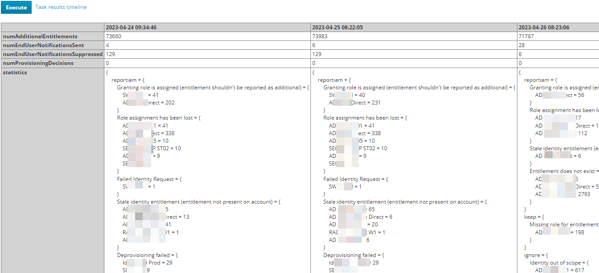

# Advanced techniques

There was a some advanced stuff in this guide already, but let's outline some techniques here, partly already seen and not necessarily *advanced*, the explanation of which wouldn't have fit well into the flow of this guide. Be sure to later also read [Best practices for using the Generic Query](/spaces/OCA/pages/269131647/Best+practices+for+using+the+Generic+Query) to learn more.

## Dealing with `null` values and Enums

When using grouping - either via the *Grouping expressions* field or using OrionQL grouping instructions - there are two situations where you need to take special care about what your OrionQL expressions return:

- If grouping keys are to be sorted (as the Generic Query *always does* when *Grouping expressions* are used, and OrionQL's grouping instructions do when *asked* to do so), `null` values are not permitted. To cope with `null` values that may appear in the data, either a *format* instruction or an expression alternative can be used:

  **Examples**

  ```
  :format(${type})
  :format(${type,n/a})
  type|"n/a"
  ```
- If OrionQL grouping instructions use expressions that return Enums, they will *not* be indexable using strings. To ensure indexing will be possible, convert the Enums into strings using a *format* instruction:

  **Example**

  ```
  items:count(application#:format(${operation})#value).IIQ.Add:map(key)
  ```

  This expression, applied to an `IdentityRequest`, gets a list of the roles that were ordered by counting the request items by `application`, `operation` and `value` and then getting all keys from the bucket for application *IIQ* and operation *Add*. The `operation` value is an Enum, and using it directly would `.Add` to always return `null`. (By counting also by `value` and then re-extracting the values from the bucket's keys, instead of directly *grouping* the values, this expression can handle multivalue request items and role duplicates - although we probably don't need to expect them.)

## Escaping

Escaping is used to change the meaning of characters by prepending them with a special character which is often (and particularly in the context of the Generic Query) the backslash (`\`). Often, but not exclusively, escaping is caused by embedding one language into another, for instance regular expressions into OrionQL or OrionQL into CerberusLogic. Consequently, there are several situations where you will be confronted with escaping when using the Generic Query for non-trivial stuff, and you will commonly get strange errors when you don't get it right. The good message is: Most often you will find the reason by carefully looking at the error output to see where the parsing went havoc. As a general orientation, here are the basic rules to get it right from the beginning:

- OrionQL constructs that accept non-OrionQL text (most prominently match/extract/replace and cache instructions), require escaping for all characters that would otherwise be considered part of the instruction's syntax. Watch out for unescaped commas, closing parentheses or backslashes if you have problems.  
  Note that the format, lookup and select instructions try to parse the embedded constructs syntax-aware and thus in most cases don't require escaping.
- When using an OrionQL expression as data source that uses dotted attribute syntax, be sure to escape the dots when accessing these attributes to have the dot recognized as part of the attribute name.
- When embedding OrionQL expressions into CerberusLogic code (they have to be represented as string literals there), any backslash or double quote (`"`) needs to be escaped.

While unnecessary escaping won't harm from a functional perspective, so you can always use it in case of problems if unsure, you should always remove it after finishing debugging to not cause unnecessary complexity.

> [!IMPORTANT]
> Remember: Whenever you are confronted with a strange error, watch out for a missing escaping!

## Date filters

We used this already in the example about analyzing logs, but let's, without providing another example, get into more detail about specifying *Filter* conditions involving `Date` values. As stated, what is specified in the the *Filter* field is in fact an OrionQL template, so placeholders can be used to format into it the results of expression evaluations. What you will commonly use is the *quoting* placeholder:

> [!IMPORTANT]
> `$"expression"`

It will convert the result of evaluating expression into the representation expected by the IIQ FilterCompiler:

- Strings will be quoted (e.g. "FunctionalRole")
- Dates will be converted into a string of the form `DATE$milliseconds` (e.g. DATE$1683699887569)
- Lists will be converted into a *list literal* of the form `{value, value, ...}` (e.g. { "ApplicationRole", "FunctionalRole" })

Particularly interesting in the *Filter* is using the OrionQL *date* instruction and especially its *now* variant in a placeholder to specify Date conditions. The difference between *date* and *now* is that *now* uses the current system time as input, whereas *date* is used for Date literals or using/converting Dates given to it as input. Based on that, the following options for manipulating Date values are available:

- Specifying a Date literal by using *date* with a parameter in the format *`yyyy-MM-ddTHH:mm:ss.SSS`* with *any* precision (omitting trailing parts is equivalent to truncating at this time unit). Examples:
  - `$":date(2023)"`
  - `$":date(2023-05-10)"`
  - `$":date(2023-05-10T13:19)"`
  - `$":date(2023-05-10T13:19:17)"`
- Adding or subtracting a timespan specified in days, hours, minutes and/or seconds. Examples:
  - `$":now-14d"`
  - `$":now-6h30m"`
  - `$"created+10s"`
- Truncating and applying an offset to a Date value: Specifying as the instruction parameter a signed offset in *either* years, months, weeks, days, hours, minutes *or* seconds will truncate the input value to the specified unit, and after that apply the offset by using correct calendar calculations. (Particularly, specifying an offset of 0 returns the start of the current year, month, day, hour etc..) The units are Y, M, W or w depending on the week's start day, d, h, m and s. Examples:
  - `$":now(-0Y)"`
  - `$"created:date(+1d)"`

Using this technique allows, without doing manual time calculations, to easily write filters that select objects, for instance by `created` timestamp. The following *Filter* will select objects that were created within the last 10 minutes:

```
created > $":now-10m"
```

## Pre-queries

In the preceding example we demonstrated the use of OrionQL placeholders in the *Filter* field to select objects by datetime. However, having the full power of OrionQL available for creating filter conditions, is much more powerful than date/time calculations only. In particular, using the *lookup* instruction permits to do database queries to prepare data for the main query's filter condition.

As an example, let's list the access requests for some user: Since the `IdentityRequest` class carries only the `targetId` in it, to do the selection, the identity's ID needs to be specified in the *Filter*. The following query uses a lookup instruction to convert the identity name given into the identity's ID, thus avoid the need for a manual lookup:

[Identity Requests for identity](https://identitiq.localdomain.com/identityiq/rulerunner/rulerunner.jsf?rule=six_generic_query&title=Identity%20Requests%20for%20identity&className=IdentityRequest&filter=targetId%20%3D%3D%20%24%22%3AIdentity(%7Bid%7Dname%3D%3D%22usrxy%22)%22&ordering=created%20desc&output=id%0Aname%0Acreated%0Atype%0Asource%0ArequesterDisplayName%0AexecutionStatus%0Astate%0AcompletionStatus&layout=1&maxRows=100)

| Field name   | Input                                                                                   |
|:-------------|:----------------------------------------------------------------------------------------|
| Title        | Identity Requests for identity                                                          |
| Object class | IdentityRequest                                                                         |
| Filter       | targetId == $":Identity({id}name=="usrxy")"                                             |
| Ordering     | created desc                                                                            |
| Output       | id name created type source requesterDisplayName executionStatus state completionStatus |
| Maximum rows | 100                                                                                     |

It produces the following type of output:

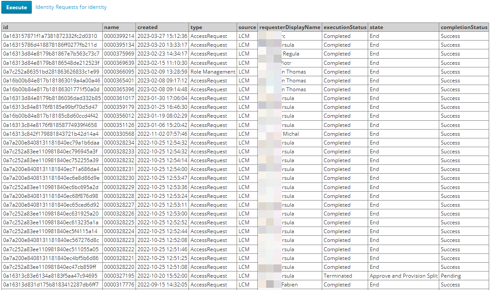

## Collapsing columns

The `IdentityRequest` class used in the previous example is particularly rich, so you easily end up with very wide output when defining many columns. By collapsing several columns into one, displaying multiple values in a single multiline cell, the output can be made more convenient to use. For this, the *format* instruction will be used, separating the placeholders by newlines (`\n`). The same technique ist used in the column header to make it multiline:

[Identity Requests for identity](https://identitiq.localdomain.com/identityiq/rulerunner/rulerunner.jsf?rule=six_generic_query&title=Identity+Requests+for+identity&className=IdentityRequest&filter=targetId+%3D%3D+%24%22%3AIdentity%28%7Bid%7Dname%3D%3D%22usrxy%22%29%22&ordering=created+desc&output=id%3D%3Aformat%28%5C%0A+%24%7Bid%7D%5Cn%5C%0A+%2Fidentityiq%2FidentityRequest%2FidentityRequest.jsf%23%2Frequest%2F%24%7Bname%7D%29%0Acreated%5Cnmodified%5CnendDate%5Cnverified%3D%3Aformat%28%5C%0A+%24%7Bcreated%7D%5Cn%5C%0A+%24%7Bmodified%2C%7D%5Cn%5C%0A+%24%7BendDate%7D%5Cn%5C%0A+%24%7Bverified%7D%29%0Atype%5Cnsource%5Cnrequester%3D%3Aformat%28%5C%0A+%24%7Btype%7D%5Cn%5C%0A+%24%7Bsource%7D%5Cn%5C%0A+%24%7BrequesterDisplayName%7D%29%0AexecutionStatus%5Cnstate%5CncompletionStatus%3D%3Aformat%28%5C%0A+%24%7BexecutionStatus%7D%5Cn%5C%0A+%24%7Bstate%7D%5Cn%5C%0A+%24%7BcompletionStatus%7D%29%0Aitems%3Ditems%5C%0A+%3Amap%28%3Aformat%28%5C%0A++%5B%24%7Bapplication%7D%5D+%24%7Boperation%7D+%24%7Bvalue%7D%24%7BdisplayableValue%3Aformat%28%2F%24%7B%7D%29%2C%7D%5C%0A++%24%7BendDate%3Aformat%28+%5Bend%3D%24%7B%25yyyy-MM-dd%7D%5D%29%2C%7D%5C%0A++%24%7BexpansionInfo%3Aformat%28%3A+%24%7B%7D%29%2C%7D+%5C%0A++%28Approval+%24%7BapprovalState%2COpen%7D%2C+Provisioning+%24%7BprovisioningState%7D%29%5C%0A+%29%29%3Ajoin%0Amessages%3Amap%28localizedMessage%29%3Ajoin&maxRows=100)

| Field name   | Input                                                                                                                                                                                                                                                                                                                                                                                                                                                                                                                                                                                                                                                                                                                 |
|:-------------|:----------------------------------------------------------------------------------------------------------------------------------------------------------------------------------------------------------------------------------------------------------------------------------------------------------------------------------------------------------------------------------------------------------------------------------------------------------------------------------------------------------------------------------------------------------------------------------------------------------------------------------------------------------------------------------------------------------------------|
| Title        | Identity Requests for identity                                                                                                                                                                                                                                                                                                                                                                                                                                                                                                                                                                                                                                                                                        |
| Object class | IdentityRequest                                                                                                                                                                                                                                                                                                                                                                                                                                                                                                                                                                                                                                                                                                       |
| Filter       | targetId == $":Identity({id}name=="usrxy")"                                                                                                                                                                                                                                                                                                                                                                                                                                                                                                                                                                                                                                                                           |
| Ordering     | created desc                                                                                                                                                                                                                                                                                                                                                                                                                                                                                                                                                                                                                                                                                                          |
| Output       | id=:format(\  ${id}\n\  /identityiq/identityRequest/identityRequest.jsf#/request/${name}) created\nmodified\nendDate\nverified=:format(\  ${created}\n\  ${modified,}\n\  ${endDate}\n\  ${verified}) type\nsource\nrequester=:format(\  ${type}\n\  ${source}\n\  ${requesterDisplayName}) executionStatus\nstate\ncompletionStatus=:format(\  ${executionStatus}\n\  ${state}\n\  ${completionStatus}) items=items\  :map(:format(\   [${application}] ${operation} ${value}${displayableValue:format(/${}),}\   ${endDate:format( [end=${%yyyy-MM-dd}]),}\   ${expansionInfo:format(: ${}),} \   (Approval ${approvalState,Open}, Provisioning ${provisioningState})\  )):join messages:map(localizedMessage):join |
| Maximum rows | 100                                                                                                                                                                                                                                                                                                                                                                                                                                                                                                                                                                                                                                                                                                                   |

This query delivers a very compact representation of the access requests:

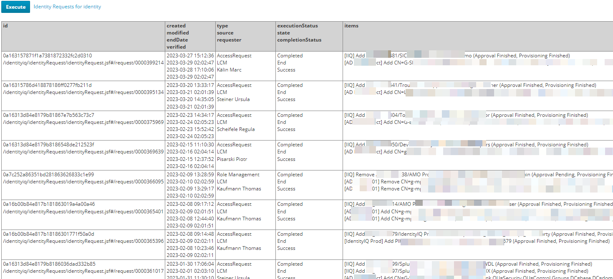

The URL path in the first column can be triple-clicked for copying it to the clipboard and opening the page in the IIQ GUI for this access request. To automate this task, you can create a browser bookmark (mine is named *Go to selection*) with the following target:

```js
javascript:void(window.open(location.origin+getSelection()))
```

This is, like the Generic Query links explained in the beginning of this guide, a [bookmarklet](https://en.wikipedia.org/wiki/Bookmarklet). It takes the location (protocol and host) from the URL of the current page, adds the text selected on the current page to it as the path, and opens the resulting URL in a new browser tab.

## Limiting column width

The Generic Query does never reflow text, so output will always be shown as produced. As a result, in the case of long strings such as error messages, columns may become uncomfortably wide, also wasting screen space in cells not filling the width. When the value causing the column to be widened is a list (a *multivalue* attribute, for instance), the problem can be easily addressed by folding it into multiple lines like, for instance:

```
memberOf:join(\n  )
```

The explicit parameter given in this example demonstrates how the follow-up lines can be indented if needed.

This technique doesn't help when what is widening the column is a *single* value. In this case, regular expressions can be used to mangle the string. There are several options:

- Limiting the overall length by matching only up to a maximum number of characters from the start using the OrionQL *match* instruction. This is rough though.
- Replacing the part following a certain number of characters by three dots using the OrionQL *replace* instruction. This gives a particularly nice output, indicating that the text has been truncated.
- Breaking the value into multiple lines by inserting newline characters after every certain number of characters using the OrionQL *replace* instruction. This doesn't give a particularly nice output but may better suit the purpose than simply cutting off text. If needed, the newline characters can be amended with marker characters or indentation of the continuation line to signal the inserted line break.

We will look at the two replace options since they are the preferable ways of addressing the problem.

> [!IMPORTANT]
> Since Java regular expressions, as used by OrionQL, have the dot wildcard (`.`) work in *multiline* mode by default, the *replace* instruction will handle multiline strings without additional effort.

For counting the characters we will use the curly braces quantifier. It allows to specify the number of characters directly.

To replace the text exceeding a certain limit of characters by three dots, we use a *capture* to match the text to keep and replace the whole match by the capture and three dots. To be sure we do the replacement only if what follows is more than the three dots we plan to add to the kept text, we require what comes after the capture to be at least four characters. Let's limit the length to 80 characters, meaning we have to cut off after 77 characters so we can add three dots after them. This is the regular expression to match (we will require there to be *more* than three characters to replace them by three dots, of course):

```
(.{77}).{4,}
```

It matches 81 characters and returns the first 77 of them as capture. The capture will be referenced using `$1`, and three dots will be added to form our replacement:

```
:replace((.{77}\).{4\,},$1...)
```

> [!IMPORTANT]
> Note the escaping for the closing parentheses and the commas contained in the regular expression.

When the expression does not match, what is the case if there are only *up to* 80 characters, it will be returned unchanged. The following query demonstrates the technique:

[Text cutoff example](https://identitiq.localdomain.com/identityiq/rulerunner/rulerunner.jsf?rule=six_generic_query&title=Text%20cutoff%20example&className=ManagedAttribute&filter=application.name%20%3D%3D%20%22AD%20Direct%22&output=value%3Areplace((.%7B77%7D%5C).%7B4%5C%2C%7D%2C%241...)&layout=1&maxRows=10)

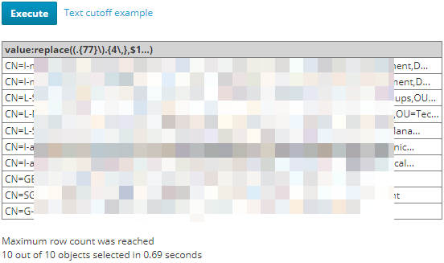

To split long strings into multiple lines, we match the desired number of characters, capturing them, and replace them with the capture and a newline. Let's limit the line length to 80:

```
:replace((.{80}\),$1\n)
```

If you apply this to a description field, the generated output is not particularly readable since words are broken by linefeeds. To overcome this, we can extend the match to also include any non-blank characters following the maximum-length matched so far. This will cause linefeeds to be inserted only before a blank character:

```
:replace((.{80}[^ ]*\),$1\n)
```

As a side effect, there is now no more hard limitation for the output line length - the number given in the quantifier instead specifies the *minimum* length of a line before a possible split. Modifying the regular expression to impose a *hard* limit on the output line length by is left as an exercise to the reader. (Hint: Limit the allowed number of additional characters.)

Where you want to allow this kind of *soft split* to happen, of course, depends on the type of text. Blank characters are a good choice for natural language text, but for instance Distinguished Names you would probably want to split after a comma.

Let's again use AD entitlements to test the technique, using a line length of 20 for better demonstration. The original value is displayed in the first column for reference. Note that we need to escape the commas contained in the regular expression to not have them interpreted as the delimiter between match pattern and replacement:

[Text break example)](https://identitiq.localdomain.com/identityiq/rulerunner/rulerunner.jsf?rule=six_generic_query&title=Text%20break%20example&className=ManagedAttribute&filter=application.name%20%3D%3D%20%22AD%20Direct%22&output=value%0Avalue%3Areplace((.%7B20%7D%5B%5E%5C%2C%5D%5C%2C%5C)%2C%241%5Cn%20)&layout=1&maxRows=10)

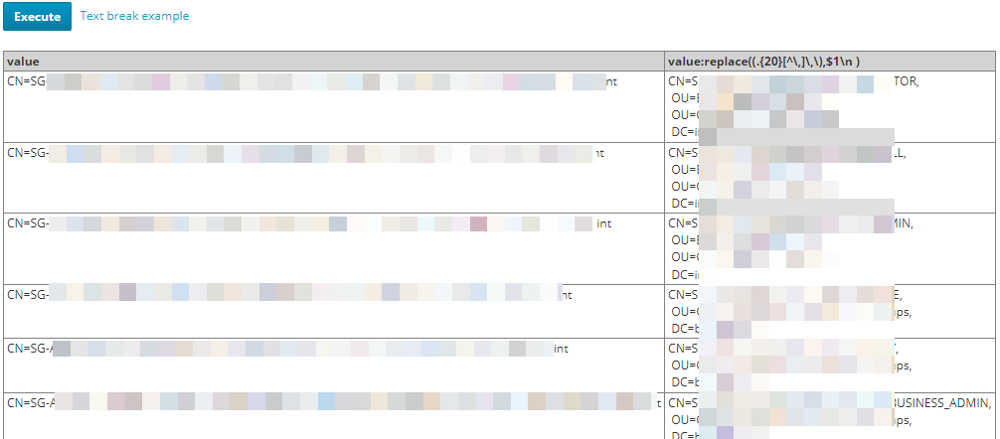

> [!IMPORTANT]
> Note that using the techniques described here, if the last line would fill up exactly, an unnecessary newline would be added to it. Luckily, it will be removed by the browser upon display, so this is not a problem except the mangled value is used in a *format* instruction with text following it. To see the dangling line break, either use developer tools or wrap the expression into a *format* instruction, adding some character after it.
>
> To prevent needlessly adding a newline at the end, we need to match more text, but without advancing the matcher. This can be done using a *zero-width lookahead* by one character:
>
> ```
> value:replace((.{80}\)(?=.\),$1\n)
> ```
>
> [Text break example (exact)](https://identitiq.localdomain.com/identityiq/rulerunner/rulerunner.jsf?rule=six_generic_query&title=Text%20break%20example%20(exact)&className=ManagedAttribute&filter=application.name%20%3D%3D%20%22AD%20Direct%22&output=value%0Avalue%3Areplace((.%7B20%7D%5C)(%3F%3D.%5C)%2C%241%5Cn)&layout=1&maxRows=10)

## Abbreviating fields

When trying to shorten representations to squeeze as much information as possible into the available output space, it might be not an option to simply cut off strings after a certain length as described in the previous section. Instead, some intelligent abbreviation might need to be computed. A good example is the `source` field in Audit records that can contain values like these:

- Identity Refresh
- Account Aggregation
- Provisioning Workflow
- wfl: SIX LCM AccessRequest Control Split
- wfl: SIX LCM AccessRequest Execution Control New Split
- Source Mapping Rule - SIX IdentityAttribute npaOwner

Suppose you want to put into the output of your query an "audit fingerprint" that is made up from *application*, *attribute name*, *attribute value* (the latter one already shortened using the approach from the previous section) and the *source* of the audit event. Then, a formatting template like

```
[${application}/${attributeName}] ${attributeValue:replace((.{57}\).{4\,},$1...)} (${source})
```

would produce audit fingerprints like this:

[SAP/Roles] CBICLNT001\ZBW\_GHRPA\_XX\_MANG\_CR (Account Aggregation)

If you have such audit fingerprints in multiple columns, like in [this query](https://identitiq.localdomain.com/identityiq/rulerunner/rulerunner.jsf?rule=six_generic_query&title=Role%20and%20entitlement%20assignments%20timeline%20for%20Identity&className=Expression&filter=%3AAuditEvent(%3E%5C%0A%20%20action.in(%7B%20%22six_role_assign%22%2C%20%22six_entitlement_assign%22%2C%20%22six_role_remove%22%2C%20%22six_entitlement_remove%22%2C%20%22six_link_attribute_change%22%2C%20%22six_identity_attrib_change%22%20%7D)%20%26%26%0A%20%20target%20%3D%3D%20%22usrxy%22%20%26%26%0A%20%20created%20%3E%20%24%22%3Adate(2021-01-01)%22%20%20%26%26%20created%20%3C%20%24%22%3Adate(2023-12-31)%22%0A)&computations=value%3DattributeValue%7Cstring2%0A%0Avalue%3Dvalue%3Areplace((.%7B57%7D%5C).%7B4%5C%2C%7D%2C%241...)&output=%5B%24%7Bapplication%7D%2F%24%7BattributeName%7D%5D%20%24%7Bvalue%7D%20(%24%7Bsource%7D)&grouping=created%3Aformat(%24%7B%25yyyy-MM-dd%20HH%3Amm%3Ass%7D)%0Aaction&layout=2), shortening the `source` would be interesting, making the output less wide and thus easier to navigate. To come up with a useful abbreviation, you can use the *replace* instruction to perform transformations like the following (using the `source` attribute as an example):

- Remove everything from the string that is not a capital letter **(use this with care!)**:

  ```
  source:replace([^A-Z],)
  ```

  This will give you, for instance, *AA* for *Account Aggregation* or *IR* for *Identity Refresh*. This type of abbreviation can, however, not only be a bit cryptic to decode in certain cases but it can even completely remove all information if there are no capital letters, so here is another option:
- Concatenate into a CamelCase abbreviation each capital letter and up to two lowercase letters following it:

  ```
  source:replace(([A-Z][a-z]{0\,2}\)[^A-Z]*,$1)
  ```

  This will give you, for instance, *SouMapRulSIXIdeAttOwn* for *Source Mapping Rule - SIX IdentityAttribute npaOwner* - instead of *SMRSIXIAO* like the first variant would give.

There are, of course, much more ways to customize the abbreviation generation, but you got the idea.

## Inline aggregation

We have used this technique already, but it's important enough to get its own section. Besides the Generic Query doing aggregations using *Grouping expressions*, OrionQL also provides aggregation capabilities (*count*, *group* and *index* instructions). They can be used everywhere an expression is accepted, particularly in column expressions, and we will show a non-trivial example of using inline aggregation here.

Let's list the access request for some identity, listing in two columns the *approved* and *rejected* roles. For this we will examine the `approvalSummaries` collection attribute. It contains a list of the approvals.

The logic behind the query is to first count, separately for each access request operation (`Add`, `Remove`, `Retain`), for each role the approval decisions (`Finished`, `Rejected`, `Canceled`). Then for each role, if there *is* a `Rejected` decision, the operation for the role was rejected, otherwise it was accepted. (To be more exact, we would have to also check in this case if there *was* a `Finished`, but let's omit this for simplicity now.) As there may be different operations requested regarding a role, we use a top level grouping to keep them apart.

To ease understanding the data transformations this query performs, the output contains the raw aggregated data in an additional column. This also demonstrates how queries can be built up incrementally when developing them. In the final version of the query, of course, this column would be removed. For the discussion below, let's provide the aggregated approval data for one of the access requests:

```
{
    Add = {
        Role711 = {
            Finished = 1
            null = 8
        }
        Role705 = {
            Finished = 1
            Rejected = 1
            Canceled = 7
        }
        Role706 = {
            Finished = 1
        }
        Role707 = {
            Finished = 1
            null = 7
        }
        Role708 = {
            Finished = 1
        }
        Role709 = {
            Finished = 1
            null = 8
        }
    }
}
```

Looking at the data, we see that the access request was about ordering 6 roles of which 5 were approved and one (AR\_30016705) rejected, and there was nothing other in the access request than these adds. Let's now look at how this aggregation is done.

To get at the `IdentityRequest`'s approval decisions for the roles, a *nested* iteration is needed: The `approvalSummaries` attribute contains a list of approval summaries, each of which contains in the `items` attribute of its `approvalSet` a list of approval items. The latter are what contains the `operation` and the `value` (role name), while the approval summary carries the decision.

The nested iteration is done using the OrionQLs *flatten* instruction which delivers the nested iteration's leaf elements (the approval items) as a flat list. The elements from the outer iterations (here the approval summaries) are accessible from the elements of this list via *parent references*. To perform the nested iteration, all the *flatten* instruction needs to be given is, for each iteration level, the path from an object to the collection for the next iteration level:

```
:flatten(approvalSummaries#approvalSet.items)
```

> [!IMPORTANT]
> The *flatten* instruction is a very powerful construct - it allows to iterate a nested object hierarchy in one go - by only providing a *virtual path* to the leaf elements, having hash marks (`#`) for the iterations on the way down. You'll probably need some time and practice to master it, but once you do, it will let you do complex stuff very easily.

The result of *flatten* is then fed into the *count* operation to do the aggregation, resulting in the nested map shown above:

```
:count(:format(${operation})#value#:format(${^.state}))
```

> [!IMPORTANT]
> Note how the Enums for `operation` and `state` are converted into strings using *format*, to permit the buckets they produce to be accessed using string keys.

The aggregation result is stored in a synthetic attribute `approvals` to have it available for multiple columns without recomputing it for each of them.

To get the list of approved or denied roles, in each column expression we first extract from the synthetic attribute `approvals` the bucket for the respective operation (`Add`, `Remove`, `Retain`):

```
approvals.Add
```

This is a map again - from the second level of the full aggregation result. It's again a map, mapping each role name to a map of the decisions made about that role. In the above example, when checking for the `Add` operation, we get the following map:

```
{
    Role711 = {
        Finished = 1
        null = 8
    }
    Role705 = {
        Finished = 1
        Rejected = 1
        Canceled = 7
    }
    Role706 = {
        Finished = 1
    }
    Role707 = {
        Finished = 1
        null = 7
    }
    Role708 = {
        Finished = 1
    }
    Role709 = {
        Finished = 1
        null = 8
    }
}
```

From it, we select only the entries satisfying an CerberusLogic selector, that checks if we have *none* or *any* `Rejected` decision in the `value` (which is a map again). The idea behind this is: If there *was* a `Reject`, the operation for the role was rejected, otherwise it must have been approved (see the comment above about needing to check for the presence of a `Finished` decision also, to be entirely correct). For the *approved* case, we thus have:

```
:select(none("value", eq("key", "Rejected")))
```

For the rejected case, the `none` check is changed into `any`.

From the result, we collect the keys - which are the role names - and sort and concatenate them into a multiline string:

```
:map(key):sort:join
```

[Identity Request approved/rejected analysis](https://identitiq.localdomain.com/identityiq/rulerunner/rulerunner.jsf?rule=six_generic_query&title=Identity%20Request%20approved%2Frejected%20analysis&className=IdentityRequest&filter=targetId%20%3D%3D%20%24%22%3AIdentity(%7Bid%7Dname%3D%3D%22usrxy%22)%22&ordering=created%20desc&computations=approvals%3D%3Aflatten(approvalSummaries%23approvalSet.items)%3Acount(%3Aformat(%24%7Boperation%7D)%23value%23%3Aformat(%24%7B%5E.state%7D))&output=id%0Acreated%0Atype%0Asource%0AexecutionStatus%0Aapprovals%3Apprint(true)%0Aadd%2Fapproved%3Dapprovals.Add%3Aselect(none(%20%22value%22%2C%20eq(%20%22key%22%2C%20%22Rejected%22%20)%20))%3Amap(key)%3Asort%3Ajoin%0Aadd%2Fdenied%3Dapprovals.Add%3Aselect(any(%20%22value%22%2C%20eq(%20%22key%22%2C%20%22Rejected%22%20)%20))%3Amap(key)%3Asort%3Ajoin%0Aremove%2Fapproved%3Dapprovals.Remove%3Aselect(none(%20%22value%22%2C%20eq(%20%22key%22%2C%20%22Rejected%22%20)%20))%3Amap(key)%3Asort%3Ajoin%0Aremove%2Fdenied%3Dapprovals.Remove%3Aselect(any(%20%22value%22%2C%20eq(%20%22key%22%2C%20%22Rejected%22%20)%20))%3Amap(key)%3Asort%3Ajoin%0Aretain%2Fapproved%3Dapprovals.Retain%3Aselect(none(%20%22value%22%2C%20eq(%20%22key%22%2C%20%22Rejected%22%20)%20))%3Amap(key)%3Asort%3Ajoin%0Aretain%2Fdenied%3Dapprovals.Retain%3Aselect(any(%20%22value%22%2C%20eq(%20%22key%22%2C%20%22Rejected%22%20)%20))%3Amap(key)%3Asort%3Ajoin&layout=1)

| Field name           | Input                                                                                                                                                                                                                                                                                                                                                                                                                                                                                                                                                                                                                                                                  |
|:---------------------|:-----------------------------------------------------------------------------------------------------------------------------------------------------------------------------------------------------------------------------------------------------------------------------------------------------------------------------------------------------------------------------------------------------------------------------------------------------------------------------------------------------------------------------------------------------------------------------------------------------------------------------------------------------------------------|
| Title                | Identity Request approved/rejected analysis                                                                                                                                                                                                                                                                                                                                                                                                                                                                                                                                                                                                                            |
| Object class         | IdentityRequest                                                                                                                                                                                                                                                                                                                                                                                                                                                                                                                                                                                                                                                        |
| Filter               | targetId == $":Identity({id}name=="usrxy")"                                                                                                                                                                                                                                                                                                                                                                                                                                                                                                                                                                                                                            |
| Ordering             | created desc                                                                                                                                                                                                                                                                                                                                                                                                                                                                                                                                                                                                                                                           |
| Synthetic attributes | approvals=:flatten(approvalSummaries#approvalSet.items):count(:format(${operation})#value#:format(${^.state}))                                                                                                                                                                                                                                                                                                                                                                                                                                                                                                                                                         |
| Output               | id created type source executionStatus approvals:pprint(true) add/approved=approvals.Add:select(none( "value", eq( "key", "Rejected" ) )):map(key):sort:join add/denied=approvals.Add:select(any( "value", eq( "key", "Rejected" ) )):map(key):sort:join remove/approved=approvals.Remove:select(none( "value", eq( "key", "Rejected" ) )):map(key):sort:join remove/denied=approvals.Remove:select(any( "value", eq( "key", "Rejected" ) )):map(key):sort:join retain/approved=approvals.Retain:select(none( "value", eq( "key", "Rejected" ) )):map(key):sort:join retain/denied=approvals.Retain:select(any( "value", eq( "key", "Rejected" ) )):map(key):sort:join |

As the screenshot shows, the six column expressions extract the desired data from the aggregation result:

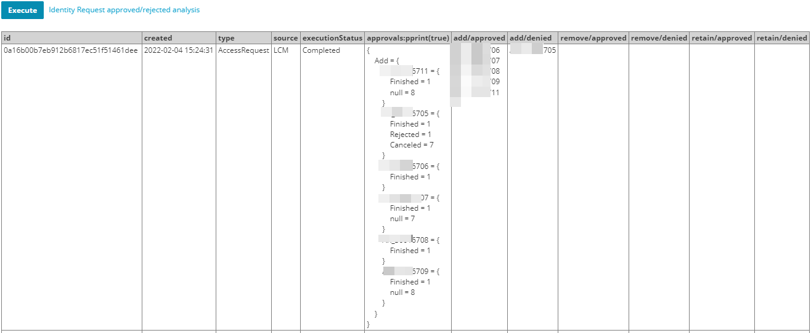

Not each use of inline aggregations needs to be such complex - often they are a convenient means to get an overview about a collection. For instance, if you wanted to amend the `IdentityRequest` table of the preceding section's example with a request items summary, you could use this column definition:

```
items summary=items:count(operation#application):pprint
```

Note that, since we use the aggregation result only for output here, there is no need to convert the `operation` Enum into a string. The output this produces would be something like this:

```
Add = {
    IIQ = 1
    AD Direct = 1
}
```

> [!IMPORTANT]
> Sorting pprint output
>
> Until now, we didn't care about the *pprint* output being unsorted. The reason for this is that OrionQL's grouping constructs by default use `HashMap`, so the keys will be in hash order, effectively looking unsorted. If *sorted* output is desired, the grouping constructs can be directed to use a `Map` implementation with sorted keys (`TreeMap`) by specifying the `>` flag:
>
> ```
> items summary=items:count(>operation#application):pprint
> ```
>
> When the `Map` submitted to *pprint* was created by IIQ, such as the `attributes` mapping of an IIQ object, a workaround can be applied to sort the *top level* keys by re-indexing the mapping:
>
> ```
> attributes:index(key,value):pprint
> ```
>
> This will output the attributes in sorted order.

## Prefetching data

When using OrionQL *lookup* instructions, the database query results are cached. Repeating the same lookup for multiple rows thus does not cause the query to be executed multiple times. However, there *may* be a performance issue when doing many small database queries in tight sequence. A better approach is often to fetch all data that will be needed *upfront* with *one* query, storing it in memory in a lookup table and using *that* for the lookups. Doing one big query instead of turning to the database with a separate query for each lookup might result in a substantial speed gain.

While OrionQL permits application code to provide lookup tables to have them available for use in *lookup* instructions, this approach is not feasible for the Generic Query. Instead, OrionQL constructs can be used to create lookup tables *on the fly*, as we will see in the next example. The example is also educating by exacting some other challenges.

Let's count, for each EAM application, how many *firewall* and *non-firewall* entitlements from automatic endpoints are built into its roles. A *firewall* entitlement is identified as starting with `CN=g-firewall-`.

We solve the task by reading the bundle-entitlement connections stored in `BundleProfileRelation` objects and counting them by the entitlement's category (*firewall* or *non-firewall*) and the bundle's EAM application. To select only entitlements from *automatic endpoints*, in the *Filter* we use an *in* condition on `sourceApplication.name`, preparing the list of all automatic endpoints *inline* by reading the `name`s of all `Application` objects representing automatic endpoints using this selection condition:

```
!type.in({"DelimitedFile", "ICCLocalManagedApplication", "SixLocalManagedApplication", "Logical" }) &&
authoritative == false
```

To exclude entitlement roles from the selection, we request the `required` attribute of the `BundleProfileRelation` to be `true`. This will select only the bundle-entitlement connections resulting from role requirements.

The bundle's EAM application is determined from the `bundleId` by a database lookup. Note that while `SIX_EAM_APPLICATION` is defined in the ObjectConfig as a *named column*, fetching it directly would yield an error (`Could not find class for join property SIX_EAM_APPLICATION in packages [sailpoint.object]`). We work around this by getting it from the `attributes` mapping, what, in performance terms, is not free however:

```
bundleId:Bundle({attributes}).SIX_EAM_APPLICATION
```

To cope with `null` values, the attribute is then converted to a string using a *format* instruction. Unfortunately, this ruins the numerical sorting that we could enjoy otherwise, so if the `long` type of the attribute wouldn't prevent us to do so, we would rather provide a default value instead by using an expression alternative.

Getting at the bundle's SIX\_EAM\_APPLICATION the way shown above lets the [query](https://identitiq.localdomain.com/identityiq/rulerunner/rulerunner.jsf?rule=six_generic_query&title=EAM%20applications%20with%20automatic%20entitlements%20in%20roles%20firewall%2Fnon-firewall&className=BundleProfileRelation&filter=sourceApplication.name.in(%0A%20%20%24%22%3AApplication(%5B%7Bname%7D%0A%20%20%20%20!type.in(%7B%22DelimitedFile%22%5C%2C%20%22ICCLocalManagedApplication%22%5C%2C%20%22SixLocalManagedApplication%22%5C%2C%20%22Logical%22%20%7D)%20%26%26%0A%20%20%20%20authoritative%20%3D%3D%20false%0A%20%20%5D)%22%0A)%20%26%26%0Arequired%20%3D%3D%20true&computations=Attribute(%20%22isFirewall%22%20).accept(%0A%20%20%22%5C%22firewall%5C%22%22%2C%20like(%20%22value%22%2C%20%22%5ECN%3Dg-firewall-%22%20)%0A).accept(%0A%20%20%22%5C%22non-firewall%5C%22%22%0A)&grouping=%3Aformat(%24%7BbundleId%3ABundle(%7Battributes%7D).SIX_EAM_APPLICATION%7D)%0AisFirewall&layout=2) turn to the database for each role referenced by any of the entitlements *individually*. Let's now get to the topic of this section and use an on-the-fly lookup table that is filled from a single big query on first use to get rid of the about 9000 separate database queries. For this, we change the above expression to the following:

```
:cache(bundles,\
  :Bundle(>{id,attributes}!type.in({ "EntitlementRole", "OrganizationalRole" }))\
  :index(id,attributes.SIX_EAM_APPLICATION)\
):get(bundleId)\


```

The lookup table is computed inside the *cache* instruction by reading, for all bundles with appropriate type, the `id` and `attributes` and building from this an index that maps each `id` to the `SIX_EAM_APPLICATION` of that role. By wrapping this expression into a *cache* instruction we ensure that it is computed only upon first invocation and then stored in the cache under the specified key `bundles`, so that from then on it will be taken directly from the cache. The lookup table then will be used by a *get* instruction to retrieve the `SIX_EAM_APPLICATION` for the role referenced by the current `BundleProfileRelation`, supplying `bundleId` as the lookup key.

Assembling all the pieces together, we arrive at this query:

[EAM applications with automatic entitlements in roles firewall/non-firewall](https://identitiq.localdomain.com/identityiq/rulerunner/rulerunner.jsf?rule=six_generic_query&title=EAM+applications+with+automatic+entitlements+in+roles+firewall%2Fnon-firewall&className=BundleProfileRelation&filter=sourceApplication.name.in%28%0A++%24%22%3AApplication%28%5B%7Bname%7D%0A++++%21type.in%28%7B%22DelimitedFile%22%2C+%22ICCLocalManagedApplication%22%2C+%22SixLocalManagedApplication%22%2C+%22Logical%22+%7D%29+%26%26%0A++++authoritative+%3D%3D+false%0A++%5D%29%22%0A%29+%26%26%0Arequired+%3D%3D+true&computations=Attribute%28+%22isFirewall%22+%29.accept%28%0A++%22%5C%22firewall%5C%22%22%2C+like%28+%22value%22%2C+%22%5ECN%3Dg-firewall-%22+%29%0A%29.accept%28%0A++%22%5C%22non-firewall%5C%22%22%0A%29&grouping=%3Aformat%28%24%7B%5C%0A++++%3Acache%28bundles%2C%5C%0A++++++%3ABundle%28%3E%7Bid%2Cattributes%7D%21type.in%28%7B+%22EntitlementRole%22%2C+%22OrganizationalRole%22+%7D%29%29%5C%0A++++++%3Aindex%28id%2Cattributes.SIX_EAM_APPLICATION%29%5C%0A++++%29%3Aget%28bundleId%29%5C%0A++%7D%29%0AisFirewall&layout=Matrix)

| Field name           | Input                                                                                                                                                                                                                 |
|:---------------------|:----------------------------------------------------------------------------------------------------------------------------------------------------------------------------------------------------------------------|
| Title                | EAM applications with automatic entitlements in roles firewall/non-firewall                                                                                                                                           |
| Object class         | BundleProfileRelation                                                                                                                                                                                                 |
| Filter               | sourceApplication.name.in(   $":Application([{name}     !type.in({"DelimitedFile", "ICCLocalManagedApplication", "SixLocalManagedApplication", "Logical" }) &&     authoritative == false   ])" ) && required == true |
| Synthetic attributes | Attribute( "isFirewall" ).accept(   "\"firewall\"", like( "value", "^CN=g-firewall-" ) ).accept(   "\"non-firewall\"" )                                                                                               |
| Grouping expressions | :format(${\     :cache(bundles,\       :Bundle(>{id,attributes}!type.in({ "EntitlementRole", "OrganizationalRole" }))\       :index(id,attributes.SIX\_EAM\_APPLICATION)\     ):get(bundleId)\   }) isFirewall          |
| Grouping layout      | Matrix                                                                                                                                                                                                                |

The output shows, for each EAM application, the number of automatic entitlements built into its roles, distinguishing firewall and non-firewall entitlements:

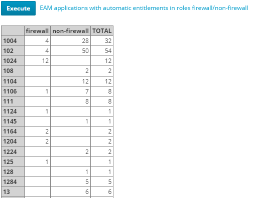

> [!IMPORTANT]
> We used a straightforward implementation to compute the `isFirewall` synthetic attribute by using an CerberusLogic rule with a *like* condition and explicitly specifying the labels we want to give to the respective entitlements:
>
> ```javascript
> Attribute( "isFirewall" ).accept(
>   "\"firewall\"", like( "value", "^CN=g-firewall-" )
> ).accept(
>   "\"non-firewall\""
> )
> ```
>
> An alternative approach would be to use a single OrionQL expression with a *match* instruction to check the same pattern as the *like* selector and returning the `firewall` substring using a regular expression *capture*, and complement it with an expression alternative supplying the value for the no-match case:
>
> ```
> isFirewall=value:match(^CN=g-(firewall\)-)|"non-firewall"
> ```
>
> Note that the capture's closing parenthesis needs to be escaped to prevent it being interpreted as the closing parenthesis of the *match* instruction.

> [!IMPORTANT]
> Note that as the *index* and *get* instructions support nested maps, there is no need to concatenate multipart keys into a single lookup key. Instead, they can be used directly, resulting in a multilevel lookup table. To create, for instance, a lookup table for entitlement owners indexed by endpoint name (`application.name`), entitlement type (`attribute`) and entitlement name (`value`), you could use:
>
> ```
> :index(application.name#attribute#value,owner.name)
> ```
>
> To retrieve the entitlement owner coming from a `BundleProfileRelation` object, the attributes to use for indexing would be `sourceApplication.name`, `type` and `value`:
>
> ```
> :cache(...).get(sourceApplication.name#type#value)
> ```
>
> Assuming that the inputs to the above expressions were objects, we didn't escape the dots in the above two code snippets. This would change if they were maps returned by a direct fetch of the objects' attributes.

> [!IMPORTANT]
> Assessing the performance improvements
>
> When testing the performance of the caching and non-caching variants of our query, there is no clear winner. One reason for this is that the query is spending a big part of its time reading the about 20000 `BundleProfileRelation` objects. Any variation of the time needed for this will mask the differences caused by the different EAM application lookup implementations. However, what we can state at this point is that the in-memory lookup at least didn't result in a *substantial* performance gain.
>
> It's important to note that besides creating additional complexity, this pattern may even *hurt* performance when applied carelessly. This can easily be the case when it causes much more data to be fetched from the database than will be effectively used. In such a case it will be more advantageous to use the simple load-as-needed approach. In other cases however, it might even make the difference between the query being *usable* or not.
>
> As a general guidance, keep the tool in your arsenal but use it consciously.
>
> The gain or loss resulting from an inline lookup table depends on the ratio between the *effectively used* and *all* prefetched data as well as on how expensive it is to load *each* of these data items: If only scalar attributes are needed and can be fetched from database columns directly (possibly also navigating an object relationship via a *join*), the expenses are low. If a CLOB, like in our example the `attributes` mapping, needs to be fetched and deserialized, the cost is significantly higher, and if even the objects have to be built, there might be no gain from batching the database accesses at all. If you are unsure about the value a lookup table provides, do some measurements. The following queries load, for three different types of data, the bundle data either directly in batch or by looping through all bundle IDs:
>
> - scalar attribute (`type`): [scalar batch](https://identitiq.localdomain.com/identityiq/rulerunner/rulerunner.jsf?rule=six_generic_query&title=scalar%20batch&className=Expression&filter=%3ABundle(%3E%7Bid%2Ctype%7D!type.in(%7B%20%22EntitlementRole%22%2C%20%22OrganizationalRole%22%20%7D))&grouping=type&layout=1) (2.1 s) vs. [scalar loop](https://identitiq.localdomain.com/identityiq/rulerunner/rulerunner.jsf?rule=six_generic_query&title=scalar%20loop&className=Expression&filter=%3ABundle(%3E%7Bid%7D!type.in(%7B%20%22EntitlementRole%22%2C%20%22OrganizationalRole%22%20%7D))&grouping=%40%3ABundle(%7Btype%7D)&layout=1) (21.1 s)
> - joined scalar attribute (`owner.name`, note the escaped dot when referencing the attribute): [join batch](https://identitiq.localdomain.com/identityiq/rulerunner/rulerunner.jsf?rule=six_generic_query&title=join%20batch&className=Expression&filter=%3ABundle(%3E%7Bid%2Cowner.name%7D!type.in(%7B%20%22EntitlementRole%22%2C%20%22OrganizationalRole%22%20%7D))&grouping=owner%5C.name%7C%22null%22&layout=1) (2.4 s) vs. [join loop](https://identitiq.localdomain.com/identityiq/rulerunner/rulerunner.jsf?rule=six_generic_query&title=join%20loop&className=Expression&filter=%3ABundle(%3E%7Bid%7D!type.in(%7B%20%22EntitlementRole%22%2C%20%22OrganizationalRole%22%20%7D))&grouping=%40%3ABundle(%7Bowner.name%7D)%7C%22null%22&layout=1) (21.6)
> - complex attribute (`attributes`): [map batch](https://identitiq.localdomain.com/identityiq/rulerunner/rulerunner.jsf?rule=six_generic_query&title=map%20batch&className=Expression&filter=%3ABundle(%3E%7Bid%2Cattributes%7D!type.in(%7B%20%22EntitlementRole%22%2C%20%22OrganizationalRole%22%20%7D))&grouping=%3Aformat(%24%7Battributes.SIX_EAM_APPLICATION%7D)&layout=1) (16.3 s) vs. [map loop](https://identitiq.localdomain.com/identityiq/rulerunner/rulerunner.jsf?rule=six_generic_query&title=map%20loop&className=Expression&filter=%3ABundle(%3E%7Bid%7D!type.in(%7B%20%22EntitlementRole%22%2C%20%22OrganizationalRole%22%20%7D))&grouping=%3Aformat(%24%7B%40%3ABundle(%7Battributes%7D).SIX_EAM_APPLICATION%7D)&layout=1) (> 40 s)
> - object: [object batch](https://identitiq.localdomain.com/identityiq/rulerunner/rulerunner.jsf?rule=six_generic_query&title=object%20batch&className=Expression&filter=%3ABundle(%3E!type.in(%7B%20%22EntitlementRole%22%2C%20%22OrganizationalRole%22%20%7D))&grouping=%3Aformat(%24%7BSIX_EAM_APPLICATION%7D)&layout=1) (29.5 s) vs. [object loop](https://identitiq.localdomain.com/identityiq/rulerunner/rulerunner.jsf?rule=six_generic_query&title=object%20loop&className=Expression&filter=%3ABundle(%3E%7Bid%7D!type.in(%7B%20%22EntitlementRole%22%2C%20%22OrganizationalRole%22%20%7D))&grouping=%3Aformat(%24%7B%40%3ABundle.SIX_EAM_APPLICATION%7D)&layout=1) (36.6 s)
>
> The query execution times often vary considerably (as can be seen by the *map loop* taking more time than the *object loop*), so for accurate conclusions, the measurements should be repeated a couple of times.
>
> As we are at it, let's also measure the time needed by the primary query - for the `BundleProfileRelation` data. The query from this section loads the objects, so we can expect a speedup when fetching only the two attributes that are needed. The following queries omit the role attribute stuff, so only the primary query is measured:
>
> - loading attributes: [BundleProfileRelation attributes](https://identitiq.localdomain.com/identityiq/rulerunner/rulerunner.jsf?rule=six_generic_query&title=BundleProfileRelation%20attributes&className=Expression&filter=%3ABundleProfileRelation(%3E%7Bvalue%2CbundleId%7DsourceApplication.name.in(%0A%20%20%24%22%3AApplication(%5B%7Bname%7D%0A%20%20%20%20!type.in(%7B%5C%22DelimitedFile%5C%22%2C%20%5C%22ICCLocalManagedApplication%5C%22%2C%20%5C%22SixLocalManagedApplication%5C%22%2C%20%5C%22Logical%5C%22%20%7D)%20%26%26%0A%20%20%20%20authoritative%20%3D%3D%20false%0A%20%20%5D)%22%0A)%20%26%26%0Arequired%20%3D%3D%20true)&grouping=bundleId&layout=1) (1.6 s)
> - loading objects: [BundleProfileRelation objects](https://identitiq.localdomain.com/identityiq/rulerunner/rulerunner.jsf?rule=six_generic_query&title=BundleProfileRelation%20objects&className=Expression&filter=%3ABundleProfileRelation(%3EsourceApplication.name.in(%0A%20%20%24%22%3AApplication(%5B%7Bname%7D%0A%20%20%20%20!type.in(%7B%5C%22DelimitedFile%5C%22%2C%20%5C%22ICCLocalManagedApplication%5C%22%2C%20%5C%22SixLocalManagedApplication%5C%22%2C%20%5C%22Logical%5C%22%20%7D)%20%26%26%0A%20%20%20%20authoritative%20%3D%3D%20false%0A%20%20%5D)%22%0A)%20%26%26%0Arequired%20%3D%3D%20true)&grouping=bundleId&layout=1) (15.6 s)
>
> As is commonly the case, omitting the object loading gives a speedup by factor 10. When changing the query from this section in this way, it speeds up considerably, and the performance gain achieved by the lookup table approach becomes more noticeable:
>
> - straightforward implementation: [EAM applications with automatic entitlements in roles firewall/non-firewall](https://identitiq.localdomain.com/identityiq/rulerunner/rulerunner.jsf?rule=six_generic_query&title=EAM%20applications%20with%20automatic%20entitlements%20in%20roles%20firewall%2Fnon-firewall&className=Expression&filter=%3ABundleProfileRelation(%3E%7Bvalue%2CbundleId%7DsourceApplication.name.in(%0A%20%20%24%22%3AApplication(%5B%7Bname%7D%0A%20%20%20%20!type.in(%7B%5C%22DelimitedFile%5C%22%2C%20%5C%22ICCLocalManagedApplication%5C%22%2C%20%5C%22SixLocalManagedApplication%5C%22%2C%20%5C%22Logical%5C%22%20%7D)%20%26%26%0A%20%20%20%20authoritative%20%3D%3D%20false%0A%20%20%5D)%22%0A)%20%26%26%0Arequired%20%3D%3D%20true)&computations=Attribute(%20%22isFirewall%22%20).accept(%0A%20%20%22%5C%22firewall%5C%22%22%2C%20like(%20%22value%22%2C%20%22%5ECN%3Dg-firewall-%22%20)%0A).accept(%0A%20%20%22%5C%22non-firewall%5C%22%22%0A)&grouping=%3Aformat(%24%7BbundleId%3ABundle(%7Battributes%7D).SIX_EAM_APPLICATION%7D)%0AisFirewall&layout=2) (14.9 s)
> - lookup table implementation: [EAM applications with automatic entitlements in roles firewall/non-firewall](https://identitiq.localdomain.com/identityiq/rulerunner/rulerunner.jsf?rule=six_generic_query&title=EAM%20applications%20with%20automatic%20entitlements%20in%20roles%20firewall%2Fnon-firewall&className=Expression&filter=%3ABundleProfileRelation(%3E%7Bvalue%2CbundleId%7DsourceApplication.name.in(%0A%20%20%24%22%3AApplication(%5B%7Bname%7D%0A%20%20%20%20!type.in(%7B%5C%22DelimitedFile%5C%22%2C%20%5C%22ICCLocalManagedApplication%5C%22%2C%20%5C%22SixLocalManagedApplication%5C%22%2C%20%5C%22Logical%5C%22%20%7D)%20%26%26%0A%20%20%20%20authoritative%20%3D%3D%20false%0A%20%20%5D)%22%0A)%20%26%26%0Arequired%20%3D%3D%20true)&computations=Attribute(%20%22isFirewall%22%20).accept(%0A%20%20%22%5C%22firewall%5C%22%22%2C%20like(%20%22value%22%2C%20%22%5ECN%3Dg-firewall-%22%20)%0A).accept(%0A%20%20%22%5C%22non-firewall%5C%22%22%0A)&grouping=%3Aformat(%24%7B%5C%0A%20%20%20%20%3Acache(bundles%2C%5C%0A%20%20%20%20%20%20%3ABundle(%3E%7Bid%2Cattributes%7D!type.in(%7B%20%22EntitlementRole%22%2C%20%22OrganizationalRole%22%20%7D))%5C%0A%20%20%20%20%20%20%3Aindex(id%2Cattributes.SIX_EAM_APPLICATION)%5C%0A%20%20%20%20)%3Aget(bundleId)%5C%0A%20%20%7D)%0AisFirewall&layout=2) (9.0 s)
>
> While this wasn't particularly impressive, here is a more convincing example: The following query was *two orders of magnitude* faster than the unoptimized query that did two database queries for each of the more than 30000 role entitlements:
>
> [BundleProfileRelation reference consistency check](https://identitiq.localdomain.com/identityiq/rulerunner/rulerunner.jsf?rule=six_generic_query&title=BundleProfileRelation%20reference%20consistency%20check&className=BundleProfileRelation&filter=required%20%3D%3D%20true&computations=byHash%3D%5C%0A%20%20%3Acache(hashLookup%2C%5C%0A%20%20%20%20%3AManagedAttribute(%3E%7Bid%2Chash%7D-)%5C%0A%20%20%20%20%3Agroup(hash%2Cid)%5C%0A%20%20)%5C%0A%20%20%3Aget(hash)%5C%0A%20%20%3Ajoin%0AbyTriplet%3D%5C%0A%20%20%3Acache(tripletLookup%2C%5C%0A%20%20%20%20%3AManagedAttribute(%3E%7Bid%2Capplication.name%2Cattribute%2Cvalue%7D-)%5C%0A%20%20%20%20%3Aindex(application%5C.name%23attribute%23value%2Cid)%5C%0A%20%20)%5C%0A%20%20%3Aget(sourceApplication.name%23attribute%23value)&selector=BundleProfileRelation().accept(%0A%20%20ne(%20%22byHash%22%2C%20ref(%20%22byTriplet%22%20)%20)%0A).accept(%0A%20%20eq(%20%22byTriplet%22%2C%20null%20)%0A)&output=bundleId%3ABundle%3Aformat(%5B%24%7Bname%7D%5D%20%24%7BdisplayName%7D)%0AsourceApplication.name%0Aattribute%0Avalue%0AbyHash%0AbyTriplet&layout=1)
>
> What it does is checking if the two ways to resolve the entitlement referenced from a `BundleProfileRelation` object - by either the triplet key (*application*, *attribute* and *value*) or the *hash* - yield identical results.
>
> For this, it creates two lookup tables - `tripletLookup` and `hashLookup` - by indexing all entitlements (taking the ID) by the triplet key and the hash. To be prepared for *hash* collisions, *group* is used instead of *index*, requiring the lookup result to be converted using *join*.
>
> The entire entitlement catalog needs to be read twice; note the dummy filter expressions (`-`) in the *ManagedAttribute* instructions needed to *not* have them do a lookup by name/ID as is done in the *absence* of a filter expression.
>
> For each `BundleProfileRelation`, the lookup results are then stored in two synthetic attributes - `byTriplet` and `byHash` - to have them available in the selection rules as well as in the column expressions. The selection rules do a comparison of both values and contain an additional condition to output also `BundleProfileRelation`s that reference non-existing entitlements.
>
> The table below shows the tremendous performance gain caused by the lookup tables compared to the unoptimized query. When assessing performance improvements, always be aware to compare execution times for the *same* server, as differences in the latency of the database connection of different servers or other factors may skew the result:
>
> 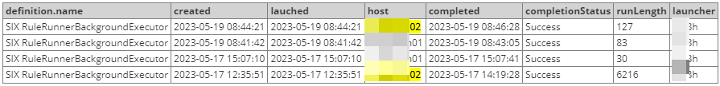

> [!IMPORTANT]
> About the cache key
>
> The cache key is a formatting template in which placeholders can be used to distinguish the results of computations differing only in their inputs. Since in the case at hand the computation uses no input but has the selection condition hardcoded, no such distinction needs to be made, and the cache key is a simple string.
>
> In contrast, imagine caching for instance entitlement data, where instead of reading *all* entitlements upfront, possibly wasting time reading entitlements for large endpoints that will never be referenced later, you want to read only some subset to cover the *immediate* need (covering a single endpoint, for instance). In such a case, you will have a selection condition that depends on the input and potentially create multiple lookup tables that of course need to be kept apart in the cache by having the keys reflect the different selection conditions (for instance, containing the endpoint name if the selection is by endpoint). With such a setup, the entitlements of any endpoint will be read only when (and *if*) the first entitlement of the endpoint is referenced.
>
> As an example, let's build a lookup table for entitlement owners to use when listing role entitlements. As a drive-by exercise for using *flatten* we'll read the entitlements from the role profiles instead of the new `BundleProfileRelation` table available since IIQ 8.3. The following Collection expression will do the job:
>
> ```
> :flatten(flattenedRequirements#profiles#constraints#value)
> ```
>
> Starting from the role, this expression iterates over all required roles (also following any requirement *chains* by using the special API method `getFlattenedRequirements()`), for each of them iterating over its profiles, for each of them iterating over its constraints, and for each of them iterating over all values. This thoroughly follows the one-to-many relationships codified in the IIQ object model without regard to how we *actually* use it (we have only *one* profile per entitlement role, *one* constraint per profile and *one* value per constraint), while the expression *builds* on that the constraints are all of type *containsAll*).
>
> The output of this expression is a stream of *values* (entitlement names), having each attached via a parent chain of constraint → profile → entitlement role → role the context information needed to identify the entitlement - namely the entitlement type (attribute name, on the *constraint*) and the endpoint (application name, on the *profile*). This means (by going the *flatten* path *backwards*), when iterating over *flatten*'s output:
>
> - `@` refers to the *value* (entitlement name, a `String`), this is the iteration's current object (the `this` object)
> - `^` refers to the *constraint* (a `Filter`).  
>   Alternatively, the more self-documenting expression `^Filter` can be used.
> - `^.^` refers to the *profile* (a `Profile`).  
>   Alternatively, the more self-documenting expression `^Profile` can be used.
> - `^.^.^` refers to the *entitlement role* (a `Bundle`).  
>   Alternatively, the more self-documenting expression `^Bundle` can be used.
> - `^.^.^.^` refers to the *role* (a `Bundle`).  
>   Alternatively, the more self-documenting expression `^^Bundle` can be used.
>
> Now that we have the triplet entitlement key that allow us to lookup the `ManagedAttribute` for determining the entitlement owner, the lookup table comes in: To not query for *each* entitlement, pulled out of a profile, the entitlement owner with a separate database lookup, we fill a lookup table on first use with one big query and get the entitlement owner from *it*. Furthermore, to not load entitlements that will possibly never be referenced by the query, we will create the lookup tables *per endpoint* as a two-level (*attribute* → *value*) lookup table, caching it by an endpoint specific cache key `entitlementOwners_endpoint`. Consequently, the database query as well as the cache key template reference `application.name` from the *profile* (`^.^`). This expression returns the lookup table for the endpoint of the current entitlement:
>
> ```
> :cache(entitlementOwners_${^.^.application.name},\
>   :ManagedAttribute(>{attribute,value,owner.name}application.name == $"^.^.application.name")\
>   :index(attribute#value,owner\.name)\
> )
> ```
>
> The entitlement owner will be retrieved from it using this two-level lookup by entitlement attribute name and value:
>
> ```
> :get(^.property#@)
> ```
>
> The final query lists the selected roles with their entitlements including the entitlement owner. To test the lookup table creation, we added a column showing its contents and restricted the row count to one. Note that in the second *cache* instruction it's enough to specify the cache key since after the preceding column expression has been evaluated, the cache is guaranteed to contain the cached value:
>
> [Lookup table creation test](https://identitiq.localdomain.com/identityiq/rulerunner/rulerunner.jsf?rule=six_generic_query&title=Lookup%20table%20creation%20test&className=Bundle&filter=displayName.startsWith(%20%22VDFS%22%20)&ordering=name&subquery=%3Aflatten(flattenedRequirements%23profiles%23constraints%23value)&output=name%3D%5E.%5E.%5E.%5E.name%0AdisplayName%3D%5E.%5E.%5E.%5E.displayName%0Aendpoint%3D%5E.%5E.application.name%0Atype%3D%5E.property%0Aentitlement%3D%40%0Aowner%3D%3Acache(entitlementOwners_%24%7B%5E.%5E.application.name%7D%2C%5C%0A%20%20%3AManagedAttribute(%3E%7Battribute%2Cvalue%2Cowner.name%7Dapplication.name%20%3D%3D%20%24%22%5E.%5E.application.name%22)%5C%0A%20%20%3Aindex(attribute%23value%2Cowner%5C.name)%5C%0A)%3Aget(%5E.property%23%40)%0AlookupTable%3D%3Acache(entitlementOwners_%24%7B%5E.%5E.application.name%7D)%5C%0A%20%20%3Apprint(true)&layout=1&maxRows=1)
>
> As you can see from the timing output of the Generic Query, building a lookup table for the almost 30000 AD lite entitlements is quite fast:
>
> 
>
> In the query's *Output* field, note the parent chain `^.^.^.^` needed to access the role from within the *flatten* iteration, analogously `^.^` for the endpoint and `^` for the entitlement type (see the above references list).

## Flattening

We already dissected objects by iterating over the elements of a collection attribute using the *Collection expression* field. We also used the OrionQL *flatten* instruction in column expressions. Let's brighten a rather dark piece of IIQ configuration by combining this and use the *flatten* instruction in the *Collection expression* field. This will allow us to get more familiar with the power the *flatten* instruction provides us, and at the same time serve as a warmup for the next section.

The `ObjectConfig` *Bundle* contains, like all other ObjectConfigs, a list of attributes defined for this object class. In addition however, it also defines different role types. This implies a matrix: *role types* \* *attributes*. Of course, not every attribute is applicable to every role type, so some sort of specification is needed which attributes apply to which types. The way this is done in IIQ is, unfortunately, a *negative list*: Each role type carries a list of *disallowed attributes*, so that, to any role type, all Bundle attributes apply that are *not* in this list. While this makes it easy to add a new attribute to all role types, it makes it hard to see in the XML, which attributes a specific role type *has*. Even more, the XML representation makes it difficult to get an overview over the defined attributes for all the role types and to compare them. What would be helpful is a tabular representation, so let's build a first version by showing the disallowed attributes for all role types in a matrix.

In this query, the primary query returns a *single* object - the `ObjectConfig` *Bundle*. To get at the data we are interested in, we dissect it using a *Collection expression*. As it turns out, we have to iterate over an object hierarchy:

- The `ObjectConfig` *Bundle* contains a list of *role type definitions*.
- Each role type definition contains a list of *disallowed attributes*.

The *flatten* instruction allows us to easily iterate over all *disallowed attributes* of all *role types*:

```
:flatten(configAttributes.roleTypeDefinitions#disallowedAttributes)
```

Each *disallowed attribute* will carry its *role type definition* as the *parent* object, so we can group the disallowed attributes that come out of the flatten instruction into rows and columns using the disallowed attribute itself (`@`) and the role type's name (`^.name`):

[Bundle type disallowed attributes](https://identitiq.localdomain.com/identityiq/rulerunner/rulerunner.jsf?rule=six_generic_query&title=Bundle+type+disallowed+attributes&className=ObjectConfig&filter=name+%3D%3D+%22Bundle%22&subquery=%3Aflatten%28configAttributes.roleTypeDefinitions%23disallowedAttributes%29&grouping=%40%0A%5E.name&layout=Matrix+%28rotate+headers%29)

| Field name            | Input                                                               |
|:----------------------|:--------------------------------------------------------------------|
| Title                 | Bundle type disallowed attributes                                   |
| Object class          | ObjectConfig                                                        |
| Filter                | name == "Bundle"                                                    |
| Collection expression | :flatten(configAttributes.roleTypeDefinitions#disallowedAttributes) |
| Grouping expressions  | @ ^.name                                                            |
| Grouping layout       | Matrix (rotate headers)                                             |

This gives us a tabular representation of the disabled attributes of all role types. As we were *counting* the disallowed attributes by name and role type, what we have in the matrix are numbers. Each filled cell means that the attribute is disallowed for this role type (and hopefully, we see only ones here):

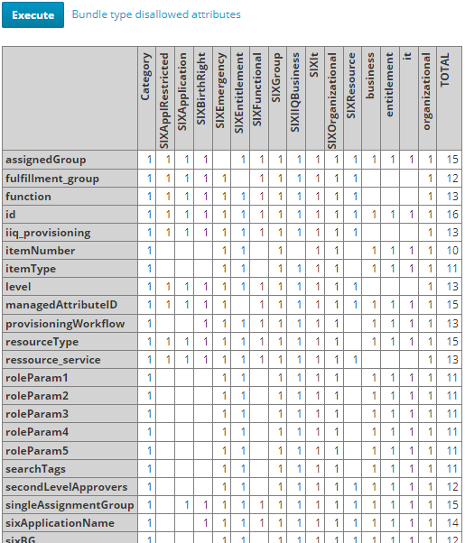

Sadly, we need to invert the cell contents *mentally* by looking at the *empty* cells, to see what we are *really* interested in - the role types' *allowed attributes*.

However, the query as another, more severe shortcoming: It *doesn't show* any attributes that are allowed for *all* role types (that is, disallowed by *none* of them), nor any role types that allow all attributes (that is, don't disallow any of them). So, we have to admit that while it was a good start to show the configuration in a more accessible view, the result is not something we can rely on to get a correct picture of the role type definitions. We will address both shortcomings in the next section.

## Free iteration

The primary function of the OrionQL *flatten* instruction is walking an *object tree* given by a *generalized path* to the objects to be iterated upon, that is made up of linear segments interspersed with iterations. We have seen these kinds of uses in the preceding examples.

The *flatten* instruction is, however, more general - it does *nested iterations* - so we can pull even more power out of it. The collections iterated upon on each next lower level are specified using expressions that are applied to the elements of each iteration level. In the normal case of these expressions returning collections *related* to this object, the result is walking an object *tree*. However, the expressions are free to return *any* collection they want - bound to the object given to it or not. We call the latter case *free iteration*, and it effectively walks a *matrix* instead of a *tree*. Consider the following instruction:

```
:flatten(:Identity(>active == true)#:Bundle(>disabled == false))
```

It will iterate over all active identities, and for each Identity, it will iterate over all bundles that are not disabled. *Both* expressions entirely disregard their input by having the selection conditions encoded within them literally. As a result, a huge matrix is walked by multiplying both sets - similar to an SQL table join without a join condition.

> [!IMPORTANT]
> Note that the matrix is never created physically in memory, as the *flatten* instruction creates only a *stream* of objects.

Let's apply this technique to our problem from the previous section to produce the full matrix of all role types and role attributes. For this, coming from the `ObjectConfig` *Bundle*, we first iterate over all role attributes and then over all role types (we could do it the opposite way also). To get for *each* `ObjectAttribute` the list of all `RoleTypeDefinition`s, we need to get back from it to the `ObjectConfig` by using a parent navigation (`^`). This will be our *Collection expression*:

```
:flatten(objectAttributes#^.configAttributes.roleTypeDefinitions)
```

To see what this turns into, execute the query below with the *Output* field cleared - this will create the full matrix of attributes and role types filled with ones since we have *one* occurrence for each combination of attribute and role type:

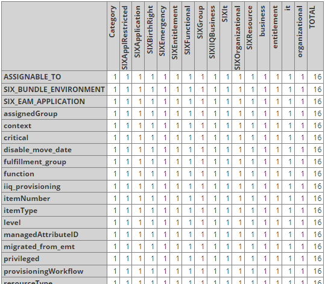

What we need now is to fill into the cells the data from the previous example. We will invert it along the way, placing an empty string for any disallowed combination and an asterisk otherwise.

We will use inline aggregation and caching to prepare the data for querying in each cell. The following expression, evaluated on the `ObjectConfig` object, will prepare a two-level mapping indexed by *role type name* and *attribute name*, containing an empty string for each disallowed combination:

```
:flatten(configAttributes.roleTypeDefinitions#disallowedAttributes)\
:index(^.name#@,"")
```

To look at what this expression produces, you can place it into the *Output* field (be sure to have no *Collection expression*):

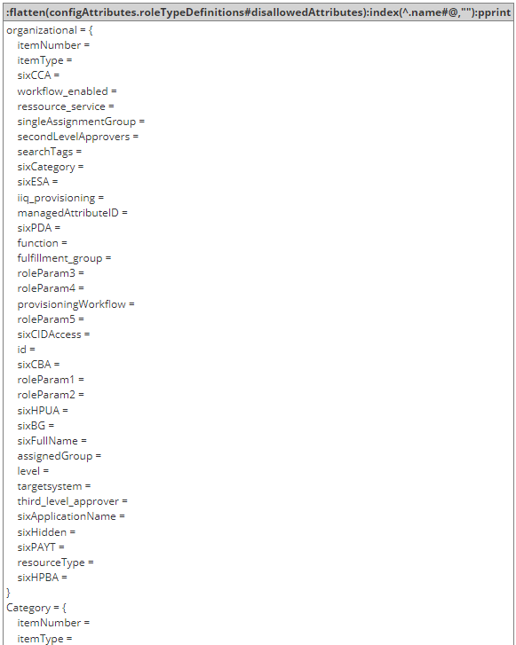

> [!IMPORTANT]
> Note that if there were duplicates in the disallowed attributes, *index* would complain by throwing an exception. To work around this, we could use *group*, what would produce, for each index position, a *list* with empty strings in it. To get rid of the square brackets we get in the cells then instead of having them empty, we could "format" this list into a space:
>
> ```
> :cache(disallowedAttributes,\
>   :flatten(^.^.configAttributes.roleTypeDefinitions#disallowedAttributes)\
>   :group(^.name#@,"")\
> ):get(name#^.name):format( )|"*"
> ```
>
> Of course, it's better to correct wrong data than to work around it, but it could be an escape in the meantime.

The empty string contained in the mapping will deliver the value for all cells with disallowed combinations, and an expression alternative will be used to supply a non-empty string for all other cells (we use an asterisk). This is how we access the above mapping from each matrix cell to get what is to be displayed in the cell:

```
:get(name#^.name)|"*"
```

Here, `name` is the *role type name* and `^.name` the *attribute name* (refer to the *flatten* collection expression above to see that we are iterating over the `RoleTypeDefinition`s with the `ObjectAttribute`s in the *parent*).

What is missing is putting all the pieces together. For this we need another technique we already used - *caching*: We compute the *disabled combinations mapping* when we need it the first time, that is, when outputting the first cell of the matrix, and cache it under the name `disallowedAttributes` for later use. Note that when evaluating *Output*, we are two levels deep in the *flatten* iteration of the *Collection expression*, so we need to get back to the `ObjectConfig` using two parent navigations. This is the finished query:

[Bundle type allowed attributes](https://identitiq.localdomain.com/identityiq/rulerunner/rulerunner.jsf?rule=six_generic_query&title=Bundle+type+allowed+attributes&className=ObjectConfig&filter=name+%3D%3D+%22Bundle%22&subquery=%3Aflatten%28objectAttributes%23%5E.configAttributes.roleTypeDefinitions%29&output=%3Acache%28disallowedAttributes%2C%5C%0A++%3Aflatten%28%5E.%5E.configAttributes.roleTypeDefinitions%23disallowedAttributes%29%5C%0A++%3Aindex%28%5E.name%23%40%2C%22%22%29%5C%0A%29%3Aget%28name%23%5E.name%29%7C%22*%22&grouping=%5E.name%0Aname&layout=Matrix+%28rotate+headers%29)

| Field name            | Input                                                                                                                                                   |
|:----------------------|:--------------------------------------------------------------------------------------------------------------------------------------------------------|
| Title                 | Bundle type allowed attributes                                                                                                                          |
| Object class          | ObjectConfig                                                                                                                                            |
| Filter                | name == "Bundle"                                                                                                                                        |
| Collection expression | :flatten(objectAttributes#^.configAttributes.roleTypeDefinitions)                                                                                       |
| Output                | :cache(disallowedAttributes,\   :flatten(^.^.configAttributes.roleTypeDefinitions#disallowedAttributes)\   :index(^.name#@,"")\ ):get(name#^.name)|"\*" |
| Grouping expressions  | ^.name name                                                                                                                                             |
| Grouping layout       | Matrix (rotate headers)                                                                                                                                 |

The output reveals several attributes that were missing in the output of the previous example since they are *not* disallowed by *any* role type:

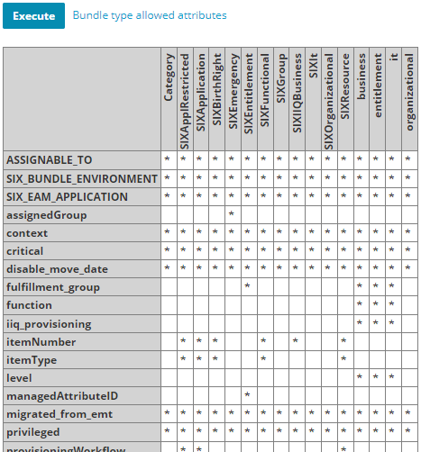

A representation like this is much more suited to reason about the role type attributes than the `ObjectConfig` XML, let alone the IIQ GUI. Particularly, we can immediately spot quite some attributes that are obviously allowed for too many role types.

> [!IMPORTANT]
> Having arrived at this point, we might be curious about how well the data in our database follows our role type definitions. This is easy to check using the same technique - what we have to do in addition to where we already are, is to count the attribute values of all roles by role type and attribute name and check this against the allowance we already computed. To count the attribute values, we take apart the `attributes` maps of all roles in the same way as we did earlier in the map unfolding example - the only difference is that it now happens within an OrionQL expression using *flatten*.
>
> > [!IMPORTANT]
> > Note that counting the attribute usages will establish the *use* of the attribute name, independent of the *attribute value* being not `null`.
>
> We do the aggregation like follows - reading all roles and iterating over each one's `attributes` mapping to count the key-value pairs by role type (`^.type`) and attribute name (`key`):
>
> ```
> :flatten(:Bundle(>{type,attributes}disabled == false)#attributes)\
> :count(^.type#key)
> ```
>
> To look at what this expression produces, you do like above and can place it into the *Output* field:
>
> 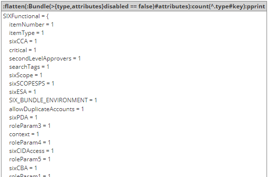
>
> (Having only one functional role using attributes appears odd, but as it turns out, 51 of these 52 roles are disabled.)
>
> After having prepared the asterisks and the counts, we could display them in each cell using *format*. To better see the mismatches however, we want to filter the output and leave only the cases where the data does *not* follow the configuration - that is, either the attribute is allowed but not used or the attribute is disallowed but used. As a result, we can get by with only a single value per cell using the *count*: When the attribute is disallowed, we will display the number of roles it is used in, and if it's allowed but not used, we will display zero.
>
> To suppress the correct cases in the output, we have two possibilities:
>
> - We can use *Selection rules* to filter out the correct cases from the matrix generation entirely. This may result in complete rows and/or columns removed from it instead of being rendered empty.
> - We can use an attribute computation rule to conditionally compute the values for the cells, supplying an empty string for the correct cases. This will keep the matrix in full size.
>
> We chose the second approach to keep the matrix complete. In both cases we have to move the computations to the *Synthetic attributes*. One reason is that we need the computed values multiple times and the other is that in both cases we are using CerberusLogic rules (albeit in different fields).
>
> Since we don't display the *allowed* asterisk any more, we can simplify the computation of the `disallowed` synthetic attribute (copied from the query above), having similar computations for both synthetic attributes. For readability, we have separated all attribute computations by newlines although the execution in several passes this causes is only needed for the `cell` attribute (where it is triggered anyway by the language change).
>
> [Bundle type allowed attributes mismatches](https://identitiq.localdomain.com/identityiq/rulerunner/rulerunner.jsf?rule=six_generic_query&title=Bundle+type+allowed+attributes+mismatches&className=ObjectConfig&filter=name+%3D%3D+%22Bundle%22&subquery=%3Aflatten%28objectAttributes%23%5E.configAttributes.roleTypeDefinitions%29&computations=disallowed%3D%3Acache%28disallowedAttributes%2C%5C%0A++%3Aflatten%28%5E.%5E.configAttributes.roleTypeDefinitions%23disallowedAttributes%29%5C%0A++%3Acount%28%5E.name%23%40%29%5C%0A%29%3Aget%28name%23%5E.name%29%0A%0Acount%3D%3Acache%28attributeCounts%2C%5C%0A++%3Aflatten%28%3ABundle%28%3E%7Btype%2Cattributes%7Ddisabled+%3D%3D+false%29%23attributes%29%5C%0A++%3Acount%28%5E.type%23key%29%5C%0A%29%3Aget%28name%23%5E.name%29%0A%0AAttribute%28+%22cell%22+%29.accept%28+%22count%22%2C%0A++ne%28+%22count%22%2C+null+%29%2C%0A++ne%28+%22disallowed%22%2C+null+%29%0A%29.accept%28+%220%22%2C%0A++eq%28+%22count%22%2C+null+%29%2C%0A++eq%28+%22disallowed%22%2C+null+%29%0A%29.accept%28+%22null%22+%29&output=cell&grouping=%5E.name%0Aname&layout=Matrix+%28rotate+headers%29)
>
> | Field name            | Input                                                                                                                                                                                                                                                                                                                                                                                                                                                                                          |
> |:----------------------|:-----------------------------------------------------------------------------------------------------------------------------------------------------------------------------------------------------------------------------------------------------------------------------------------------------------------------------------------------------------------------------------------------------------------------------------------------------------------------------------------------|
> | Title                 | Bundle type allowed attributes mismatches                                                                                                                                                                                                                                                                                                                                                                                                                                                      |
> | Object class          | ObjectConfig                                                                                                                                                                                                                                                                                                                                                                                                                                                                                   |
> | Filter                | name == "Bundle"                                                                                                                                                                                                                                                                                                                                                                                                                                                                               |
> | Collection expression | :flatten(objectAttributes#^.configAttributes.roleTypeDefinitions)                                                                                                                                                                                                                                                                                                                                                                                                                              |
> | Synthetic attributes  | disallowed=:cache(disallowedAttributes,\   :flatten(^.^.configAttributes.roleTypeDefinitions#disallowedAttributes)\   :count(^.name#@)\ ):get(name#^.name) <br/> count=:cache(attributeCounts,\   :flatten(:Bundle(>{type,attributes}disabled == false)#attributes)\   :count(^.type#key)\ ):get(name#^.name) <br/> Attribute( "cell" ).accept( "count",   ne( "count", null ),   ne( "disallowed", null ) ).accept( "0",   eq( "count", null ),   eq( "disallowed", null ) ).accept( "null" ) |
> | Output                | cell                                                                                                                                                                                                                                                                                                                                                                                                                                                                                           |
> | Grouping expressions  | ^.name name                                                                                                                                                                                                                                                                                                                                                                                                                                                                                    |
> | Grouping layout       | Matrix (rotate headers)                                                                                                                                                                                                                                                                                                                                                                                                                                                                        |
>
> As expected, the output contains quite some zeroes, suggesting attributes that should be *disallowed* for the respective types. However, more disturbing are the *non-zero* numbers. For instance there are 146 `EmergencyRole` roles having the `secondLevelApprovers` attribute - that is disallowed for this type - *set* (possibly to `null`). There is a danger of IIQ removing disallowed attributes when touching roles, so it will be a good idea to fix these discrepancies:
>
> 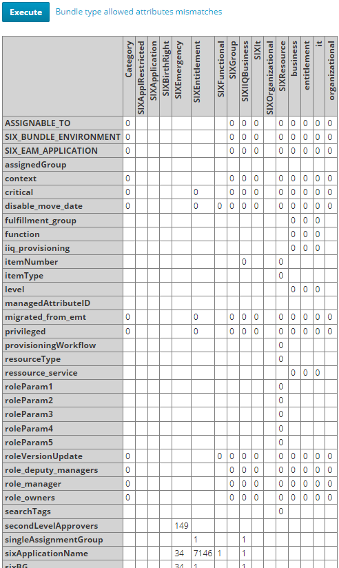
>
> Note that the empty string we supply for the correct cases prevents totals from being computed.

## Reading from OrionQL expressions

Let's explicitly discuss a powerful technique that we already used several times in the extension boxes above: Changing the query's input source to `Expression`.

The normal way queries are done is by entering an *IIQ object class name* into the *Object class* field. This causes the objects of this class, as selected by the *Filter* condition, to be fetched from the database and processed. There are two reasons to deviate from this schema:

- Performance. As long as the Generic Query is unable to directly load only the attributes needed by the query but always loads the complete objects (effectively disregarding the *Load objects* flag), certain queries may be prohibitively slow. As a workaround, in the meantime the Generic Query can be directed to read its input from an OrionQL expression since OrionQL allows to do *attribute-only* queries by explicitly listing the attributes to fetch.
- Complex data processing. While the Generic query provides basic features for object grouping and related output layout, it doesn't provide extensive data mangling capabilities on its own. When this is needed, the powerful data aggregation and transformation capabilities of OrionQL can be utilized by directing the Generic Query to read its input from an OrionQL expression, so the Generic Query is used only for output rendering.

As we had an example for the first case already, we'll now provide an example for the second.

When we introduced the Matrix view, we displayed role assignments in a grid layout with the identities in the columns and the roles in the rows, and the cells showing the assignments. While this is already quite nice, it quickly reveals that there are roles assigned to the same sets of identities. It would be interesting to merge them into a single row to provide even more insight about the role assignments. Let's do this.

What we obviously need to do is grouping the roles by the sets of identities that have each role assigned. This will collect all roles that are assigned to the same set of identities into one group, so we can render the assignments for all these roles in the grid as a single row.

It's clear at this point that we need two consecutive groupings: First, we have to group the role assignments by role to get, for each role the set of identities that have this role assigned. In a second step we then need to group the output of this the opposite way - grouping the roles by the sets of assigned identities. The Generic Query doesn't allow us a processing like this, since it provides a single grouping step only, the result of which is then immediately converted into output.

It is, however, no problem to do such processings in OrionQL - the pipeline-like notation it provides fits the problem naturally. The result can then be fed into the Generic Query's output processing for rendering by having it read its input from the expression.

The first part of the processing pipeline is quite straightforward: For all identities in scope we read the names of their assigned roles and count, for each role, how often it is assigned to each identity:

```
:Identity(>{name,assignedRoles.name}\
  department == "DEP001" &&\
  assignedRoles.name.notNull()\
)\
:count(assignedRoles\.name#name)
```

Note that we need to *explicitly* suppress the `null` role added by the outer join behind the scenes for identities with *no* assigned role.

> [!IMPORTANT]
> Suppressing duplicates
>
> You might wonder why, being interested effectively in a *list* of identities per role, we count the assignments by role and identity instead of directly grouping the identities by role. The reason for this detour, that requires us to later extract the identities from the keys of the inner mapping, is that it removes duplicates.

The mapping this produces is essentially equivalent to what we already produced earlier in this guide when introducing the Matrix view. The only difference is that *here* we are using the role and identity *names* whereas earlier we created a more readable output using *format*. (We will elaborate on that later, but for the beginning let's keep the example as simple as possible.)

Using *pprint*, we can check the result we have so far:

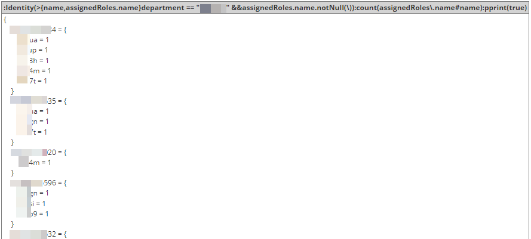

Note that by default the OrionQL groupings do *not* sort the map keys. We will have to keep this in mind when using the result.

After we have this grouping ready, the interesting part follows: In the second pipeline stage, we re-aggregate the mapping we have produced so far *the opposite way around* - grouping the keys by their values. This will group the roles (which are in the keys) by the lists of identities they are assigned to (which are in the values). This is easily done by appending another *group* instruction to the expression.

As you already know, a `Map` represents a *collection* of key-value pairs, providing *keyed access* for value retrieval. So, feeding a `Map` into an instruction that expects a collection as input - like the *group* instruction - will have that instruction operate on the map's key-value pairs. To group the `key`s from the key-value pairs of the above mapping by `value`, we basically do the following:

```
:group(value,key)
```

This groups the `Map`'s entries by `value`, storing in the output only the `key` instead of the key-value pair itself.

Since the `value`, as we produced it in the preceding aggregation, is not quite yet the list of identities we want to use as the grouping key but a `Map` of role assignment counts (we took this detour to remove duplicates), we need to extract from the `Map` in the `value` the identities, which are in the keys. Again, we operate on the `Map`'s collection of key-value pairs, mapping them to their keys, what gets us the list of identities. Since in the first aggregation we didn't request the keys to be sorted, we'll get the identities in random (hash) order. This shouldn't be a problem since maps containing the same set of keys should return them in the same order but to not rely on that, we sort the list of identities to make sure there cannot be differences *by order only* hurting our grouping. This is our second pipeline stage:

```
:group(value:map(key):sort,key)
```

As we can see by checking the output of the complete expression so far, the mapping it produces maps the lists of identities to the lists of roles that are assigned to each identity:

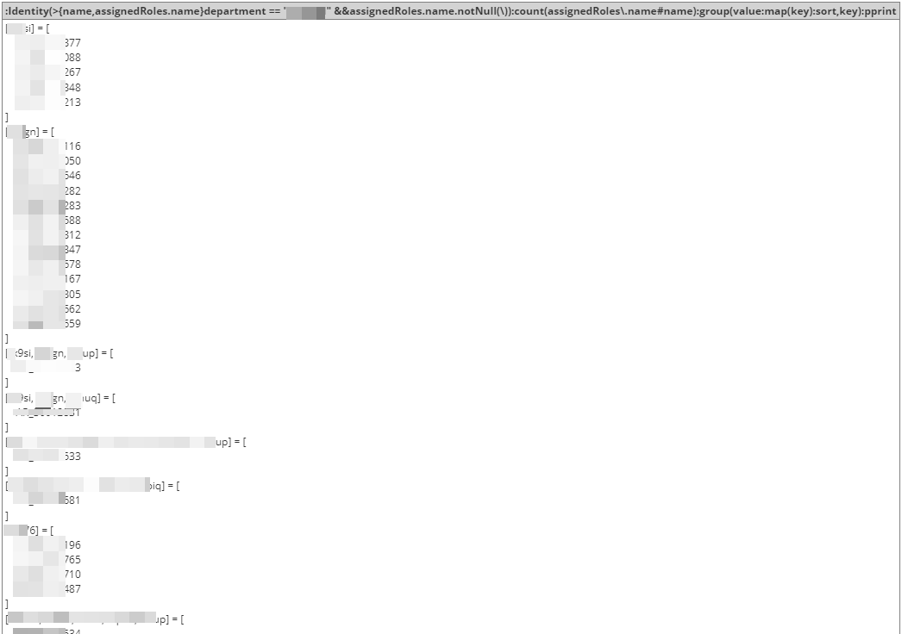

To get this data into a Matrix representation similar to the one we had earlier but with one row per role *group*, we need to take the identity lists in the keys apart again. Without that we would get a column for each [unique] list of identities, what would rather obscure the picture than providing additional insight. So, instead of simply iterating over the above `Map`'s entries to do the output, we apply a *flatten* operation to it to do a *nested iteration* - the outer one over the `Map`'s entries - the groups of roles with identical assignments - and the inner one over the elements of each entry's key - the list of identities. Since the outer iteration is on the *flatten*'s input object *itself* (which is the `Map` we produced above) as opposed to a collection to be *reached* from it, the path for the first iteration is empty, letting the argument of the *flatten* instruction start with a hash sign (`#`):

```
:flatten(#key)
```

This instruction will turn the map we produced into a sequence of the identities contained in its keys, with each of them having the key-value pair it was taken from as the *parent*.

The following screenshot shows the part of the generated sequence that matches what is visible in the above screenshot. The first entry, which has only one identity in the key, yields only one row, same for the second entry, while the third and fourth entry, each having three identities in the key yield three rows each, and so on:

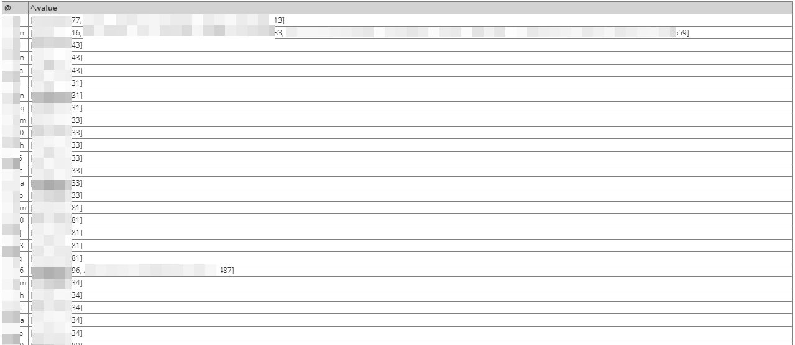

You can produce this output from the query below by removing the grouping and entering the column expressions you see in the screenshot into the *Output* field.

This sequence can now be laid out in rows and columns using the Generic Query's grouping feature: The role lists will deliver the rows (having their elements concatenated by newlines using *join*), and the identities will define the columns:

[DEP001 assigned role groups](https://identitiq.localdomain.com/identityiq/rulerunner/rulerunner.jsf?rule=six_generic_query&title=DEP001+assigned+role+groups&className=Expression&filter=%3AIdentity%28%3E%7Bname%2CassignedRoles.name%7D%5C%0A++department+%3D%3D+%22DEP001%22+%26%26%5C%0A++assignedRoles.name.notNull%28%29%5C%0A%29%5C%0A%3Acount%28assignedRoles%5C.name%23name%29%5C%0A%3Agroup%28value%3Amap%28key%29%3Asort%2Ckey%29%5C%0A%3Aflatten%28%23key%29&grouping=%5E.value%3Ajoin%0A%40&layout=Matrix+%28rotate+headers%29)

| Field name           | Input                                                                                                                                                                                    |
|:---------------------|:-----------------------------------------------------------------------------------------------------------------------------------------------------------------------------------------|
| Title                | DEP001 assigned role groups                                                                                                                                                             |
| Object class         | Expression                                                                                                                                                                               |
| Filter               | :Identity(>{name,assignedRoles.name}\   department == "DEP001" &&\   assignedRoles.name.notNull()\ )\ :count(assignedRoles\.name#name)\ :group(value:map(key):sort,key)\ :flatten(#key) |
| Grouping expressions | ^.value:join @                                                                                                                                                                           |
| Grouping layout      | Matrix (rotate headers)                                                                                                                                                                  |

The result is a matrix, showing for each group of roles with identical assignment patterns, to which identities each role is assigned:

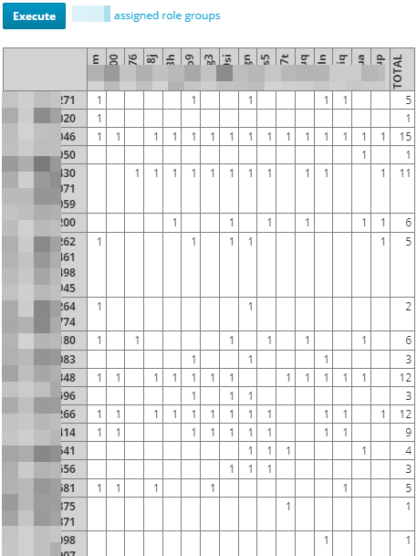

> [!IMPORTANT]
> The Generic Query as a layout engine
>
> Making the Generic Query read its input from an expression like we did here effectively *reduces* it to a *layout engine* for *result rendering*, while all the processing is done within the expression. This is very important, since it means that you can do *any* processing, without being limited to what the Generic Query's input form seems to offer.
>
> That the Generic Query *is*, especially what concerns its grouping feature, in fact a layout engine, *hasn't* been visible before as clearly as in the example above. As long as the expressions were simpler or the data source was even a plain database query, its grouping feature looked like - well, *grouping*, and of course it can be *seen* and *used* like that. However, as soon as you understand the Generic Query as a transformation tool for turning data into the representation needed to understand and analyze it, you get a different - more abstract - view about it and its features and how they can be utilized and combined.
>
> Having understood that the Generic Query is all about transforming data into an output representation, the first question you have to answer, after identifying the data, is, what type of output to generate:
>
> - *columnar* output (*list* output)
> - *grid* output (arranging data on a two-dimensional pane in rows and columns)
>
> We did this distinction in the first two chapters of this guide, calling them *linear queries* and *grouping queries*.
>
> Independent of that this decision is only used at the end of the processing and is also entered at the bottom of the input form, it determines how to mangle the data before submitting it to output generation. All the other features like *Collection expression*, *Selection rules* and *Synthetic attributes*, not mentioning the primary query itself, only serve to *prepare* the data for output generation.
>
> If you see the Generic Query, instead of as a query tool (which it, of course, *is*), like this as an *abstract engine* providing *abstract building blocks* that can be combined in various ways, you will get a birds-view perspective on all query problems you will be faced with and will easily identify the patterns that need to be applied.

> [!IMPORTANT]
> The cryptic role names and user IDs used in the output are not well suited to analyze and understand the data. Let's make the output more human-readable by adding the display names in both axes. As it turns out, this requires changing only the first two pipeline stages that fetch and aggregate the data for the first time. The aggregation keys used here are carried over into the output unmodified by all processing steps that follow. (Of course, when changing the aggregation keys we must ensure that this doesn't change the semantics of the aggregations. Adding the display name to the already unique name doesn't, and the same is true for the different sort order.)
>
> So, what needs to be changed in the query's expression is only the *count* instruction and, as a consequence, the two additional attributes needed must be added to the attributes list in the lookup instruction fetching the data:
>
> ```
> :Identity(>{name,displayName,assignedRoles.name,assignedRoles.displayName}\
>   department == "DEP001" &&\
>   assignedRoles.name.notNull()\
> )\
> :count(:format(${assignedRoles\.displayName,} (${assignedRoles\.name}))#:format(${displayName} (${name})))\
> :group(value:map(key):sort,key)\
> :flatten(#key)
> ```
>
> The rest of the query stays unmodified (excluding the title, of course):
>
> [DEP001 assigned role groups (verbose)](https://identitiq.localdomain.com/identityiq/rulerunner/rulerunner.jsf?rule=six_generic_query&title=DEP001+assigned+role+groups+%28verbose%29&className=Expression&filter=%3AIdentity%28%3E%7Bname%2CdisplayName%2CassignedRoles.name%2CassignedRoles.displayName%7D%5C%0A++department+%3D%3D+%22DEP001%22+%26%26%5C%0A++assignedRoles.name.notNull%28%29%5C%0A%29%5C%0A%3Acount%28%3Aformat%28%24%7BassignedRoles%5C.displayName%2C%7D+%28%24%7BassignedRoles%5C.name%7D%29%29%23%3Aformat%28%24%7BdisplayName%7D+%28%24%7Bname%7D%29%29%29%5C%0A%3Agroup%28value%3Amap%28key%29%3Asort%2Ckey%29%5C%0A%3Aflatten%28%23key%29&grouping=%5E.value%3Ajoin%0A%40&layout=Matrix+%28rotate+headers%29)
>
> Unlike the output of the original query above, the output now allows to see the semantic contents of the identified role groupings:
>
> 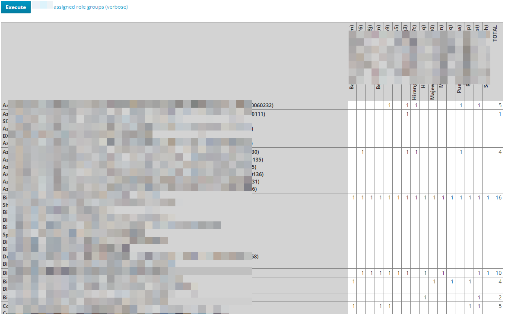

> [!IMPORTANT]
> Testing ObjectQueryDSL expressions
>
> You might have wondered how the screenshots with the aggregation results were produced or OrionQL expressions can be debugged in general.
>
> In cases like the above query, the mapping produced by the expression in the *Filter* field can be showed by simply adding `:pprint(true)` to it and putting `@` into the *Output* field (no *Grouping expressions* must be specified). To not wait long for a result during development, you will also want to set a result limit in the lookup instruction at the start of the expression and remove it once you are done debugging.
>
> Most often however, you will test OrionQL expressions in the *Output* field. This is obvious if they are used as column expressions, but even if you intend to use them as grouping criteria, you might first want to see what they produce by putting them into the *Output* field and only later move them to the *Grouping expressions* field.
>
> Mostly, when doing the testing, the easiest way is to set *Maximum rows* to some small value or even to 1. With a *Maximum rows* of 1 the Generic Query will execute your expression exactly once, so this is what you generally would like to do, for instance, when testing lookup table creation.
>
> However, when testing an expression that *doesn't* take any input, like was the case here, the question arises how to convince the Generic Query to execute your expression *at all*, since, well, there is *no* result set to iterate upon. A *dummy result set* is needed in such a case.
>
> The simplest way to provide one is to supply an expression that returns a string literal - the literal will implicitly be converted into a result set with one row and one column. This was also the approach used for the screenshots above to have the expressions tested to be displayed in the column headers. Since, in the *Output field*, multiple expressions can be entered, it is even possible to test multiple expressions at once and see their outputs side-by-side:
>
> [Expression test](https://identitiq.localdomain.com/identityiq/rulerunner/rulerunner.jsf?rule=six_generic_query&title=Expression+test&className=Expression&filter=%22%22&output=%3AIdentity%28%3E%7Bname%2CassignedRoles.name%7D%5C%0A++department+%3D%3D+%22DEP001%22+%26%26%5C%0A++assignedRoles.name.notNull%28%29%5C%0A%29%5C%0A%3Acount%28assignedRoles%5C.name%23name%29%5C%0A%3Apprint%28true%29%0A%3AIdentity%28%3E%7Bname%2CassignedRoles.name%7D%5C%0A++department+%3D%3D+%22DEP001%22+%26%26%5C%0A++assignedRoles.name.notNull%28%29%5C%0A%29%5C%0A%3Acount%28assignedRoles%5C.name%23name%29%5C%0A%3Agroup%28value%3Amap%28key%29%3Asort%2Ckey%29%5C%0A%3Apprint%28true%29)

## Reading data from endpoints

The Generic Query's data transformation and query capabilities can be leveraged for processing data read directly from endpoints. This can be very helpful for instance during onboardings or to troubleshoot correlation rules. While the primary query is done on the endpoint's connector using an *iterate* operation, the data read can be submitted to any processing offered by the Generic Query. You can:

- display the endpoint data in tabular form
- perform basic data analysis
- correlate the data with data in the IIQ database

To direct the Generic Query to an endpoint connector, `ResourceObject` is specified in the *Object class* Field, and the *endpoint* and *schema type* are specified in the *Filter* field as a*pplication*: *type*. Optionally, on the following lines aggregation parameters can be specified using the assignment syntax known from the [*Synthetic attributes*](#synthetic-attributes) field (see second example). Note that the query will need to be executed on one of the backend servers to be able to reach the endpoint through the firewalls. To not bother you with accessing the backend server, for demonstration we will use an endpoint that is accessible from a frontend server as well by reading the account data from the IIQ database. This is not the most interesting thing to do, however.

Let's read all accounts of the `IdentityIQ Prod` endpoint and display the disabled ones together with some interesting attributes of the Identity to which they would be correlated by name and the account's entitlements:

[Disabled IdentityIQ Prod accounts](https://identitiq.localdomain.com/identityiq/rulerunner/rulerunner.jsf?rule=six_generic_query&title=Disabled%20IdentityIQ%20Prod%20accounts&className=ResourceObject&filter=IdentityIQ%20Prod%3A%20account&selector=ResourceObject(%0A%20%20eq(%20%22IIQDisabled%22%2C%20true%20)%0A).accept()&output=nativeIdentity%3Didentity%0Aidentity%3AIdentity.lcmstatus%0Aidentity%3AIdentity.fire_date%0Aidentity%3AIdentity.last_work_day%0Acapabilities%3Ajoin%0Aworkgroups%3Ajoin&layout=1)

| Field name      | Input                                                                                                                                                |
|:----------------|:-----------------------------------------------------------------------------------------------------------------------------------------------------|
| Title           | Disabled IdentityIQ Prod accounts                                                                                                                    |
| Object class    | ResourceObject                                                                                                                                       |
| Filter          | IdentityIQ Prod: account                                                                                                                             |
| Selection rules | ResourceObject(   eq( "IIQDisabled", true ) ).accept()                                                                                               |
| Output          | nativeIdentity=identity identity:Identity.lcmstatus identity:Identity.fire\_date identity:Identity.last\_work\_day capabilities:join workgroups:join |

In INT, in the full output there some accounts *with* capabilities, however not among the top ones:

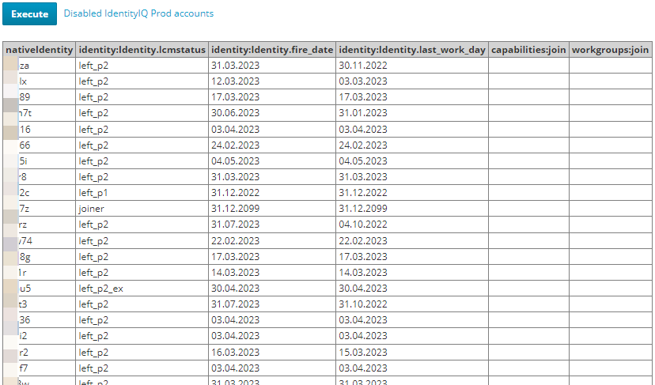

This was only a small demonstration to not require a backend server login. Analyzing data read from AD or HR endpoints is certainly more interesting. The following example however will run only on the backend server. It demonstrates also parameter overrides, which are needed when reading HR data. This example again uses [map unfolding](#map-unfolding) to create tabular output with minimal effort:

[HR File read](https://identitiq.localdomain.com/identityiq/rulerunner/rulerunner.jsf?rule=six_generic_query&title=HR+File+read&className=ResourceObject&filter=SAP_HR%3A+account%0Afile%3D%22%2Fvar%2Finput%2FSAP%2FPIAM.SAP.PER1.HCMPER1.20230913_080038.xml.20230913083019%22&subquery=attributes&selector=ResourceObject%28%0A++eq%28+%22Action_Type%22%2C+%22C0%22+%29%0A%29.accept%28%29&output=value&grouping=%5E.identity%0Akey&layout=Matrix)

| Field name            | Input                                                                                                                |
|:----------------------|:---------------------------------------------------------------------------------------------------------------------|
| Title                 | HR File read                                                                                                         |
| Object class          | ResourceObject                                                                                                       |
| Filter                | SIX\_HR: account file="/var/input/SAP/PIAM.SAP.PER1.HCMPER1.20230913\_080038.xml.20230913083019" |
| Collection expression | attributes                                                                                                           |
| Selection rules       | ResourceObject(   eq( "Action\_Type", "C0" ) ).accept()                                                              |
| Output                | value                                                                                                                |
| Grouping expressions  | ^.identity key                                                                                                       |
| Grouping layout       | Matrix                                                                                                               |

To not stress the browser with a huge output table, we have selected only part of the records. Note that we perform the selection in the rule header and not in the action: Since we are using a collection expression, the latter would be evaluated for *every* attribute (requiring a parent navigation to get back to the ResourceObject for check). The selector in the rule header, instead, is evaluated on the ResourceObject itself, on a mismatch discarding it immediately, so the *Collection expression* isn't even evaluated.

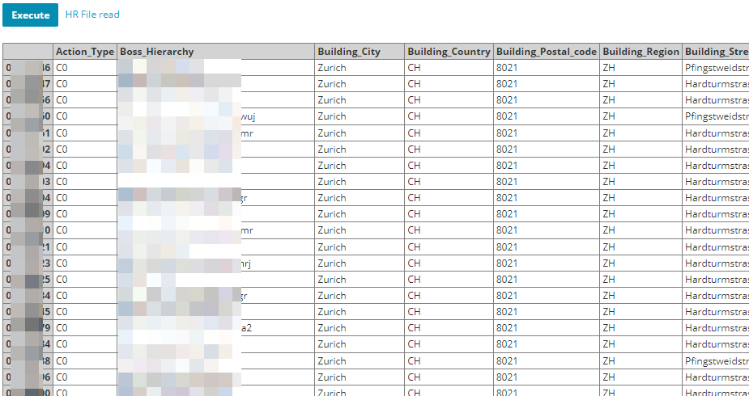

Putting an [additional] selector into the action would instead allow us to check, for instance, for some value contained in *any* column, displaying only these cells, or to quickly exclude certain columns from the display:

|                 |                                                        |
|:----------------|:-------------------------------------------------------|
| Selection rules | ResourceObject().accept(   eq( "value", "00000246" ) ) |

[HR File read)](https://identitiq.localdomain.com/identityiq/rulerunner/rulerunner.jsf?rule=six_generic_query&title=HR%20File%20read&className=ResourceObject&filter=SAP_HR%3A%20account%0Afile%3D%22%2Fvar%2Finput%2FSAP%2FPIAM.SAP.PER1.HCMPER1.20230913_080038.xml.20230913083019%22&subquery=attributes&selector=ResourceObject().accept(%0A%20%20eq(%20%22value%22%2C%20%2200000246%22%20)%0A)&output=value&grouping=%5E.identity%0Akey&layout=2)

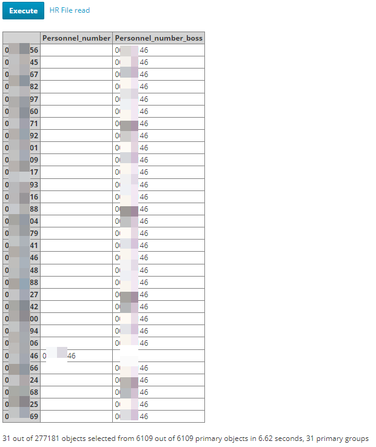

## Dynamic attribute access

The dynamic nature of the Generic Query and the framework underneath it harmonizes well with that of IIQ. The following example demonstrates how to examine the IIQ configuration and access configured attributes of objects.

In IIQ, the `Application` schemas define how data is read from the endpoints, and particularly, which attributes provide the *identity* and the *displayName* of an aggregated object. This enables different endpoints to use different attributes for each purpose. On a group aggregation, for instance, IIQ gets the `displayName` of an entitlement by examining the attribute specified in the schema as `displayAttribute`.

However, as IIQ does never *update* the `displayName` in subsequent aggregations, by time differences can accumulate. We want to write a query to show them. For this, we have to retrieve the value of the entitlement's `displayAttribute` as specified in the application's schema for the entitlement's type and compare it to its `displayName`.

To not hardcode the name of this attribute by hand for each endpoint, we retrieve it from the schema. The access path is as follows:

ManagedAttribute → Application → Schema → `displayAttribute`

Note that as there are multiple schemas in an application, the schema to use is the one for the `ManagedAttribute`'s `type`. The following expression retrieves the name of the `displayAttribute` of a `ManagedAttribute`:

```
application.schema(type).displayAttribute
```

Knowing the `displayAttribute`, its value can then be retrieved from the ManagedAttribute's `attributes` mapping using `:get()`.

```
attributes:get(application.schema(type).displayAttribute)
```

Using *Selection rules*, we limit the output to only the entitlements with differences (and only if the `displayAttribute` *has* a value):

```
ManagedAttribute().accept(
  ne( "attributes:get(application.schema(type).displayAttribute)", null, ref( "displayName" ) )
)
```

The finished query is shown below. To limit the execution time, in addition to selecting only entitlements from automatic endpoints, it was equipped with an additional selection by *endpoint name*. This, in fact, yields the *endpoint type* selection unnecessary, however it has been intentionally included into the query so that by removing the second condition the query can be easily executed for all *automatic* endpoints. Due to the execution time however, it must be run in background then:

[Entitlements with pending displayName update](https://identitiq.localdomain.com/identityiq/rulerunner/rulerunner.jsf?rule=six_generic_query&title=Entitlements%20with%20pending%20displayName%20update&className=ManagedAttribute&filter=!application.type.in(%7B%20%22DelimitedFile%22%2C%20%22ICCLocalManagedApplication%22%2C%20%22SixLocalManagedApplication%22%2C%20%22Logical%22%20%7D)%20%26%26%20application.name.startsWith(%20%22SDL%20%22%20)&ordering=application.name%2C%20value&selector=ManagedAttribute().accept(%0A%20%20ne(%20%22attributes%3Aget(application.schema(type).displayAttribute)%22%2C%20null%2C%20ref(%20%22displayName%22%20)%20)%0A)&output=id%0Aapplication.name%0Atype%0Aattribute%0Avalue%0AdisplayAttribute%3Dapplication.schema(type).displayAttribute%0AdisplayAttribute%20value%5CndisplayName%3D%3Aformat(%24%7Battributes%3Aget(application.schema(type).displayAttribute)%7D%5Cn%24%7BdisplayName%7D)&layout=1)

| Field name      | Input                                                                                                                                                                                                                         |
|:----------------|:------------------------------------------------------------------------------------------------------------------------------------------------------------------------------------------------------------------------------|
| Title           | Entitlements with pending displayName update                                                                                                                                                                                  |
| Object class    | ManagedAttribute                                                                                                                                                                                                              |
| Filter          | !application.type.in({ "DelimitedFile", "ICCLocalManagedApplication", "SixLocalManagedApplication", "Logical" }) && application.name.startsWith( "SDL " )                                                               |
| Ordering        | application.name, value                                                                                                                                                                                                       |
| Selection rules | ManagedAttribute().accept(   ne( "attributes:get(application.schema(type).displayAttribute)", null, ref( "displayName" ) ) )                                                                                                  |
| Output          | id application.name type attribute value displayAttribute=application.schema(type).displayAttribute displayAttribute value\ndisplayName=:format(${attributes:get(application.schema(type).displayAttribute)}\n${displayName}) |

The result lists all entitlements of the selected endpoints for which the current value of the *displayAttribute*, as aggregated from the endpoint, differs from the entitlement's displayName:

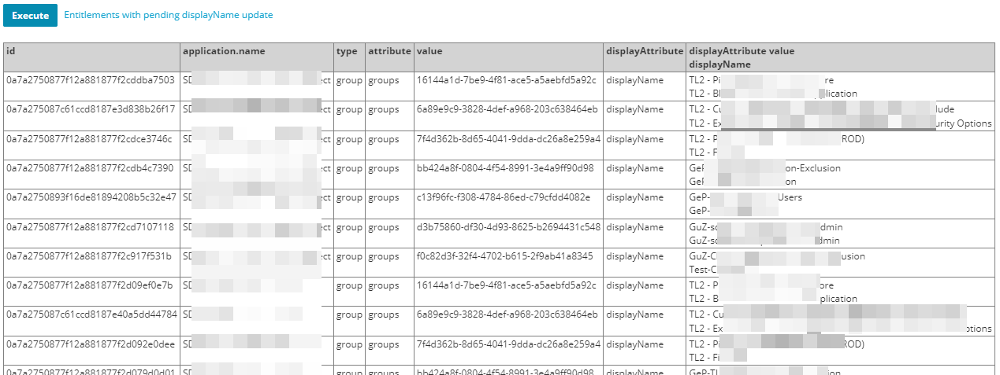

By factoring out the schema and attribute accesses shown in the first two code blocks into *Synthetic attributes*, redundancy can be removed from the query, at the same time improving self-documentation. Separating the two attribute definitions with an empty line ensures their evaluation in separate passes, so the result of the first is available in the second one:

```
displayAttributeName=application.schema(type).displayAttribute

displayAttributeValue=attributes:get(displayAttributeName)
```

The resulting query is significantly easier to understand than the initial version:

[Entitlements with pending displayName update](https://identitiq.localdomain.com/identityiq/rulerunner/rulerunner.jsf?rule=six_generic_query&title=Entitlements%20with%20pending%20displayName%20update&className=ManagedAttribute&filter=!application.type.in(%7B%20%22DelimitedFile%22%2C%20%22ICCLocalManagedApplication%22%2C%20%22SixLocalManagedApplication%22%2C%20%22Logical%22%20%7D)%20%26%26%20application.name.startsWith(%20%22SDL%20%22%20)&ordering=application.name%2C%20value&computations=displayAttributeName%3Dapplication.schema(type).displayAttribute%0A%0AdisplayAttributeValue%3Dattributes%3Aget(displayAttributeName)&selector=ManagedAttribute().accept(%0A%20%20ne(%20%22displayAttributeValue%22%2C%20null%2C%20ref(%20%22displayName%22%20)%20)%0A)&output=id%0Aapplication.name%0Atype%0Aattribute%0Avalue%0AdisplayAttribute%3DdisplayAttributeName%0AdisplayAttribute%20value%5CndisplayName%3D%3Aformat(%24%7BdisplayAttributeValue%7D%5Cn%24%7BdisplayName%7D)&layout=1)

# A heavyweight example

Having done a lot of heavy lifting already, let's finish this guide with a last example to demonstrate one more advanced technique.

With version 8.3 IIQ introduced a new `BundleProfileRelation` class to ease examining the connections between entitlements and roles. The way these relationships are stored in IIQ using constraints in role profiles made them notoriously difficult to examine in the past, especially when coming from the entitlement side. The new table, maintained by a task that needs to be run regularly, is a great relief. Of course, where there is redundancy, there are always inconsistencies, so we are interested in checking how well the new mechanism represents the true data, which is still in the role profiles. Let's setup a query.

What we need to do is, for each role, to read the entitlements granted by the role the classical way from the profiles and the new way from the `BundleProfileRelation` table, and compare the results.

A straightforward way to do this would be to iterate over all roles, for each of them doing a query for the respective `BundleProfileRelation`s and compare the result with what is derived from the role's profiles. The comparison can be easily done by either collecting the role's entitlements into a list using a bulletproof formatting like `${application.name}/${attribute}/${value}` and sorting it, or more beautifully by building a nested mapping. We'll use the latter approach.

To get a better performance, instead of separate `BundleProfileRelation` queries for each role we will use a lookup table created from one big query.

Being unsure about if there is a referential integrity constraint between the `BundleProfileRelation` objects and the roles, the approach outlined so far might not report `BundleProfileRelation`s for roles that don't exist any more. While we could live with that, we take the challenge to demonstrate a technique that allows to merge the results of two queries - the *union* instruction: We will collect the data to compare into two lookup tables, each mapping the roles to their entitlements. One will source the data from the profiles and the other one will source it from the `BundleProfileRelation`s. Then we create the union key set of both lookup tables to iterate over all roles and for each role retrieve and compare the associated data from both lookup tables.

Let's first create the lookup tables. This code reads all roles and builds a mapping of *role id* → *application name* → *attribute name* → *value*. It iterates over all roles, their flattened required roles, their profiles, their constraints and the values they contain and counts the values by the mentioned keys:

```
:flatten(:Bundle(>!type.in({ "EntitlementRole", "OrganizationalRole" }))#flattenedRequirements#profiles#constraints#value)\
:count(^.^.^.^.id#^.^.application.name#^.property#@)
```

Building the same type of mapping from the `BundleProfileRelation` objects is a bit simpler:

```
:BundleProfileRelation(>required == true)\
:count(bundleId#sourceApplication.name#attribute#value)
```

To test the expressions, we limit the number of rows they process to 100 each:

[Expressions testbed](https://identitiq.localdomain.com/identityiq/rulerunner/rulerunner.jsf?rule=six_generic_query&title=Expressions%20testbed&className=Expression&filter=%22%22&output=%3Aflatten(%3ABundle(%3E!type.in(%7B%20%22EntitlementRole%22%2C%20%22OrganizationalRole%22%20%7D)%2C100)%23flattenedRequirements%23profiles%23constraints%23value)%5C%0A%3Acount(%5E.%5E.%5E.%5E.id%23%5E.%5E.application.name%23%5E.property%23%40)%5C%0A%3Apprint(true)%0A%3ABundleProfileRelation(%3Erequired%20%3D%3D%20true%2C100)%5C%0A%3Acount(bundleId%23sourceApplication.name%23attribute%23value)%5C%0A%3Apprint(true)&layout=1)

As we can see, the mappings are created correctly (of course in this snippet there are no common roles):

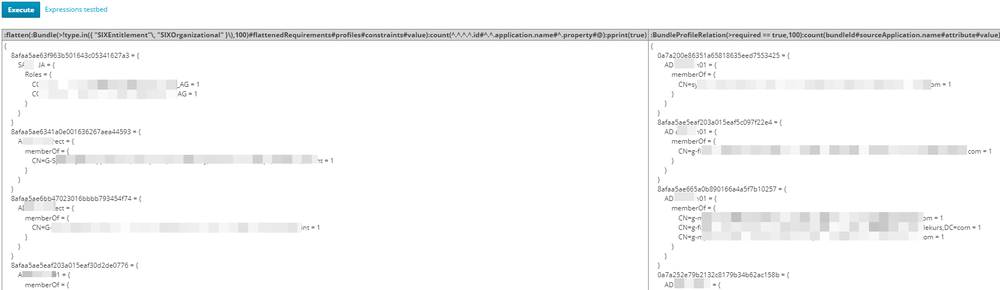

We will cache the lookup tables using appropriate names by wrapping the above expressions into *cache* instructions, so we can repeatedly refer to them when iterating over the roles.

To iterate over the roles contained in *any* of the two lookup tables, we have to merge their key sets. The *union* instruction will concatenate the sequences of the top level key-value pairs from both lookup tables, and we will feed this into *count* to count the keys (the role IDs), thus having the role IDs in the

```
:union(\
  :cache(bundleEntitlements,...),\
  :cache(bundleProfileRelationEntitlements,...)\
)\
:count(key)
```

We can test the produced sequence by defining appropriate *Output* columns:

[Expression testbed #2](https://identitiq.localdomain.com/identityiq/rulerunner/rulerunner.jsf?rule=six_generic_query&title=Expression%20testbed%20%232&className=Expression&filter=%3Aunion(%5C%0A%20%20%3Acache(bundleEntitlements%2C%5C%0A%20%20%20%20%3Aflatten(%3ABundle(%3E!type.in(%7B%20%22EntitlementRole%22%2C%20%22OrganizationalRole%22%20%7D)%2C100)%23flattenedRequirements%23profiles%23constraints%23value)%5C%0A%20%20%20%20%3Acount(%5E.%5E.%5E.%5E.id%23%5E.%5E.application.name%23%5E.property%23%40)%5C%0A%20%20)%2C%5C%0A%20%20%3Acache(bundleProfileRelationEntitlements%2C%5C%0A%20%20%20%20%3ABundleProfileRelation(%3Erequired%20%3D%3D%20true%2C100)%5C%0A%20%20%20%20%3Acount(bundleId%23sourceApplication.name%23attribute%23value)%5C%0A%20%20)%5C%0A)%5C%0A%3Acount(key)&output=key%0Avalue&layout=1)

As expected by the unsynchronized queries that create both lookup tables, limiting their row counts results in having mostly ones in the value column instead of the twos we would expect for most role IDs:

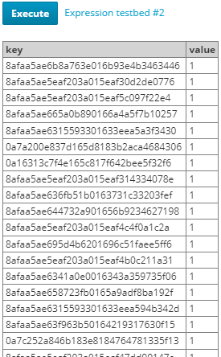

With that sequence of role IDs in the `key` attribute, we can now examine what the lookup tables contain for each role:

```
bundleEntitlements=:cache(bundleEntitlements):get(key)
bundleProfileRelationEntitlements=:cache(bundleProfileRelationEntitlements):get(key)
```

Note the *cache* instructions needing only the cache key since the lookup tables are guaranteed to have been computed before the iteration could even start.

Using our limited-by-100 lookup tables, there are no commonalities, but we can see clearly the data looked up in the lookup tables. Since we will need the looked-up data twice - for comparison and for output - we define synthetic attributes for it from the beginning:

[Expression testbed #3](https://identitiq.localdomain.com/identityiq/rulerunner/rulerunner.jsf?rule=six_generic_query&title=Expression%20testbed%20%233&className=Expression&filter=%3Aunion(%5C%0A%20%20%3Acache(bundleEntitlements%2C%5C%0A%20%20%20%20%3Aflatten(%3ABundle(%3E!type.in(%7B%20%22EntitlementRole%22%2C%20%22OrganizationalRole%22%20%7D)%2C100)%23flattenedRequirements%23profiles%23constraints%23value)%5C%0A%20%20%20%20%3Acount(%5E.%5E.%5E.%5E.id%23%5E.%5E.application.name%23%5E.property%23%40)%5C%0A%20%20)%2C%5C%0A%20%20%3Acache(bundleProfileRelationEntitlements%2C%5C%0A%20%20%20%20%3ABundleProfileRelation(%3Erequired%20%3D%3D%20true%2C100)%5C%0A%20%20%20%20%3Acount(bundleId%23sourceApplication.name%23attribute%23value)%5C%0A%20%20)%5C%0A)%5C%0A%3Acount(key)&output=key%0AbundleEntitlements%3D%3Acache(bundleEntitlements)%3Aget(key)%3Apprint(true)%0AbundleProfileRelationEntitlements%3D%3Acache(bundleProfileRelationEntitlements)%3Aget(key)%3Apprint(true)&layout=1)

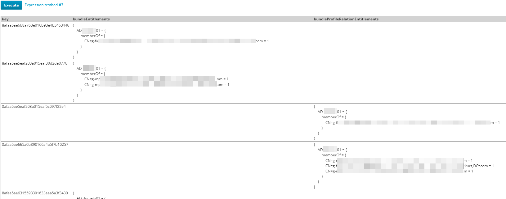

What remains is to filter out the roles with mismatches by using the *Selection rules* field (note that we are comparing nested mappings here!):

```javascript
Bundle().accept(
  ne( "bundleEntitlements", ref( "bundleProfileRelationEntitlements" ) )
)
```

After removing the limits from the lookup table building expressions and replacing the role ID by something more readable, we get the final query (since the `Bundle` lookup will only be done for the roles that pass the selection rule, there is no need, and also no chance, to use a lookup table to avoid the individual datanbase lookups):

[BundleProfileRelation consistency check](https://identitiq.localdomain.com/identityiq/rulerunner/rulerunner.jsf?rule=six_generic_query&title=BundleProfileRelation%20consistency%20check&className=Expression&filter=%3Aunion(%5C%0A%20%20%3Acache(bundleEntitlements%2C%5C%0A%20%20%20%20%3Aflatten(%3ABundle(%3E!type.in(%7B%20%22EntitlementRole%22%2C%20%22OrganizationalRole%22%20%7D))%23flattenedRequirements%23profiles%23constraints%23value)%5C%0A%20%20%20%20%3Acount(%5E.%5E.%5E.%5E.id%23%5E.%5E.application.name%23%5E.property%23%40)%5C%0A%20%20)%2C%5C%0A%20%20%3Acache(bundleProfileRelationEntitlements%2C%5C%0A%20%20%20%20%3ABundleProfileRelation(%3Erequired%20%3D%3D%20true)%5C%0A%20%20%20%20%3Acount(bundleId%23sourceApplication.name%23attribute%23value)%5C%0A%20%20)%5C%0A)%5C%0A%3Acount(key)&computations=bundleEntitlements%3D%3Acache(bundleEntitlements)%3Aget(key)%0AbundleProfileRelationEntitlements%3D%3Acache(bundleProfileRelationEntitlements)%3Aget(key)&selector=Bundle().accept(%0A%20%20ne(%20%22bundleEntitlements%22%2C%20ref(%20%22bundleProfileRelationEntitlements%22%20)%20)%0A)&output=key%3ABundle%3Aformat(%5B%24%7Bname%7D%5D%20%24%7BdisplayName%7D)%0AbundleEntitlements%3Apprint%0AbundleProfileRelationEntitlements%3Apprint&layout=1)

| Field name           | Input                                                                                                                                                                                                                                                                                                                                                                                                             |
|:---------------------|:------------------------------------------------------------------------------------------------------------------------------------------------------------------------------------------------------------------------------------------------------------------------------------------------------------------------------------------------------------------------------------------------------------------|
| Title                | BundleProfileRelation consistency check                                                                                                                                                                                                                                                                                                                                                                           |
| Object class         | Expression                                                                                                                                                                                                                                                                                                                                                                                                        |
| Filter               | :union(\   :cache(bundleEntitlements,\     :flatten(:Bundle(>!type.in({ "EntitlementRole", "OrganizationalRole" }))#flattenedRequirements#profiles#constraints#value)\     :count(^.^.^.^.id#^.^.application.name#^.property#@)\   ),\   :cache(bundleProfileRelationEntitlements,\     :BundleProfileRelation(>required == true)\     :count(bundleId#sourceApplication.name#attribute#value)\   )\ )\ :count(key) |
| Synthetic attributes | bundleEntitlements=:cache(bundleEntitlements):get(key) bundleProfileRelationEntitlements=:cache(bundleProfileRelationEntitlements):get(key)                                                                                                                                                                                                                                                                       |
| Selection rules      | Bundle().accept(   ne( "bundleEntitlements", ref( "bundleProfileRelationEntitlements" ) ) )                                                                                                                                                                                                                                                                                                                       |
| Output               | key:Bundle:format([${name}] ${displayName}) bundleEntitlements:pprint bundleProfileRelationEntitlements:pprint                                                                                                                                                                                                                                                                                                    |

The query will take longer than the allowed foreground execution limit, so it will have to be executed in the background. This feature wasn't available as of the writing of this guide, for taking the following screenshot the role selections in the database queries have been tweaked. The data is from Production:

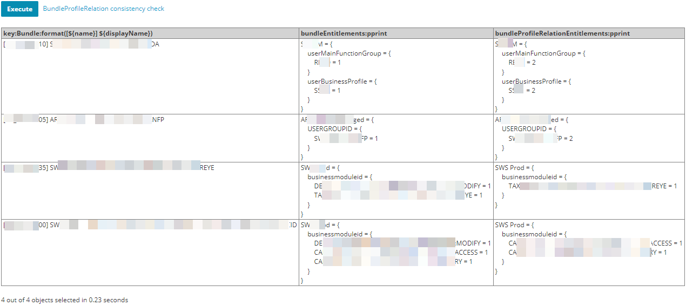

The full query reports 772 out of 15476 roles with differences.

As can be seen in the full output, there are mostly differences in the counts, meaning the `BundleProfileRelation` table contains duplicate entries. Removing them for the comparison is possible by postprocessing the lookup tables by iterating over the nested key-value pairs and re-counting the ones on the lowest level by their full key paths. It's not trivial but possible:

```
:flatten(#value#value#value)\
:count(^.^.^.key#^.^.key#^.key#key)
```

This will build an identical mapping - with all numbers replaced by ones. Here is the test:

[Expressions testbed #4](https://identitiq.localdomain.com/identityiq/rulerunner/rulerunner.jsf?rule=six_generic_query&title=Expressions%20testbed%20%234&className=Expression&filter=%22%22&output=%3ABundleProfileRelation(%3Erequired%20%3D%3D%20true%2C100)%5C%0A%3Acount(bundleId%23sourceApplication.name%23attribute%23value)%5C%0A%3Apprint(true)%0A%3ABundleProfileRelation(%3Erequired%20%3D%3D%20true%2C100)%5C%0A%3Acount(bundleId%23sourceApplication.name%23attribute%23value)%5C%0A%3Aflatten(%23value%23value%23value)%5C%0A%3Acount(%5E.%5E.%5E.key%23%5E.%5E.key%23%5E.key%23key)%5C%0A%3Apprint(true)&layout=1)

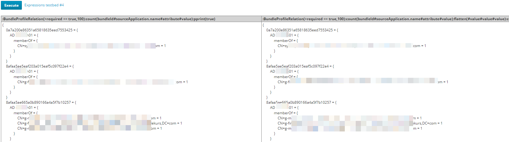

After changing the query, it still reported 139 out of 15476 roles with differences:

[BundleProfileRelation consistency check](https://identitiq.localdomain.com/identityiq/rulerunner/rulerunner.jsf?rule=six_generic_query&title=BundleProfileRelation%20consistency%20check&className=Expression&filter=%3Aunion(%5C%0A%20%20%3Acache(bundleEntitlements%2C%5C%0A%20%20%20%20%3Aflatten(%3ABundle(%3E!type.in(%7B%20%22EntitlementRole%22%2C%20%22OrganizationalRole%22%20%7D))%23flattenedRequirements%23profiles%23constraints%23value)%5C%0A%20%20%20%20%3Acount(%5E.%5E.%5E.%5E.id%23%5E.%5E.application.name%23%5E.property%23%40)%5C%0A%20%20%20%20%3Aflatten(%23value%23value%23value)%5C%0A%20%20%20%20%3Acount(%5E.%5E.%5E.key%23%5E.%5E.key%23%5E.key%23key)%5C%0A%20%20)%2C%5C%0A%20%20%3Acache(bundleProfileRelationEntitlements%2C%5C%0A%20%20%20%20%3ABundleProfileRelation(%3Erequired%20%3D%3D%20true)%5C%0A%20%20%20%20%3Acount(bundleId%23sourceApplication.name%23attribute%23value)%5C%0A%20%20%20%20%3Aflatten(%23value%23value%23value)%5C%0A%20%20%20%20%3Acount(%5E.%5E.%5E.key%23%5E.%5E.key%23%5E.key%23key)%5C%0A%20%20)%5C%0A)%5C%0A%3Acount(key)&computations=bundleEntitlements%3D%3Acache(bundleEntitlements)%3Aget(key)%0AbundleProfileRelationEntitlements%3D%3Acache(bundleProfileRelationEntitlements)%3Aget(key)&selector=Bundle().accept(%0A%20%20ne(%20%22bundleEntitlements%22%2C%20ref(%20%22bundleProfileRelationEntitlements%22%20)%20)%0A)&output=key%3ABundle%3Aformat(%5B%24%7Bname%7D%5D%20%24%7BdisplayName%7D)%0AbundleEntitlements%3Apprint%0AbundleProfileRelationEntitlements%3Apprint&layout=1)

So, as always, where there is redundancy in data, there are differences.

When mangling the lookup tables anyway, we could also have *grouped* the entitlement values under their attribute names instead of *counting* them, this way replacing the lowest-level map with a list and retting rid of the ones behind each entitlement. Doing so would clearly enhance the output but to not further complicate matters, we didn't do this here. You can do it as an exercise though.

# Summing up and where to go from here

Having read up to here, you have seen many examples that illustrate the various ways how the building blocks offered by the Generic Query and the two DSLs can be combined to address different kinds of data exploration and presentation problems. The Generic Query can be applied not only to the obvious – identity and access management data – but also for examining the IIQ configuration, local files like log files, and basically anything that you can feed to it by writing a rule. This offers a way to use the data processing and presentation features of the Generic Query for *any* data to get it into a representation that answers specific questions.

By using the Generic Query from now on whenever you need to get insight into some of IIQ's data or other internals, you will get more and more familiar with its concepts and patterns, applying them automatically and finding more and more uses you would never have thought of, and at the end you will be able to work wonders with very little effort that you didn't think they are possible at all. Creating queries that better fit your personal workflows and habits than what you currently have will make you more productive and your work more fun. Stay healthy and enjoy!

This introduction has guided you through a quite remarkable journey, and you have now a good understanding of the Generic Query's functional principles and usage patterns. You are now ready to explore *on your own* the features that have *not* been covered here. Examine the reference documentation and the [existing queries](/spaces/OCA/pages/269132414/Prefabricated+queries) to discover more bells and whistles you can use. Here are some topics to dive into:

## Reading input from rules

The Generic Query can read its input from a rule. Rules that support this are for instance six\_sql\_query, six\_list\_directory, and six\_parse\_file. This allows to apply the Generic Query's analysis and layout capabilities to any data you can write a rule for that returns this data in a collection or iterator.

> [!IMPORTANT]
> By using six\_beanshellrunner, you can even read from a Beanshell script embedded in your query! The following query groups the SIX `AuditEventActionEnum` values by the second and last word:
>
> [AuditAction enum matrix](https://identitiq.localdomain.com/identityiq/rulerunner/rulerunner.jsf?rule=six_generic_query&title=AuditAction+enum+matrix&className=Rule%3A+six_beanshellrunner&filter=script%3D%22import+com.six.iam.iiq.audit.AuditEventActionEnum%3B%0A%0Areturn+Arrays.asList%28AuditEventActionEnum.values%28%29%29%3B%22&computations=subject%2Caction%3D%3Amatch%28six_%28%5B%5E_%5D%2B%5C%29.*%3F_%28%5B%5E_%5D%2B%5C%29%24%29&output=%40&grouping=action%0Asubject&postprocessing=Level%282%29.accept%28%0A+%22value%3Asort%22%0A%29&layout=Matrix)

## Splitting large output into multiple tables

The `Multiple*` *Grouping layouts* provided by the Generic Query allow splitting the output of a single query into multiple tables or matrices, which are separated by captions. A navigator in the lower left corner of the output window allows to quickly navigate to any section.

See the Generic Query Reference for details.

## Filtering the grouping result

This is similar to SQL's *having* clause: The *Groups postprocessing* field allows to filter the grouping result before it is processed for output. An example is reducing a huge matrix to the data of interest, for instance, keeping only cells with a value greater than some threshold, or rows containing data in at least so many columns.

## Keeping detail in aggregated queries

When counting objects and presenting the result in a matrix, the nice thing is the overview this provides. What is uncomfortable is the effort it takes to get from the overview to the details to see what is behind the numbers. This is especially disturbing since all that information was already fetched by the query but then thrown away.

It is possible to preserve the detail information while still keeping the compact overview picture. The key to this is to, instead of only counting, collect the detail information by using the *Output* field or further groupings, and then use the *Groups postprocessing* to map the collected data to the number for display and attach the details to it in a tooltip (use the OrionQL *link* instruction).

The OrionQL and CerberusLibrary libraries provide prefabricated code you can use.

## Rendering tables in popups and table cells

The OrionQL *table*, *htable* and *grid* instructions allow to explicitly render data in tabular and [multiple] matrix form. This allows to embed detail information into popups and table cells in a suitable format. Make yourself familiar with these instructions.

## Using color

In highly aggregated queries, there is often not enough screen space to represent all desired dimensions of the data. An example would be a query that shows the ProvisioningTransaction counts for all endpoints for the last two weeks. To also show the success rate of the ProvisioningTransactions the numbers can be colored according to the success rate (and you want to also provide the detailed numbers in a popup as explained above). Make yourself familiar with the *heat* instruction and how to use the *link* instruction together with *switch* to color output.

The OrionQL and CerberusLibrary libraries provide prefabricated code you can use.

## Creating charts

Numbers are nice, but to easily digest information, the human brain needs *pictures*. This is why charts are so popular. In addition, charts can also help to concisely represent additional dimensions of your data that would otherwise require more space.

OrionQL's two chart instructions allow to create charts with almost no effort – it was probably *never* so easy! Experiment with the *barchart* and *linechart* instructions.

## Recursive flattening

The *flatten* instruction is, alongside the *lookup* instruction, the most powerful and demanding OrionQL instruction. It allows to navigate complex object models with ease.

What has not been covered in this guide is *recursive flattening*, that is, iterating over object *chains* as if they were collections. Be sure to read the reference and understand this powerful concept.

## List and map decomposition

If you are familiar with languages like Python or Lua that support list decomposition by multiple assignment, you will immediately feel at home when seeing OrionQL code like this from the query in the above box:

**List decomposition**

```text
subject,action=:match(six_([^_]+\).*?_([^_]+\)$)
```

The right side of the assignment extracts from a string composed of words connected by underscores the second and the last word, and these two values are assigned to the two variables on the left side.

What happens on a technical level is that the *match* instruction returns a list, and the multiple assignment decomposes this list into its elements, assigning them one-by-one to the specified variables (and discarding the unused elements).

This *list decomposition* is very handy. Use it, for instance, to split, with almost no code, a delimited string into its components – in this example an *entitlement value* made up as a colon delimited concatenation of *mouleid*, *serviceid* and *accesslevel*:

```text
mouleid,serviceid,accesslevel=value:extract([^:]+)
```

Besides *list decomposition*, OrionQL assignments support also *map decomposition*. Map decomposition is requested by assigning a map to the special variable \*. This has the effect that for each key contained in the map a variable with the corresponding value is created:

**Map decomposition**

```text
*=attributes
```

Map decomposition can save you a lot of tedious and clumsy writing. The following query uses it in the *Collection expression* to merge the regular attributes of the TaskResults (the attributes that are available via getters) with the attributes contained in the `attributes` mapping using a *construct* instruction, so that an iteration can be done over all of the attributes together:

[Task results timeline for...](https://identitiq.localdomain.com/identityiq/rulerunner/rulerunner.jsf?rule=six_generic_query&title=Task%20results%20timeline%20for...&className=TaskResult&filter=definition.name.contains(%20%22SIX%20AutoReconciliation%22%20)&subquery=%3Aconstruct(%5C%0A%20%5Blauncher%5D%3Dlauncher%2C%5C%0A%20%5Bhost%5D%3Dhost%2C%5C%0A%20%5Bprogress%5D%3Dprogress%2C%5C%0A%20%5BrunLength%5D%3DrunLength.%24toDurationString%24%2C%5C%0A%20%5BcompletionStatus%5D%3DcompletionStatus%2C%5C%0A%20%5Bmessages%5D%3Dmessages%3Ajoin%2C%5C%0A%20*%3Dattributes%5C%0A)&computations=Attribute(%20%22value%22%20).when(%0A%20%22value%3Alink(%23%2C%24%7B%7D%2C%2C%24%7B%24toStatusColor%24%7D)%22%2C%0A%20eq(%20%22key%22%2C%20%22%5BcompletionStatus%5D%22%20)%0A).when(%0A%20%22value.%24toString%24%3Areplace(%26nbsp%3B%2C%20).%24softWrap100%24%22%0A)&output=value&grouping=key%0A%3Aformat(%24%7B%5E.created%7D%5Cn%24%7B%5E.definition.name%7D%5Cn%24%7B%5E.name%7D)&layout=Matrix)

## Conditional formatting

When formatting text, there are often situations where missing pieces should be left out together with surrounding markup. Consider this formatting template:

```text
${firstname} '${nickname,}' ${lastname}
```

It tries to account for the fact that *nickname* may be missing by providing an empty string as default. However, the two single quotes surrounding the placeholder will always be rendered. To avoid this, use a formatting template that contains the conditionally rendered markup (including one of the spaces):

```text
${firstname} ${%'%s' ,nickname,}${lastname}
```

Now, if there is no *nickname*, *lastname* will directly follow *firstname* after a single space.

## Memorizing data

The *recache* and *swapcache* instructions allow to use the caching mechanism to memorize data between iterations. Learn how this works – some queries need that.

## Using macros

OrionQL and CerberusLogic macros allow to store reusable pieces of DSL code in macro libraries. The value of this in regard to reducing the complexity of queries, self-documentation and maintenance cannot be overestimated. Make yourself familiar with macros and the existing macro libraries ([OrionLibrary](https://identitiq.localdomain.com/identityiq/rulerunner/rulerunner.jsf?rule=six_generic_query&title=OrionLibrary&className=Configuration&filter=name.startsWith(%20%22OrionLibrary%22%20)&subquery=%3Acache(%24%7Bname%7D%2C%5C%0A%20attributes%3Aindex(%3Ekey%3Amatch(%5C%5C%24(description%5C)%24)%7C%22expansion%22%23key%3Areplace(%5C%5C%24.*%2C)%2Cvalue)%5C%0A).expansion&computations=category%3Dkey%3Aswitch(%5C%0A%20%5C%5Cd%3D%22Text%20shortening%22%2C%5C%0A%20HiddenDetails%3D%22Details%20popup%20rendering%22%2C%5C%0A%20%5Ecompute%3D%22Computations%22%2C%5C%0A%20%5Eto%3D%22Formatting%22%2C%5C%0A%20%5ElinkTo%3D%22Link%20rendering%22%2C%5C%0A%20%5Equery%3D%22Queries%22%2C%5C%0A%20columns%24%3D%22Column%20definitions%22%2C%5C%0A%20Format%3D%22Format%20definitions%22%2C%5C%0A%20%5Ered%7C%5Egreen%7C%5Eyellow%7C%5Eorange%7C%5Eblue%7C%5Emagenta%7C%5Egrey%3D%22Color%20definitions%22%2C%5C%0A%20.%2B%5C%5C.%3D%3Amatch(%5B%5E.%5D%2B)%3Aformat(Class%20%24%7B%3Amatch(.)%3Aupcase%7D%24%7B%3Amatch(.(.*%5C))%7D)%2C%5C%0A%20%22%5BOther%5D%22%5C%0A)&output=Name%3Dkey%0ADescription%3D%3Acache(%24%7B%5E.name%7D).description%3Aget(key).%24softWrap60%24%0AExpansion%3Dvalue&grouping=%5E.name%0Acategory&layout=Multiple%20tables), [CerberusLibrary](https://identitiq.localdomain.com/identityiq/rulerunner/rulerunner.jsf?rule=six_generic_query&title=CerberusLibrary&className=Configuration&filter=name.startsWith%28+%22CerberusLibrary%22+%29&subquery=%3Acache%28%24%7Bname%7D%2C%5C%0A+attributes%3Aindex%28%3Ekey%3Amatch%28%5C%5C%24%28description%5C%29%24%29%7C%22expansion%22%23key%3Areplace%28%5C%5C%24.*%2C%29%2Cvalue%29%5C%0A%29.expansion&computations=category%3Dkey%3Aswitch%28%5C%0A+HiddenDetails%3D%22Details+popup+rendering%22%2C%5C%0A+%5Ecompute%3D%22Computations%22%2C%5C%0A+%5Eto%3D%22Formatting%22%2C%5C%0A+%5ElinkTo%3D%22Link+rendering%22%2C%5C%0A+%5Equery%3D%22Queries%22%2C%5C%0A+columns%24%3D%22Column+definitions%22%2C%5C%0A+%22%5BOther%5D%22%5C%0A%29&output=Name%3Dkey%0ADescription%3D%3Acache%28%24%7B%5E.name%7D%29.description%3Aget%28key%29.%24softWrap60%24%0AExpansion%3Dvalue&grouping=%5E.name%0Acategory&layout=Multiple+tables)) and create a habit to watch out for code that can be reused – such as but not restricted to:

- Object formatting
- Data traversal
- Standard output column sets

## Making queries linkable

Learn how to store queries as Rule Runner *Proxy Rules*, so you can link to them from other, higher aggregated queries.

## Composite expressions

OrionQL implements, beyond the *expression alternative* (`|`) that we used in this guide, a number of other binary operators (\*, /, +, -, ==, !=, <, <=, >, >=), allowing as well to use parentheses for controlling the operator precedence. There is nothing unexpected in this area compared to other programming languages, so just remember that this is available for use. Maybe you want to have a special look at date arithmetic or multiplying strings though.

## Computing aggregates

OrionQL provides four processing instructions to compute aggregates from collections (*sum*, *avg*, *max*, *min*). There is nothing unexpected here – just have a quick look and remember that these instructions exist when you need them.

# Appendix

> [!IMPORTANT]
> Form template
>
> When extending this document, you can copy the table for describing your query from here:
>
> | Field name            | Input   |
> |:----------------------|:--------|
> | Title                 |         |
> | Object class          |         |
> | Filter                |         |
> | Ordering              |         |
> | Collection expression |         |
> | Synthetic attributes  |         |
> | Selection rules       |         |
> | Output                |         |
> | Grouping expressions  |         |
> | Groups postprocessing |         |
> | Grouping layout       |         |
> | Maximum captions      |         |
> | Maximum rows          |         |
