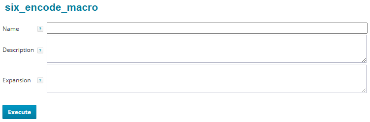

# Generic Query Reference

This document describes the operation and input form of the Generic Query, focusing solely on the query *execution* aspect - which is the part of the *overall* Generic Query usage that is provided by the Generic Query *component*. For the part which OrionQL ([Reference](https://confluence.localdomain.com/display/OCA/ObjectQueryDSL+Reference)) and CerberusLogic ([Reference](https://confluence.localdomain.com/display/OCA/ObjectCheckerDSL+Reference)) contribute to the Generic Query, please refer to their documentation.

- [Features Overview](#features-overview)
  - [Data Sources](#data-sources)
    - [Database queries](#database-queries)
    - [OrionQL Expressions](#orionql-expressions)
    - [Connector endpoints](#connector-endpoints)
    - [Rules](#rules)
  - [Subqueries](#subqueries)
  - [Synthetic Attributes](#synthetic-attributes)
  - [Selection Rules](#selection-rules)
  - [Object Grouping](#object-grouping)
  - [Groups Postprocessing](#groups-postprocessing)
  - [Generic Query Macros](#generic-query-macros)
    - [Creating macros](#creating-macros)
    - [Displaying existing macros](#displaying-existing-macros)
- [Input Form](#input-form)
- [Generic Query Execution Flow](#generic-query-execution-flow)

> [!IMPORTANT]
> About the Rule Runner platform
>
> The Generic Query is one of several applications running on the [Rule Runner](/spaces/OCA/pages/279282065/The+Rule+Runner+Platform) platform. By using the Rule Runner as execution platform, the [common features it provides to all rules](/spaces/OCA/pages/279282249/Rule+Runner+User+Guide) are available as well to the Generic Query.

# Features Overview

Concerning its overall operation, the Generic Query offers three main dimensions:

- Objects can be queried from
  - the database
  - an OrionQL expression
  - connector endpoints
  - the output of a Rule
- Objects can be
  - processed directly
  - dissected into child objects to process instead
- Output can be produced
  - as a flat table containing one row per [child] object
  - by grouping (or counting) the [child] objects according to some selected criteria and assembling the result into a suitable presentation

The dimensions are steered by providing the necessary input in the input fields controlling them, and can all be freely combined, resulting in a variety of different operating modes. The controlling fields are:

- *Object class*: The value entered in this field controls the source to read the [*primary*] objects from.
- *Collection expression*: An OrionQL expression entered in this field will get evaluated for each [primary] object, *unfolding* it into a collection [of *child* or *secondary* objects] that will then be iterated upon, going into the remainder of the processing instead of the primary object.
- *Grouping expressions*: One or more OrionQL expressions entered in this field will cause the (primary or secondary) objects to be *grouped* instead of being immediately output into a flat table. After all objects have been processed, the grouping result will be converted into a representation chosen using the *Grouping layout* selector.

Before describing the [input form](#input-form), the following subsections outline the main features of the Generic Query in more detail. We will follow the order in which the features are connected together in the query [execution flow](#execution-flow). For the minor features like limiting the number of objects to process, cache control and background execution see the explanations of the corresponding fields in the input form.

## Data Sources

As stated above, the Generic Query can use different input sources to read objects from. This is determined by the *Object class* field. The following subsections describe the available sources.

### Database queries

Database queries constitute the primary use of the Generic Query. They are initiated by entering an *IIQ object class name* like `Identity` or `Bundle` into the *Object class* field. There are 100+ object classes available in IIQ, and most of them can be queried directly. (Contrast this to the IIQ Debug pages that offer only a small subset of the classes, let alone the effectively missing selection capabilities.)

In Database mode, two more fields are used:

- In the *Filter* field, an optional an IIQ filter expression can be specified to restrict the set of objects selected. The filter expression is supercharged by using OrionQL template syntax, so placeholders can be used to insert computed values into it.
- In the *Ordering* field, an optional comma separated list of object attributes can be specified to sort the result set by. For descending order, `desc` can be added after the respective attribute. Dotted IIQ attribute syntax can be used to traverse object relationships (e.g. `owner.name`).

Database queries always load the *SailPointObject*s, thereby offering the whole functionality offered by the object class via its *getter* methods as defined in the IIQ API.

This type of queries is the easiest to understand and use, however loading objects is much slower than the pure database access. Faster queries can be done using OrionQL expressions, as they allow to directly specify the attributes to fetch (including extended attributes and attributes obtained from related objects through an implicit SQL join). By doing this, the loading of the objects can be avoided, leading to a speed improvement by roughly a factor of 10. In addition, expressions allow to perform sophisticated data processing before the data is seen and further processed by the Generic Query.

### OrionQL Expressions

While for most database queries the standard Generic Query capabilities are sufficient, queries can often be significantly sped up by explicitly specifying the attributes to fetch instead of loading the *SailPointObject*s. In addition, there can be tasks requiring more complex processing to bring the data into the form needed to create the desired output using the Generic Query's processing capabilities.

In such cases, an OrionQL expression can be specified as input source. The result of the expression is interpreted as a *Collection* containing the *primary objects*, and it will be iterated in the *primary iteration*.

> [!IMPORTANT]
> What is a Collection?
>
> The Generic Query uses the same rules for interpreting objects as Collections (more precisely *Iterables*) as do OrionQL and CerberusLogic:
>
> - If the object is a collection, then this is what to iterate over.
> - If the object is a `Map`, then its *entry set* (the key-value pairs it contains) is iterated over.
> - If the object is a scalar, it is treated as a collection containing a single element.

Here is an [example](https://identitiq.localdomain.com/identityiq/rulerunner/rulerunner.jsf?rule=six_generic_query&title=DEP001%20assigned%20role%20groups&className=Expression&filter=%3AIdentity(%3E%7Bname%2CassignedRoles.name%7D%5C%0A%20%20department%20%3D%3D%20%22DEP001%22%5C%0A)%5C%0A%3Acount(assignedRoles%5C.name%7C%22-%2F-%22%23name)%5C%0A%3Agroup(value%3Amap(key)%2Ckey)%5C%0A%3Aflatten(%23key)&grouping=%40%0A%5E.value%3Ajoin&layout=2) that uses two consecutive groupings to determine which groups of roles are assigned to which groups of identities, presenting the result in matrix form with the identity groups taken apart again.

Expression mode is enabled by specifying `Expression` in the *ObjectClass* field and the OrionQL expression in the *Filter* field.

### Connector endpoints

The processing capabilities of the Generic Query make it a powerful tool to analyze data also from other sources than the database. One of them is aggregations (reading from *connector endpoints*). By specifying `ResourceObject` in the *Object class* field (this object class does not have a database representation), a connector *iterate* operation is used to read data directly from the specified endpoint (equivalent to the IIQ console *iterate* command or the `six_direct_connector_access` Rule Runner script's *iterate* operation).

The iterate operation requires the *endpoint name* (application name in IIQ terminology) and the *schema object type* and returns a list of `ResourceObject`s that can be processed in the same way as objects read from the database. Application and schema object type are specified in the Filter field as

*application*: *type*

On additional lines, application parameter overrides can be specified using an assignment syntax with OrionQL expressions as values:

*name*=*value*

### Rules

In situations where data needs to be analyzed by the Generic Query that is not accessible by any of its above methods it is possible to provide them to the Generic Query through dedicated rules. An example is processing data that is contained in SIX custom tables (they can be queried only through SQL).

To consume the output of a rule, the Generic Query provides a simple interface: *Whatever the rule returns* is interpreted as something iterate over in the *primary iteration* to yield the *primary objects*. This works analogous to consuming the result of [OrionQL Expressions](#orionql-expressions), see the above box "What is a Collection?".

In most cases, rules specifically written to be used as Generic Query input source return an *Iterator*, however.

Examples of rules written to be used as input for the Generic Query are `six_sql_query` and `six_parse_file`. When they are called from the Generic Query, instead of producing HTML output they return an *Iterator* yielding a `Map` for each row. (All such rules need to document the parameter names to use in the parameter help popups of their input forms.)

Reading from Rule output is enabled by specifying `Rule: ruleName` in the *ObjectClass* field and the rule's parametes in the *Filter* field, one per line in assignment syntax `parameter=value`*,* using OrionQL expressions as values.

## Subqueries

Specifying a *Collection expression* causes this expression to be evaluated for each [*primary*] object as read from the [data source](#data-source) (that is, delivered by the *primary* iteration). The expression is expected to return a *Collection* (possibly an empty one) of *child* or *secondary objects* that will in turn be iterated upon in a nested, *secondary* iteration. The secondary objects are what goes into the further processing in place of the primary object (which continues to be available as a [parent](/spaces/OCA/pages/218112785/OrionQL+Reference#OrionQLReference-Parentreferences)).

Subqueries are a very powerful feature, especially when combined with grouping.

## Synthetic Attributes

Often, when queries get more complex, the same computation result is used in different places, for example in a [selection rule](#selection-rule) and as an output column. The Generic query allows to define such values as *synthetic attributes* using two mechanisms that can even be mixed:

- [OrionQL](/spaces/OCA/pages/218112785/OrionQL+Reference) assignment syntax – this is the most intuitive and simple to use mechanism. Besides the familiar assignment syntax it allows *List* and *Map* decomposition.  
  ### provide some examples
- [CerberusLogic](/spaces/OCA/pages/218112789/CerberusLogic+Reference) attribute computation rules – this mechanism is ideal when attributes are computed differently depending on certain condition checks.  
  ### provide an example

> [!IMPORTANT]
> Note that when using [subqueries](#subqueries), no synthetic attributes are computed for the primary objects.

Computations can reference already computed synthetic values by using multi-pass evaluation: Any block of attribute computations that is separated from the preceding one by an empty line has access to all synthetic attributes that were computed up to this point.

The computed synthetic attributes are functionally equivalent to normal object attributes and are accessed like these (see the section *Pseudo attributes* in the [OrionQL Reference](/spaces/OCA/pages/218112785/OrionQL+Reference)). Imagine them as being *implanted* into the objects (on name collisions hiding the original attributes).

> [!IMPORTANT]
> Note that synthetic attributes are only overlaid and do not change the original object in any way. Particularly, they are never persisted to the database.

## Selection Rules

When reading data from the database (including using *Expression* mode), the selection condition is normally expressed using a Sailpoint filter expression (in the *Filter* input field). However, in certain cases the selection conditions cannot be evaluated in the database – for instance when they need to evaluate non-indexed extended attributes or require nontrivial computations.

In these cases, an additional selection can be done by specifying, in the field *Selection rules*, a [CerberusLogic](/spaces/OCA/pages/218112789/CerberusLogic+Reference) rule set. The *selection rules* will be applied after the objects have been fetched by the Generic Query from the database.

> [!IMPORTANT]
> Note that for *all* data sources *except* [database queries](#database-queries), *selection rules* are the *only* way to filter the data.

The Generic Query consults the rule set in two places during the [query execution process](#query-execution-process):

1. After reading the primary object: The primary object it is immediately checked against the rule headers and discarded if it does not select any rule.  
   This allows – by crafting the selection rules accordingly – to avoid unnecessary processing like computing the collection expression or synthetic attributes when the object is not going to be processed anyway: Specifically only for a primary object that matches at least one rule header selector, the collection expression is computed so that a sub-iteration is conducted.
2. After computing the synthetic attributes for the object (either primary one or the current secondary one in the sub-iteration), the object is checked against the rule set (more precisely: the rules selected in the first step). If an *accept* (positive) decision is taken, the object is processed further, otherwise it is discarded.

Using this schema, powerful object selection capabilities are available.

> [!IMPORTANT]
> Testing business rules
>
> An important use of *Selection rules* is testing *CerberusLogic* business rules from other areas of the IAM system (e.g. a *role composition checker*): The Generic Query exposes the decision made by the rule set as a synthetic attribute `_decision`. This allows to use it as a testbed for *any* business rules by simply pasting them into the *Selection rules* field to have them applied to the objects read from the database, and for the objects that have been accepted examining the synthetic `_decision` attribute.

### provide examples

## Object Grouping

One of the features that sets the Generic Query apart from, e.g., standard SQL queries is *object grouping*: It is activated by specifying one or more expressions in the *Grouping expressions* field (one per line),

The result of the grouping operation is an – in general *multi-level* nested – mapping with one nesting level per grouping expression and the objects placed into the *leaf positions* of this tree.

Two operation modes are available:

1. Counting objects. This is selected when the *Output* field is left empty. In this case the leaf position will contain only the number of objects that had the respective keys.  
   This can be used with all four *Matrix* type layouts.
2. Grouping objects. This is selected when the *Output* field is not empty. Two variants are offered, differing in the supported *Grouping layouts*:
   1. The *Output* field contains either an OrionQL expression or a formatting template. In this case, the leaf positions will contain a list with the evaluation results of the expression or template for each objects that had the respective keys.  
      This can be used with all four *Matrix* type layouts.
   2. The *Output* field contains multiple expressions that define table columns similar to plain (non-grouping) queries. In this case, the leaf positions will contain a list with the objects that had the respective keys.  
       It can only be used with the *Multiple tables* grouping layout. (You will get a syntax error about the expression assumed to be in the *Output* field if you select a different layout.)

### This needs to be illustrated

What makes the grouping feature so useful are the *Grouping layouts* they can be rendered into. There are three types of grouping layouts:

1. None (no grouping layout selected): This will pretty-print the mapping produced by the grouping operation as text. It is primarily used for debugging purposes when developing queries.
2. Four *Matrix* type layouts, providing all combinations of:
   1. *single* vs. *multiple* matrices:
      1. *Single matrix* renders all grouping levels into the same table using the top level grouping for the rows and the one below it for the columns. Any remaining grouping levels will go into the cells, causing a pretty-print of the `Map` at this position.
      2. *Multiple matrices* uses the topmost levels of the mapping to generate the section headings of a document containing the matrices defined by the remaining levels. The default is to leave only the two lowest levels for the matrices and use all levels above for the document's section structure.  
         The *Maximum captions* field allows to restrict the number of levels to be used for captions with the result of the remaining levels going into the matrices, causing a pretty-print of the `Map` as in the *single matrix* case.
   2. *plain* vs. *rotated* column headers: Rotating the column headers results in a more compact output when cell values are narrow (such as counts).
3. A *Multiple tables* layout: This will use *all* levels of the mapping to generate the section headings of a document, each section containing a table listing the objects collected for the respective keys in the conventional columnar format (using the column definitions in the *Output* field).

### This also should be illustrated

## Groups Postprocessing

In certain cases, for analyzing the data, the grouping result may not yet be what serves you best if displayed unmodified: The output may contain unnecessary noise or just be too big to work with and to see the overall picture.

- You might want to apply some filtering to have the output contain only the *essence* of what you are looking for – for instance only rows with more than one column filled or only cells containing data that matches certain conditions.
- You may want to transform the cell contents in some way – for instance to have them display only overview information like counts, moving more detailed information into a tooltip.

To support this, the *Groups postprocessing* field accepts [CerberusLogic](/spaces/OCA/pages/218112789/CerberusLogic+Reference) rules that can filter and/or transform the data on selected levels of the grouping hierarchy. The groups postprocessing is applied after the object grouping has been completed, before the grouping result is displayed. It results in a transformed grouping result that goes into display.

### provide an example

## Generic Query Macros

The Generic Query supports reusing code snippets through OrionQL and CerberusLogic macros. It uses the following schema to define and load macro libraries:

1. Macro libraries are defined as `Configuration` objects.
   1. The base library names are `OrionLibrary` and `CerberusLibrary`.
   2. Besides the base libraries, *named* libraries can be provided as `baseLibraryName.name`. Named libraries can be loaded *top level* or as *includes*.
      1. When named libraries are loaded *top level*, their entries are loaded into the same scope as the base library. This is used by the Generic Query for the user's private macro library which is named with the user name (e.g. `OrionLibrary.usrxy`).
         > [!IMPORTANT]
         > Since the user's private library is loaded *after* the base library, it can override the macros loaded from it. This allows users to fix errors in macros, not waiting for the deployment of the libraries that are under version control, which may be a longer process. (The user's private libraries are not subject to the strong version control and deployment restrictions that apply to the common libraries.)
      2. When loaded as *includes*, the library contents are *scoped*, prefixing the macro name with the library name.
         > [!IMPORTANT]
         > Since included libraries are loaded *before* the current library, it is possible to override imported macros in the importing library. This is, however, not recommended except as a temporary workaround.
         >
         > It is also possible but also not recommended except as a temporary workaround to define scoped macros which are *missing* in the included library for that scope.
2. The macros are stored as configuration entries, using the *macro name* as key and the *expansion text* as value.
3. A special entry `$includes$`, having as value a comma separated string of library names, causes the listed named libraries to be loaded as *includes*.
4. Even without includes, the macro namespace can be hierarchically scoped by using macro names containing dots. Example: `bundle.iterateEntitlements`. (The scoping is purely *descriptive*, as the macros continue to be represented in a flat map.)
5. Macro *descriptions* can be stored as additional configuration entries using the macro name with the suffix `$description`.

> [!IMPORTANT]
> See the subsections below about how to effortlessly add macros to an existing library and how to display the contents of the existing macro libraries.

The following example illustrates the above schema. Consider these libraries:

```xml
<Configuration name="OrionLibrary">
    <Attributes>
        <Map>
            <entry key="$includes$" value="bundle"/>
            <entry key="toDayString" value=":format(${%yyyy-MM-dd})"/>
            <entry key="toDayString$description" value="Format timestamp as yyyy-MM-dd"/>
            <entry key="entitlement.entitlementFormat" value="[${application.name}/${attribute}] ${value}"/>
            <entry key="entitlement.entitlementFormat$description" value="Standard formatting template for ManagedAttribute class"/>
        </Map>
    </Attributes>
</Configuration>

<Configuration name="OrionLibrary.bundle">
    <Attributes>
        <Map>
            <entry key="iterateEntitlements" value=":flatten(:union(requirements,inheritance)*#profiles#constraints#value)"/>
            <entry key="iterateEntitlements$description" value="Iterate over all entitlements granted by a role"/>
         </Map>
    </Attributes>
</Configuration>

<Configuration name="OrionLibrary.usrxy">
    <Attributes>
        <Map>
            <entry key="parseCsv" value=":extract(([^,]+\)[, ]*)"/>
            <entry key="parseCsv$description" value="Split a CSV string into a list"/>
        </Map>
    </Attributes>
</Configuration>
```

When the Generic Query is executed by the user usrxy, the *effective* library composed in memory will be equivalent to the following library:

```xml
<Configuration name="OrionLibrary">
    <Attributes>
        <Map>
            <entry key="toDayString" value=":format(${%yyyy-MM-dd})"/>
            <entry key="entitlement.entitlementFormat" value="[${application.name}/${attribute}] ${value}"/>
            <entry key="bundle.iterateEntitlements" value=":flatten(:union(requirements,inheritance)*#profiles#constraints#value)"/>
            <entry key="parseCsv" value=":extract(([^,]+\)[, ]*)"/>
        </Map>
    </Attributes>
</Configuration>
```

In addition to the general schema, the following macro naming conventions have been defined to be used for OrionQL:

1. Macros that are associated with a certain object class should be scoped with the lowercased class name. Example: `bundle.iterateEntitlements`
2. Macros that render HTML links to queries should be scoped with `query`. Example: `query.objectXmlById`
3. Macros that perform text shortening of any sort should have their name end with a number. Example: `softWrap60`
4. Macros that format or otherwise convert their input into a specific representation should start their name with `to`, followed by the name of the representation. Example: `toDayString`
5. Formatting templates should have their name end with `Format`. Example: `bundle.entitlementFormat`

As the macro library grows, new naming conventions may be added.

### Creating macros

For turning DSL code into a macro, use the following rule:



[six\_encode\_macro](https://identitiq.localdomain.com/identityiq/rulerunner/rulerunner.jsf?rule=six_encode_macro)

After executing the rule, you can copy the two entries that encode the macro and its description directly into the XML of the library Configuration object.

### Displaying existing macros

The following queries list all existing OrionQL respective CerberusLogic macros, grouped into *category sections* according to the above naming convention:

- [OrionLibrary](https://identitiq.localdomain.com/identityiq/rulerunner/rulerunner.jsf?rule=six_generic_query&title=OrionLibrary&className=Configuration&filter=name.startsWith%28+%22OrionLibrary%22+%29&subquery=%3Acache%28%24%7Bname%7D%2C%5C%0A+attributes%3Aindex%28%3Ekey%3Amatch%28%5C%5C%24%28.*%5C%29%29%7C%22expansion%22%23key%3Areplace%28%5C%5C%24.*%2C%29%2Cvalue%29%5C%0A%29.expansion&computations=category%3Dkey%3Aswitch%28%5C%0A+%5C%5Cd%3D%22Text+shortening%22%2C%5C%0A+%5Eto%3D%22Formatting%22%2C%5C%0A+%5Equery%3D%22Queries%22%2C%5C%0A+Format%3D%22Format+definitions%22%2C%5C%0A+.%2B%5C%5C.%3D%3Amatch%28%5B%5E.%5D%2B%29%3Aformat%28Class+%24%7B%7D%29%2C%5C%0A+%22%5BOther%5D%22%5C%0A%29&output=Name%3Dkey%0ADescription%3D%3Acache%28%24%7B%5E.name%7D%29.description%3Aget%28key%29.%24softWrap60%24%0AExpansion%3Dvalue&grouping=%5E.name%0Acategory&layout=Multiple+tables)
- [CerberusLibrary](https://identitiq.localdomain.com/identityiq/rulerunner/rulerunner.jsf?rule=six_generic_query&title=CerberusLibrary&className=Configuration&filter=name.startsWith(%20%22CerberusLibrary%22%20)&subquery=%3Acache(%24%7Bname%7D%2C%5C%0A%20attributes%3Aindex(%3Ekey%3Amatch(%5C%5C%24(description%5C)%24)%7C%22expansion%22%23key%3Areplace(%5C%5C%24.*%2C)%2Cvalue)%5C%0A).expansion&computations=category%3Dkey%3Aswitch(%5C%0A%20HiddenDetails%3D%22Details%20popup%20rendering%22%2C%5C%0A%20%5Ecompute%3D%22Computations%22%2C%5C%0A%20%5Eto%3D%22Formatting%22%2C%5C%0A%20%5ElinkTo%3D%22Link%20rendering%22%2C%5C%0A%20%5Equery%3D%22Queries%22%2C%5C%0A%20columns%24%3D%22Column%20definitions%22%2C%5C%0A%20%22%5BOther%5D%22%5C%0A)&output=Name%3Dkey%0ADescription%3D%3Acache(%24%7B%5E.name%7D).description%3Aget(key).%24softWrap60%24%0AExpansion%3Dvalue&grouping=%5E.name%0Acategory&layout=Multiple%20tables)

# Input Form

The following table lists the Generic Query's input parameters. A short help text can be displayed by hovering with the mouse pointer in the Generic Query input form over the small question mark icon left to each input field.

> [!IMPORTANT]
> The order of the fields in the input form follows the order in which they are used in the [execution](#execution) of the query, helping to remember their function.

For illustration, the field contents for this [example query](https://identitiq.localdomain.com/identityiq/rulerunner/rulerunner.jsf?rule=six_generic_query&title=Latest%20access%20requests%20for%20usrxy&className=IdentityRequest&filter=targetId%20%3D%3D%20%24%22%3AIdentity(%7Bid%7Dname%3D%3D%22usrxy%22)%22&ordering=created%20desc&subquery=items&selector=IdentityRequestItem().accept(%0A%20%20%20%20eq(%22application%22%2C%20%22IIQ%22)%0A)&output=type%3D%5E.type%0Acreated%3D%5E.created%0Asource%3D%5E.source%0Aoperation%0Avalue&layout=1&maxRows=100) are shown in the third column.

| Field name                                      | Explanation                                                                                                                                                                                                                                                                                                                                                                                                                                                                                                                                                                                                                                                                                                                                                                                                                                                                                                                                                                                                                                                                                                                                                                                                                                                                                                                                                                                                                                                                                                                                                                                                                                                                                                                                                                                                                                                                                                                                                                                                                                                                                                                                                                                                                                                                                                                                                                                                                                                                                                                                                                                                                                                                                                                                                                                                                                                                                                                                         | Example                                                       |
|:------------------------------------------------|:----------------------------------------------------------------------------------------------------------------------------------------------------------------------------------------------------------------------------------------------------------------------------------------------------------------------------------------------------------------------------------------------------------------------------------------------------------------------------------------------------------------------------------------------------------------------------------------------------------------------------------------------------------------------------------------------------------------------------------------------------------------------------------------------------------------------------------------------------------------------------------------------------------------------------------------------------------------------------------------------------------------------------------------------------------------------------------------------------------------------------------------------------------------------------------------------------------------------------------------------------------------------------------------------------------------------------------------------------------------------------------------------------------------------------------------------------------------------------------------------------------------------------------------------------------------------------------------------------------------------------------------------------------------------------------------------------------------------------------------------------------------------------------------------------------------------------------------------------------------------------------------------------------------------------------------------------------------------------------------------------------------------------------------------------------------------------------------------------------------------------------------------------------------------------------------------------------------------------------------------------------------------------------------------------------------------------------------------------------------------------------------------------------------------------------------------------------------------------------------------------------------------------------------------------------------------------------------------------------------------------------------------------------------------------------------------------------------------------------------------------------------------------------------------------------------------------------------------------------------------------------------------------------------------------------------------------|:--------------------------------------------------------------|
| Title                                           | Descriptive name for the query. This text is used as the tab title as well as for the generated link and should be chosen to facilitate recognizing the query later.                                                                                                                                                                                                                                                                                                                                                                                                                                                                                                                                                                                                                                                                                                                                                                                                                                                                                                                                                                                                                                                                                                                                                                                                                                                                                                                                                                                                                                                                                                                                                                                                                                                                                                                                                                                                                                                                                                                                                                                                                                                                                                                                                                                                                                                                                                                                                                                                                                                                                                                                                                                                                                                                                                                                                                                | Latest access requests for usrxy                              |
| Object class                                    | Identifies the data source of the query. For a normal database query, this is a [Sailpoint object class](https://identitiq.localdomain.com/identityiq/doc/javadoc/sailpoint/object/package-summary.html) like `Identity` or `Bundle`, but other sources can be specified as well: <br/><ul><li><code>ResourceObject</code> requests a connector <em>iterate</em> operation. In this case, the <em>endpoint</em> and <em>schema object type</em> have to be specified in the <em>Filter</em> field below in the following format, optionally followed by parameter overrides (see <em>Filter</em> field below):<br/><em>    application</em>: <em>type</em></li><li><code>Expression</code> causes an OrionQL expression to be evaluated to obtain the query result. The expression is specified in the <em>Filter</em> field.</li><li><code>Rule: <em>name</em></code> causes the Rule with the specified <em>name</em> to be executed, and its return value to be used to obtain the query result. The rule parameters, if any, are specified in the <em>Filter</em> field.</li></ul> The *Object class* parameter is the only one that is mandatory for all types of queries. All other parameters are used depending on the specific task to accomplish.                                                                                                                                                                                                                                                                                                                                                                                                                                                                                                                                                                                                                                                                                                                                                                                                                                                                                                                                                                                                                                                                                                                                                                                                                                                                                                                                                                                                                                                                                                                                                                                                                                                                                         | IdentityRequest                                               |
| Filter                                          | Specifies the selection condition of the query. <br/> For a database query, this is a [Sailpoint Filter expression](https://community.sailpoint.com/t5/Technical-White-Papers/Filters-and-Filter-Strings/ta-p/76012). This is optional, and without it, *all* objects of the specified class will be selected. The Filter expression is specified as an [OrionQL formatting template](/spaces/OCA/pages/218112785/OrionQL+Reference#OrionQLReference-Templates), allowing to inject computed values into the filter expression by using substitution placeholders like $"*expression*" as demonstrated in the example query. <br/> For the other types of queries (see the description for the *Object class* field above), the contents are as follows: <br/><ul><li>For iterating objects on endpoints (<em>Object class</em> = <code>ResourceObject</code>), <em>endpoint</em> and <em>schema object type</em> are specified in this field in the following form:<br/>    <em style="letter-spacing: 0.0px;">application</em><span style="letter-spacing: 0.0px;">: </span><em style="letter-spacing: 0.0px;">type</em><br/>This specification can optionally be followed by one or more lines containing parameter overrides using an assignment syntax with OrionQL expressions as values:<br/>    <em>name</em>=<em>value</em></li><li>For iterating over the result of evaluating an OrionQL expression (<em>Object class</em> = <code>Expression</code>), the expression is specified here.</li><li>For iterating over the result of a Rule execution (<em>Object class</em> = <code>Rule: <em>name</em></code>), the rule parameters are specified here using an assignment syntax with OrionQL expressions as values:<br/>    <em>name</em>=<em>value</em></li></ul>                                                                                                                                                                                                                                                                                                                                                                                                                                                                                                                                                                                                                                                                                                                                                                                                                                                                                                                                                                                                                                                                                                                                                                      | targetId == $":Identity({id}name=="usrxy")"                   |
| Ordering                                        | For a database query this is an optional comma separated list of *searchable* attributes to sort the result set by. For descending order, add `desc` after the respective attribute. The familiar dotted IIQ attribute syntax for traversing object relationships can also be used (e.g. `owner.name`). <br/> The parameter is ignored by the `ResourceObject` and `Expression` query types.                                                                                                                                                                                                                                                                                                                                                                                                                                                                                                                                                                                                                                                                                                                                                                                                                                                                                                                                                                                                                                                                                                                                                                                                                                                                                                                                                                                                                                                                                                                                                                                                                                                                                                                                                                                                                                                                                                                                                                                                                                                                                                                                                                                                                                                                                                                                                                                                                                                                                                                                                        | created desc                                                  |
| [Collection expression](#collection-expression) | If an OrionQL expression is provided in this field, it will be evaluated for every object returned by the [primary] query. It is expected to return a collection of [secondary] objects, which is then iterated upon to deliver the objects that go into the query result in place of the primary objects. The primary objects themselves will *not* be part of the result, however they will be available from their secondary objects as a [parent](/spaces/OCA/pages/218112785/OrionQL+Reference#OrionQLReference-Parentreferences). <br/> An empty collection that is returned for some primary object will cause this object to not leave any traces in the output.                                                                                                                                                                                                                                                                                                                                                                                                                                                                                                                                                                                                                                                                                                                                                                                                                                                                                                                                                                                                                                                                                                                                                                                                                                                                                                                                                                                                                                                                                                                                                                                                                                                                                                                                                                                                                                                                                                                                                                                                                                                                                                                                                                                                                                                                            | items                                                         |
| [Synthetic attributes](#synthetic-attributes)   | This field can be used to compute values off the current object to use them in later processing steps. The computed values will be "implanted" into the object, making them available in the same way as normal object attributes. Synthetic attributes will mask object attributes with the same name, however nothing will ever be written to the database. <br/> Two different approaches can be used to specify synthetic attributes, which are automatically recognized. The first approach is simpler and usually preferred, while the second one is better suited for attribute computations that use condition checks: <br/><ul><li data-uuid="e795c83a-8870-4aa8-b159-fd73fffa750e"><a href="/spaces/OCA/pages/218112785/OrionQL+Reference">OrionQL</a> assignment syntax using a simple <code><em>name</em>=<em>expression</em></code> syntax similar to that used in the <em>Output</em> field when a column name is specified. The name can be made up of digits, letters and the underscore. There are two variants of this syntax to support <code>List</code> and <code>Map</code> decomposition:<ul><li data-uuid="34516b12-b3ce-4305-9515-044c212ec2f8">A <em>multiple assignment</em> syntax: <code><em>name1,name2,...</em>=</code><em><code>expression</code><br/></em>This causes the value returned by the expression to be interpreted as a <em>Collection</em>, assigning its elements one by one to the specified names (unused elements are discarded and missing elements are assigned as <code>null</code>).</li><li data-uuid="1bf64406-0885-4bae-837e-7829d6acc2e7">A <em>wildcard assignment</em> syntax: <code><em>*=expression</em></code><br/>This causes all entries of the <code>Map</code> to be assigned to synthetic attributes using the keys as attribute name.</li></ul></li><li data-uuid="36695e62-b350-4b7e-a1ab-b4d12a7fa467"><a href="/spaces/OCA/pages/218112789/CerberusLogic+Reference">CerberusLogic</a> attribute computation rules that will be executed in <em>evaluation</em> mode (see section <em>Rule set execution</em> in the linked reference guide). The rules are composed in the following way:<ul><li>For the rule header, the identifier <code>Attribute</code> has to be used.</li><li>The name of the synthetic attribute is used as the <em>rule ID</em>. (If the rule header contains selectors, multiple rules for the same attribute are possible. However, this is needed in complex cases only.)</li><li>The expression returning the value of the synthetic attribute is specified as the <em>action ID</em>.</li></ul></li></ul> When multiple blocks of attribute specifications are given, a multi pass evaluation scheme is applied: Each new block has access to the attributes computed by the previous blocks. (Within a block, multiple attribute computations don't "see" each other's results.) A new block is established by a syntax switch or a blank line. |                                                               |
| [Selection rules](#selection-rules)             | This field can contain an [CerberusLogic](/spaces/OCA/pages/218112789/CerberusLogic+Reference) rule set specifying selection criteria that cannot be specified by using a database filter (see the *Filter* field above). This applies to, among others, checks involving collection attributes, synthetic attributes or secondary objects, as well as *any* filtering to perform on non-database input. <br/> The rule set will be applied to each object iterated upon, and the object will be processed further only if the rule set makes a positive decision. There are two operating modes, depending on the contents of the *Collection expression* field above: <br/><ul><li>When <em>no </em>collection expression has been specified, the rule set will check each object iterated upon both in the rule header and in the actions. Consequently, except to avoid costly computations of synthetic attributes, there is little reason to check it in the rule header, and there will be only a single rule with one or more actions.</li><li>When a collection expression <em>has </em>been specified, the <em>primary </em>object will be checked against the <em>rule header</em> selectors, and the <em>secondary </em>objects will be checked against the <em>action </em>selectors. The evaluation of the collection expression is only done if the check of the primary object was successful.</li></ul> Note that for performance reasons, while any condition *could* be expressed solely in CerberusLogic, a filter expression should always be used if possible since it will perform its selection in the database, so that only the objects satisfying the filter need to be fetched. <br/> The Identifier for the rule headers can be chosen freely, preferably in a way that supports an intuitive understanding of the query. The class of the object to be checked is a good choice. <br/> The Generic Query exposes the decision made by the rule set as a synthetic attribute `_decision`. This allows the selection rules to provide an explanation for why the object has been selected using rule IDs and action IDs. More importantly, it allows to use the Generic Query as a testbed for business rules by pasting the rules into the *Selection rules* field and showing the `_decision` object's `ruleId` and `actionId` attributes.                                                                                                                                                                                                                                                                                                                                                                                                                                                                                                                                                                            | IdentityRequestItem().accept(     eq("application", "IIQ") )  |
| Output                                          | This field defines the information to be output for every object that was selected in the preceding steps. Its contents depend on the operating mode of the Generic Query: <br/><ul><li>In the standard tabular output mode, including the <em>Multiple tables</em> grouping layout, the field contains a list of column definitions, one per line. The definitions have the following syntax:<br/>    <em>caption</em>=<em>expression</em><br/>Both parts are optional (but not at the same time):<ul><li>Without a caption, the expression (which is an OrionQL expression) will be used as the column's title.</li><li>Without an expression, an empty column will be generated.</li></ul></li><li>In grouping mode (see <em>Grouping expressions</em> below) there are two sub-modes:<ul><li>Counting objects: This mode is selected by leaving the Output field empty.</li><li>Grouping objects: In this mode, representations of the objects are collected into the groups. The representations are specified in one of the following ways:<ul><li>An OrionQL expression. This causes the result of evaluating the expression to get placed into the output. It need not be a string. (When <a href="#GenericQueryReference-GroupsPostprocessing">groups postprocessing</a> is used, often the object itself is placed into the grouping by using the <em>this</em> expression <code>@</code>.)</li><li>An OrionQL formatting template. This causes the object to be formatted into a string representation that is then placed into the output.</li></ul></li></ul></li></ul>                                                                                                                                                                                                                                                                                                                                                                                                                                                                                                                                                                                                                                                                                                                                                                                                                                                                                                                                                                                                                                                                                                                                                                                                                                                                                                                                                                | type=^.type created=^.created source=^.source operation value |
| [Grouping expressions](#grouping-expressions)   | Instead of the standard behavior of creating a tabular output of the selected objects with one row per object, the Generic Query can alternatively be advised to group the objects according to some criteria and present the collected data in a suitable form according to the *Grouping layout* setting (see below). Grouping is a powerful means for data analysis or transforming data to alternative representations. <br/> The grouping criteria are specified in this field as OrionQL expressions, one per line. As a result, a possibly multilevel mapping is created, containing the objects that have equal value(s) for the grouping key(s) in so-called *buckets*, which are located at the leaf positions of the mapping tree. The number of mapping levels created equals the number of grouping expressions. <br/> Depending on the *Output* field (see above), the buckets can be one of the following: <br/><ul><li>An <em>object count</em> when objects are counted only (<em>Output</em> field is empty).</li><li>A list of <em>object representations</em> according to the definition in the <em>Output</em> field.</li></ul> Note that when producing the output, the values for each grouping key get sorted, so they must be *comparable*. In particular `null` values are not allowed, so countermeasures need to be applied if necessary, the easiest one being a fallback to a string literal using an [expression alternative](/spaces/OCA/pages/218112785/OrionQL+Reference#OrionQLReference-Expressionalternatives). Alternatively, the value can be [formatted](/spaces/OCA/pages/218112785/OrionQL+Reference#OrionQLReference-format()).                                                                                                                                                                                                                                                                                                                                                                                                                                                                                                                                                                                                                                                                                                                                                                                                                                                                                                                                                                                                                                                                                                                                                                                                                                                                         |                                                               |
| [Groups postprocessing](#groups-postprocessing) | This field allows to request the Generic Query to filter and/or transform the grouping result before it is used for output generation according to the *Grouping layout* selection. The postprocessing is specified as a [CerberusLogic](/spaces/OCA/pages/218112789/CerberusLogic+Reference) rule set containing rules of the form <br/> `Level(nn).accept( "expression", selector )` <br/><br/>> [!IMPORTANT] Instead of *accept*, *when* can be used as well. This is advisable when *and only when* the rule contains multiple clauses to define different transformations depending on condition checks. <br/>  Here <br/><ul><li data-uuid="cf4d4665-9758-443f-ad44-d5d1dd9a01a4"><em><code>nn</code></em> is an Integer specifying the grouping level to apply this rule to (in the single-matrix layouts, for instance, level 1 is the <em>rows </em>and level 2 the <em>cells</em>)</li><li data-uuid="e1579e18-e498-4a20-a599-b329a5d00ba8"><em><code>expression</code></em> is an OrionQL expression for transforming each element on this level into the desired form (unless the level refers to the bucket with the list of objects having equal keys, the elements are always of type <code>Map.Entry</code>, and the collected data is in their <code>value</code> attribute)</li><li data-uuid="cc5abbb4-d546-43dd-b9fc-35be9a53d9f8"><code>selector</code> is one or more CerberusLogic selectors specifying the filtering to apply on this level by <em>accepting </em>the elements that should stay</li></ul> In most cases, only one of *`expression`* or *`selector`* is used. However, filtering and transforming (only the *accepted* objects, that is) can be combined – allowing for instance to define different transformations depending on condition checks. <br/> If rules are defined for multiple levels, their order in the rule set determines the order in which they are evaluated: Rules for deeper levels are evaluated *after* or *before* the rules for higher levels depending on if they come *after* or *before* them in the rule set. Note however, that rules that perform transformations prevent further traversal of the grouping hierarchy, so no rules for deeper levels that come after them in the rule set will ever be evaluated. <br/>                                                                                                                                                                                                                                                                                                                                                                                                                                                                                                                                                                                                                                                     |                                                               |
| Grouping layout                                 | The grouping result, which is a potentially multilevel mapping of keys to either object counts or lists of object representations as defined by the *Output* field (see above), can be converted to various output representations: <br/><ul><li>Pretty-print as text. This format is selected by <em>not </em>selecting a layout. It is the simplest representation, showing the raw aggregated data as indented text. As such, it is suited, beyond for one-level groupings, for quickly understanding the structure of the aggregated data during the development of a query. It may also be the best representation when a matrix representation creates a too large and mostly empty table.</li><li>Matrix (with column headers rotated or not). These selections present the data in a tabular layout with the first grouping key making up the rows and the second one the columns – consequently, at least two grouping levels are required. The table cells contain whatever has been collected at this position. Depending on the number of grouping expressions and the output definition this can be still a grouping (a sub-mapping), or otherwise either an object count or object list. In case of object counts, a <em>TOTAL</em> column and row be added to the table, for the other cases the cells will contain a textual representation of the data.</li><li data-uuid="ec100c77-2ba4-4b60-8f6a-8af8caada402">Multiple matrices (with column headers rotated or not). These selections present the data as a document containing multiple matrices divided by section headings. By default, the matrices are generated from the two lowest grouping levels, while all higher levels go into the captions separating the matrices. The number of caption levels, can be limited, however in the <em>Maximum captions</em> field, causing more grouping levels to go into the matrices.</li><li data-uuid="bc0f2dd7-67fb-442c-9faf-98064cd971ee">Multiple tables. This selection presents the data as a document containing multiple tables divided by section headings. Each table displays the objects collected into a bucket by having the same grouping keys in the familiar columnar format using the column definitions in the <em>Output</em> field.</li></ul>                                                                                                                                                                                                                                                                                                                                                                                                                                                                                                                                                                                                                                                            |                                                               |
| Maximum captions                                | This field is used in the two *Multiple matrices* grouping layouts to restrict the number of grouping levels that is used for generating document sections to split the grouped data into multiple matrices. The default is to use all but the two *lowest* grouping levels for generating document sections, however if more levels should go into the matrices, the number of section levels (or *caption levels*) can be limited.                                                                                                                                                                                                                                                                                                                                                                                                                                                                                                                                                                                                                                                                                                                                                                                                                                                                                                                                                                                                                                                                                                                                                                                                                                                                                                                                                                                                                                                                                                                                                                                                                                                                                                                                                                                                                                                                                                                                                                                                                                                                                                                                                                                                                                                                                                                                                                                                                                                                                                                |                                                               |
| Maximum rows                                    | In this field, the number of objects to process can be limited. (If a collection expression is used, the limit applies to the number of secondary objects.) <br/> This feature can be used to quickly obtain, for test or exploration, some sample data without going into a detailed filtering, but a more important application is to use it in conjunction with result set ordering to process only the first *n* objects satisfying the selection criteria.                                                                                                                                                                                                                                                                                                                                                                                                                                                                                                                                                                                                                                                                                                                                                                                                                                                                                                                                                                                                                                                                                                                                                                                                                                                                                                                                                                                                                                                                                                                                                                                                                                                                                                                                                                                                                                                                                                                                                                                                                                                                                                                                                                                                                                                                                                                                                                                                                                                                                     | 10                                                            |
| Maximum cache size                              | Database query results can be cached by the Object Query Framework as well as Hibernate. While in the common case this speeds up queries, the memory consumption it causes may sometimes be substantial and either slow down the whole server or even cause the query to fail due to memory exhaustion. <br/> While not needed for most queries, this setting allows to force a cache cleanup every *n* primary objects to free up memory, possibly making otherwise infeasible queries possible.                                                                                                                                                                                                                                                                                                                                                                                                                                                                                                                                                                                                                                                                                                                                                                                                                                                                                                                                                                                                                                                                                                                                                                                                                                                                                                                                                                                                                                                                                                                                                                                                                                                                                                                                                                                                                                                                                                                                                                                                                                                                                                                                                                                                                                                                                                                                                                                                                                                   |                                                               |
| Download output as                              | If set, the query result is not displayed inline but sent back to the browser as a *file download*, prompting the browser's *Save as...* dialog. The selection determines the output file format (only HTML is currently implemented). <br/><br/>> [!IMPORTANT] The downloaded file is identical to what would be produced by instead selecting *Execute in background* and receiving the result as mail attachment. <br/>  If *Execute in background* is selected, it supersedes the download functionality (no download is sent to the browser), and this field only selects the the background execution's output file format. (There is currently no use for this – it will become interesting only when CSV output is implemented.) <br/>                                                                                                                                                                                                                                                                                                                                                                                                                                                                                                                                                                                                                                                                                                                                                                                                                                                                                                                                                                                                                                                                                                                                                                                                                                                                                                                                                                                                                                                                                                                                                                                                                                                                                                                                                                                                                                                                                                                                                                                                                                                                                                                                                                                                      |                                                               |
| Execute in background                           | The Generic Query imposes a time limit for executing queries in the foreground, that is, when executing them synchronously while the browser is waiting for the result (which is the normal case). The purpose of this is, besides preventing (accidentally) long-running queries to punish the user by forcing him to wait a long time for the result (and at the same time occupying a GUI thread in the application server), to prevent hitting the HTTP connection timeout that would cause a complete loss of the query result as *already* collected. <br/> The built in foreground execution time limit of 40 seconds lets the Generic Query abort longer running queries as soon as it gets the control back from the data source, returning the result collected so far. Often this is even a sufficient result. <br/> To get the complete result, the query can alternatively be executed in the background. When sending the form with background execution enabled, only a notification about the query having been submitted to background execution is displayed, and the query execution is handed over to the IIQ task executor. The result will be sent to the user's email address. <br/> Up to four background executions may be active at any time, causing an error message to be displayed this number is already reached. The submit can be retried later in this case. <br/><br/>> [!IMPORTANT] In addition to removing the *execution time limit*, there is also an *output size limit*, which is increased for background execution. <br/>                                                                                                                                                                                                                                                                                                                                                                                                                                                                                                                                                                                                                                                                                                                                                                                                                                                                                                                                                                                                                                                                                                                                                                                                                                                                                                                                                                                |                                                               |

# Generic Query Execution Flow

The Generic Query follows the following execution flow (minor details like checking execution time limit, object count or cache size are omitted):

- Read the primary objects from the data source for iteration
- For each primary object:
  - If selection rules are present, immediately discard the object if it does not select any rule
  - If a collection expression is present, evaluate it and start a nested iteration over the result
  - For each secondary object or continuing with the primary object when no collection expression was specified:
    - Compute the specified synthetic attributes and "implant" them into the object
    - If selection rules are present, discard the object if it is not accepted by any rule
    - If grouping is specified, add the object to the grouping, otherwise to the output
- If grouping is specified:
  - If groups postprocessing is specified, apply it to the grouping result
  - Format the grouping result into the requested layout

The following flowchart illustrates the outlined above processing steps and the input fields controlling them:
