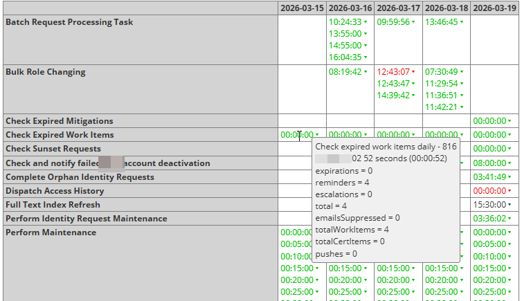
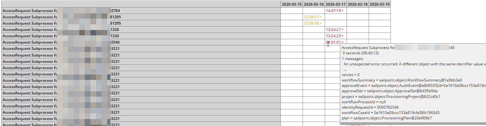
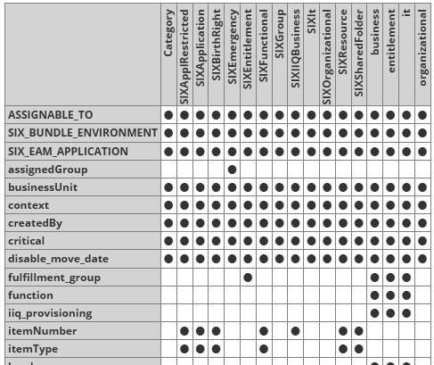
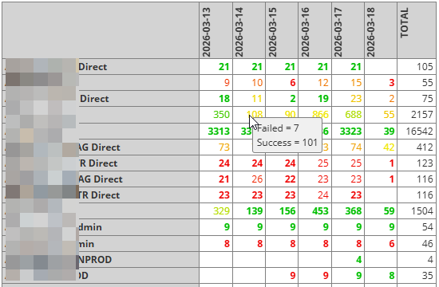
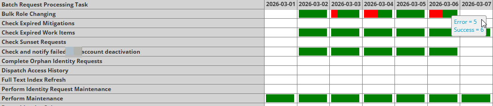
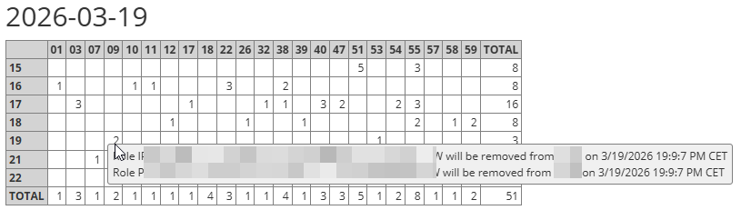
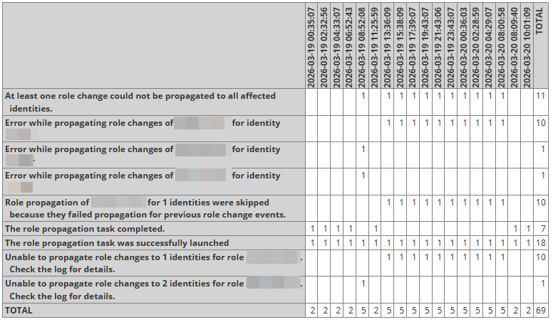

# Prefabricated queries

This page serves to share prefabricated queries within the team. It uses Confluence's *Table Transformer* to generate links for multiple environments from the same URL parameters.

Note that some of the queries need to be executed in background to get the full result.

- [Standard searches](#standard-searches)
- [OMOD queries](#omod-queries)
- [Frequently used queries](#frequently-used-queries)
- [Configuration queries](#configuration-queries)
- [File queries](#file-queries)
- [Targeted queries](#targeted-queries)
  - [Identities / Accounts /Assignments](#identities-accounts-assignments)
  - [Entitlements / Roles](#entitlements-roles)
  - [Access requests / Certifications / Provisioning](#access-requests-certifications-provisioning)
  - [Workflows / Workitems](#workflows-workitems)
  - [Tasks / Requests](#tasks-requests)
  - [Consistency checks](#consistency-checks)
- [Developer helpers](#developer-helpers)
- [-- Table template --](#table-template)

# Standard searches

| Title                            | Description   | Keywords   | Screenshot   | Parameters                                                                                                                                                                                                                                                                                                                                                                                                                                                                                                                                                                                                                                                                                                                                    |
|:---------------------------------|:--------------|:-----------|:-------------|:----------------------------------------------------------------------------------------------------------------------------------------------------------------------------------------------------------------------------------------------------------------------------------------------------------------------------------------------------------------------------------------------------------------------------------------------------------------------------------------------------------------------------------------------------------------------------------------------------------------------------------------------------------------------------------------------------------------------------------------------|
| Search provisioning transactions |               |            |              | `rule=six_generic_query&title=Search%20provisioning%20transactions&className=ProvisioningTransaction&filter=applicationName.startsWith(%20"AD%20"%20)%20%26%26%0Aoperation%20%3D%3D%20"Disable"%20%26%26%0Acreated%20>%20%24"%3Anow(-90d)"&ordering=created%20desc&output=%24provisioningTransaction.columns%24&grouping=applicationName%7C"--%20null%20--"%0AidentityName%3AIdentity%3Aformat(%24%7BdisplayName%7D%20(%24%7Bname%7D))%7CidentityName%7C"--%20null%20--"&layout=Multiple%20tables`                                                                                                                                                                                                                                            |
| Search roles                     |               |            |              | `rule=six_generic_query&title=Search+roles&className=Bundle&filter=type.in%28%7B+"Application"+%7D%29+%26%26+disabled+%3D%3D+true&ordering=displayName&selector=Bundle%28%29.accept%28%0A++any%28+"%24bundle.iterateEntitlements%24"+%29%0A%29&output=created%0Atype%0Adisabled%3Ddisable_move_date%7Cdisabled%0Aid%0AID%3Dname%0Aname%3DdisplayName%0Ainheritance%3Dinheritance%3Amap%28name%29%3Asort%3Ajoin%0Aentitlements%3D%24bundle.iterateEntitlements%24%3Amap%28%3Aformat%28%24bundle.entitlementFormat%24%29%29%3Asort%3Ajoin%0Adependent+roles%3D%24bundle.dependencies%24%3Aget%28name%29%3Amap%28%3ABundle%3Aformat%28%24%7Bdisabled%3Aswitch%28true%3D"%2F%2F+"%29%2C%7D%24%7B%24toAugmentedName%24%7D%29%29%3Ajoin&maxRows=10` |
|                                  |               |            |              |                                                                                                                                                                                                                                                                                                                                                                                                                                                                                                                                                                                                                                                                                                                                               |

# OMOD queries

| Title                                               | Description   | Keywords   | Screenshot                        | Parameters                                                                                                                                                                                                                                                                                                                                                                                                                                                                                                                                                                                                                                                                                                                                                                                                                                                                                                                                                                                                                                                                                                                                                                                                                                                                                                                                                                                                                                                                                                                                                                                                                                                                                                                                                                     |
|:----------------------------------------------------|:--------------|:-----------|:----------------------------------|:-------------------------------------------------------------------------------------------------------------------------------------------------------------------------------------------------------------------------------------------------------------------------------------------------------------------------------------------------------------------------------------------------------------------------------------------------------------------------------------------------------------------------------------------------------------------------------------------------------------------------------------------------------------------------------------------------------------------------------------------------------------------------------------------------------------------------------------------------------------------------------------------------------------------------------------------------------------------------------------------------------------------------------------------------------------------------------------------------------------------------------------------------------------------------------------------------------------------------------------------------------------------------------------------------------------------------------------------------------------------------------------------------------------------------------------------------------------------------------------------------------------------------------------------------------------------------------------------------------------------------------------------------------------------------------------------------------------------------------------------------------------------------------|
| Provisioning errors - All ongoing only, by Identity |               |            |                                   | `rule=six_generic_query&title=Provisioning+errors+-+All+ongoing+only%2C+by+Identity&className=ProvisioningTransaction&filter=status+%3D%3D+"Failed"+%0A%26%26++created+>+%24"%3Anow%28-4d%29"+%0A%26%26+operation.in%28%7B+"Disable"%2C+"Delete"%2C+"Modify"%2C+"Create"+%7D%29+%0A%26%26+identityName+%21%3D+"null"&ordering=applicationName%2C+created+desc&output=created%3D%3Alink%28%23%2C%24%7Bcreated%7D%2C%24%7B%3AtoXml%7D%29%0AnativeIdentity%2Flink%3D%3Ahtml%28%5C%0A+%24%7BnativeIdentity%7D%5Cn%5C%0A+%24%7B%3ALink%28>identity.name+%3D%3D+%24"identityName"+%26%26+application.name+%3D%3D+%24"applicationName"%29%5C%0A++%3Amap%28%5C%0A+++%3Alink%28%23%2C%24%7BnativeIdentity%7D%2C%24%7B%3AtoXml%7D%29%5C%0A++%29%5C%0A++%3Ajoin%2C%5C%0A+%7D%5C%0A%29%0Aoperation%0Asource%3Dsource.%24abbreviate3%24%0Astatus%0Arequest%3Drequest.attributeRequests%3Amap%28%3Aformat%28%24%7Bop%7D+%24%7Bname%7D+->+%24%7Bvalue%7D%29%29%3Ajoin%0Arequest+errors%3Drequest.result.errors%3Ajoin.%24softWrap60%24%0Aplan+errors%3DplanResult.errors%3Ajoin.%24softWrap60%24&grouping=applicationName%0A%28request.result.errors%7CplanResult.errors%29%3Ajoin.%24matchKnownErrors%24%0A%3Aformat%28%24%7BidentityDisplayName%7D+%28%24%7BidentityName%7D%29%2C+hire+date+%3D+%24%7BidentityName%3AIdentity%28%7Bhire_date%2Clast_work_day%2Cfire_date%7D%29.hire_date%7D%2C+last+working+day+%3D+%24%7BidentityName%3AIdentity%28%7Bhire_date%2Clast_work_day%2Cfire_date%7D%29.last_work_day%7D%2C+fire+date+%3D+%24%7BidentityName%3AIdentity%28%7Bhire_date%2Clast_work_day%2Cfire_date%7D%29.fire_date%7D%29&postprocessing=Level%283%29.accept%28%0A+any%28+"value"%2C%0A++ge%28+"created"%2C+ref%28+"%3Anow%28-0d%29"+%29+%29%0A+%29%0A%29&layout=Multiple+tables` |
| Recent task results timeline                        |               |            |  | `rule=six_generic_query&title=Recent+task+results+timeline&className=Expression&filter=%3ATaskResult%28>%7Bcreated%2Ccompleted%2Cname%2Cdefinition.name%2Chost%2CrunLength%2CcompletionStatus%2Cattributes%2Cmessages%7D%0A++%21definition.type.in%28%7B+"Workflow"%2C+"Report"%2C+"LiveReport"%2C+"GridReport"+%7D%29+%26%26%0A++created+>+%24"%3Anow%28-4d%29"%0A%29%5C%0A%3Asort%28created%29&output=%3Alink%28%23%2C%24%7Bcreated.%24toTimeString%24%7D%2C%5C%0A+%24%7Bname%7D%5Cn%5C%0A+%24%7Bhost%2C%7D+%24%7BrunLength%7D+seconds+%28%24%7B%25HH%3Amm%3Ass%2Ccompleted%2C%7D%29%5C%0A+%24%7Bmessages%3Aformat%28%5Cn%24%7B%3Asize%7D+messages%3A%5Cn++%24%7B%3Aselect%281%29.localizedMessage%7D%5Cn++...%29%2C%7D%5Cn%5C%0A+%24%7Battributes.taskResultPartitions%3Aindex%28>name%2Cattributes%29%3Apprint%7Cattributes%3Apprint%2C%7D%2C%5C%0A+%24%7BcompletionStatus.%24toStatusColor%24%7D%5C%0A%29&grouping=%3Aformat%28%24%7Bdefinition%5C.name%7D%24%7Battributes.applications%3Aformat%28+%5B%24%7B%7D%5D%29%2C%7D%29.%24limit60%24%0Acreated.%24toDayString%24&layout=Matrix`                                                                                                                                                                                                                                                                                                                                                                                                                                                                                                                                                                                                                                                                                  |
| Failed workflow task results timeline               |               |            |  | `rule=six_generic_query&title=Failed+workflow+task+results+timeline&className=Expression&filter=%3ATaskResult%28>%7Bcreated%2Ccompleted%2Cname%2Cdefinition.name%2Chost%2CrunLength%2CcompletionStatus%2Cattributes%2Cmessages%7D%0A++definition.type+%3D%3D+"Workflow"+%26%26%0A++completionStatus.in%28%7B+"Warning"%2C+"Error"+%7D%29+%26%26%0A++created+>+%24"%3Anow%28-4d%29"%0A%29%5C%0A%3Asort%28created%29&output=%3Alink%28%23%2C%24%7Bcreated.%24toTimeString%24%7D%2C%5C%0A+%24%7Bname%7D%5Cn%5C%0A+%24%7Bhost%2C%7D+%24%7BrunLength%7D+seconds+%28%24%7B%25HH%3Amm%3Ass%2Ccompleted%2C%7D%29%5C%0A+%24%7Bmessages%3Aformat%28%5Cn%24%7B%3Asize%7D+messages%3A%5Cn++%24%7B%3Aselect%281%29.localizedMessage%7D%5Cn++...%29%2C%7D%5Cn%5C%0A+%24%7Battributes.taskResultPartitions%3Aindex%28>name%2Cattributes%29%3Apprint%7Cattributes%3Apprint%2C%7D%2C%5C%0A+%24%7BcompletionStatus.%24toStatusColor%24%7D%5C%0A%29&grouping=name%3Areplace%28+-+.*%2C%29%0Acreated.%24toDayString%24&layout=Matrix`                                                                                                                                                                                                                                                                                                                                                                                                                                                                                                                                                                                                                                                                                                                                                              |
|                                                     |               |            |                                   |                                                                                                                                                                                                                                                                                                                                                                                                                                                                                                                                                                                                                                                                                                                                                                                                                                                                                                                                                                                                                                                                                                                                                                                                                                                                                                                                                                                                                                                                                                                                                                                                                                                                                                                                                                                |

# Frequently used queries

| Title                                           | Description   | Keywords   | Screenshot   | Parameters                                                                                                                                                                                                                                                                                                                                                                                                                                                                                                                                                                                                                                                                                                                                                                                                                                                                                                                                                                                                                                                                                                                                                                                                                                                                                                                                                                                                                                                                                                                                                                                                                                             |
|:------------------------------------------------|:--------------|:-----------|:-------------|:-------------------------------------------------------------------------------------------------------------------------------------------------------------------------------------------------------------------------------------------------------------------------------------------------------------------------------------------------------------------------------------------------------------------------------------------------------------------------------------------------------------------------------------------------------------------------------------------------------------------------------------------------------------------------------------------------------------------------------------------------------------------------------------------------------------------------------------------------------------------------------------------------------------------------------------------------------------------------------------------------------------------------------------------------------------------------------------------------------------------------------------------------------------------------------------------------------------------------------------------------------------------------------------------------------------------------------------------------------------------------------------------------------------------------------------------------------------------------------------------------------------------------------------------------------------------------------------------------------------------------------------------------------|
| Applications entitlements and accounts overview |               |            |              | `rule=six_generic_query&title=Applications+entitlements+and+accounts+overview&className=Application&filter=%21+type.in%28%7B"DelimitedFile"%2C+"ICCLocalManagedApplication"%2C+"SixLocalManagedApplication"+%7D%29&ordering=type%2C+name&output=name%0Aaccounts+%2F+uncorrelated+%2F+orphaned%3D%3Aformat%28%24%7B%3ALink%28%3Fapplication.name+%3D%3D+%24"name"%29%7D%5Cn%24%7B%3ALink%28%3Fapplication.name+%3D%3D+%24"name"+%26%26+identity.correlated+%3D%3D+false%29%7D%5Cn%24%7B%3ALink%28%3Fapplication.name+%3D%3D+%24"name"+%26%26+identity.isNull%28%29%29%7D%29%0Aentitlements+%2F+no+owner%3D%3Aformat%28%24%7B%3AManagedAttribute%28%3Fapplication.name+%3D%3D+%24"name"%29%7D%5Cn%24%7B%3AManagedAttribute%28%3Fapplication.name+%3D%3D+%24"name"+%26%26+owner.isNull%28%29%29%7D%29%0Aassignments+%2F+additional+entitlements%3D%3Aformat%28%24%7B%3AIdentityEntitlement%28%3Fapplication.name+%3D%3D+%24"name"%29%7D%5Cn%24%7B%3AIdentityEntitlement%28%3Fapplication.name+%3D%3D+%24"name"+%26%26+grantedByRole+%3D%3D+false%29%7D%29&grouping=type&layout=Multiple+tables`                                                                                                                                                                                                                                                                                                                                                                                                                                                                                                                                                           |
| Audit event swimlanes for identity day          |               |            |              | `rule=six_generic_query&title=Audit+event+swimlanes+for+identity+day&className=Expression&filter=%3Anow%28-0d%29%5C%0A%3AAuditEvent%28>%0A+created+>+%24""+%26%26%0A+created+<+%24"%3Adate%28%2B1d%29"+%26%26%0A+target.in%28%7B+"usr123"%2C+"usr456"%2C+"usr789"+%7D%29%0A%29%5C%0A%3Asort%28created%29&computations=attributeValue%3DattributeValue.%24limit40%24%0AoldValue%3Dstring2.%24limit40%24%0A%0Atext%3D%3Aswitch%28action%2C%5C%0A+expansion%3Dstring2%2C%5C%0A+SessionTimeout%3DserverHost%2C%5C%0A+six_break_glass_summary%3D%3Aformat%28%24%7BRoles+ordered%7D+%24%7BTimespan%7Dh%29%2C%5C%0A+six_break_glass_remove%3DattributeName%2C%5C%0A+six_qradar_break_glass_process%3DattributeValue%2C%5C%0A+six_entitlement_assign%7Csix_entitlement_remove%3D%3Aformat%28%24%7BattributeValue%7D%24%7Bstring1%3Amatch%28From+role+%28.*%5C%29%29%3Aformat%28+%5B%24%7B%7D%5D%29%2C%7D%29%2C%5C%0A+six_.*_attrib.*_change%3D%3Aformat%28%24%7BattributeName%7D%3A+%24%7BoldValue%7D+->+%24%7BattributeValue%7D%29%2C%5C%0A+six_link_account_provisioning_retry%3Dfailed_request%3AparseXml%3Aformat%28%24%7BtargetIntegration%7D+%5B%24%7BattributeRequests%3Amap%28name%29%3Ajoin%28%7C%29%7D%5D%29%2C%5C%0A+six_email_notification%3DattributeValue%2C%5C%0A+six_reconciliation_decision%3Dapplication%2C%5C%0A+string1%3Areplace%28%28.%7B32%7D%5C%29....%2B%2C%241...%29%7CattributeValue%5C%0A%29&output=%3Alink%28%23%2C%5C%0A+%24%7Btext.%24limit60%24%7D+%28%24%7Bsource.%24abbreviate3%24%7D%29%2C%5C%0A+%24%7B%24toXmlExtended%24%7D%5C%0A%29&grouping=target%0Acreated.%24toTimestampString%24%0Aaction&layout=Multiple+matrices` |
| Latest emails - Sailpoint audits                |               |            |              | `rule=six_generic_query&title=Latest+emails+-+Sailpoint+audits&className=Expression&filter=%3Anow%28-30m%29%5C%0A%3AAuditEvent%28>%7Bcreated%2Csource%2Ctarget%2CserverHost%2Cstring1%7D%0A+action+%3D%3D+"emailSent"+%26%26%0A+created+>+%24""+%26%26%0A+created+<+%24".%2B30m"%0A%29%5C%0A%3Asort%28created+desc%29&output=created%0Asource%0Atarget%0AserverHost%0ASubject%3Dstring1`                                                                                                                                                                                                                                                                                                                                                                                                                                                                                                                                                                                                                                                                                                                                                                                                                                                                                                                                                                                                                                                                                                                                                                                                                                                               |
| Latest task results for...                      |               |            |              | `rule=six_generic_query&title=Latest+task+results+for...&className=TaskResult&filter=definition.name.contains%28+"SIX+RuleRunnerBackgroundExecutor"+%29&ordering=created+desc&output=created%3D%3Alink%28%23%2C%24%7Bcreated%7D%2C%24%7B%3AtoXml%7D%29%0Alaunched%0Acompleted%0Astatus%3DcompletionStatus%7CworkflowSummary.step%7Cprogress%0ArunLength%3DrunLength.%24toDurationString%24%0Ahost%0Atype%0Aname%2Fdefinition%3D%3Aformat%28%24%7Bname%7D%5Cn%24%7BworkflowCaseId%3AWorkflowCase%28%7Bname%7D%29%7Cdefinition.name%7D%29%0Alauncher%0Adetails%3Dattributes%3Alink%28%23%2C%24%7Btitle%2Cattributes%7D%2C%24%7B%3Apprint%7D%29%0Amessages%3D%3Aflatten%28taskResultPartitions*%23messages%29%3Amap%28%3Aformat%28%24%7B%3Aswitch%28%5E.%5E%3F%2C.%3D%3Aformat%28%5B%24%7B%5E.name%7D%5D+%29%2C""%29%7D%24%7BlocalizedMessage%7D%29%29%3Ajoin&maxRows=10`                                                                                                                                                                                                                                                                                                                                                                                                                                                                                                                                                                                                                                                                                                                                                                                 |
| Tasks in progress                               |               |            |              | `rule=six_generic_query&title=Tasks+in+progress&className=TaskResult&filter=launched.notNull%28%29+%26%26+completed.isNull%28%29+%26%26+%21type.in%28%7B+"Workflow"%2C+"LCM"%2C+"Certification"+%7D%29&ordering=created+desc&output=launched%3D%3Alink%28-%2C%24%7Blaunched%7D%2C%24%7B%3AtoXml%7D%29%0Aduration%3D%28%3Anow-launched%29.%24toColoredDuration%24%0Alive%0Ahost%0Astatus%3DworkflowSummary.step%7Cprogress%0Atype%0Aname%3DworkflowCaseId%3AWorkflowCase%28%7Bname%7D%29%7Cdefinition.name%0Alauncher%0Aschedule%0Amessages%3Amap%28localizedMessage%29%3Ajoin&maxRows=100`                                                                                                                                                                                                                                                                                                                                                                                                                                                                                                                                                                                                                                                                                                                                                                                                                                                                                                                                                                                                                                                             |
| Task results (partitioned) timeline for...      |               |            |              | `rule=six_generic_query&title=Task+results+%28partitioned%29+timeline+for...&className=TaskResult&filter=definition.name.contains%28+"Check+Expired+Work+Items"+%29&subquery=%3Aconstruct%28%5C%0A+%5Blauncher%5D%3Dlauncher%2C%5C%0A+%5Bhost%5D%3Dhost%2C%5C%0A+%5Bprogress%5D%3Dprogress%2C%5C%0A+%5BrunLength%5D%3DrunLength.%24toDurationString%24%2C%5C%0A+%5BcompletionStatus%5D%3DcompletionStatus%2C%5C%0A+%5Bmessages%5D%3Dmessages%3Ajoin%2C%5C%0A+*%3Dattributes%5C%0A%29&computations=Attribute%28+"value"+%29.when%28%0A+"value%3Alink%28%23%2C%24%7B%3Asize%7D+partitions%2C%24%7B%3Aindex%28>name.%24softWrap40%24%2C%3Aconstruct%28%5BcompletionStatus%5D%3DcompletionStatus%3Alink%28%23%2C%24%7B%7D%2C%2C%24%7B%24toStatusColor%24%7D%29%2C%5Bmessages%5D%3Dmessages%3Amap%28%24softWrap60%24%29%3Ajoin%2C*%3Dattributes%29%29%3Agrid%7D%29"%2C%0A+eq%28+"key"%2C+"taskResultPartitions"+%29%0A%29.when%28%0A+"value%3Alink%28%23%2C%24%7B%7D%2C%2C%24%7B%24toStatusColor%24%7D%29"%2C%0A+eq%28+"key"%2C+"%5BcompletionStatus%5D"+%29%0A%29.when%28%0A+"value.%24toString%24%3Areplace%28%26nbsp%3B%2C+%29.%24softWrap100%24"%0A%29&output=value&grouping=key%0A%3Aformat%28%24%7B%5E.created%7D%5Cn%24%7B%5E.definition.name%7D%5Cn%24%7B%5E.name%7D%29&layout=Matrix`                                                                                                                                                                                                                                                                                                                                                              |
|                                                 |               |            |              |                                                                                                                                                                                                                                                                                                                                                                                                                                                                                                                                                                                                                                                                                                                                                                                                                                                                                                                                                                                                                                                                                                                                                                                                                                                                                                                                                                                                                                                                                                                                                                                                                                                        |

# Configuration queries

| Title                                            | Description                                             | Keywords   | Screenshot                       | Parameters                                                                                                                                                                                                                                                                                                                                                                                                                                                                                                                                                                                                                                                                                                                                                                                                                                                                                                                                                                                                                                                                                                                                                                                                                                                                                                                                                                                                                                                                                                                                                                                                                                                                                                                                                                                                                                                                                                                                                                                                                                                                                                                                                                                                                                                                                                                                                                                                                                                                                                                                                                                                                                                                                                                                                                                                                                                                                                                                                                                                                                                                                                                                                                                                                                                                                                                                                                                                                                                                                                                                                                                                                                                                                                                                                                                                                                                                                                                                                                                                                                                                                                                                                                                                    |
|:-------------------------------------------------|:--------------------------------------------------------|:-----------|:---------------------------------|:--------------------------------------------------------------------------------------------------------------------------------------------------------------------------------------------------------------------------------------------------------------------------------------------------------------------------------------------------------------------------------------------------------------------------------------------------------------------------------------------------------------------------------------------------------------------------------------------------------------------------------------------------------------------------------------------------------------------------------------------------------------------------------------------------------------------------------------------------------------------------------------------------------------------------------------------------------------------------------------------------------------------------------------------------------------------------------------------------------------------------------------------------------------------------------------------------------------------------------------------------------------------------------------------------------------------------------------------------------------------------------------------------------------------------------------------------------------------------------------------------------------------------------------------------------------------------------------------------------------------------------------------------------------------------------------------------------------------------------------------------------------------------------------------------------------------------------------------------------------------------------------------------------------------------------------------------------------------------------------------------------------------------------------------------------------------------------------------------------------------------------------------------------------------------------------------------------------------------------------------------------------------------------------------------------------------------------------------------------------------------------------------------------------------------------------------------------------------------------------------------------------------------------------------------------------------------------------------------------------------------------------------------------------------------------------------------------------------------------------------------------------------------------------------------------------------------------------------------------------------------------------------------------------------------------------------------------------------------------------------------------------------------------------------------------------------------------------------------------------------------------------------------------------------------------------------------------------------------------------------------------------------------------------------------------------------------------------------------------------------------------------------------------------------------------------------------------------------------------------------------------------------------------------------------------------------------------------------------------------------------------------------------------------------------------------------------------------------------------------------------------------------------------------------------------------------------------------------------------------------------------------------------------------------------------------------------------------------------------------------------------------------------------------------------------------------------------------------------------------------------------------------------------------------------------------------------------------|
| OrionLibrary                                     | Show all macros defined in the OrionQL libraries        |            |                                  | `rule=six\_generic\_query&title=OrionLibrary&className=Configuration&filter=name.startsWith(%20%22OrionLibrary%22%20)&subquery=%3Acache(%24%7Bname%7D%2C%5C%0A%20attributes%3Aindex(%3Ekey%3Amatch(%5C%5C%24(description%5C)%24)%7C%22expansion%22%23key%3Areplace(%5C%5C%24.%2A%2C)%2Cvalue)%5C%0A).expansion&computations=category%3Dkey%3Aswitch(%5C%0A%20%5C%5Cd%3D%22Text%20shortening%22%2C%5C%0A%20HiddenDetails%3D%22Details%20popup%20rendering%22%2C%5C%0A%20%5Ecompute%7C%5Ethis%5C%5C.%3D%22Computations%22%2C%5C%0A%20%5Eto%3D%22Formatting%22%2C%5C%0A%20%5ElinkTo%3D%22Link%20rendering%22%2C%5C%0A%20%5Equery%3D%22Queries%22%2C%5C%0A%20columns%24%3D%22Column%20definitions%22%2C%5C%0A%20Format%3D%22Format%20definitions%22%2C%5C%0A%20%5Ered%7C%5Egreen%7C%5Eyellow%7C%5Eorange%7C%5Eblue%7C%5Emagenta%7C%5Egrey%3D%22Color%20definitions%22%2C%5C%0A%20.%2B%5C%5C.%3D%3Amatch(%5B%5E.%5D%2B)%3Aformat(Class%20%24%7B%3Amatch(.)%3Aupcase%7D%24%7B%3Amatch(.(.%2A%5C))%7D)%2C%5C%0A%20%22%5BOther%5D%22%5C%0A)&output=Name%3Dkey%0ADescription%3D%3Acache(%24%7B%5E.name%7D).description%3Aget(key).%24softWrap60%24%0AExpansion%3Dvalue&grouping=%5E.name%0Acategory&layout=Multiple%20tables`                                                                                                                                                                                                                                                                                                                                                                                                                                                                                                                                                                                                                                                                                                                                                                                                                                                                                                                                                                                                                                                                                                                                                                                                                                                                                                                                                                                                                                                                                                                                                                                                                                                                                                                                                                                                                                                                                                                                                                                                                                                                                                                                                                                                                                                                                                                                                                                                                                                                                                                                                                                                                                                                                                                                                                                                                                                                                                                                                                                          |
| CerberusLibrary                                  | Show all macros defined in the CerberusLogic libraries  |            |                                  | `rule=six\_generic\_query&title=CerberusLibrary&className=Configuration&filter=name.startsWith(%20%22CerberusLibrary%22%20)&subquery=%3Acache(%24%7Bname%7D%2C%5C%0A%20attributes%3Aindex(%3Ekey%3Amatch(%5C%5C%24(description%5C)%24)%7C%22expansion%22%23key%3Areplace(%5C%5C%24.%2A%2C)%2Cvalue)%5C%0A).expansion&computations=category%3Dkey%3Aswitch(%5C%0A%20%5Ediscard%3D%22Level%20filtering%22%2C%5C%0A%20HiddenDetails%3D%22Details%20popup%20rendering%22%2C%5C%0A%20%5Ecompute%3D%22Computations%22%2C%5C%0A%20%5Eto%3D%22Formatting%22%2C%5C%0A%20%5ElinkTo%3D%22Link%20rendering%22%2C%5C%0A%20%5Equery%3D%22Queries%22%2C%5C%0A%20columns%24%3D%22Column%20definitions%22%2C%5C%0A%20%22%5BOther%5D%22%5C%0A)&output=Name%3Dkey%0ADescription%3D%3Acache(%24%7B%5E.name%7D).description%3Aget(key).%24softWrap60%24%0AExpansion%3Dvalue&grouping=%5E.name%0Acategory&layout=Multiple%20tables`                                                                                                                                                                                                                                                                                                                                                                                                                                                                                                                                                                                                                                                                                                                                                                                                                                                                                                                                                                                                                                                                                                                                                                                                                                                                                                                                                                                                                                                                                                                                                                                                                                                                                                                                                                                                                                                                                                                                                                                                                                                                                                                                                                                                                                                                                                                                                                                                                                                                                                                                                                                                                                                                                                                                                                                                                                                                                                                                                                                                                                                                                                                                                                                                                                                                                                 |
| RulerunnerLibrary                                | Show all proxy rules defined in the RulerunnerLibraries |            |                                  | `rule=six\_generic\_query&title=RulerunnerLibrary&className=Configuration&filter=name.startsWith(%20%22RulerunnerLibrary%22%20)&subquery=attributes%3Asort(key)&output=Name%3Dkey%0ATitle%3Dvalue.title%0ASignature%3Dvalue.signature.arguments%3Atable(Label%3D%3Alink(-%2C%24%7BdisplayLabel%7D%2C%24%7Bdescription%7D)%2CName%3Dname%2CType%3Dtype%3Amatch(%5B%5E%3A%5D%2A))%0AAuthorization%3Dvalue%3Aformat(%24%7B%25s%5Cn%2CauthorizingCapabilities%2C%7D%24%7BauthorizingDynamicScopes%2C%7D)%0ATarget%20Rule%3Dvalue.targetRuleName%0ATarget%20Rule%20Arguments%3D%3Ahtml(%24%7Bvalue.targetRuleArguments%3Aindex(%3Ekey%23%22%22%2Cvalue)%3Agrid%2C%7D%24%7Bvalue.source%2C%7D)&grouping=%5E.name&layout=Multiple%20tables`                                                                                                                                                                                                                                                                                                                                                                                                                                                                                                                                                                                                                                                                                                                                                                                                                                                                                                                                                                                                                                                                                                                                                                                                                                                                                                                                                                                                                                                                                                                                                                                                                                                                                                                                                                                                                                                                                                                                                                                                                                                                                                                                                                                                                                                                                                                                                                                                                                                                                                                                                                                                                                                                                                                                                                                                                                                                                                                                                                                                                                                                                                                                                                                                                                                                                                                                                                                                                                                                          |
| Applications overview                            |                                                         |            |                                  | `rule=six\_generic\_query&title=Applications%20overview&className=Application&filter=!type.in(%7B"DelimitedFile"%2C%20"ICCLocalManagedApplication"%2C%20"SixLocalManagedApplication"%2C%20"Logical"%2C%20"IdentityIQ%20Loopback%20Connector"%20%7D)&ordering=name&computations=connection%3D%5C%0A%20proxy.name%3Aformat(%20->%20%24%7B%7D%24%7B%40.domainName%3Aformat(%20->%20%24%7B%7D)%2C%7D)%7C%5C%0A%20host%3Aformat(%24%7B%7D%3A%24%7B%40.port%2C%7D%24%7B%40.useSSL%3Aswitch(true%3D"%20SSL")%2C%7D%24%7B%40.TLSEnabled%3Aswitch(true%3D"%20TLS")%2C%7D)%7C%5C%0A%20genericWebServiceBaseUrl%7C%5C%0A%20domainSettings%3Aformat(%24%7B%3Amap(%3Aformat(%24%7Bservers%7D%3A%24%7Bport%7D%24%7BuseSSL%3Aswitch(true%3D"%20SSL")%2C%7D))%3Ajoin%7D%5CnIQService%20%3D%20%24%7B%5C%0A%20%20%40.IQServiceHost%3Aformat(%24%7B%7D%3A%24%7B%40.IQServicePort%7D)%7C%5C%0A%20%20%40.IQServiceConfiguration%3Amap(%3Aformat(%24%7BIQServiceHost%7D%3A%24%7BIQServicePort%7D%24%7BuseTLSForIQService%3Aswitch(true%3D"%20SSL")%2C%7D))%3Ajoin%2C%7D)%7C%5C%0A%20ExchHost%7C%5C%0A%20wsdlUrl%7C%5C%0A%20url%7C%5C%0A%20attributes%3Aselect(like(%20"key"%2C%20"%5EwsdlUrl"%20))%3Aindex(key%2Cvalue)%3Apprint&output=name%20(AutoRecon)%3D%3Ahtml(%5C%0A%20%24%7B%3Alink(%5C%0A%20%20%2Fidentityiq%2Fdefine%2Fapplications%2Fapplication.jsf%3FappId%3D%24%7Bid%7D%2C%5C%0A%20%20%24%7Bname%7D%2C%5C%0A%20%20%24%7B%3Alink(rulerunner.jsf%3Frule%3Dsix\_connector\_test%26applicationFilter%3Dname%2520%253D%253D%2520%2522%24%7Bname%7D%2522%26title%3D%24%7Bname%7D%2Csix\_connector\_test)%7D%5Cn%5C%0A%20%20%24%7B%3Alink(rulerunner.jsf%3Frule%3Dsix\_direct\_connector\_access%26application%3D%24%7Bname%7D%26title%3D%24%7Bname%7D%2Csix\_direct\_connector\_access)%7D%5C%0A%20)%7D%5C%0A%20%24%7B%5C%0A%20%20%3Acache(autorecon%2C%5C%0A%20%20%20%3ATaskDefinition(name%20%3D%3D%20"SIX%20AutoReconciliation").arguments.applications%5C%0A%20%20%20%3Aextract(%5BA-Z%5D%5B%5E%2C%5D%2B)%3Aindex(%40%2C"%20(%2A)")%5C%0A%20%20)%5C%0A%20%20%3Aget(name)%7C""%7D%5Cn%5C%0A%20%24%7Bid%7D%5Cn%5C%0A%20%24%7B%3ALink(%3Fapplication.name%20%3D%3D%20%24"name")%7D%20accounts%5Cn%5C%0A%20%24%7BaccountSchema.entitlementAttributeNames%3Amap(%3Aformat(%24%7B%3AManagedAttribute(%3Fapplication.name%20%3D%3D%20%24"%5E.name"%20%26%26%20attribute%20%3D%3D%20%24"")%7D%20entitlements%20(%24%7B%7D)))%3Ajoin%2C%7D%5C%0A%20)%0Atype%2Fconnector%3D%3Aformat(%24%7Btype%7D%5Cn%24%7BconnectorClass%7Cconnector%2C%7D%5Cn%24%7BfeaturesString%3Areplace((.%7B60%7D%5B%5E%20%5D%2A%20%5C)%2C%241%5Cn)%7D)%0Aconnection%3Dconnection%3Areplace((.%7B67%7D%5B%5E%2F%5C%5Cs%5D%2A%5C)%5C%5Cs%2A%2C%241%5Cn)%0Aintegration%20config%3D%5C%0A%20%3Acache(integrationconfig%2C%5C%0A%20%20%3Aflatten(%3AIntegrationConfig(>-)%23resources)%5C%0A%20%20%3Agroup(resourceName%2C%5E%3Aformat(%24%7Bname%7D%5Cn->%20%24%7Bexecutor%3Amatch(%5B%5E.%5D%2B%24)%7D))%5C%0A%20)%5C%0A%20%3Aget(name)%3Ajoin%0AsixAutoDeleteAccount%0AsixAccountSelectorRule%0AaccountCorrelationConfig%3DaccountCorrelationConfig.name%0AcorrelationRule%3DcorrelationRule.name%0AbeforeProvisioningRule%0AafterProvisioningRule%0AcreationRule%3DcreationRule.name%0AcustomizationRule%3DcustomizationRule.name%0AmanagedAttributeCustomizationRule%3DmanagedAttributeCustomizationRule.name%0Aschemas%3Dschemas%3Amap(%3Aformat(%24%7BnativeObjectType%7D%20%2F%20%24%7BidentityAttribute%7D))%3Ajoin%0Aretry%20configuration%3DretryableErrors%3Aformat(%24%7B%40.provisioningMaxRetries%2Cdefault%7D%20retries%20with%20%24%7B%40.provisioningRetryThreshold%2Cdefault%7D%20minutes%20interval%5Cn%24%7B%3Ajoin%7D)%0Aaggregations%3D%5C%0A%20%3Acache(aggregations%2C%5C%0A%20%20%3ATaskDefinition(>%7Bname%2Carguments%7Dtype.in(%7B%20"AccountAggregation"%2C%20"AccountGroupAggregation"%20%7D)%20%26%26%20template%20%3D%3D%20false)%5C%0A%20%20%3Aflatten(%23arguments.applications%3Aextract(%20%2A(%5B%5E%2C%5D%2B%5C)))%5C%0A%20%20%3Agroup(%40%2C%5E)%5C%0A%20)%5C%0A%20%3Aget(name)%3Asort(name)%3Amap(%3Aformat(%24%7Bname%7D%24%7Barguments.correlateOnly%3Aswitch(true%3D"%20(ignore%20uncorrelated)")%2C%7D))%3Ajoin` |
| ObjectConfigs                                    | Show custom attribute definitions                       |            |                                  | `rule=six\_generic\_query&title=ObjectConfigs&className=ObjectConfig&ordering=name&subquery=objectAttributes%3Asort%28name%29&output=categoryName%0Aname%0AdisplayName%0Atype%0Asystem%3Dsystem%3Amatch%28true%29%0AnamedColumn%2FextendedNumber%3DnamedColumn%3Amatch%28true%29%7CextendedNumber%3Amatch%28%5B1-9%5D.%2A%29%0Adescription&grouping=%5E.name&layout=Multiple+tables`                                                                                                                                                                                                                                                                                                                                                                                                                                                                                                                                                                                                                                                                                                                                                                                                                                                                                                                                                                                                                                                                                                                                                                                                                                                                                                                                                                                                                                                                                                                                                                                                                                                                                                                                                                                                                                                                                                                                                                                                                                                                                                                                                                                                                                                                                                                                                                                                                                                                                                                                                                                                                                                                                                                                                                                                                                                                                                                                                                                                                                                                                                                                                                                                                                                                                                                                                                                                                                                                                                                                                                                                                                                                                                                                                                                                                          |
| Role type definitions                            |                                                         |            |                                  | `rule=six\_generic\_query&title=Role+type+definitions&className=ObjectConfig&filter=name+%3D%3D+"Bundle"&subquery=configAttributes.roleTypeDefinitions%3Asort%28displayName%29&output=role+type%3D%3Aformat%28%24%7BdisplayName%7D+%28%24%7Bname%7D%29%29%0Acount%3D%3ABundle%28%3Ftype+%3D%3D+%24"name"%29%0AnoProfiles%0AnoIIQ%0AallowDuplicateAccounts%0Aassignable%0AmanuallyAssignable%0AnoManualAssignment%0AnoAssignmentSelector%0AnoAutoAssignment%0Adetectable%0AnoDetection%0AnoDetectionUnlessAssigned%0AnoPermits%0AnotPermittable%0AnoRequirements%0AnotRequired%0AnoSubs%0AnoSupers`                                                                                                                                                                                                                                                                                                                                                                                                                                                                                                                                                                                                                                                                                                                                                                                                                                                                                                                                                                                                                                                                                                                                                                                                                                                                                                                                                                                                                                                                                                                                                                                                                                                                                                                                                                                                                                                                                                                                                                                                                                                                                                                                                                                                                                                                                                                                                                                                                                                                                                                                                                                                                                                                                                                                                                                                                                                                                                                                                                                                                                                                                                                                                                                                                                                                                                                                                                                                                                                                                                                                                                                                            |
| Role type allowed attributes                     |                                                         |            |  | `rule=six\_generic\_query&title=Role+type+allowed+attributes&className=ObjectConfig&filter=name+%3D%3D+"Bundle"&subquery=%3Aflatten%28objectAttributes%23%5E.configAttributes.roleTypeDefinitions%29&output=%3Acache%28disallowedAttributes%2C%5C%0A++%3Aflatten%28%5E.%5E.configAttributes.roleTypeDefinitions%23disallowedAttributes%29%5C%0A++%3Aindex%28%5E.name%23%40%2C""%29%5C%0A%29%3Aget%28name%23%5E.name%29%7C%3Alink%28-%2C%29&grouping=%5E.name%0Aname&layout=Matrix+%28rotate+headers%29`                                                                                                                                                                                                                                                                                                                                                                                                                                                                                                                                                                                                                                                                                                                                                                                                                                                                                                                                                                                                                                                                                                                                                                                                                                                                                                                                                                                                                                                                                                                                                                                                                                                                                                                                                                                                                                                                                                                                                                                                                                                                                                                                                                                                                                                                                                                                                                                                                                                                                                                                                                                                                                                                                                                                                                                                                                                                                                                                                                                                                                                                                                                                                                                                                                                                                                                                                                                                                                                                                                                                                                                                                                                                                                       |
| Identity attribute source definitions            |                                                         |            |                                  | `rule=six\_generic\_query&title=Identity+attribute+source+definitions&className=ObjectConfig&filter=name+%3D%3D+"Identity"&subquery=%3Aflatten%28objectAttributes%23sources%29&output=%24%7Brule.name%3Aformat%28Rule%3A+%24%7B%7D%29%7Cname%7D&grouping=%5E%3Aformat%28%24%7Bname%7D+%28%24%7BeditMode%7D%29%29%0Aapplication.name%7C""&layout=Matrix`                                                                                                                                                                                                                                                                                                                                                                                                                                                                                                                                                                                                                                                                                                                                                                                                                                                                                                                                                                                                                                                                                                                                                                                                                                                                                                                                                                                                                                                                                                                                                                                                                                                                                                                                                                                                                                                                                                                                                                                                                                                                                                                                                                                                                                                                                                                                                                                                                                                                                                                                                                                                                                                                                                                                                                                                                                                                                                                                                                                                                                                                                                                                                                                                                                                                                                                                                                                                                                                                                                                                                                                                                                                                                                                                                                                                                                                       |
| Identity attributes listening targets            |                                                         |            |                                  | `rule=six_generic_query&title=Identity+attributes+listening+targets&className=Application&filter=%21type.in%28%7B+"DelimitedFile"%2C+"ICCLocalManagedApplication"%2C+"SixLocalManagedApplication"%2C+"Logical"+%7D%29&subquery=%3Aflatten%28provisioningForms%28"account"%29%23formRef.idOrName%3AForm*%23sections*%23fields%23sixListenToIdentityAttributes%29&output=%5E.name&grouping=%40%0A%5E%5E.name.%24softWrap16%24%3Areplace%28%5Cn+%2B%2C%5Cn%29&postprocessing=Level%282%29.accept%28%0A+"value%3Asort"%0A%29&layout=Matrix`                                                                                                                                                                                                                                                                                                                                                                                                                                                                                                                                                                                                                                                                                                                                                                                                                                                                                                                                                                                                                                                                                                                                                                                                                                                                                                                                                                                                                                                                                                                                                                                                                                                                                                                                                                                                                                                                                                                                                                                                                                                                                                                                                                                                                                                                                                                                                                                                                                                                                                                                                                                                                                                                                                                                                                                                                                                                                                                                                                                                                                                                                                                                                                                                                                                                                                                                                                                                                                                                                                                                                                                                                                                                       |
| Account attributes listening sources             |                                                         |            |                                  | `rule=six_generic_query&title=Account+attributes+listening+sources&className=Application&filter=%21type.in%28%7B+"DelimitedFile"%2C+"ICCLocalManagedApplication"%2C+"SixLocalManagedApplication"%2C+"Logical"+%7D%29&subquery=%3Aflatten%28provisioningForms%28"account"%29%23formRef.idOrName%3AForm*%23sections*%23fields%23sixListenToIdentityAttributes%29&output=%40&grouping=%5E.name%0A%5E%5E.name.%24softWrap16%24%3Areplace%28%5Cn+%2B%2C%5Cn%29&postprocessing=Level%282%29.accept%28%0A+"value%3Asort"%0A%29&layout=Matrix`                                                                                                                                                                                                                                                                                                                                                                                                                                                                                                                                                                                                                                                                                                                                                                                                                                                                                                                                                                                                                                                                                                                                                                                                                                                                                                                                                                                                                                                                                                                                                                                                                                                                                                                                                                                                                                                                                                                                                                                                                                                                                                                                                                                                                                                                                                                                                                                                                                                                                                                                                                                                                                                                                                                                                                                                                                                                                                                                                                                                                                                                                                                                                                                                                                                                                                                                                                                                                                                                                                                                                                                                                                                                        |
| Account attributes provisioning overview         |                                                         |            |                                  | `rule=six_generic_query&title=Account+attributes+provisioning+overview&className=Application&filter=%21type.in%28%7B+"DelimitedFile"%2C+"ICCLocalManagedApplication"%2C+"SixLocalManagedApplication"%2C+"Logical"+%7D%29&subquery=%3Aflatten%28provisioningForms%28"account"%29%23formRef.idOrName%3AForm*%23sections*%23fields%29&computations=policy%3Dscript%7Crule%7Cvalue%0A%0AAttribute%28+"manualType"+%29.accept%28+"%5C"+M%5C""%2C+or%28+eq%28+"required"%2C+true+%29%2C++eq%28+"reviewRequired"%2C+true+%29+%29+%29.accept%28+"%5C"+m%5C""+%29%3B%0AAttribute%28+"useOnUpdate"+%29.accept%28+"%5C"%21%5C""%2C+eq%28+"sixUseOnUpdate"%2C+"true"+%29+%29.accept%28+"%5C"%5C""+%29%3B%0A%0Apolicy%3Dpolicy%3Aformat%28%29%7CmanualType%0A%0Apolicy%3D%3Aformat%28%24%7B%5E%5EForm.type%3Aswitch%28Delete%3D"X"%2C%3Amatch%28.%29%29%7D%24%7BuseOnUpdate%7D%24%7Bpolicy%7D%29&selector=Attribute%28%29.accept%28%0A++like%28+"name"%2C+"%28%3Fi%29mail"%2C+"userPrincipalName"+%29%0A%29.accept%28%29&output=policy&grouping=name%0A%5E%5E.name&layout=Matrix+%28rotate+headers%29`                                                                                                                                                                                                                                                                                                                                                                                                                                                                                                                                                                                                                                                                                                                                                                                                                                                                                                                                                                                                                                                                                                                                                                                                                                                                                                                                                                                                                                                                                                                                                                                                                                                                                                                                                                                                                                                                                                                                                                                                                                                                                                                                                                                                                                                                                                                                                                                                                                                                                                                                                                                                                                                                                                                                                                                                                                                                                                                                                                                                                                                                                                                     |
| Account provisioning policies matrix             |                                                         |            |                                  | `rule=six_generic_query&title=Account+provisioning+policies+matrix&className=Application&filter=%21type.in%28%7B+"DelimitedFile"%2C+"ICCLocalManagedApplication"%2C+"SixLocalManagedApplication"%2C+"Logical"+%7D%29+%26%26%0Aname.startsWith%28+"AD+"+%29&subquery=%3Aflatten%28provisioningForms%28"account"%29%23formRef.idOrName%3AForm*%23sections*%23fields%29&computations=policy%3Dscript.source%3Areplace%28%5E%5C%5Cs%2B%2C%29%3Areplace%28%5C%5Cs%2B%24%2C%29%7Crule%3Aformat%28Rule%5Cn%24%7Bname%7D%29%7Cvalue%7C"*"%0A%0Apolicy%3Dpolicy%3Areplace%28javanative%3A.*%5C%5C.%28%5B%5E%3B%5D%2B%5C%29%3B%28.%2B%5C%29%2C%241%5Cn%242%29%0A%0Apolicy%3D%3Aformat%28%28%24%7B%5E%5EForm.type%3Aswitch%28Delete%3D"X"%2C%3Amatch%28.%29%29%7D%24%7BsixUseOnUpdate%3Aswitch%28true%3D"%21"%29%2C%7D%29+%24%7Bpolicy%7D%29&selector=Attribute%28%29.accept%28%0A++like%28+"name"%2C+"%28%3Fi%29mail"%2C+"userPrincipalName"+%29%0A%29.accept%28%29&output=policy&grouping=name%0A%5E%5E.name&layout=Matrix`                                                                                                                                                                                                                                                                                                                                                                                                                                                                                                                                                                                                                                                                                                                                                                                                                                                                                                                                                                                                                                                                                                                                                                                                                                                                                                                                                                                                                                                                                                                                                                                                                                                                                                                                                                                                                                                                                                                                                                                                                                                                                                                                                                                                                                                                                                                                                                                                                                                                                                                                                                                                                                                                                                                                                                                                                                                                                                                                                                                                                                                                                                                                                                                            |
| Application account provisioning policies        |                                                         |            |                                  | `rule=six_generic_query&title=Application+account+provisioning+policies&className=Application&filter=name+%3D%3D+"AD+Direct"&subquery=%3Aflatten%28provisioningForms%28"account"%29%23formRef.idOrName%3AForm*%23sections*%23fields%29&computations=policy%3Dscript.source%3Areplace%28%5E%5C%5Cs%2B%2C%29%3Areplace%28%5C%5Cs%2B%24%2C%29%7Crule%3Aformat%28Rule%5Cn%24%7Bname%7D%29%7Cvalue%7C"*"%0A%0Apolicy%3Dpolicy%3Areplace%28javanative%3A.*%5C%5C.%28%5B%5E%3B%5D%2B%5C%29%3B%28.%2B%5C%29%2C%241%5Cn%242%29%0A%0Apolicy%3Dpolicy%3Areplace%28%5C%5Ct%2C++++%29%3Areplace%28%28.%7B80%7D%5C%29%2C%241%5Cn>>>+%29&selector=Attribute%28%29.accept%28%0A++like%28+"name"%2C+"%28%3Fi%29mail"%2C+"userPrincipalName"+%29%0A%29.accept%28%29&output=policy&grouping=name%0A%5E%5EForm.type&layout=Matrix`                                                                                                                                                                                                                                                                                                                                                                                                                                                                                                                                                                                                                                                                                                                                                                                                                                                                                                                                                                                                                                                                                                                                                                                                                                                                                                                                                                                                                                                                                                                                                                                                                                                                                                                                                                                                                                                                                                                                                                                                                                                                                                                                                                                                                                                                                                                                                                                                                                                                                                                                                                                                                                                                                                                                                                                                                                                                                                                                                                                                                                                                                                                                                                                                                                                                                                                                                                                                |
| Correlation configs overview                     |                                                         |            |                                  | `rule=six_generic_query&title=Correlation+configs+overview&className=Application&filter=%21type.in%28%7B"DelimitedFile"%2C+"ICCLocalManagedApplication"%2C+"SixLocalManagedApplication"%2C+"Logical"%2C+"IdentityIQ+Loopback+Connector"+%7D%29&ordering=name&output=name%0Atype%0AaccountCorrelationConfig%3DaccountCorrelationConfig%3Aformat%28%5B%24%7Bname%7D%5D%5Cn%24%7BattributeAssignments%3Amap%28expression%29%3Ajoin%7D%29%0AcorrelationRule%3DcorrelationRule%3Aformat%28%5B%24%7Bname%7D%5D%5Cn%24%7Bsource%7D%29`                                                                                                                                                                                                                                                                                                                                                                                                                                                                                                                                                                                                                                                                                                                                                                                                                                                                                                                                                                                                                                                                                                                                                                                                                                                                                                                                                                                                                                                                                                                                                                                                                                                                                                                                                                                                                                                                                                                                                                                                                                                                                                                                                                                                                                                                                                                                                                                                                                                                                                                                                                                                                                                                                                                                                                                                                                                                                                                                                                                                                                                                                                                                                                                                                                                                                                                                                                                                                                                                                                                                                                                                                                                                               |
| Application connector features                   |                                                         |            |                                  | `rule=six_generic_query&title=Application+connector+features&className=Application&filter=%21+type.in%28%7B"DelimitedFile"%2C+"ICCLocalManagedApplication"%2C+"SixLocalManagedApplication"+%7D%29&subquery=featuresString%3Aextract%28%5B%5E%2C+%5D%2B%29&grouping=%3Aformat%28%5B%24%7B%5E.type%7D%5D+%24%7B%5E.name%7D%29%0A%40&layout=Matrix+%28rotate+headers%29`                                                                                                                                                                                                                                                                                                                                                                                                                                                                                                                                                                                                                                                                                                                                                                                                                                                                                                                                                                                                                                                                                                                                                                                                                                                                                                                                                                                                                                                                                                                                                                                                                                                                                                                                                                                                                                                                                                                                                                                                                                                                                                                                                                                                                                                                                                                                                                                                                                                                                                                                                                                                                                                                                                                                                                                                                                                                                                                                                                                                                                                                                                                                                                                                                                                                                                                                                                                                                                                                                                                                                                                                                                                                                                                                                                                                                                         |
| Application schema types matrix                  |                                                         |            |                                  | `rule=six_generic_query&title=Application+schema+types+matrix&className=Application&filter=%21+type.in%28%7B"DelimitedFile"%2C+"ICCLocalManagedApplication"%2C+"SixLocalManagedApplication"+%7D%29&subquery=schemas&selector=Schema%28%29.accept%28+ne%28+"objectType"%2C+"account"%2C+"group"+%29+%29.accept%28%29&output=%24%7BnativeObjectType%7D%5Cn%24%7BidentityAttribute%7D&grouping=%5E.name%0AobjectType&layout=Matrix`                                                                                                                                                                                                                                                                                                                                                                                                                                                                                                                                                                                                                                                                                                                                                                                                                                                                                                                                                                                                                                                                                                                                                                                                                                                                                                                                                                                                                                                                                                                                                                                                                                                                                                                                                                                                                                                                                                                                                                                                                                                                                                                                                                                                                                                                                                                                                                                                                                                                                                                                                                                                                                                                                                                                                                                                                                                                                                                                                                                                                                                                                                                                                                                                                                                                                                                                                                                                                                                                                                                                                                                                                                                                                                                                                                              |
| Application schemas attributes matrix (filtered) |                                                         |            |                                  | `rule=six_generic_query&title=Application+schemas+attributes+matrix+%28filtered%29&className=Application&filter=%21type.in%28%7B+"DelimitedFile"%2C+"ICCLocalManagedApplication"%2C+"SixLocalManagedApplication"%2C+"Logical"+%7D%29+%26%26%0Aname.contains%28+"AD+"+%29&subquery=%3Aflatten%28schemas%23attributes%29&computations=Attribute%28+"tag"+%29.when%28%0A++"%5C"I%5C""%2C+eq%28+"name"%2C+ref%28+"%5E.identityAttribute"+%29+%29%0A%29.when%28%0A++"%5C"D%5C""%2C+eq%28+"name"%2C+ref%28+"%5E.displayAttribute"+%29+%29%0A%29.when%28%0A++"%5C"E%5C""%2C+eq%28+"entitlement"%2C+true+%29%0A%29.when%28%0A++"%5C"x%5C""%2C+eq%28+"type"%2C+"string"+%29%0A%29.when%28+"type%3Amatch%28.%29"+%29&selector=Attribute%28%29.accept%28%0A++eq%28+"%5E.objectType"%2C+"account"+%29%2C%0A++eq%28+"tag"%2C+"I"%2C+"D"%2C+"E"+%29%0A%29&output=tag&grouping=name%0A%3Aformat%28%24%7B%5E.%5E.name%7D+%7C+%24%7B%5E.objectType%7D+%28%24%7B%5E.nativeObjectType%7D%29%29&layout=Matrix+%28rotate+headers%29`                                                                                                                                                                                                                                                                                                                                                                                                                                                                                                                                                                                                                                                                                                                                                                                                                                                                                                                                                                                                                                                                                                                                                                                                                                                                                                                                                                                                                                                                                                                                                                                                                                                                                                                                                                                                                                                                                                                                                                                                                                                                                                                                                                                                                                                                                                                                                                                                                                                                                                                                                                                                                                                                                                                                                                                                                                                                                                                                                                                                                                                                                                                                                                                               |
| Compare account schemas                          |                                                         |            |                                  | `rule=six_generic_query&title=Compare+account+schemas&className=Application&filter=%21type.in%28%7B+"DelimitedFile"%2C+"ICCLocalManagedApplication"%2C+"SixLocalManagedApplication"%2C+"Logical"+%7D%29+%26%26%0Aname.startsWith%28+"AD+"+%29&subquery=schema%28"account"%29.attributes&computations=Attribute%28+"tag"+%29.accept%28%0A++"%5C"M%5C""%2C%0A++eq%28+"multi"%2C+true+%29%0A%29.accept%28+"%5C"*%5C""+%29&output=tag&grouping=name%0A%5E%3Aformat%28%24%7Bname%7D+%28%24%7Bschema%28"account"%29.identityAttribute%7D%29%29&layout=Matrix+%28rotate+headers%29`                                                                                                                                                                                                                                                                                                                                                                                                                                                                                                                                                                                                                                                                                                                                                                                                                                                                                                                                                                                                                                                                                                                                                                                                                                                                                                                                                                                                                                                                                                                                                                                                                                                                                                                                                                                                                                                                                                                                                                                                                                                                                                                                                                                                                                                                                                                                                                                                                                                                                                                                                                                                                                                                                                                                                                                                                                                                                                                                                                                                                                                                                                                                                                                                                                                                                                                                                                                                                                                                                                                                                                                                                                  |
| Triggers                                         |                                                         |            |                                  | `rule=six_generic_query&title=Triggers&className=IdentityTrigger&filter=handler+%3D%3D+"sailpoint.api.WorkflowTriggerHandler"+%26%26+disabled+%3D%3D+false&ordering=name&output=trigger%3Dname%0Aselector%3Dselector.matchExpression.terms%3Amap%28%3AtoXml%29%3Ajoin%28%29%7Cselector.filter%3AtoXml%0Arule%3Drule%3Alink%28%5C%0A+%2Fidentityiq%2Frulerunner%2Frulerunner.jsf%3Frule%3Dsix_generic_query%26title%3D%24%7Bname%7D%26className%3DRule%26filter%3Dname%2520%253D%253D%2520%2522%24%7Bname%7D%2522%26output%3Dsource%2C%5C%0A+%24%7Bname%7D%2C%5C%0A+%24%7Bsource%3Areplace%28%28%3Fm%5C%29%5E.*import+.*%5Cn%2C%29%7D%5C%0A%29%0Aworkflow%3Dparameters.workflow%3Alink%28%5C%0A+%2Fidentityiq%2Frulerunner%2Frulerunner.jsf%3Frule%3Dsix_generic_query%26title%3D%24%7B%7D%26className%3DWorkflow%26filter%3Dname%2520%253D%253D%2520%2522%24%7B%7D%2522%26subquery%3Dsteps%26output%3Dname%250A%253AtoXml%2C%5C%0A+%24%7B%7D%2C%5C%0A+%24%7B%3AWorkflow.steps%3Amap%28%3Aformat%28%5C%0A++%24%7Bname%7D+%3D+%24%7Baction%7CsubProcess.name%7Capproval%3Aformat%28--+approval+--%29%7Cscript%3Aformat%28--script--%29%2C%7D%5C%0A+%29%29%3Ajoin%7D%5C%0A%29`                                                                                                                                                                                                                                                                                                                                                                                                                                                                                                                                                                                                                                                                                                                                                                                                                                                                                                                                                                                                                                                                                                                                                                                                                                                                                                                                                                                                                                                                                                                                                                                                                                                                                                                                                                                                                                                                                                                                                                                                                                                                                                                                                                                                                                                                                                                                                                                                                                                                                                                                                                                                                                                                                                                                                                                                                                                                                                                                                                                                                                   |
| QuickLinks                                       |                                                         |            |                                  | `rule=six_generic_query&title=QuickLinks&className=QuickLink&ordering=category%2C+name&output=category%3D%3Aformat%28%24%7Bcategory%7D+%23%24%7Bordering%7D%29%0Aname%0AmessageKey%0Ahidden%0AassignedScope%0Ascopes%3DquickLinkOptions%5C%0A+%3Amap%28%3Aformat%28%5C%0A++%24%7BdynamicScope.name%7D+%5C%0A++%24%7B%24quickLinkOptions.flagsSummary%24%7D%5C%0A+%29%29%5C%0A+%3Ajoin%0Aaction%3D%3Aformat%28%5B%24%7Baction%7D%5D+%24%7Barguments.url%7Carguments.workflowName%7Carguments.workItemType%2C%7D%29`                                                                                                                                                                                                                                                                                                                                                                                                                                                                                                                                                                                                                                                                                                                                                                                                                                                                                                                                                                                                                                                                                                                                                                                                                                                                                                                                                                                                                                                                                                                                                                                                                                                                                                                                                                                                                                                                                                                                                                                                                                                                                                                                                                                                                                                                                                                                                                                                                                                                                                                                                                                                                                                                                                                                                                                                                                                                                                                                                                                                                                                                                                                                                                                                                                                                                                                                                                                                                                                                                                                                                                                                                                                                                            |
| QuickLink polulations (DynamicScopes)            |                                                         |            |                                  | `rule=six_generic_query&title=QuickLink+polulations+%28DynamicScopes%29&className=DynamicScope&ordering=name&output=population%3Dname%0Aselector%3Dselector.matchExpression.terms%3Amap%28%3Aformat%28%24%7Btype%3Aformat%28%24%7B%7D+%29%2C%7D%24%7Bname%7D%3A+%24%7Bvalue%7D%29%29%3Ajoin%0AallowAll%3DallowAll%3Amatch%28true%29%0AquickLinks%3D%3Acache%28quickLinks%2C%3Aflatten%28%3AQuickLink%28>-%29%23quickLinkOptions%29%3Aindex%28dynamicScope.name%23%5E.name%2C%40%29%29%3Aget%28name%29%3Amap%28%3Aformat%28%24%7Bkey%7D+%24%7Bvalue.%24quickLinkOptions.flagsSummary%24%7D%29%29%3Ajoin%0Arequest+control%3D%5C%0A+%3Aconstruct%28Applications%3DapplicationRequestControl%2CRoles%3DroleRequestControl%2CEntitlements%3DmanagedAttributeRequestControl%29%5C%0A+%3Aselect%28+ne%28+"value"%2C+null+%29+%29%5C%0A+%3Amap%28%3Ahtml%28%24%7Bkey%7D+%3D+%24%7Bvalue%3Alink%28%23%2C%24%7Bname%7D%2C%24%7Bsource%7D%29%2C%7D%29%29%5C%0A+%3Ajoin%0Aremove+control%3D%5C%0A+%3Aconstruct%28Applications%3DapplicationRemoveControl%2CRoles%3DroleRemoveControl%2CEntitlements%3DmanagedAttributeRemoveControl%29%5C%0A+%3Aselect%28+ne%28+"value"%2C+null+%29+%29%5C%0A+%3Amap%28%3Ahtml%28%24%7Bkey%7D+%3D+%24%7Bvalue%3Alink%28%23%2C%24%7Bname%7D%2C%24%7Bsource%7D%29%2C%7D%29%29%5C%0A+%3Ajoin`                                                                                                                                                                                                                                                                                                                                                                                                                                                                                                                                                                                                                                                                                                                                                                                                                                                                                                                                                                                                                                                                                                                                                                                                                                                                                                                                                                                                                                                                                                                                                                                                                                                                                                                                                                                                                                                                                                                                                                                                                                                                                                                                                                                                                                                                                                                                                                                                                                                                                                                                                                                                                                                                                                                                                                                                                                                                                               |
| QuickLink scopes matrix                          |                                                         |            |                                  | `rule=six_generic_query&title=QuickLink+scopes+matrix&className=QuickLink&subquery=quickLinkOptions&output=%24quickLinkOptions.flagsSummary%24%3Areplace%28%5B%28%5C%29%5D%2C%29&grouping=dynamicScope.name%0A%5E.name&postprocessing=Level%282%29.accept%28%0A+"value.%24toSizeWithHiddenDetailsList%24"%0A%29&layout=Matrix+%28rotate+headers%29`                                                                                                                                                                                                                                                                                                                                                                                                                                                                                                                                                                                                                                                                                                                                                                                                                                                                                                                                                                                                                                                                                                                                                                                                                                                                                                                                                                                                                                                                                                                                                                                                                                                                                                                                                                                                                                                                                                                                                                                                                                                                                                                                                                                                                                                                                                                                                                                                                                                                                                                                                                                                                                                                                                                                                                                                                                                                                                                                                                                                                                                                                                                                                                                                                                                                                                                                                                                                                                                                                                                                                                                                                                                                                                                                                                                                                                                           |
|                                                  |                                                         |            |                                  |                                                                                                                                                                                                                                                                                                                                                                                                                                                                                                                                                                                                                                                                                                                                                                                                                                                                                                                                                                                                                                                                                                                                                                                                                                                                                                                                                                                                                                                                                                                                                                                                                                                                                                                                                                                                                                                                                                                                                                                                                                                                                                                                                                                                                                                                                                                                                                                                                                                                                                                                                                                                                                                                                                                                                                                                                                                                                                                                                                                                                                                                                                                                                                                                                                                                                                                                                                                                                                                                                                                                                                                                                                                                                                                                                                                                                                                                                                                                                                                                                                                                                                                                                                                                               |

# File queries

| Title                           | Description   | Keywords   | Screenshot   | Parameters                                                                                                                                                                                                                                                                                                                                                                                                                                                                                                      |
|:--------------------------------|:--------------|:-----------|:-------------|:----------------------------------------------------------------------------------------------------------------------------------------------------------------------------------------------------------------------------------------------------------------------------------------------------------------------------------------------------------------------------------------------------------------------------------------------------------------------------------------------------------------|
| List log file directory         |               |            |              | `rule=six_list_directory&title=List+log+file+directory&path=%2Fvar%2Flog%2Fiiq`                                                                                                                                                                                                                                                                                                                                                                                                                                 |
| Log file sizes timeline         |               |            |              | `rule=six_generic_query&title=Log+file+sizes+timeline&className=Rule%3A+six_list_directory&filter=path%3D"%2Fvar%2Flog%2Fiiq"&computations=category%3Dname%3Areplace%28%5B-.%5D%3F%5B0-9%5D%2B%2C%29&output=length&grouping=category%0AlastModified.%24toDayString%24%0AlastModified.%24toHourString%24&postprocessing=Level%283%29.accept%28%0A+"value%3Alink%28-%2C%24%7B%25.0f%2C%3Asum%7D%2C%24%7B%3Amap%28%3Aformat%28%24%7B%25.0f%7D%29%29%3Ajoin%7D%29"%0A%29&layout=Multiple+matrices`                  |
| Parse log file                  |               |            |              | `rule=six_parse_file&title=Parse+log+file&paths=%2Fvar%2Flog%2Fiiq%2Faccess.log`                                                                                                                                                                                                                                                                                                                                                                                                                                |
| Search log file (Generic Query) |               |            |              | `rule=six_generic_query&title=Search+log+file+%28Generic+Query%29&className=Rule%3A+six_parse_file&filter=paths%3D"%2Fvar%2Flog%2Fiiq%2Fiiq.log"&selector=Record%28%29.accept%28%0A+like%28+"message"%2C+"deadlock"+%29%0A%29&output=timestamp%0Alevel%3Dlevel.%24toColoredLogLevel%24%0Athread%0Aclass%0Aline%0Amessage`                                                                                                                                                                                       |
| Log file overview               |               |            |              | `rule=six_generic_query&title=Log+file+overview&className=Rule%3A+six_parse_file&filter=paths%3D"%2Fvar%2Flog%2Fiiq%2Fiiq.log"%0AfilterPattern%3D"%5EA%2C"&output=%24%7Btimestamp%7D+%24%7Blevel%7D+%24%7Bmessage%3Amatch%28.*%29%7D&grouping=thread%3Amatch%28%5Ba-zA-Z%5D%2B%29%0Aclass%0Aline%2B0%7C0&postprocessing=Level%283%29.accept%28%0A+"value%3Alink%28-%2C%24%7B%3Asize%7D%2C%24%7B%3Aselect%284%29%3Ajoin%7D%2C%24%7B%3Aselect%281%29.%24toLogLevelColor%24%7D%29"%0A%29&layout=Multiple+matrices` |
| Log file swimlanes              |               |            |              | `rule=six_generic_query&title=Log+file+swimlanes&className=Rule%3A+six_parse_file&filter=paths%3D"%2Fvar%2Flog%2Fiiq%2Fiiq.log"&selector=Log%28%29.accept%28+like%28+"thread"%2C+"http"+%29+%29&output=%3Alink%28-%2C%28%24%7Blevel%3Amatch%28.%29%7D%29+%24%7Bmessage%3Areplace%28%28%3Fs%29%28.%7B12%7D%5C%29.%7B4%5C%2C%7D%2C%241...%29%3Areplace%28%5Cn%2C+%29%7D%2C%24%7B%3Apprint%7D%29&grouping=timestamp%0Athread&layout=Matrix&maxRows=1000`                                                           |
|                                 |               |            |              |                                                                                                                                                                                                                                                                                                                                                                                                                                                                                                                 |

# Targeted queries

## Identities / Accounts / Assignments

| Title                                             | Description   | Keywords   | Screenshot   | Parameters                                                                                                                                                                                                                                                                                                                                                                                                                                                                                                                                                                                                                                                                                                                                                                                                                                                                                                                                                                                                                                                                                                                                                               |
|:--------------------------------------------------|:--------------|:-----------|:-------------|:-------------------------------------------------------------------------------------------------------------------------------------------------------------------------------------------------------------------------------------------------------------------------------------------------------------------------------------------------------------------------------------------------------------------------------------------------------------------------------------------------------------------------------------------------------------------------------------------------------------------------------------------------------------------------------------------------------------------------------------------------------------------------------------------------------------------------------------------------------------------------------------------------------------------------------------------------------------------------------------------------------------------------------------------------------------------------------------------------------------------------------------------------------------------------|
| Identity effective capabilities w/explanation     |               |            |              | `rule=six_generic_query&title=Identity+effective+capabilities+w%2Fexplanation&className=Identity&filter=department+%3D%3D+"ORG-DOE"&subquery=%3Aflatten%28workgroups*%23capabilities%23inheritedCapabilities*%29&output=%3Aflatten%28%5E%3F*%29%5C%0A%3Amap%28%5C%0A+%3Alink%28-%2C%24%7Bname%7D%2C%2C%24%7B%3Aswitch%28class%2CCapability%3D%24green%24%2C%3Aswitch%28workgroup%2Ctrue%3D%24blue%24%2C""%29%29%7D%29%5C%0A%29%5C%0A%3Ajoin%28+->+%29&grouping=%40.name%0A%5E%5E.name&postprocessing=Level%282%29.accept%28%0A+"value%3Alink%28-%2C%24%7B1%7D%2C%24%7B%3Ajoin%7D%29"%0A%29&layout=Matrix+%28rotate+headers%29`                                                                                                                                                                                                                                                                                                                                                                                                                                                                                                                                           |
| Identity assigned roles w/entitlements            |               |            |              | `rule=six_generic_query&title=Identity+assigned+roles+w%2Fentitlements&className=Identity&filter=name.in%28%7B+"usr123"%2C+"usr456"+%7D%29&subquery=assignedRoles%3Asort%28displayName%29&output=role%3D%3Aformat%28%24%7BdisplayName%7D+%28%24%7Bname%7D%29%29%0Aentitlements%3D%5C%0A+%24bundle.iterateEntitlements%24%5C%0A+%3Amap%28%3Aformat%28%5C%0A++%5B%24%7B%5E.%5E.application.name%7D%2F%24%7B%5E.property%7D%5D+%5C%0A++%24%7B%7D+%5C%0A++%24%7B%3Acache%28%24%7B%5E%5E.name%7D%2C%5E%5E.links%3Aflatten%28%23attributes%23value%29%3Acount%28%5E.%5E.application.name%23%5E.key%23%29%29%3Aget%28%5E.%5E.application.name%23%5E.property%23%29%3Aformat%28+*%29%2C--%7D%5C%0A+%29%29%5C%0A+%3Ajoin&grouping=%5E.%3Aformat%28%24%7BdisplayName%7D+%28%24%7Bname%7D%29%29&layout=Multiple+tables`                                                                                                                                                                                                                                                                                                                                                             |
| Identity accounts                                 |               |            |              | `rule=six_generic_query&title=Identity+accounts&className=Identity&filter=name.in%28%7B+"usr123"%2C+"usr456"%2C+"usr789"+%7D%29&subquery=links%3Asort%28application.name%29&output=%3Alink%28%23%2C%24%7Bapplication.name%7D%2C%24%7B%3AtoXml%7D%29%0Acreated%0Amodified%0AlastRefresh%0Adisabled%0AnativeIdentity%0Aentitlements%3D%5C%0A+application.accountSchema.entitlementAttributeNames%5C%0A+%3Amap%28%5C%0A++%3Ahtml%28%24%7B%40%7D%3A+%24%7B%5E.attributes%3Aget%28%40%29%3Alink%28%23%2C%24%7B%3Amap%28%29%3Asize%7D%2C%24%7B%3Asort%3Ajoin%7D%29%7D%29%5C%0A+%29%5C%0A+%3Ajoin&grouping=%5E%3Aformat%28%24%7BdisplayName%7D+%28%24%7Bname%7D%29%2C+%24%7Blcmstatus%7D+%24%7Blast_work_day%7D%29&layout=Multiple+tables`                                                                                                                                                                                                                                                                                                                                                                                                                                      |
| Identity accounts matrix (verbose)                |               |            |              | `rule=six_generic_query&title=Identity+accounts+matrix+%28verbose%29&className=Expression&filter=%3ALink%28>%7Bapplication%2CnativeIdentity%2Cidentity.name%2Cidentity.displayName%2Cidentity.identityorigin%2Cattributes%7D%0A++%21application.type.in%28%7B+"DelimitedFile"%2C+"ICCLocalManagedApplication"%2C+"SixLocalManagedApplication"%2C+"Logical"+%7D%29+%26%26%0A++identity.department.in%28%7B+"ORG-DOE"+%7D%29%0A%29&output=application.accountSchema.entitlementAttributeNames%5C%0A%3Amap%28%3Alink%28-%2C%24%7B%5E.attributes%3Aget%28%29%3Asize%7C0%7D%2C%24%7B%7D+%2F+%24%7B%5E.nativeIdentity%7D%29%29%5C%0A%3Ajoin&grouping=%3Aformat%28%24%7Bidentity%5C.displayName%7D+%28%24%7Bidentity%5C.name%7D%2F%24%7Bidentity%5C.identityorigin%7D%29%29%0Aapplication.name&layout=Matrix+%28rotate+headers%29`                                                                                                                                                                                                                                                                                                                                              |
| Identity forwarding chains with loops             |               |            |              | `rule=six_generic_query&title=Identity+forwarding+chains+with+loops&className=Expression&filter=%3AIdentity%28>%7Bname%2Cpreferences%7D%0A+identitytype+%3D%3D+"employee"+%26%26%0A+inactive+%3D%3D+false%2C%5C%0A+name%5C%0A%29%5C%0A%3Aselect%28+and%28%0A+ne%28+"preferences.forward"%2C+null+%29%2C%0A+not%28+gt%28++"preferences.forwardStartDate"%2C+ref%28+"%3Anow"+%29+%29+%29%2C%0A+not%28+lt%28++"preferences.forwardEndDate"%2C+ref%28+"%3Anow"+%29+%29+%29%0A%29+%29%5C%0A%3Acache%28forwardings%2C%3Aindex%28>name%2Cpreferences.forward%29%29%5C%0A%3Amap%28key%29&computations=forwarding%3D%3Aflatten%28%3Acache%28forwardings%29%3Aget%28%40%29*%29%3Amap%28%40%29&selector=Identity%28%29.accept%28%0A+any%28+"forwarding%3Acount"%2C+gt%28+"value"%2C+1+%29+%29%0A%29&output=name%3D%40%0Aforwarding%3Dforwarding%3Ajoin%28+->+%29`                                                                                                                                                                                                                                                                                                                   |
| Identity assigned entitlements and granting roles |               |            |              | `rule=six_generic_query&title=Identity+assigned+entitlements+and+granting+roles&className=IdentityEntitlement&filter=identity.name.in%28%7B+"usr123"+%7D%29+%26%26+application.notNull%28%29&ordering=application.name%2C+value&computations=roles%3D%5C%0A+%3Acache%28%24%7Bidentity.name%7D_grantingRoles%2C%5C%0A++%3Aflatten%28identity.assignedRoles%23%3Aunion%28inheritance%2Crequirements%29*%23profiles%23constraints%23value%29%5C%0A++%3Agroup%28%5E.%5E.application.name%23%5E.property%23%40%2C%5E%5EBundle%3Aformat%28%24%7Bdisabled%3Aswitch%28true%3D"%2F%2F+"%29%2C%7D%24%7BdisplayName%7D+%28%24%7Bname%7D%29%29%29%5C%0A+%29%5C%0A+%3Aget%28application.name%23name%23value%29&output=created%0Amodified%0Aname%0Avalue%0Asource%0AgrantedByRole%0AaggregationState%0Aroles%3Ajoin&grouping=identity.name%0A%3Aformat%28%24%7Bapplication.name%7D+%2F+%24%7BnativeIdentity%7D%29&layout=Multiple+tables`                                                                                                                                                                                                                                              |
| Identity assigned roles and granted entitlements  |               |            |              | `rule=six_generic_query&title=Identity+assigned+roles+and+granted+entitlements&className=Identity&filter=name.in%28%7B+"usr123"+%7D%29&subquery=%3Aflatten%28assignedRoles%23%3Aunion%28inheritance%2Crequirements%29*%23profiles%23constraints%23value%29&computations=identityEntitlements%3D%5C%0A+%3Acache%28identityEntitlements%2C%5C%0A++%3AIdentityEntitlement%28>%7Bapplication.name%2Cname%2Cvalue%2CgrantedByRole%7Didentity.name+%3D%3D+%24"%5E%5E.name"%29%5C%0A++%3Agroup%28application%5C.name%23name%23value%29%5C%0A+%29%5C%0A+%3Aget%28%5E.%5E.application.name%23%5E.property%23%40%29&output=identityEntitlements%3Amap%28grantedByRole%3Alink%28%23%2C%2C%2C%24%7B%3Aswitch%28true%3D"%2300bf00"%2C"%23ef0000"%29%7D%29%29%3Ajoin%7C%3Alink%28%23%2C%2C%2Corange%29&grouping=%5E%5E.name%0A%5E.%5E.application.name%0A%3Aformat%28%5B%24%7B%5E.%5E.application.name%7D%2F%24%7B%5E.property%7D%5D+%24%7B%40%7D%29%3Areplace%28%28.%7B97%7D%5C%29.%7B4%5C%2C%7D%2C%241...%29%0A%5E%5EBundle%3Aformat%28%24%7BdisplayName%3Areplace%28%28.%7B57%7D%5C%29....%2B%2C%241...%29%7D+%28%24%7Bname%7D%29%29&layout=Multiple+matrices+%28rotate+headers%29` |
|                                                   |               |            |              |                                                                                                                                                                                                                                                                                                                                                                                                                                                                                                                                                                                                                                                                                                                                                                                                                                                                                                                                                                                                                                                                                                                                                                          |

## Entitlements / Roles

| Title                             | Description   | Keywords   | Screenshot   | Parameters                                                                                                                                                                                                                                                                                                                                                                                                                                                                                                                                                                                                                                                                                                                                                                                                                                                                                                      |
|:----------------------------------|:--------------|:-----------|:-------------|:----------------------------------------------------------------------------------------------------------------------------------------------------------------------------------------------------------------------------------------------------------------------------------------------------------------------------------------------------------------------------------------------------------------------------------------------------------------------------------------------------------------------------------------------------------------------------------------------------------------------------------------------------------------------------------------------------------------------------------------------------------------------------------------------------------------------------------------------------------------------------------------------------------------|
| Entitlement catalog               |               |            |              | `rule=six_generic_query&title=Entitlement+catalog&className=Expression&filter=%3AManagedAttribute%28>%7Bid%2Ccreated%2Capplication.name%2Ctype%2Cattribute%2Cvalue%2CdisplayName%2Cattributes%2Cowner.name%2Cdeputy_owners%2Csix_eam_application%2Csix_bundle_environment%7D%0A+application.name+%3D%3D+"AD+Direct"%2C%5C%0A+attribute%2Cvalue%5C%0A%29&ordering=value&output=created%0Atype%0Aattribute%0Avalue%3D%3Aconstruct%28class%3D"ManagedAttribute"%2Cid%3Did%2Ctext%3Dvalue.%24hardWrap60%24%29.%24query.objectXmlById%24%0AdisplayName%0Adescription%3Dattributes.description.%24softWrap60%24%0Aowner%5C.name%0Adeputy_owners%0Asix_eam_application%0Asix_bundle_environment&grouping=application%5C.name&layout=Multiple+tables`                                                                                                                                                                   |
| Entitlement catalog w/roles       |               |            |              | `rule=six_generic_query&title=Entitlement+catalog+w%2Froles&className=Expression&filter=%3AManagedAttribute%28>%7Bid%2Ccreated%2Capplication%2Ctype%2Cattribute%2Cvalue%2CdisplayName%2Cattributes%2Cowner.name%2Cdeputy_owners%2Csix_eam_application%2Csix_bundle_environment%7D%0A+application.name+%3D%3D+"AD+Direct"%2C%5C%0A+attribute%2Cvalue%5C%0A%29&output=created%0Atype%0Aattribute%0Avalue%3D%3Aconstruct%28class%3D"ManagedAttribute"%2Cid%3Did%2Ctext%3Dvalue.%24hardWrap60%24%29.%24query.objectXmlById%24%0AdisplayName%0Adescription%3Dattributes.description.%24softWrap60%24%0Aowner%5C.name%0Adeputy_owners%0Asix_eam_application%0Asix_bundle_environment%0Agranting+roles%3D%24entitlement.grantingRoles%24%3Amap%28%3ABundle%3Aformat%28%24%7Bdisabled%3Aswitch%28true%3D"%2F%2F+"%29%2C%7D%24%7B%24toAugmentedName%24%7D%29%29%3Ajoin&grouping=application.name&layout=Multiple+tables` |
| Entitlement catalog w/assignments |               |            |              | `rule=six_generic_query&title=Entitlement+catalog+w%2Fassignments&className=Expression&filter=%3AManagedAttribute%28>%7Bapplication.name%2Ctype%2Cattribute%2Cvalue%2CdisplayName%7D%0A+application.name+%3D%3D+"AD+Direct"%2C%5C%0A+attribute%2Cvalue%5C%0A%29&computations=assignments%3D%5C%0A+%3Acache%28index%2C%5C%0A++%3AIdentityEntitlement%28>%7Bname%2Cvalue%2Cidentity.displayName%2Cidentity.name%7Dapplication.name+%3D%3D+%24"application%5C.name"%29%5C%0A++%3Agroup%28name%23value%2C%3Aformat%28%24%7Bidentity%5C.displayName%7D+%28%24%7Bidentity%5C.name%7D%29%29%29%5C%0A+%29%5C%0A+%3Aget%28attribute%23value%29&output=attribute%0Avalue%0AdisplayName%0Aassignments%3Dassignments%3Asort.%24toSizeWithHiddenDetailsList%24&grouping=application%5C.name&layout=Multiple+tables`                                                                                                          |
|                                   |               |            |              |                                                                                                                                                                                                                                                                                                                                                                                                                                                                                                                                                                                                                                                                                                                                                                                                                                                                                                                 |

## Access requests / Certifications / Provisioning

| Title                                                        | Description   | Keywords   | Screenshot                       | Parameters                                                                                                                                                                                                                                                                                                                                                                                                                                                                                                                                                                                                                                                                                                                                                                                                                                                                                                                                                                                                                                                                                 |
|:-------------------------------------------------------------|:--------------|:-----------|:---------------------------------|:-------------------------------------------------------------------------------------------------------------------------------------------------------------------------------------------------------------------------------------------------------------------------------------------------------------------------------------------------------------------------------------------------------------------------------------------------------------------------------------------------------------------------------------------------------------------------------------------------------------------------------------------------------------------------------------------------------------------------------------------------------------------------------------------------------------------------------------------------------------------------------------------------------------------------------------------------------------------------------------------------------------------------------------------------------------------------------------------|
| Search access requests (simple)                              |               |            |                                  | `rule=six_generic_query&title=Search+access+requests+%28simple%29&className=IdentityRequest&filter=created+>+%24"%3Anow%28-1h%29"&ordering=created+desc&output=%24identityRequest.columns%24&maxRows=10`                                                                                                                                                                                                                                                                                                                                                                                                                                                                                                                                                                                                                                                                                                                                                                                                                                                                                   |
| Search access requests by items                              |               |            |                                  | `rule=six_generic_query&title=Search+access+requests+by+items&className=Expression&filter=%3AIdentityRequestItem%28>%7BidentityRequest.id%7D%5C%0A++identityRequest.created+>+%24"%3Anow%28-30d%29"+%26%26%0A++application+%3D%3D+"IIQ"+%26%26%0A++operation+%3D%3D+"Add"+%26%26%0A++value.in%28%24"%3ABundle%28%5B%7Bname%7D%21type.in%28%7B+"SIXEntitlement"%2C+"SIXOrganizational"+%7D%29+%26%26+disabled+%3D%3D+false+%26%26+%28displayName.startsWith%28+"MPE"+%29+%7C%7C+displayName.startsWith%28+"LIF"+%29%29%5D%29"%29%0A%29%5C%0A%3Acount%28%40%29%5C%0A%3Amap%28key%3AIdentityRequest%29%5C%0A%3Asort%28created+desc%29&selector=IdentityRequest%28%29.accept%28%0A++any%28+"provisionedProject.expansionItems"%2C+like%28+"value"%2C+"%5C%5Cd00+HEX+Address"+%29+%29%0A%29&output=%24identityRequest.columns%24&maxRows=10`                                                                                                                                                                                                                                                    |
| Role assignments monthly plot for identity                   |               |            |                                  | `rule=six\_generic\_query&title=Role+assignments+monthly+plot+for+identity&className=ProvisioningTransaction&filter=identityName+%3D%3D+"usrxy"+%26%26%0Asource+%3D%3D+"Rule"+%26%26%0AapplicationName+%3D%3D+"IdentityIQ"+%26%26%0Aintegration+%3D%3D+"IdentityIQ"&subquery=request.attributeRequests%3Aselect%28and%28eq%28"op"%2C+"Add"%29%2C+eq%28"name"%2C+"assignedRoles"%29%29%29&grouping=value%3ABundle.%24toAugmentedName%24%0A%5E.created.%24toMonthString%24&layout=Matrix+%28rotate+headers%29`                                                                                                                                                                                                                                                                                                                                                                                                                                                                                                                                                                               |
| Role de/assignments daily plot for identity filtered         |               |            |                                  | `rule=six\_generic\_query&title=Role+de%2Fassignments+daily+plot+for+identity+filtered&className=ProvisioningTransaction&filter=identityName+%3D%3D+"usrxy"+%26%26%0Asource+%21%3D+"Rule"+%26%26%0AapplicationName+%3D%3D+"IdentityIQ"+%26%26%0Aintegration+%3D%3D+"IdentityIQ"&subquery=request.attributeRequests%3Aselect%28eq%28"name"%2C+"assignedRoles"%29%29&selector=AttributeRequest%28%29.accept%28%0A++ne%28+"op"%2C+"Retain"+%29%0A%29&output=%3Alink%28%5C%0A+rulerunner.jsf%3Frule%3Dqueries.show\_provisioning\_transaction%26provisioningTransactionId%3D%24%7B%5E%5E.id%7D%26runImmediate%3Don%2C%5C%0A+%24%7B%5E%5E.source%3Amatch%28.%29%7D%2C%5C%0A+%24%7B%25HH%3Amm%3Ass%2C%5E%5E.created%7D+%24%7B%5E%5E.source%7D%3A+%24%7Bop%7D+%24%7B%5E.request.arguments.%28requester%7CcreateEventMap%3Amap%28key%29%3Ajoin%28%2F%29%29%2C%7D%2C%5C%0A+%24%7Bop.%24toOperationColor%24%7D%0A%29&grouping=value%3ABundle.%24toAugmentedName%24%0A%5E.created.%24toDayString%24&postprocessing=Level%282%29.accept%28%0A+"value%3Asort"%0A%29&layout=Matrix+%28rotate+headers%29` |
| Provisioning transactions status timeline                    |               |            |                                  | `rule=six_generic_query&title=Provisioning+transactions+status+timeline&className=Expression&filter=%3AProvisioningTransaction%28%5B%7Bcreated%2CapplicationName%2Cintegration%2Cstatus%7D%0A+applicationName.in%28+%24"%3AApplication%28%5B%7Bname%7D%21type.in%28%7B"DelimitedFile"%2C+"ICCLocalManagedApplication"%2C+"SixLocalManagedApplication"%2C+"Logical"%2C+"IdentityIQ+Loopback+Connector"+%7D%29%5D%29"+%29+%26%26%0A+created+>+%24"%3Anow%28-7d%29"%0A%5D%29&grouping=applicationName%0A%3Aformat%28%24%7B%25yyyy-MM-dd%2Ccreated%7D%29%0A%3Aswitch%28integration%2CFiltered%3D"%23"%2Cstatus%3Amatch%28.%29%29&layout=Matrix+%28rotate+headers%29`                                                                                                                                                                                                                                                                                                                                                                                                                           |
| Provisioning transaction counts timeline by endpoint colored |               |            |  | `rule=six_generic_query&title=Provisioning+transaction+counts+timeline+by+endpoint+colored&className=Expression&filter=%3AProvisioningTransaction%28>%7Bcreated%2CapplicationName%2Cstatus%7D%0A+applicationName.notNull%28%29+%26%26+%21integration.in%28%7B+"SimulateProvisioning"%2C+"Filtered"+%7D%29+%26%26%0A+created+>+%24"%3Anow%28-7d%29"%0A%29&grouping=applicationName%0Acreated.%24toDayString%24%0Astatus.%24toString%24&postprocessing=Level%282%29.accept%28%0A+"value.%24toSuccessColoredSumWithHiddenDetailsMap%24"%0A%29&layout=Matrix+%28rotate+headers%29`                                                                                                                                                                                                                                                                                                                                                                                                                                                                                                             |
| Provisioning transactions for identity day                   |               |            |                                  | `rule=six_generic_query&title=Provisioning%20transactions%20for%20identity%20day&className=Expression&filter=%3Anow(-0d)%5C%0A%3AProvisioningTransaction(>%0A%20identityName.in(%7B%20"usr123"%20%7D)%20%26%26%0A%20created%20>%20%24""%20%26%26%0A%20created%20<%20%24"%3Adate(%2B1d)"%0A)%5C%0A%3Asort(created%20desc)&output=%24provisioningTransaction.columns%24&grouping=identityName&layout=Multiple%20tables`                                                                                                                                                                                                                                                                                                                                                                                                                                                                                                                                                                                                                                                                      |
|                                                              |               |            |                                  |                                                                                                                                                                                                                                                                                                                                                                                                                                                                                                                                                                                                                                                                                                                                                                                                                                                                                                                                                                                                                                                                                            |

## Workflows / Workitems

| Title                                                  | Description   | Keywords   | Screenshot   | Parameters                                                                                                                                                                                                                                                                                                                                                                                                                                                                                                                                                                                                                                                                                                                                                                                                                                                                                                 |
|:-------------------------------------------------------|:--------------|:-----------|:-------------|:-----------------------------------------------------------------------------------------------------------------------------------------------------------------------------------------------------------------------------------------------------------------------------------------------------------------------------------------------------------------------------------------------------------------------------------------------------------------------------------------------------------------------------------------------------------------------------------------------------------------------------------------------------------------------------------------------------------------------------------------------------------------------------------------------------------------------------------------------------------------------------------------------------------|
| WorkflowCases                                          |               |            |              | `rule=six_generic_query&title=WorkflowCases&className=WorkflowCase&ordering=created+desc&output=id%5Cncreated%5Cnmodified%3D%3Aformat%28%5C%0A+%24%7Bid%7D%5Cn%5C%0A+%24%7Bcreated%7D%5Cn%5C%0A+%24%7Bmodified%7D%29%0Alauncher%0Aname%5Cnworkflow%2Fstep%3D%24workflowCase.summary%24%0Aplan%5Cnproject%5Cnsplit+plans%3D%3Aformat%28%5C%0A+%24%7Bworkflow.variables.plan.accountRequests%3Amap%28%24accountRequest.summary%24%29%3Ajoin%7D%5Cn%5Cn%5C%0A+%24%7Bworkflow.variables.project.plans%3Amap%28accountRequests%3Amap%28%24accountRequest.summary%24%29%3Ajoin%29%3Ajoin%28%5Cn---%5Cn%29%7D%5Cn%5Cn%5C%0A+%24%7Bworkflow.variables.splitPlans%3Amap%28accountRequests%3Amap%28%24accountRequest.summary%24%29%3Ajoin%29%3Ajoin%28%5Cn---%5Cn%29%7D%29%0Aworkflow.variables%3Aindex%28>key%2Cvalue%29%3Apprint&maxRows=10`                                                                       |
| Workflow cases overview by name prefix and launch time |               |            |              | `rule=six_generic_query&title=Workflow+cases+overview+by+name+prefix+and+launch+time&className=Expression&filter=%3AWorkflowCase%28>%7Bname%2Ccreated%7D-%29&computations=%24computeTimeBucket%24&output=name&grouping=name%3Areplace%28%3A.*%7C+for.*%7C+usr%5Ba-z0-9%5D%7B3%7D%5C%5Cb.*%7C%27.*%7C+-+.*%2C%29%3Areplace%28+role+.*%2C+role%29%3Areplace%28Entitlement+%5B%5E+%5D%2B%2CEntitlement+...%29%0Atimebucket&postprocessing=Level%282%29.accept%28%0A+"value%3Asort.%24toSizeWithHiddenDetailsList%24"%0A%29&layout=Matrix+%28rotate+headers%29`                                                                                                                                                                                                                                                                                                                                                |
| Workflow cases overview by workflow and launch time    |               |            |              | `rule=six_generic_query&title=Workflow+cases+overview+by+workflow+and+launch+time&className=Expression&filter=%3Anow%28-30d%29%5C%0A%3Acache%28workflowCases%2C%3AWorkflowCase%28%5Bcreated+>+%24""%5D%29%29%5C%0A%3Acache%28namePrefixes%2C%5C%0A+%3Acount%28workflow.name%23name%3Areplace%28%3A.*%7C+for.*%7C+usr%5Ba-z0-9%5D%7B3%7D%5C%5Cb.*%7C%27.*%7C+-+.*%2C%29%3Areplace%28+role+.*%2C+role%29%3Areplace%28Entitlement+%5B%5E+%5D%2B%2CEntitlement+...%29%29%5C%0A+%3Aindex%28key%2Cvalue%3Amap%28key%29%3Asort%3Ajoin%28%5Cn++%29%29%5C%0A%29%5C%0A%3Acache%28workflowCases%29&computations=%24computeTimeBucket%24&output=name&grouping=%3Aformat%28%24%7Bworkflow.name%7D%5Cn++%24%7B%3Acache%28namePrefixes%29%3Aget%28workflow.name%29%7D%29%0Atimebucket&postprocessing=Level%282%29.accept%28%0A+"value%3Asort.%24toSizeWithHiddenDetailsList%24"%0A%29&layout=Matrix+%28rotate+headers%29` |
| Workflow cases overview by state and launch time       |               |            |              | `rule=six_generic_query&title=Workflow+cases+overview+by+state+and+launch+time&className=WorkflowCase&filter=created+>+%24"%3Anow%28-30d%29"&computations=fingerprint%3D%5C%0A+%24workflowCase.iterateExecutionTree%24%5C%0A+%3Amap%28%5C%0A++%3Aformat%28%5C%0A+++%24%7B%24computeHierarchyIndent%24%3Areplace%28%5E+%2C%29%7D%5C%0A+++%24%7B%5E.workflow.name%7D%24%7Bworkflow.variables.retries%3Aformat%28+%28>%3D+%24%7B%24toLeadingDigitRange%24%7D+retries%29%29%2C%7D%3A+%24%7Bname%7D%5C%0A++%29%5C%0A+%29%5C%0A+%3Ajoin%0A%0A%24computeTimeBucket%24&output=name&grouping=fingerprint%0Atimebucket&postprocessing=Level%282%29.accept%28%0A+"value%3Asort.%24toSizeWithHiddenDetailsList%24"%0A%29&layout=Matrix+%28rotate+headers%29`                                                                                                                                                           |
| Open work items overview                               |               |            |              | `rule=six_generic_query&title=Open+work+items+overview&className=Expression&filter=%3AWorkItem%28>%7Bdescription%2Ccreated%2Cowner.name%7Dtype+%21%3D+"Event"%29&computations=%24computeTimeBucket%24&grouping=description%3Areplace%28+for.*%2C%29%3Areplace%28%27%5B%5E%27%5D%2B%27%2C...%29%3Areplace%28entitlement+.*%7CRole+.._.*%2C%29%0Atimebucket%0Aowner%5C.name&postprocessing=Level%282%29.%24toSumWithHiddenDetailsMap%24&layout=Matrix+%28rotate+headers%29`                                                                                                                                                                                                                                                                                                                                                                                                                                  |
|                                                        |               |            |              |                                                                                                                                                                                                                                                                                                                                                                                                                                                                                                                                                                                                                                                                                                                                                                                                                                                                                                            |

## Tasks / Requests

| Title                                                         | Description                                           | Keywords   | Screenshot                        | Parameters                                                                                                                                                                                                                                                                                                                                                                                                                                                                                                                                                                                                                                                                                                                                                                                                                                                                                                                                                                                                                                                                                                                                                                                                                                                                                                                                                                                                                                                                                                                                                                                                                                                                                                                                                                                                                                                                                                 |
|:--------------------------------------------------------------|:------------------------------------------------------|:-----------|:----------------------------------|:-----------------------------------------------------------------------------------------------------------------------------------------------------------------------------------------------------------------------------------------------------------------------------------------------------------------------------------------------------------------------------------------------------------------------------------------------------------------------------------------------------------------------------------------------------------------------------------------------------------------------------------------------------------------------------------------------------------------------------------------------------------------------------------------------------------------------------------------------------------------------------------------------------------------------------------------------------------------------------------------------------------------------------------------------------------------------------------------------------------------------------------------------------------------------------------------------------------------------------------------------------------------------------------------------------------------------------------------------------------------------------------------------------------------------------------------------------------------------------------------------------------------------------------------------------------------------------------------------------------------------------------------------------------------------------------------------------------------------------------------------------------------------------------------------------------------------------------------------------------------------------------------------------------|
| Tasks success timeline                                        |                                                       |            |  | `rule=six_generic_query&title=Tasks+success+timeline&className=Expression&filter=%3ATaskResult%28>%7Bdefinition.name%2Claunched%2Ccreated%2CcompletionStatus%7D%0A+%21type.in%28%7B+"Workflow"%2C+"LCM"%2C+"Certification"+%7D%29%0A%29&grouping=definition%5C.name%0A%28launched%7Ccreated%29.%24toDayString%24%0A%3Aformat%28%24%7BcompletionStatus%2CRunning%7D%29&postprocessing=Level%282%29.accept%28%0A+"value%5C%0A++%3Alink%28-%2C%24%7B%5C%0A+++%3Aindex%28key%2C10000*value%2F%5E.value%3Asum%28value%29%2F100.0%29%5C%0A+++%3Abarchart%280.5%2CTerminated%23grey%3DTerminated%2CError%23red%3DError%2CWarning%23orange%3DWarning%2CSuccess%23green%3DSuccess%2CRunning%23blue%3DRunning%29%5C%0A++%7D%2C%24%7B%3Alink%28rulerunner.jsf%3Frule%3Dqueries.show_task_day%26taskName%3D%24%7B%5E.key%7D%26taskDay%3D%24%7B%40.key%7D%26runImmediate%3Don%2C%24%7B%3Apprint%7D%29%7D%29"%0A%29&layout=Matrix`                                                                                                                                                                                                                                                                                                                                                                                                                                                                                                                                                                                                                                                                                                                                                                                                                                                                                                                                                                                       |
| Task durations timeline                                       |                                                       |            |                                   | `rule=six_generic_query&title=Task+durations+timeline&className=Expression&filter=%3ATaskResult%28>%7Bid%2Ccreated%2Clauncher%2Cdefinition.name%2CrunLength%2CcompletionStatus%2Cattributes%7D%0A++%21definition.type.in%28%7B+"Workflow"%2C+"Report"%2C+"LiveReport"%2C+"GridReport"+%7D%29+%26%26%0A++created+>+%24"%3Anow%28-4d%29"%0A%29%5C%0A%3Asort%28created%29&output=%3Alink%28-%2C%5C%0A+%24%7BrunLength%7D%2C%5C%0A+%24%7Bdefinition%5C.name%7D%5Cn%5C%0A+%24%7B%25HH%3Amm%3Ass%2Ccreated%7D+%24%7Bid%7D+%28%24%7Blauncher%2C%7D%29%5Cn%5C%0A+%24%7Battributes%3Aindex%28>key%23""%2Cvalue%3Ajoin%29%3Agrid%28%29%2C%7D%5C%0A+%24%7B%3Aswitch%28completionStatus%2CSuccess%3D""%2Cid%3ATaskResult%28%7Bmessages%7D%29%3Ajoin%29%2C%7D%2C%5C%0A+%24%7BcompletionStatus.%24toStatusColor%24%2C%7D%5C%0A%29&grouping=%3Aformat%28%24%7Bdefinition%5C.name%7D%24%7Battributes.applications%3Aformat%28+%5B%24%7B%24softWrap60%24%7D%5D%29%2C%7D%29%0A%3Aformat%28%24%7B%25yyyy-MM-dd%2Ccreated%7D%29&layout=Matrix+%28rotate+headers%29`                                                                                                                                                                                                                                                                                                                                                                                                                                                                                                                                                                                                                                                                                                                                                                                                                                                            |
| Task durations timeline w/partitions                          |                                                       |            |                                   | `rule=six_generic_query&title=Task+durations+timeline+w%2Fpartitions&className=Expression&filter=%3ATaskResult%28>%7Bname%2Ccreated%2Clauncher%2Cdefinition.name%2Chost%2CrunLength%2CcompletionStatus%2Cattributes%7D%0A++%21definition.type.in%28%7B+"Workflow"%2C+"Report"%2C+"LiveReport"%2C+"GridReport"+%7D%29+%26%26%0A++created+>+%24"%3Anow%28-4d%29"%0A%29%5C%0A%3Asort%28created%29&output=%3Alink%28-%2C%5C%0A+%24%7BrunLength%7D%2C%5C%0A+%24%7B%25HH%3Amm%3Ass%2Ccreated%7D+%24%7Bhost%7D+%28%24%7Blauncher%2C%7D%29%3A+%24%7Bname%7D%5Cn%5C%0A+%24%7Battributes%3Aindex%28>key%23""%2Cvalue%3Ajoin%29%3Agrid%28%29%2C%7D%5C%0A+%24%7Battributes.taskResultPartitions%5C%0A++%3Aflatten%28%5C%0A+++%23%5C%0A+++%3Aconstruct%28%5C%0A++++messages%3Dmessages%3Ajoin%2C%5C%0A++++duration%3D%3Alink%28-%2C%24%7Bcompleted-launched%7D%2C%2C%24%7BcompletionStatus.%24toStatusColor%24%2C%7D%29%2C%5C%0A++++*%3Dattributes%7C%3Aconstruct%28dummy%3D""%29%5C%0A+++%29%5C%0A++%29%5C%0A++%3Agroup%28>key%23%5E.name%3Ahtml%28<span+title%3D%24"">%24%7B%24limit60%24%7D<%2Fspan>%29%2Cvalue%29%5C%0A++%3Agrid%2C%7D%5C%0A+%24%7B%3Aswitch%28completionStatus%2CError%7CWarning%3Dname%3ATaskResult%28%7Bmessages%7D%29%3Ajoin%29%2C%7D%2C%5C%0A+%24%7BcompletionStatus.%24toStatusColor%24%2C%7D%5C%0A%29&grouping=%3Aformat%28%24%7Bdefinition%5C.name%7D%24%7Battributes.applications%3Aformat%28+%5B%24%7B%24softWrap60%24%7D%5D%29%2C%7D%29%0A%3Aformat%28%24%7B%25yyyy-MM-dd%2Ccreated%7D%29&layout=Matrix+%28rotate+headers%29`                                                                                                                                                                                                                                                                                                                                                            |
| RequestDefinitions                                            |                                                       |            |                                   | `rule=six_generic_query&title=RequestDefinitions&className=RequestDefinition&ordering=name&computations=timestamps%3D%5C%0A+%3Acache%28timestamps%2C%5C%0A++%3ARequest%28%5B%7Bcreated%2Cdefinition.name%2CcompletionStatus%2CnextLaunch%7D-%5D%29%5C%0A++%3Agroup%28definition%5C.name%2Ccreated%29%5C%0A+%29%5C%0A+%3Aget%28name%29%0Acompletions%3D%5C%0A+%3Acache%28completions%2C%5C%0A++%3ARequest%28%5B%7Bcreated%2Cdefinition.name%2CcompletionStatus%2CnextLaunch%7D-%5D%29%5C%0A++%3Aselect%28ne%28+"completionStatus"%2C+null+%29%29%5C%0A++%3Acount%28definition%5C.name%23completionStatus%29%5C%0A+%29%5C%0A+%3Aget%28name%29%0AnextLaunch%3D%5C%0A+%3Acache%28nextLaunch%2C%5C%0A++%3ARequest%28%5B%7Bcreated%2Cdefinition.name%2CcompletionStatus%2CnextLaunch%7D-%5D%29%5C%0A++%3Aselect%28ne%28+"nextLaunch"%2C+null+%29%29%5C%0A++%3Acount%28>definition%5C.name%23%3Aformat%28%24%7B%25yyyy-MM%2CnextLaunch%7D%29%29%5C%0A+%29%5C%0A+%3Aget%28name%29&output=name%0Atype%0Aopen%3Dtimestamps%3Asize%0Aoldest%3Dtimestamps%3Asort%3Aselect%281%29%0Anewext%3Dtimestamps%3Asort%28%40+desc%29%3Aselect%281%29%0AnextLaunch%3DnextLaunch%3Apprint%0Astatus%3Dcompletions%3Apprint%0AretryMax%0AretryInterval%0Aexecutor%0Aarguments%3Apprint%0Adescription`                                                                                                                                                                                                                                                                                                                                                                                                                                                                                                                                                                                                                               |
| Open requests overview                                        |                                                       |            |                                   | `rule=six_generic_query&title=Open+requests+overview&className=Expression&filter=%3ARequest%28>%7Bid%2Cdefinition.name%2CnextLaunch%2Ccreated%2Cmodified%2CsunsetDate%2Claunched%2Chost%2CcompletionStatus%2CretryCount%2Clauncher%2Cowner.name%2CidentityName%2Cidentity%2Cname%2Cintegration%2Cflow%2Cworkflow%2Cmessages%2Cstack%7D-%29%3Asort%28nextLaunch%7Ccreated%29&computations=Attribute%28+"nextLaunchDisplay"+%29.when%28%0A+"%3Alink%28-%2C%24%7BnextLaunch%7D%2C%2C%24%7B%28%3Anow-nextLaunch%29.%24toDurationColor%24%7D%29"%2C%0A+lt%28+"nextLaunch"%2C+ref%28+"%3Anow"+%29+%29%0A%29.when%28%0A+"nextLaunch"%0A%29&output=nextLaunch%3DnextLaunchDisplay%0Acreated%3D%3Alink%28-%2C%24%7Bcreated%7D%2C%24%7B%3AtoXml%7D%5Cn%24%7BtaskResult%3AtoXml%7D%29%0Amodified%3Dmodified%3Alink%28%23%2C%24%7B%7D%2C%24%7B%40.partitionResult.progress%2C%7D%2C%24%7B%28%3Anow-%28%29%29.%24toDurationColor%24%7D%29%0AsunsetDate%3DsunsetDate%3Adate%28TQ%29%0Alive%0Alaunched%3Dlaunched%3Alink%28-%2C%24%7B%7D%2C%2C%24%7B%28%3Anow-%28%29%29.%24toDurationColor%24%7D%29%0Ahost%0AcompletionStatus%3DcompletionStatus%3Alink%28-%2C%24%7B%7D%2C%2C%24%7B%24toStatusColor%24%7D%29%0AretryCount%0Alauncher%0Aowner%3Downer%5C.name%0Aidentity%3DidentityName%7Cidentity%0Aname%3Dname%3Ahtml%28<span+title%3D%24"">%24%7B%3Areplace%28%28.%7B57%7D%5C%29....%2B%2C%241...%29%7D<%2Fspan>%29%0Aintegration%0Aflow%0Aworkflow%3Dworkflow%3Alink%28-%2C%24%7B%7D%2C%24%7B%40.attributes%3Apprint%2C%7D%29%0Amessages%3Ajoin%0Astacktrace%3Dstack%3Alink%28%23%2C%24%7B%3Amatch%28.*%29%7D%2C%24%7B%7D%29&grouping=definition%5C.name&layout=Multiple+tables#/Service%20Request`                                                                                                                                                                                                                    |
| Upcoming requests timetable (filtered)                        |                                                       |            |  | `rule=six_generic_query&title=Upcoming+requests+timetable+%28filtered%29&className=Expression&filter=%3ARequest%28>%7BnextLaunch%2Cname%7D%0A+nextLaunch+<+%24"%3Anow%28%2B2d%29"+%26%26%0A+name.contains%28+"will+be+removed"+%29%0A%29%5C%0A%3Asort%28nextLaunch%29&output=name&grouping=%3Aformat%28%24%7B%25yyyy-MM-dd%2CnextLaunch%7D%29%0A%3Aformat%28%24%7B%25HH%2CnextLaunch%7D%29%0A%3Aformat%28%24%7B%25mm%2CnextLaunch%7D%29&postprocessing=Level%283%29.accept%28%0A+"value%3Alink%28-%2C%24%7B%3Asize%7D%2C%24%7B%3Ajoin%7D%29"%0A%29&layout=Multiple+matrices`                                                                                                                                                                                                                                                                                                                                                                                                                                                                                                                                                                                                                                                                                                                                                                                                                                                                                                                                                                                                                                                                                                                                                                                                                                                                                                                               |
| IdentityRefresh flags comparison                              |                                                       |            |                                   | `rule=six_generic_query&title=IdentityRefresh+flags+comparison&className=TaskDefinition&filter=parent.name+%3D%3D+"Identity+Refresh"&subquery=arguments&selector=TaskDefinition%28+ne%28+"arguments.TaskDefinition%5C%5C.runs"%2C+null+%29+%29.accept%28+eq%28+"value"%2C+"true"+%29+%29&output="x"&grouping=%5E.name%0Akey&layout=Matrix+%28rotate+headers%29`                                                                                                                                                                                                                                                                                                                                                                                                                                                                                                                                                                                                                                                                                                                                                                                                                                                                                                                                                                                                                                                                                                                                                                                                                                                                                                                                                                                                                                                                                                                                            |
| TaskSchedules                                                 |                                                       |            |                                   | `rule=six_generic_query&title=TaskSchedules&className=Expression&filter=%3ATaskSchedule%28>-%29%5C%0A%3Asort%28name%29&selector=TaskSchedule%28%29.accept%28%0A+unlike%28+"description"%2C+"%5EImmediate"+%29%0A%29&output=name%3D%3Alink%28%23%2C%24%7Bname%7D%2C%24%7B%3AtoXml%7D%29%0Aarguments.executor%0AlastExecution%0AnextExecution%0AcronExpressions%3DcronExpressions%3Ajoin%0Adescription`                                                                                                                                                                                                                                                                                                                                                                                                                                                                                                                                                                                                                                                                                                                                                                                                                                                                                                                                                                                                                                                                                                                                                                                                                                                                                                                                                                                                                                                                                                      |
| Task runs from audit                                          |                                                       |            |                                   | `rule=six_generic_query&title=Task+runs+from+audit&className=Expression&filter=%3AAuditEvent%28>%7Baction%2Ctarget%2Ccreated%2Csource%7Daction.in%28%7B+"run"%2C+"update"+%7D%29+%26%26+created+>+%24"%3Anow-1d"%29%5C%0A%3Asort%28created+desc%29&computations=end%3D%3Aswitch%28action%2C%5C%0A+update%3D%3Arecache%28%24%7Btarget%3Areplace%28%5ETaskDefinition%3A%2C%29%7D%2Ccreated%29%2C%5C%0A+run%3D%3Acache%28%24%7Btarget%7D%3F%29%5C%0A%29&selector=AuditEvent%28%29.reject%28%0A++ne%28+"action"%2C+"run"+%29%0A%29.accept%28%0A++ne%28+"end"%2C+null+%29%2C%0A++ne%28+"%3Aformat%28%24%7Bend%7D%29"%2C+ref%28+"%3Aformat%28%24%7Bcreated%7D%29"+%29+%29%0A%29.accept%28%29&output=target%0Asource%0Astart%3Dcreated%0Aend%0Aduration%3D%28end-created%29.%24toDurationString%24&maxRows=100`                                                                                                                                                                                                                                                                                                                                                                                                                                                                                                                                                                                                                                                                                                                                                                                                                                                                                                                                                                                                                                                                                                   |
| Task executions plot for day (filtered)                       |                                                       |            |                                   | `rule=six_generic_query&title=Task+executions+plot+for+day+%28filtered%29&className=Expression&filter=%3Anow%28-0d%29%5C%0A%3ATaskResult%28>%7Bname%2Cdefinition.name%2Claunched%2Ccompleted%2CcompletionStatus%2Chost%7D%0A+%21type.in%28%7B+"Workflow"%2C+"LCM"%2C+"Certification"+%7D%29+%26%26%0A+%21definition.name.in%28%7B+"Perform+Maintenance"%2C+"Refresh+Identity+Cube+Concurrent"+%7D%29+%26%26%0A+launched+>+%24""+%26%26%0A+launched+<+%24"%3Adate%28%2B1d%29"%0A%29%5C%0A%3Asort%28launched%29%5C%0A%3Acache%28taskResults%2C%3Agroup%28definition%5C.name%2C%3Aconstruct%28*%3D%40%40%2Claunched%3D%3Aformat%28%24%7Blaunched%7D%29%2Ccompleted%3D%3Aformat%28%24%7Bcompleted%2C9999-99-99+99%3A99%3A99%7D%29%2Chost%3Dhost%3Amatch%28..%24%29%7C"xx"%29%29%29%5C%0A%3Acache%28times%2C%3Aflatten%28%23value%23%3Aunion%28launched%2Ccompleted%29%29%3Acount%3Amap%28key%29%29%5C%0A%3Aflatten%28%3Acache%28taskResults%29%3Amap%28key%29%23%3Acache%28times%29%29&subquery=%3Arecache%28definitionName%2C%5E%29%5C%0A%3Arecache%28time%2C%40%29%5C%0A%3Acache%28taskResults%29%3Aget%28%5E%29%3Aselect%28between%28+"%3Acache%28time%29"%2C+ref%28+"launched"+%29%2C+ref%28+"completed"+%29+%29%29&computations=Attribute%28+"marker"+%29%0A+.when%28+"%3Aformat%28+%24%7BcompletionStatus%3Amatch%28.%29%2C%3F%7D%29"%2C+eq%28+"%3Acache%28time%29"%2C+ref%28+"completed"+%29+%29+%29%0A+.when%28+"host"%2C+eq%28+"%3Acache%28time%29"%2C+ref%28+"launched"+%29+%29+%29%0A+.when%28+"%5C"+%7C+%5C""+%29&output=%3Alink%28-%2C%24%7Bmarker%7D%2C%24%7Bhost%7D%3A+%24%7Blaunched%7D+-+%24%7Bcompleted%7D+%24%7Bname%7D%2C%24%7BcompletionStatus.%24toStatusColor%24%7D%29&grouping=%3Acache%28time%29%0A%3Acache%28definitionName%29%3Ahtml%28<span+title%3D%24"">%24%7B%24limit60%24%7D<%2Fspan>%29&layout=Matrix+%28rotate+headers%29`                                                   |
| Task executions coarse plot for day (filtered)                |                                                       |            |                                   | `rule=six_generic_query&title=Task+executions+coarse+plot+for+day+%28filtered%29&className=Expression&filter=%3Anow%28-1d%29%5C%0A%3ATaskResult%28>%7Bname%2Cdefinition.name%2Claunched%2Ccompleted%2CcompletionStatus%2Chost%7D%0A+%21type.in%28%7B+"Workflow"%2C+"LCM"%2C+"Certification"+%7D%29+%26%26%0A+%21definition.name.in%28%7B+"Perform+Maintenance"%2C+"Refresh+Identity+Cube+Concurrent"+%7D%29+%26%26%0A+launched+>+%24""+%26%26%0A+launched+<+%24"%3Adate%28%2B1d%29"%0A%29%5C%0A%3Asort%28launched%29%5C%0A%3Acache%28taskResults%2C%3Agroup%28definition%5C.name%2C%3Aconstruct%28*%3D%40%40%2Claunched%3D%3Aformat%28%24%7B%25YYYY-MM-dd+HH%3Amm%2Claunched%7D%29%2Ccompleted%3D%3Aformat%28%24%7B%25YYYY-MM-dd+HH%3Amm%2Ccompleted%2C9999-99-99+99%3A99%7D%29%2Chost%3Dhost%3Amatch%28..%24%29%7C"xx"%29%29%29%5C%0A%3Acache%28times%2C%3Aflatten%28%23value%23%3Aunion%28launched%2Ccompleted%29%29%3Acount%3Amap%28key%29%29%5C%0A%3Aflatten%28%3Acache%28taskResults%29%3Amap%28key%29%23%3Acache%28times%29%29&subquery=%3Arecache%28definitionName%2C%5E%29%5C%0A%3Arecache%28time%2C%40%29%5C%0A%3Acache%28taskResults%29%3Aget%28%5E%29%3Aselect%28between%28+"%3Acache%28time%29"%2C+ref%28+"launched"+%29%2C+ref%28+"completed"+%29+%29%29&computations=Attribute%28+"marker"+%29%0A+.when%28+"%3Aformat%28+%24%7BcompletionStatus%3Amatch%28.%29%2C%3F%7D%29"%2C+eq%28+"%3Acache%28time%29"%2C+ref%28+"completed"+%29+%29+%29%0A+.when%28+"host"%2C+eq%28+"%3Acache%28time%29"%2C+ref%28+"launched"+%29+%29+%29%0A+.when%28+"%5C"+%7C+%5C""+%29&output=%3Alink%28-%2C%24%7Bmarker%7D%2C%24%7Bhost%7D%3A+%24%7Blaunched%7D+-+%24%7Bcompleted%7D+%24%7Bname%7D%2C%24%7BcompletionStatus.%24toStatusColor%24%7D%29&grouping=%3Acache%28time%29%0A%3Acache%28definitionName%29%3Ahtml%28<span+title%3D%24"">%24%7B%24limit60%24%7D<%2Fspan>%29&layout=Matrix+%28rotate+headers%29` |
| Task executions plot from audit in time interval - unfiltered |                                                       |            |                                   | `rule=six_generic_query&title=Task+executions+plot+from+audit+in+time+interval+-+unfiltered&className=Expression&filter=%3Acache%28tasks%2C%3ATaskDefinition%28%5B%7Bname%7D%5C%0A++%21type.in%28%7B+"Workflow"%2C+"LCM"%2C+"Certification"+%7D%29%0A+%5D%29%29%5C%0A%3AAuditEvent%28%5B%7Bcreated%2Caction%2Ctarget%2CserverHost%7D%5C%0A+%28action+%3D%3D+"run"+%7C%7C+action+%3D%3D+"update"+%26%26+target.startsWith%28+"TaskDefinition%3A"+%29%29+%26%26%5C%0A+target.in%28+%24"%3Aunion%28%3Acache%28tasks%29%2C%3Acache%28tasks%29%3Amap%28%3Aformat%28TaskDefinition%3A%24%7B%7D%29%29%29"+%29+%26%26%5C%0A+created+>+%24"%3Adate%282025-11-17T09%3A00%3A00%29"+%26%26%0A+created+<+%24"%3Adate%282025-11-17T10%3A00%3A00%29"%0A%5D%29%5C%0A%3Acache%28rundata%2C%5C%0A++%3Agroup%28action%23target%3Areplace%28TaskDefinition%3A%2C%29%23%3Aformat%28%24%7Bcreated%7D%29%2C%40%29%5C%0A%29%5C%0A%3Acache%28executedTasks%2C%3Aflatten%28%23value%29%3Acount%28key%29%3Amap%28key%29%29%5C%0A%3Acache%28times%2C%3Acache%28rundata%29%3Aflatten%28%23value%23value%29%3Acount%28>key%29%3Amap%28key%29%29%5C%0A%3Aflatten%28%3Acache%28executedTasks%29%23%3Acache%28times%29%29&computations=launch%3D%3Acache%28rundata%29.run%3Aget%28%5E%23%40%29%3Amap%28serverHost%3Amatch%28..%24%29%29%3Ajoin%0Acomplete%3D%3Acache%28rundata%29.update%3Aget%28%5E%23%40%29%3Aformat%28__%29%0A%0Arunning%3Dcomplete%3Arecache%28%24%7B%5E%7D%2C""%29%7Claunch%3Arecache%28%24%7B%5E%7D%2C"+%7C+"%29%7C%3Acache%28%24%7B%5E%7D%2C""%29&output=launch%7Ccomplete%7Crunning&grouping=%40%0A%5E.%24limit60%24&layout=Matrix+%28rotate+headers%29`                                                                                                                                                                                                                                                            |
| Task hangs plot                                               | Shows task runs that exeeded the scheduling interval  |            |                                   | `rule=six_generic_query&title=Task+hangs+plot&className=Expression&filter=%3ASyslogEvent%28>%7Bcreated%2Cstacktrace%7D%0A+stacktrace.contains%28+"An+instance+of+task+"+%29+%26%26%0A+stacktrace.contains%28+"+is+already+running."+%29%0A%29&grouping=stacktrace%3Amatch%28%27%28%5B%5E%27%5D%2B%5C%29%27%29%0Acreated.%24toMinuteString%24%0Acreated.%24toDayString%24&layout=Multiple+matrices+%28rotate+headers%29`                                                                                                                                                                                                                                                                                                                                                                                                                                                                                                                                                                                                                                                                                                                                                                                                                                                                                                                                                                                                                                                                                                                                                                                                                                                                                                                                                                                                                                                                                    |
| TaskResult messages (partitioned) timeline                    |                                                       |            |  | `rule=six_generic_query&title=TaskResult+messages+%28partitioned%29+timeline&className=TaskResult&filter=definition.name+%3D%3D+"Propagate+Role+Changes"+%26%26%0Acreated+>+%24"%3Anow%28-1d%29"&subquery=%3Aunion%28messages%2Cattributes.taskResultPartitions%3Aflatten%28%23messages%29%29&grouping=%24softWrap60%24%0A%5E%5E.created.%24toTimestampString%24&layout=Matrix+%28rotate+headers%29`                                                                                                                                                                                                                                                                                                                                                                                                                                                                                                                                                                                                                                                                                                                                                                                                                                                                                                                                                                                                                                                                                                                                                                                                                                                                                                                                                                                                                                                                                                                                                                                                                                                                                                                                                                                                                                                                                                           |
|                                                               |                                                       |            |                                   |                                                                                                                                                                                                                                                                                                                                                                                                                                                                                                                                                                                                                                                                                                                                                                                                                                                                                                                                                                                                                                                                                                                                                                                                                                                                                                                                                                                                                                                                                                                                                                                                                                                                                                                                                                                                                                                                                                            |

## Error monitoring and investigation

| Title                                          | Description   | Keywords   | Screenshot   | Parameters                                                                                                                                                                                                                                                                                                                                                                                                                                                                                                                                                     |
|:-----------------------------------------------|:--------------|:-----------|:-------------|:---------------------------------------------------------------------------------------------------------------------------------------------------------------------------------------------------------------------------------------------------------------------------------------------------------------------------------------------------------------------------------------------------------------------------------------------------------------------------------------------------------------------------------------------------------------|
| Syslog overview (compressed)                   |               |            |              | `rule=six_generic_query&title=Syslog+overview+%28compressed%29&className=Expression&filter=%3ASyslogEvent%28>%7Bcreated%2Cclassname%2ClineNumber%2Cmessage%7D-%29&output=message%3Amatch%28.*%29&grouping=classname%0AlineNumber%2B0%7C0&postprocessing=Level%282%29.accept%28%0A+"value%3Alink%28-%2C%24%7B%3Asize%7D%2C%24%7B%3Aselect%284%29%7D%29"%2C%0A+mt%28+"value"%2C+100+%29%0A%29&layout=Matrix`                                                                                                                                                     |
| SyslogEvent counts plot (compressed w/details) |               |            |              | `rule=six_generic_query&title=SyslogEvent+counts+plot+%28compressed+w%2Fdetails%29&className=Expression&filter=%3ASyslogEvent%28>%7Bcreated%2Cclassname%7Dcreated+>+%24"%3Anow%28-14d%29"%29&grouping=%3Aformat%28%24%7B%25HH%3Amm%2Ccreated%7D%29%0A%3Aformat%28%24%7B%25yyyy-MM-dd%2Ccreated%7D%29%0Aclassname&postprocessing=Level%282%29.accept%28%0A+"value%3Alink%28-%2C%24%7B%3Asum%28value%29%7D%2C%24%7B%3Apprint%7D%29"%2C%0A++gt%28+"value%3Asum%28value%29"%2C+100+%29%0A%29&layout=Matrix+%28rotate+headers%29`                                   |
| SyslogEvents (last hour)                       |               |            |              | `rule=six_generic_query&title=SyslogEvents+%28last+hour%29&className=Expression&filter=%3Anow%28-60m%29%5C%0A%3ASyslogEvent%28>%7Bcreated%2CeventLevel%2Cserver%2Cthread%2Cclassname%2ClineNumber%2Cmessage%2CquickKey%2Cid%2Cstacktrace%7D%0A+created+>%3D+%24""+%26%26++created+<+%24"%28%29%2B60m"%2C%5C%0A+created+desc%5C%0A%29&output=created%3D%3Alink%28%23%2C%24%7Bcreated%7D%2C%24%7BquickKey%7D%5Cn%24%7Bid%7D%29%0AeventLevel%0Aserver%0Athread%0Aclassname%0AlineNumber%0Amessage%3D%3Alink%28%23%2C%24%7Bmessage%7D%2C%24%7Bstacktrace%2C%7D%29` |
| Object locks                                   |               |            |              | `rule=six_generic_query&title=Object+locks&className=Identity&filter=lock.notNull%28%29&computations=locked%3Dlock%3Amatch%28%5B%5E%7C%5D%2B%5C%5C%7C%28%5B0-9%5D%2B%5C%29%7C%29%3Adate%28TQ%29%0Aexpiry%3Dlock%3Amatch%28%5B%5E%7C%5D%2B%5C%5C%7C%5B0-9%5D%2B%5C%5C%7C%28%5B0-9%5D%2B%5C%29%7C%29%3Adate%28TQ%29&output=%3Anow%0Aname%0Alock%0Alocked%0Aexpiry`                                                                                                                                                                                               |
|                                                |               |            |              |                                                                                                                                                                                                                                                                                                                                                                                                                                                                                                                                                                |

## Consistency checks

| Title                                     | Description                                                                                                                          | Keywords   | Screenshot   | Parameters                                                                                                                                                                                                                                                                                                                                                                                                                                                                                                                                                                                                                                                                                                                                                                                                                                                                                                                                                                                                                                                                                                                                                                                                                                                                                                                                                                                                                                                                                                                                                                                                                                                                                                   |
|:------------------------------------------|:-------------------------------------------------------------------------------------------------------------------------------------|:-----------|:-------------|:-------------------------------------------------------------------------------------------------------------------------------------------------------------------------------------------------------------------------------------------------------------------------------------------------------------------------------------------------------------------------------------------------------------------------------------------------------------------------------------------------------------------------------------------------------------------------------------------------------------------------------------------------------------------------------------------------------------------------------------------------------------------------------------------------------------------------------------------------------------------------------------------------------------------------------------------------------------------------------------------------------------------------------------------------------------------------------------------------------------------------------------------------------------------------------------------------------------------------------------------------------------------------------------------------------------------------------------------------------------------------------------------------------------------------------------------------------------------------------------------------------------------------------------------------------------------------------------------------------------------------------------------------------------------------------------------------------------|
| Ambiguous attribute correlations          | This is a query template                                                                                                             |            |              | `rule=six_generic_query&title=Ambiguous+attribute+correlations&className=Expression&filter=%3ALink%28>%7Battributes%7Dapplication.name+%3D%3D+"SAP_HR"%29&grouping=Personnel_Area%7C"null"%0ALegal_Person%7C"null"&postprocessing=Level%282%29.%24discardStandaloneCells%24&layout=Multiple+matrices`                                                                                                                                                                                                                                                                                                                                                                                                                                                                                                                                                                                                                                                                                                                                                                                                                                                                                                                                                                                                                                                                                                                                                                                                                                                                                                                                                                                                        |
| Bundle type allowed attributes mismatches | -/- → No bundle of this type has any attributes; green → attribute allowed; orange → attribute disallowed; red → attribute undefined |            |              | `rule=six_generic_query&title=Bundle+type+allowed+attributes+mismatches&className=Expression&filter=%3Acache%28attributeCounts%2C%5C%0A++%3Aflatten%28%3ABundle%28>%7Btype%2Cattributes%7Ddisabled+%3D%3D+false%29%23attributes%29%5C%0A++%3Acount%28%5E.type%23key%29%5C%0A%29%5C%0A%3AObjectConfig%28name+%3D%3D+"Bundle"%29&subquery=%3Aflatten%28%5C%0A+%3Aunion%28%5C%0A++%3Acache%28knownAttributes%2C%5C%0A+++objectAttributes%3Acount%28name%29%5C%0A++%29%5C%0A++%3Amap%28key%29%5C%0A++%2C%5C%0A++%3Acache%28attributeCounts%29%5C%0A++%3Aflatten%28%23value%29%3Acount%28key%29%3Amap%28key%29%5C%0A+%29%5C%0A+%3Acount%5C%0A+%3Amap%28key%29%5C%0A+%23%5C%0A+%5E.configAttributes.roleTypeDefinitions%5C%0A%29&computations=allowed%3D%3Acache%28disallowedAttributes%2C%5C%0A++%3Aflatten%28%5E.%5E.configAttributes.roleTypeDefinitions%23disallowedAttributes%29%5C%0A++%3Aindex%28%5E.name%23%40%2C0%29%5C%0A%29%3Aget%28name%23%5E%29%7C%3Acache%28knownAttributes%29%3Aget%28%5E%29%7C2%0Acount%3D%3Acache%28attributeCounts%29%3Aget%28name%23%5E%29%0A%0AAttribute%28+"cell"+%29.when%28%0A+"%3Alink%28-%2C-%2F-%2C%2C%2300bf00%29"%2C+eq%28+"%3Acache%28attributeCounts%29%3Aget%28name%29"%2C+null+%29%2C+eq%28+"allowed"%2C+1+%29%0A%29.when%28%0A+"%3Alink%28-%2C%24%7Bcount%7C0%7D%2C%2C%2300bf00%29"%2C+eq%28+"allowed"%2C+1+%29%0A%29.when%28%0A+"%3Alink%28-%2C%24%7Bcount%7D%2C%2C%23ffa500%29"%2C+ge%28+"count"%2C+1+%29%2C+eq%28+"allowed"%2C+0+%29%0A%29.when%28%0A+"%3Alink%28-%2C%24%7Bcount%7D%2C%2C%23ef0000%29"%2C+ge%28+"count"%2C+1+%29%2C+eq%28+"allowed"%2C+2+%29%0A%29.when%28%0A+"null"%0A%29&output=cell&grouping=%5E%0Aname&layout=Matrix+%28rotate+headers%29` |
| RoleAssignments vs. assignedRoles         |                                                                                                                                      |            |              | `rule=six_generic_query&title=RoleAssignments+vs.+assignedRoles&className=Identity&filter=identitytype+%3D%3D+"employee"+%26%26+inactive+%3D%3D+false&computations=assignments%3DactiveRoleAssignments%3Amap%28roleName%29%3Acount%28>%29%0Aroles%3D%5C%0A+%3Acache%28assignedRoles%2C%5C%0A++%3AIdentity%28>%7Bid%2CassignedRoles.name%7DassignedRoles.name.notNull%28%29%29%5C%0A++%3Acount%28>id%23assignedRoles%5C.name%29%5C%0A+%29%5C%0A+%3Aget%28id%29%0A%0AexcessAssignments%3Dassignments%3Aselect%28+notin%28+"%40"%2C+"%5E.roles"+%29+%29%0AexcessRoles%3Droles%3Aselect%28+notin%28+"%40"%2C+"%5E.assignments"+%29+%29&selector=Identity%28%29.accept%28%0A+or%28%0A++any%28+"excessAssignments"+%29%2C%0A++any%28+"excessRoles"+%29%0A+%29%0A%29&output=name%0AroleAssignments%3DexcessAssignments%3Ajoin%0AassignedRoles%3DexcessRoles%3Ajoin%0Aassignment+details%3D%5C%0A+activeRoleAssignments%5C%0A+%3Aselect%28+in%28+"roleName"%2C+"%5E.excessAssignments%3Amap%28key%29"+%29+%29%5C%0A+%3Asort%28roleName%29%5C%0A+%3Amap%28%3Aformat%28%24%7Bsource%7D%2F%24%7Bassigner%7D%40%24%7Bdate%7D%3A+%24%7BroleName%7D%29%29%5C%0A+%3Ajoin`                                                                                                                                                                                                                                                                                                                                                                                                                                                                                                                                                   |
|                                           |                                                                                                                                      |            |              |                                                                                                                                                                                                                                                                                                                                                                                                                                                                                                                                                                                                                                                                                                                                                                                                                                                                                                                                                                                                                                                                                                                                                                                                                                                                                                                                                                                                                                                                                                                                                                                                                                                                                                              |

# Developer helpers

| Title                                                        | Description | Keywords   | Screenshot   | Parameters                                                                                                                                                                                                                                                                                                                                                                                                                                                                                                                                                                                                                                                                                                                                                                                                                                                                                                                                                                                                                                                                                                                                                                                                                                                                                                                                                                                                                              |
|:-------------------------------------------------------------|:------------|:-----------|:-------------|:----------------------------------------------------------------------------------------------------------------------------------------------------------------------------------------------------------------------------------------------------------------------------------------------------------------------------------------------------------------------------------------------------------------------------------------------------------------------------------------------------------------------------------------------------------------------------------------------------------------------------------------------------------------------------------------------------------------------------------------------------------------------------------------------------------------------------------------------------------------------------------------------------------------------------------------------------------------------------------------------------------------------------------------------------------------------------------------------------------------------------------------------------------------------------------------------------------------------------------------------------------------------------------------------------------------------------------------------------------------------------------------------------------------------------------------|
| Rule.Type overview                                           | Demo query  |            |              | `rule=six_generic_query&title=Rule.Type+overview&className=Rule%3A+six_beanshellrunner&filter=script%3D"import+sailpoint.object.Rule%3B%0Areturn+Arrays.asList%28Rule.Type.values%28%29%29%3B"&computations=prefix%2Csuffix%3D%3Amatch%28%28%5BA-Z%5D%5B%5EA-Z%5D%2B%5C%29.*%3F%28%5BA-Z%5D%5B%5EA-Z%5D%2B%5C%29%24%29&output=%40&grouping=suffix%7C""%0Aprefix%7C%40.%24toString%24&postprocessing=Level%282%29.%24toSizeWithHiddenDetailsList%24&layout=Matrix+%28rotate+headers%29`                                                                                                                                                                                                                                                                                                                                                                                                                                                                                                                                                                                                                                                                                                                                                                                                                                                                                                                                                  |
| Regular expression test                                      |             |            |              | `rule=six\_generic\_query&title=Regular+expression+test&className=Expression&filter="first+test%0Asecond+test"&subquery=%3Aextract%28%5B%5E%5Cn%5D%2B%29&computations=result%3D%3Aextract%28t.%29&output=input%3D%40%0Amatches%3Dresult%3Amap%28%3Aformat%28%3A%24%7B%7D%3A%29%29%3Ajoin`                                                                                                                                                                                                                                                                                                                                                                                                                                                                                                                                                                                                                                                                                                                                                                                                                                                                                                                                                                                                                                                                                                                                               |
| Search SystemConfiguration                                   |             |            |              | `rule=six\_generic\_query&title=Search+SystemConfiguration&className=Configuration&filter=name+%3D%3D+"SystemConfiguration"&subquery=attributes&selector=Configuration%28%29.accept%28%0A++++like%28+"key"%2C+"%28%3Fi%29pool"+%29%0A%29&output=%24%7Bvalue%7D&grouping=key%0A%3Aformat%28value%29&layout=Matrix`                                                                                                                                                                                                                                                                                                                                                                                                                                                                                                                                                                                                                                                                                                                                                                                                                                                                                                                                                                                                                                                                                                                       |
| Compare target.properties - filtered detail, single table    |             |            |              | `rule=six_generic_query&title=Compare+target.properties+-+filtered+detail%2C+single+table&className=Rule%3Asix_parse_file&filter=paths%3D"C%3A%2FDevelop%2Fiam%2Fsource%2F*.target.properties"%0Aparser%3D"properties"&selector=Property%28+like%28+"_"%2C+"reverse.target.properties"+%29+%29.reject%28%29%0A%0AProperty%28%29.accept%28%0A+like%28+"key"%2C+"REGISTR"+%29%0A%29&output=value&grouping=key%0A_%3Areplace%28.*%5B%2F%5C%5C%5C%5C%5D%2C%29&layout=Matrix`                                                                                                                                                                                                                                                                                                                                                                                                                                                                                                                                                                                                                                                                                                                                                                                                                                                                                                                                                                |
| Compare target.properties - filtered detail, multiple tables |             |            |              | `rule=six_generic_query&title=Compare+target.properties+-+filtered+detail%2C+multiple+tables&className=Rule%3Asix_parse_file&filter=paths%3D"C%3A%2FDevelop%2Fiam%2Fsource%2F*.target.properties"%0Aparser%3D"properties"&selector=Property%28+like%28+"_"%2C+"reverse.target.properties"+%29+%29.reject%28%29%0A%0AProperty%28%29.accept%28%0A+like%28+"key"%2C+"REGISTR"+%29%0A%29&output=value&grouping=key%0A_%3Areplace%28.*%5B%2F%5C%5C%5C%5C%5D%2C%29%0A"value"&layout=Multiple+matrices`                                                                                                                                                                                                                                                                                                                                                                                                                                                                                                                                                                                                                                                                                                                                                                                                                                                                                                                                        |
| Placeholder inconsistencies in target.properties             |             |            |              | `rule=six_generic_query&title=Placeholder+inconsistencies+in+target.properties&className=Rule%3Asix_parse_file&filter=paths%3D"C%3A%2FDevelop%2Fiam%2Fsource%2F*.target.properties"%0Aparser%3D"properties"&selector=File%28+unlike%28+"_"%2C+"reverse.target.properties"+%29+%29.accept%28%29&grouping=key%0A_%3Areplace%28.*%5B%2F%5C%5C%5C%5C%5D%2C%29&postprocessing=Level%281%29.accept%28%0A+ft%28+"value"%2C+5+%29%0A%29&layout=Matrix+%28rotate+headers%29`                                                                                                                                                                                                                                                                                                                                                                                                                                                                                                                                                                                                                                                                                                                                                                                                                                                                                                                                                                     |
| Placeholder inconsistencies in target.properties and XML     |             |            |              | `rule=six_generic_query&title=Placeholder+inconsistencies+in+target.properties+and+XML&className=Rule%3Asix_parse_file&filter=paths%3D"C%3A%2FDevelop%2Fiam%2Fsource%2F*.target.properties%5Cn%5C%0AC%3A%2FDevelop%2Fiam%2Fsource%2Fconfig%2FApplication%2F*.xml%5Cn%5C%0AC%3A%2FDevelop%2Fiam%2Fsource%2Fconfig%2FConfiguration%2F*.xml%5Cn%5C%0AC%3A%2FDevelop%2Fiam%2Fsource%2Fconfig%2FCustom%2F*.xml%5Cn%5C%0AC%3A%2FDevelop%2Fiam%2Fsource%2Fconfig%2FEmailTemplate%2F*.xml%5Cn%5C%0AC%3A%2FDevelop%2Fiam%2Fsource%2Fconfig%2FIntegrationConfig%2F*.xml%5Cn%5C%0AC%3A%2FDevelop%2Fiam%2Fsource%2Fconfig%2FOther%2F*.xml%5Cn%5C%0AC%3A%2FDevelop%2Fiam%2Fsource%2Fconfig%2FRule%2F*.xml%5Cn%5C%0AC%3A%2FDevelop%2Fiam%2Fsource%2Fconfig%2FRequestDefinition%2F*.xml%5Cn%5C%0AC%3A%2FDevelop%2Fiam%2Fsource%2Fconfig%2FTaskDefinition%2F*.xml%5Cn%5C%0AC%3A%2FDevelop%2Fiam%2Fsource%2Fconfig%2FTaskSchedule%2F*.xml"%0AunlimitedGlob%3Dtrue%0AfilterPattern%3D"%25%25"%0Aparser%3D"plain"&subquery=line%3Aextract%28%25%25%5B%5E%25%5D%2B%25%25%29&selector=File%28+unlike%28+"_"%2C+"reverse.target.properties"+%29+%29.accept%28%29&grouping=%40%0A%5E._%3Areplace%28.*%5B%2F%5C%5C%5C%5C%5D%2C%29&postprocessing=Level%281%29.accept%28%0A+ft%28+"value"%2C+5%2C+like%28+"key"%2C+"properties"+%29+%29%0A%29.accept%28%0A+none%28+"value"%2C++unlike%28+"key"%2C+"properties"+%29+%29%0A%29&layout=Matrix+%28rotate+headers%29` |
| Application XML placeholders usage                           |             |            |              | `rule=six_generic_query&title=Application+XML+placeholders+usage&className=Rule%3Asix_parse_file&filter=paths%3D"C%3A%2FDevelop%2Fiam%2Fsource%2Fconfig%2FApplication%2F*.xml"%0AfilterPattern%3D"%25%25"%0Aparser%3D"%5B%5E%25%5D%2B%28%3F<key>%25%25%5B%5E%25%5D%2B%25%25%29.*"&grouping=key%0A_%3Areplace%28.*%5B%2F%5C%5C%5C%5C%5D%2C%29&postprocessing=Level%281%29.accept%28%0A+mt%28+"value"%2C+1+%29%0A%29&layout=Matrix+%28rotate+headers%29`                                                                                                                                                                                                                                                                                                                                                                                                                                                                                                                                                                                                                                                                                                                                                                                                                                                                                                                                                                                  |
|                                                              |             |            |              |                                                                                                                                                                                                                                                                                                                                                                                                                                                                                                                                                                                                                                                                                                                                                                                                                                                                                                                                                                                                                                                                                                                                                                                                                                                                                                                                                                                                                                         |

# -- Table template --

| Title   | Description   | Keywords   | Screenshot   | Parameters   |
|:--------|:--------------|:-----------|:-------------|:-------------|
|         |               |            |              |              |
|         |               |            |              |              |
