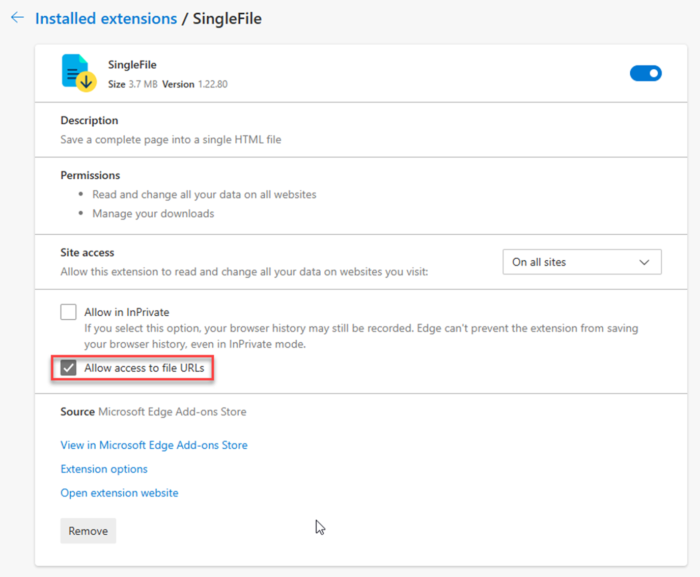
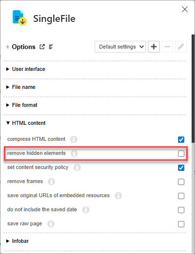

# Rule Runner User Guide

The Rule Runner is a GUI and an execution infrastructure for specially instrumented Rules, allowing, by writing such rules, to easily add various functionality to the IIQ GUI: By having the Rules define their inputs in their *Signature*, the Rule Runner is able to generate an input form and to invoke the Rule with the user's input, displaying the output generated by the Rule.

> [!IMPORTANT]
> Access to the Rule Runner
>
> The Rule Runner is not linked into any menu of the IIQ GUI. It can only be invoked by manually entering the correct URL or using a browser bookmark. The URL includes the name of the rule to invoke and has the following structure:
>
> `https://hostname/identityiq/rulerunner/rulerunner.jsf?rule=rulename`
>
> The rulename can be followed by rule arguments to have the form prefilled. Example:
>
> `https://hostname/identityiq/rulerunner/rulerunner.jsf?rule=six_thread_watcher&title=ThreadWatcher%20CorrelationModel&threadSelectorPatterns=.%20CorrelationModel`
>
> This is used by most Rule Runner bookmarks.
>
> The following [Generic Query](/spaces/OCA/pages/268671184/The+Generic+Query) can be used as an overview and a launchpad for rules:
>
> `https://hostname/identityiq/rulerunner/rulerunner.jsf?rule=six_generic_query&title=Rule+Runner+Cockpit&className=Rule&filter=name.startsWith%28+"six_"+%29+%7C%7C+name.startsWith%28+"usr"+%29&ordering=name&selector=Rule%28%29.accept%28+like%28+"name"%2C+"%5Esix_"%2C+"%5Eusr%5Ba-z0-9%5D%2B_"+%29+%29&output=link%3D%3Alink%28%2Fidentityiq%2Frulerunner%2Frulerunner.jsf%3Frule%3D%24%7Bname%7D%2C%24%7Bname%7D%29%0Adescription`
>
> The following [bookmarklet](https://en.wikipedia.org/wiki/Bookmarklet) can be used to invoke the Rule Runner for *any* rule directly by entering a rulename. The rulename input field is prefilled with the text selected on the current page, if any:
>
> |       |                                                                                                                                       |
> |:------|:--------------------------------------------------------------------------------------------------------------------------------------|
> | Title | Rule Runner                                                                                                                           |
> | URL   | javascript:void(window.open(location.origin+"/identityiq/rulerunner/rulerunner.jsf?rule="+prompt("Enter rule name", getSelection()))) |

The Rule Runner provides the following common features to all hosted Rules:

- [Title argument](#title-argument)
- [Link generation](#link-generation)
- [Background execution](#background-execution)
- [Download](#download)
- [Executing the form using the ENTER key](#executing-the-form-using-the-enter-key)
- [Additional tips](#additional-tips)
  - [Annotating output](#annotating-output)
  - [Saving output](#saving-output)
    - [Using the SingleFile browser extension](#using-the-singlefile-browser-extension)
    - [Using the Rule Runner's download feature](#using-the-rule-runner-s-download-feature)

# Title argument

Rules can optionally define a `title` input argument, which will be used for the [link](#link) and as page title. This is recommended practice. The rule is not required to handle this argument.

# Link generation

When the form is submitted, the browser's *URL line* is updated with the inputs, and a *link* encoding all inputs is generated next to the *Execute* button as a [bookmarklet](https://en.wikipedia.org/wiki/Bookmarklet).

This allows sharing, bookmarking and duplicating the filled-out form (and prevents losing the inputs in case of a browser crash, as long as the browser can restore the page URLs):

- The page URL can be copied from the URL bar into chat or email messages to share the prefilled form with other people.
- The page can be bookmarked, allowing to invoke the prefilled form on the same IIQ instance.
- The *bookmarklet link* generated next to the *Execute* button can be dragged to the browser's bookmarks. In contrast to a regular bookmark, it will work on *any* IIQ instance by taking the host from the URL field and opening a new browser tab with the prefilled form.
- To continue working in a new tab while keeping the output of the last rule execution for reference, the tab can be duplicated by either *cloning* it or by clicking on the generated link.

> [!IMPORTANT]
> There may be a maximum URL length limit imposed by certain platforms, so it may be a good idea to check that long links work before relying on them. Particularly, after pasting a link into an Email Ctrl-Click on it to see if all fields are filled correctly.

# Background execution

Rules that can require significant execution time are required to [cooperate](/spaces/OCA/pages/279282091/Writing+Rules+for+the+Rule+Runner) with the Rule Runner to stay within the 40 seconds of allowed foreground execution time. To allow for longer execution times, they can support background execution by defining a `runInBackground` boolean input argument. This argument is transparently handled by the Rule Runner with no specific action required from the rule.

If background execution is requested by the user, the rule is not executed immediately upon submitting the form, but instead the request is sent for execution to a background task executor. Upon completion, the rule's output is sent to the user by email. Up to four background executions can be active at any time (shared by all users).

> [!IMPORTANT]
> Since background execution is handled transparently by the Rule Runner without requiring the cooperation of the rule, it is possible to execute *any* rule in background. For rules that don't define the background execution control in their signature, it can be dynamically added to the rule's input form using the bookmarklet described in [Writing Rules for the Rule Runner](/spaces/OCA/pages/279282091/Writing+Rules+for+the+Rule+Runner), section *Creating an Operational Monitoring TaskDefinition*.

# Download

Rules can optionally define a `download` input argument, which allows the user to request receiving the rule output as download instead of the standard display on the Rule Runner page. This argument is transparently handled by the Rule Runner with no specific action required from the rule. (The rule may, however, use this argument also for output format selection by making it a type like *choice* instead of *boolean*.)

> [!IMPORTANT]
> Since the `download` argument is handled transparently by the Rule Runner, it is possible to request the rule output as download even for rules that do not foresee it by using the bookmarklet described [below](#below).

# Executing the form using the ENTER key

Forms can be submitted, instead of clicking the *Execute* button, by pressing *Enter* while the cursor is within a simple (that is, *non*-multiline) input field.

# Additional tips

## Annotating output

When working with the output of a rule like the [Generic Query](/spaces/OCA/pages/268671184/The+Generic+Query), it may be convenient to add marks and comments directly on the browser page. While there exist a number of ways to do that, a simple one is my following bookmarklet:

|       |                                                                                                                                                                                                                                                                                                                                                                                                                                                                                                                                                                                                                                                                                                                                                                                                                                                                                                                                                                                                                                                                                                                                                                                                                                                              |
|:------|:-------------------------------------------------------------------------------------------------------------------------------------------------------------------------------------------------------------------------------------------------------------------------------------------------------------------------------------------------------------------------------------------------------------------------------------------------------------------------------------------------------------------------------------------------------------------------------------------------------------------------------------------------------------------------------------------------------------------------------------------------------------------------------------------------------------------------------------------------------------------------------------------------------------------------------------------------------------------------------------------------------------------------------------------------------------------------------------------------------------------------------------------------------------------------------------------------------------------------------------------------------------|
| Title | Install annotator                                                                                                                                                                                                                                                                                                                                                                                                                                                                                                                                                                                                                                                                                                                                                                                                                                                                                                                                                                                                                                                                                                                                                                                                                                            |
| URL   | javascript:(function(){document.addEventListener("click", function(e) { var color = 0; if (e.shiftKey) color += 1; if (e.ctrlKey) color += 2; if (e.altKey) color += 4; if (color == 1) { var selection = window.getSelection(); var range = document.createRange(); if (e.target.className == "note") { e.target.contentEditable = "plaintext-only"; e.target.focus(); range.selectNodeContents(e.target); } else { var note = document.createElement("div"); document.body.append(note); note.className = "note"; note.textContent = "type here"; note.style.position = "absolute"; note.style.top = e.pageY + "px"; note.style.left = e.pageX + "px"; note.style.background = "#e0e0e0"; note.style.opacity = "0.6"; note.style.whiteSpace = "pre"; note.contentEditable = "plaintext-only"; note.focus(); range.selectNodeContents(note); } selection.removeAllRanges(); selection.addRange(range); } else if (color > 1) { e.target.style.background = ["lightgreen", "orange", "lightblue", "yellow", "lightgrey", ""][color - 2]; } }, true); document.addEventListener("blur", function(e) { if (e.target.className == "note") { if (e.target.textContent == "") { e.target.remove(); } else { e.target.contentEditable = "false"; } } }, true)})(); |

> [!IMPORTANT]
> You can turn your own JavaScript code into bookmarklets on this page: [JS inject · mcdlr](https://mcdlr.com/js-inject/ "https://mcdlr.com/js-inject/")

When invoked, the bookmarklet installs a function into the current page which allows to color table cells and to insert notes by mouse click. The concrete function is controlled using the *Shift*, *Ctrl* and *Alt* keys while clicking:

| Click modifiers                             | Action                                                                                                                                                                                                                                                                                                                                                                                                                                                                                                                                                                                                                                                                                          |
|:--------------------------------------------|:------------------------------------------------------------------------------------------------------------------------------------------------------------------------------------------------------------------------------------------------------------------------------------------------------------------------------------------------------------------------------------------------------------------------------------------------------------------------------------------------------------------------------------------------------------------------------------------------------------------------------------------------------------------------------------------------|
| Shift-Click                                 | Insert a note.   To edit an existing note, shift-click on it again. To delete a note, make it empty and leave it.                                                                                                                                                                                                                                                                                                                                                                                                                                                                                                                                                                           |
| Ctrl, Alt and Shift in various combinations | Add a background color to the element under the mouse pointer (typically a table cell). The modifier keys select the color:  <ul><li data-uuid="036a41df-a73d-46c2-8cf3-2d28f6ab9c33">Ctrl = green</li><li data-uuid="b7149363-00f5-420e-b01c-f562e3fe35e1">Alt = blue</li><li data-uuid="8958d677-1ace-480b-be82-32851186a10a">Shift+Ctrl = orange (complement color for green)</li><li data-uuid="0d06a588-01cf-42ac-aac8-fe593304cc24">Shift+Alt = yellow (complement color for blue)</li><li data-uuid="35f442af-f703-4d52-a313-510b0e817deb">Ctrl+Alt = grey</li></ul> To remove the background color, click with *all three* modifier keys pressed (a Shift+Ctrl+Alt click, that is). |

## Saving output

### Using the SingleFile browser extension

To save a page as a single HTML file that you can keep for later, send to others or attach to Confluence pages, I recommend the [SingleFile - Microsoft Edge Addons](https://microsoftedge.microsoft.com/addons/detail/singlefile/efnbkdcfmcmnhlkaijjjmhjjgladedno?hl=en-US) browser extension.

Important: If you want to use it to *re-save* saved pages after you have worked on them again, be sure to give it access to file URLs:

Important: If you don't uncheck, in the extension options, the *remove hidden elements* option, OrionQL `link` tooltips will not be carried over to the saved files!

### Using the Rule Runner's download feature

Since [downloads](#downloads) are handled transparently by the Rule Runner, it is possible to request the rule output as download even for rules that do not foresee it (that is, that do not define the `download` input argument). This can easily be done by adding the needed input control to the rule's form using the following bookmarklet:

|       |                                                                                                                                                                                                                                                                                                                                                                                                                                                                                                                                                                                                    |
|:------|:---------------------------------------------------------------------------------------------------------------------------------------------------------------------------------------------------------------------------------------------------------------------------------------------------------------------------------------------------------------------------------------------------------------------------------------------------------------------------------------------------------------------------------------------------------------------------------------------------|
| Title | Add download checkbox                                                                                                                                                                                                                                                                                                                                                                                                                                                                                                                                                                              |
| URL   | javascript:(function(){var argsTable = document.getElementById("arguments"); var tbody = argsTable.querySelector("tbody"); var row = document.createElement("tr"); var labelCell = document.createElement("td"); labelCell.textContent = "Download output"; row.appendChild(labelCell); row.appendChild(document.createElement("td")); var inputCell = document.createElement("td"); var checkbox = document.createElement("input"); checkbox.type = "checkbox"; checkbox.id = "argumentsForm:download"; inputCell.appendChild(checkbox); row.appendChild(inputCell); tbody.appendChild(row);})(); |
