# Thread Watcher

The Rule Runner script *six\_thread\_watcher* implements a poor man's profiler by sampling and aggregating stack snapshots for specified threads. The output allows to investigate, what these threads are doing and where they spend most of their time. It is split into the following sections:

- **Overview**: This section gives an overview of the sampling, the main part being a table with status statistics for all monitored threads and totals per thread and per status. (The RUNNABLE status column total can be used as an indicator of the overall CPU load.)
- **[Methods executing at sample time](#methods-executing-at-sample-time)**: This section shows the specific methods that were seen executing at sample time, allowing to see where the monitored thread(s) spent most of their time.
- **[Aggregated stack frame counts](#aggregated-stack-frame-counts)**: This section contains statistics about specifically selected methods, allowing to estimate their gross execution costs. (Optional section, present only if aggregated counts *are* requested)
- **[Sample details](#sample-details)**: This section contains the aggregated call stacks.

> [!IMPORTANT]
> Note that due to limitations of the Java API used by the ThreadWatcher, certain system threads are not seen by it. As of OpenJDK 11, these include:
>
> - \*CompilerThread\*
> - GC Thread\*
> - Monitor Deflation Thread
> - Service Thread
> - Sweeper Thread
> - VM Periodic Task Thread
>
> Information about these threads can be obtained only using operating system level methods, see [Alternative methods for monitoring threads (a.k.a. "Unai's method")](/spaces/OCA/pages/344779460/Alternative+methods+for+monitoring+threads+a.k.a.+Unai+s+method).

The operation of the Thread Watcher is described below.

- [Quick start for the impatient](#quick-start-for-the-impatient)
- [Input parameters](#input-parameters)
- [Basic operation parameters](#basic-operation-parameters)
  - [Selecting threads](#selecting-threads)
    - [Selecting by thread name](#selecting-by-thread-name)
    - [Selecting by stack frame](#selecting-by-stack-frame)
    - [The thread selection phase](#the-thread-selection-phase)
  - [Sampling configuration](#sampling-configuration)
    - [Sample interval](#sample-interval)
    - [Sample count](#sample-count)
- [Understanding the sampling details report](#understanding-the-sampling-details-report)
- [Advanced operating parameters](#advanced-operating-parameters)
  - [Call stack details filtering](#call-stack-details-filtering)
    - [Details suspend and resume](#details-suspend-and-resume)
    - [Plain stack frame filtering](#plain-stack-frame-filtering)
    - [The "Methods executing at sample time" output section](#the-methods-executing-at-sample-time-output-section)
  - [Aggregation](#aggregation)

# Quick start for the impatient

Fire up the [Thread Watcher](https://identitiq.localdomain.com/identityiq/rulerunner/rulerunner.jsf?rule=six_thread_watcher) without making any inputs to see what insights it can give you. If you see fit, [customize](#customize) the [output](#output), [select specific threads](#select-specific-threads) or [add statistics for methods of interest](#add-statistics-for-methods-of-interest). Note that you can instruct the Thread Watcher to [hunt for specific events](#hunt-for-specific-events). Customize the [sampling parameters](#sampling-parameters) if necessary.

# Input parameters

The Thread Watcher accepts the input fields shown in the table below. Sending this form without any input will quickly - within 3-4 seconds - return an overview about what all the threads in the JVM are doing at the moment,

| Field name                                    | Explanation                                                                                                                                                                                                                   |
|:----------------------------------------------|:------------------------------------------------------------------------------------------------------------------------------------------------------------------------------------------------------------------------------|
| Title                                         | Optional descriptive title for the capture executed upon submitting this form, will be set as the tab title and used when bookmarking                                                                                         |
| [Thread selector](#thread-selector)           | Optional specification which thread(s) to monitor (Default: all threads). The selection can be made by *thread name* and/or *stack frame label*, by specifying one or two regular expressions separated by a blank character. |
| [Sample interval](#sample-interval)           | Override the wait interval in milliseconds between snapshots. Default: 20 <br/> This parameter is also used for the thread selection phase.                                                                                   |
| [Sample count](#sample-count)                 | Override the number of samples to capture. Default: 100 <br/> This parameter is also used for the thread selection phase.                                                                                                     |
| [Aggregation selector](#aggregation-selector) | Optional regular expression to select stack frames to collect aggregated results for                                                                                                                                          |
| [Suspend filter](#suspend-filter)             | Optional regular expression to select stack frames for which details should be suppressed                                                                                                                                     |
| [Resume filter](#resume-filter)               | Optional regular expression to select stack frames for which details should be re-enabled                                                                                                                                     |

All the parameters are explained in more detail below. We will split the discussion into two parts, taking a detour after discussing the basic parameters to explain the capture output as a basis for understanding the remaining more advanced parameters.

# Basic operation parameters

## Selecting threads

The *Thread selector* field determines which threads to monitor. Without an input, *all* threads are monitored. To select specific threads, one or two regular expressions, separated by a blank character, can be entered to perform thread selection by *thread name* and/or *stack frame label* as discussed below.

### Selecting by thread name

If the names of the thread(s) to monitor are known, a suitable regular expression can be entered in the *Thread selector* field. Most often this will be a simple string, letting the Thread Watcher search for it in the thread name. Example:

```
exec
```

This will select all threads containing *exec* in their name, like *http-nio-127.0.0.1-8080-exec-1*.

> [!IMPORTANT]
> Despite this *looks* like a substring search, don't forget that any special characters you enter here will be interpreted according to regular expression syntax. Unless you are familiar with the latter, the safest approach is to avoid any character that is not a letter, digit, dot, hyphen or underscore (the dot matching *any* character instead of only a dot, however).
>
> Note also that you cannot specify a blank character in the search pattern, since a blank character will separate the name pattern from the stack frame pattern (see below). Use \s instead.

To select by *multiple* name patterns, you can make use of the regular expression syntax, concatenating the patterns with pipe symbols:

```
exec|pool
```

### Selecting by stack frame

If the name of the thread is not known, the Thread Watcher can be instructed to search for threads by examining the stacks of *all* or *selected* threads, looking for specific stack frames that would identify the thread(s) of interest. This not only helps to avoid manual work but is also the *only* way to capture short-time thread executions (an HTTP thread picking up a request, for instance). We will look at this in the next section.

Since the stack frame labels, as they appear in the output, are made up of class name, method name, source file name and line number, all this can be used for selection. To monitor, for instance, an aggregation, a viable approach would be to select all threads that contain a stack frame referring to the class `sailpoint.api.Aggregator`:

```
. sailpoint.api.Aggregator
```

> [!IMPORTANT]
> Note the dot in front of the stack frame selector: Even if you don't do a selection by thread name, you *have* to provide a regular expression for the thread name selection, since the *only* way to tell the Thread Watcher that there is a selection on stack frame is giving it *two* regular expressions. A convenient approach is to use a dot here, causing the stack snapshots of *all* threads to be examined. Using a more specific selection is possible but in most cases probably not be worth the effort:
>
> ```
> QuartzScheduler_Worker sailpoint.api.Aggregator
> ```

Like for the thread name selectors, note also for the stack frame selectors that, despite *looking* like substring searches, they are in fact regular expressions.

### The thread selection phase

What was explained up to here is all you need to know about thread selection as long as the thread to monitor is already active at the time the Thread Watcher is launched. When this is not the case, you need to be aware of the *thread selection phase*.

The thread selection phase is run before the capture phase and determines the threads to watch. For this, the Thread Watcher continually takes stack snapshots and examines them against the *Thread selector* specification. As soon as it finds at least one thread matching the selector, it stops and switches to the capturing phase. If no matching thread was found, the thread selection fails.

> [!IMPORTANT]
> To keep the input form simple, the thread selection phase reuses the [sampling configuration](#sampling-configuration) of the capture phase. This is a compromise and needs to be taken into account when making use of the thread selection phase, so the sampling configuration can serve both phases.

## Sampling configuration

The following two parameters control the [thread selection phase](#thread-selection-phase) (if used) and the capture phase, determining how many samples to capture and in which interval. Multiplying the two values gives an estimate for the overall length of the capture interval. (The default values amount to two seconds without considering processing time.)

### Sample interval

This parameter specifies the wait time in milliseconds between captures. The default is 20.

> [!IMPORTANT]
> Note that the effective interval between the captures will be larger than the specified wait time due to the sample processing time (no compensation is made). The gross time spent on capturing is reported in the output, so you can compensate for the processing time if needed.

### Sample count

This parameter specifies how many samples to capture from the selected threads. The default is 100.

When this parameter is reused for the thread selection phase, it specifies the *maximum* number of samples that the Thread Watcher will try searching for a thread that matches the selector. (As a result, the thread selection phase will last no longer that the capture phase. You will need to stretch the capture phase if the selection phase would be too short otherwise.)

# Understanding the sampling details report

From the sampled stack snapshots, the Thread Watcher creates - for every thread - an *aggregated call tree* by overlaying all call chains into a *single* aggregate by matching their common parts, and counting how often the thread was seen in each stack configuration (separately per thread state). This may sound complicated but is indeed quite forward to understand when looking at the examples below.

Before going into the details, let's state the general rule how to interpret the sample details:

> [!IMPORTANT]
> General rule for reading call trees
>
> Each stack frame that is *not* a simple call-through to a lower stack frame is represented by an own indented section enclosed in curly braces that contains the details of its execution:
>
> - the number of times the thread was encountered directly in this stack frame (separately for each thread state)
> - the call trees originating from this stack frame, recursively

To warm up, let's start with the simplest possible case of a thread doing nothing, resulting in it being seen always hanging at the same stack frame. The call tree degenerates into a linear chain in such a case, and there is only a single details section - for the method that was executing each time:

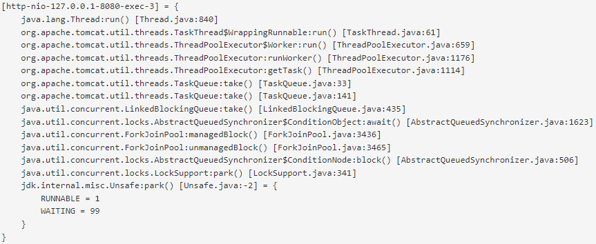

As the screenshot shows, this thread was encountered 100 times at the `Unsafe.park()` method, which was always reached by the same 13 methods deep call chain starting at the top level `Thread.run()` method. From the overall 100 samples, the thread was seen once in the `RUNNABLE` state, and the other 99 times in the `WAITING` state.

(BTW, the `Unsafe.park()`'s line number -2 probably indicates that the thread is waiting on a synchronized method.)

> [!IMPORTANT]
> Note that despite the similarity with Java stack traces, the Thread Watcher shows the methods in the order they call each other. This is in contrast to the familiar stack trace format that - for legitimate reasons - turns the call chain upside down, showing the top level method at the bottom (if at all) and the currently executing one at the top. So don't be confused.

In the case of a thread doing real work, the aggregation generally results in a tree. The following screenshot shows part of a thread's call tree - the start of the call chain (which is in most cases the `Thread.run()` method) is outside the screenshot. We will discuss how to interpret the recursive structure of the output by using the highlighted stack frame as an example:

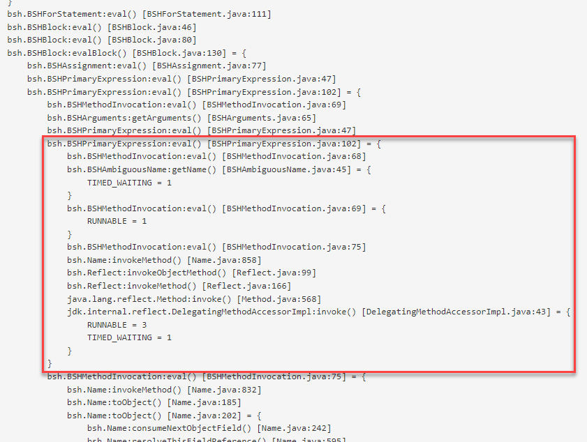

The highlighted part shows the captured execution details for the method `BSHPrimaryExpression.eval()` when it was invoked at this specific stack location.

The execution details for this `BSHPrimaryExpression.eval()` call show three call trees originating from there (actually, they are all *linear* call chains). Each of them starts with the same call to `BSHMethodInvocation.eval()` (which is trapped executing different lines, however).

> [!IMPORTANT]
> Note the recursive call to `BSHPrimaryExpression.eval()` - this method is already present on the second line of the screenshot.

The `DelegatingMethodAccessorImpl.invoke()` call at the bottom of the highlighted section was encountered having the thread in two different states, so there are two entries in its section. It is also possible that a method was sampled executing directly as well as in calls to other methods. The following screenshot shows an example:

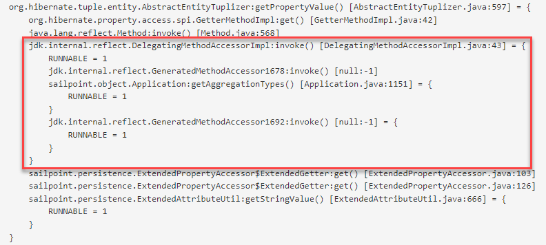

Having understood what the Thread Watcher's output shows, we are prepared for discussing the ways how to modify it.

# Advanced operating parameters

Sampling the execution of real code can collect a huge amount of data that makes analysis different. The primary symptom of this is the call trees becoming hundreds or even thousands of lines long by showing lots of framework execution details that effectively hide what we want to see:

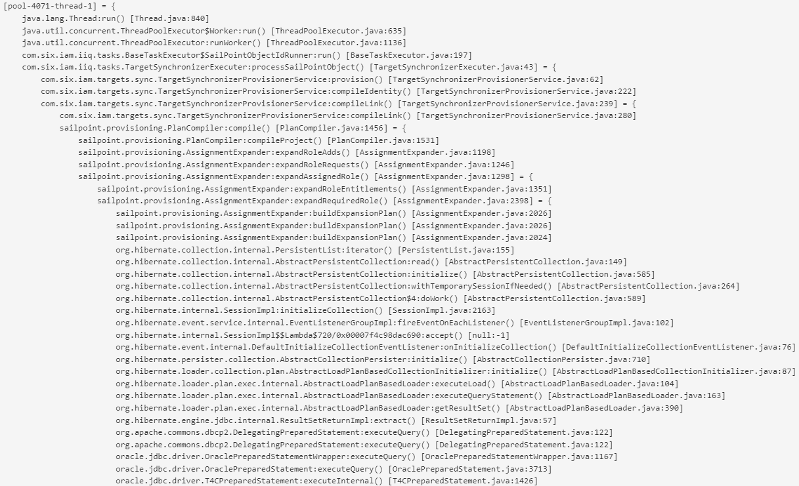

To reduce the information to the interesting part, the Thread Watcher provides two mechanisms - filtering and aggregation.

## Call stack details filtering

Call stack filtering comes in two flavors:

1. Suspending and resuming details reporting
2. Plain stack frame filtering

The second flavor is in fact achieved merely by a special combination of the suspend/resume parameters used by the first flavor, but since the resulting behavior is so distinct from the first one, it's justified to talk about it separately.

### Details suspend and resume

The simplest way to reduce output is by suppressing details below selected stack frames (that is, *method calls*). This is what the *Suspend filter* does. Looking at the above screenshot you might, for instance, decide that the details of hibernate are not of interest, so you want to suppress them. This can easily be done by specifying a *Suspend filter*:

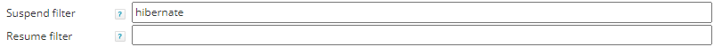

The result will be that for stack frames containing "hibernate" no more details will be shown in the output. It effectively turns these stack frames into terminal sections of the call tree, showing nothing more than an aggregated count for the stack frame and all stack frames below it.

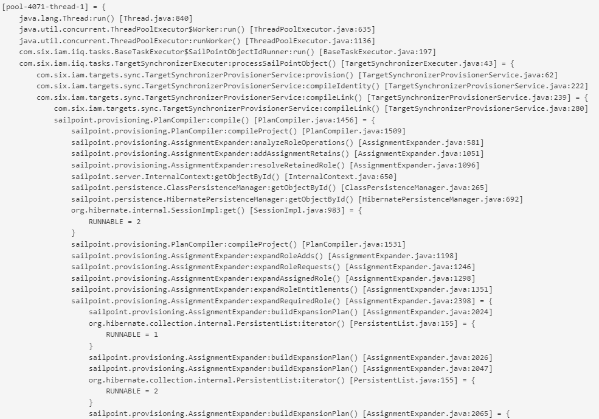

The reason why this mechanism is called *suspend* is that often frameworks call back into application code, and it should be possible to *reactivate* details reporting then. To achieve this, the stack frame processing is not *stopped* after encountering a stack frame that triggers the *Suspend filter*, but continues - only with details reporting inhibited. As soon as a stack frame triggers the *Resume filter*, details reporting is again turned on. The following setting suppresses detail reporting for JDK and org\* framework calls but resumes it as soon as a call to sailpoint or six code is encountered down the call chain:

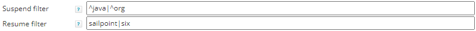

In place of the suppressed stack frames, the output now only shows how many stack frames were suppressed. In this case, it was Sailpoint code that was invoked from Hibernate:

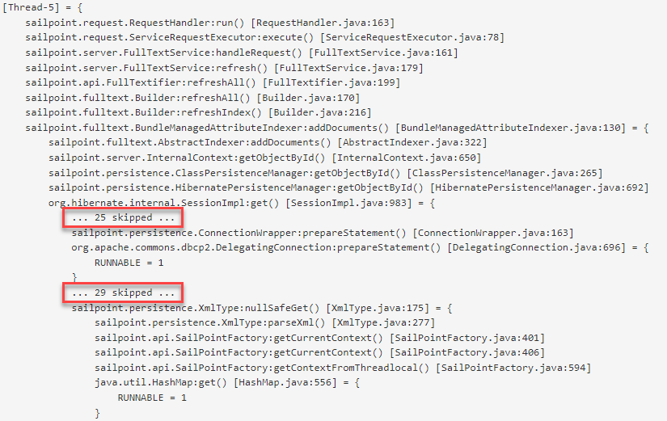

Note that neither for the `DelegatingConnection.prepareStatement()` call, nor for the `HashMap.get()` call there are any details reported. They did not call any of the code we were interested in.

> [!IMPORTANT]
> Note that we anchored the *java* and *org* regular expressions to the start of the stack frame label to prevent them matching at some undesired location. (In fact, *java* would be found in almost any stack frame label as part of the file name!)

From the reporting point of view, the `... n skipped ...` entries are treated like virtual stack frames, so they can have detail sections on their own containing several call trees like in the following screenshot. This, however, does not necessarily mean that the call chains the virtual stack frame represents are identical. They are guaranteed only to be of identical *depth*:

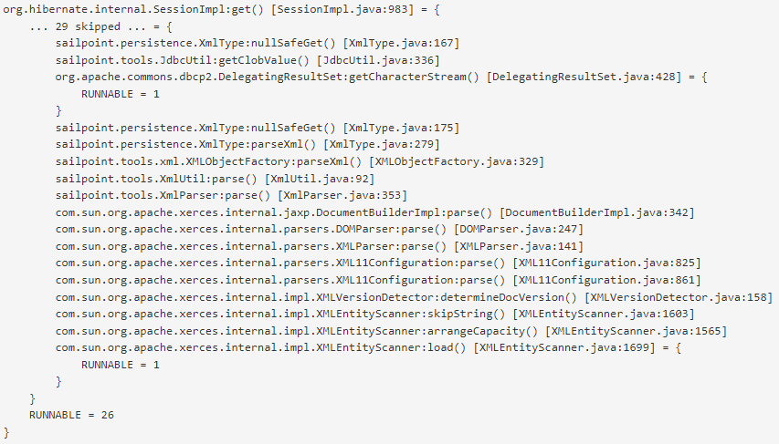

### Plain stack frame filtering

While the suspend/resume mechanism offers ultimate flexibility to tailor the output, especially in easy cases it may be unnecessary complex to configure, and a plain stack frame filtering comes more handy. This can easily be achiebed by exploiting the fact that the suspend pattern is always checked last, causing suspend to be turned on even if the same stack frame just triggered a resume. So, by setting a suspend filter that matches *every* stack frame, the output can be restricted to the stack frames that satisfy the *Resume filter*, what effectively turns it into a plain filter:

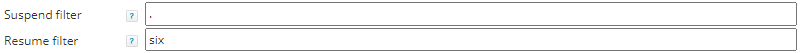

As a result, after the top level stack frame, only *six* stack frames will be shown:

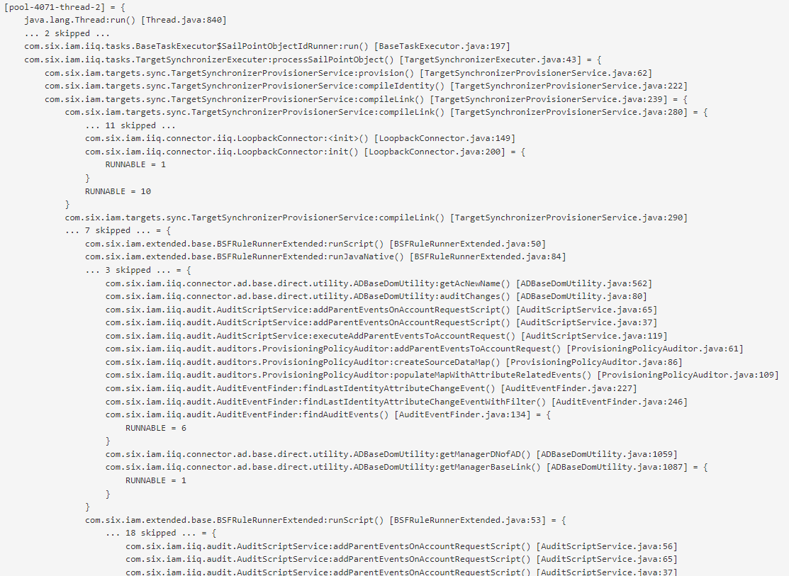

### The "Methods executing at sample time" output section

Suppressing sample details in the output using the methods described above results in the output no more showing which method was *effectively* executing at sample time. This information, however, may be important to diagnose certain problems. To mitigate this, the Thread Watcher output contains a section "Methods executing at sample time" that shows which stack frames were at the bottom of the call chains at sample time.

## Aggregation

Due to the fact that the counts in the sample details section are always reported at the deepest detail level (according to [details filtering](#details-filtering)), statistics for higher level methods would have to be manually be computed by summing up all counts from underneath the respective stack frame. However, aggregated statistics can be requested by entering a regular expression into the *Aggregation selector* field. This will cause aggregated counts to be computed for the selected stack frames, and a new section will appear in the output to show them. These aggregated counts can be used to compute the gross execution costs of the respective method calls.

The following statistics were computed using the selector *six* and show, for each encountered six method, the number of samples (from all monitored threads) in which it was present on the call stack (meaning the method itself or some method it has called were being in execution):

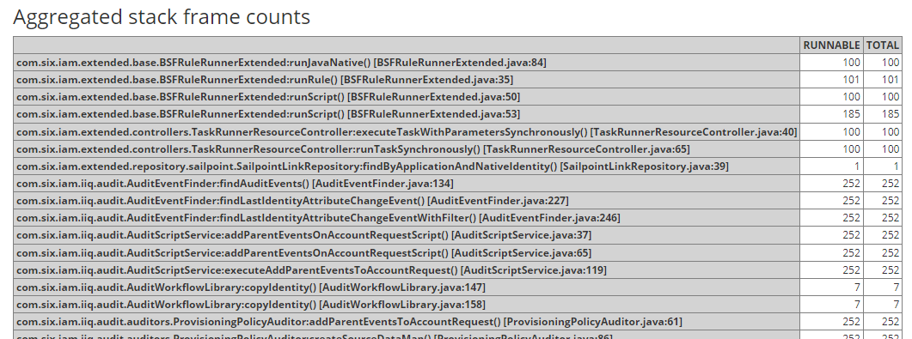

> [!IMPORTANT]
> Note that due to the overlapping counts resulting from the selected methods calling each other, the column TOTALs in this table are normally useless. The row totals, however, *can* be used - relating them to the total sample count (given in the lower right corner of the *Overview* table).

If the call stacks contain recursive method calls (that is, the same stack frame label occurs multiple times in a call chain), the recursive calls are marked with asterisks. The following statistics were computed with the selector *toXml*, showing that this method called itself recursively up to three times (if *directly* or *indirectly* cannot be told from the statistics alone but only from the sample details output):

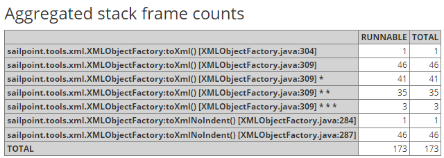

For correct results, to compute the gross execution costs of recursive methods, only the unmarked lines should be taken into account.
