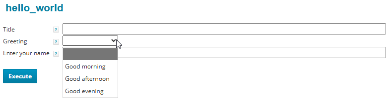
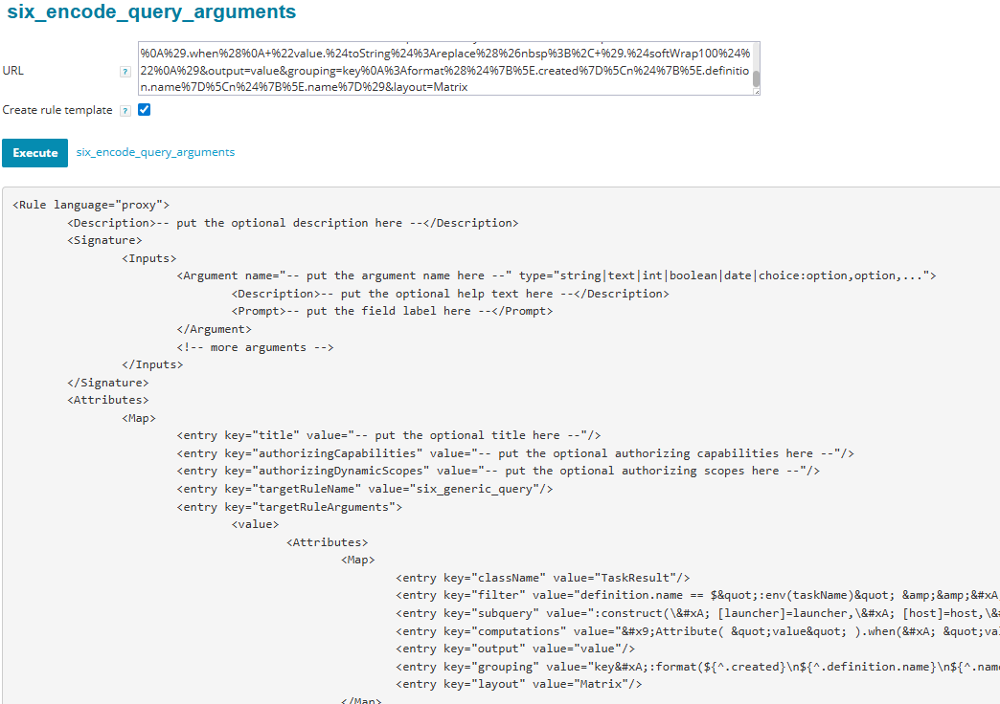
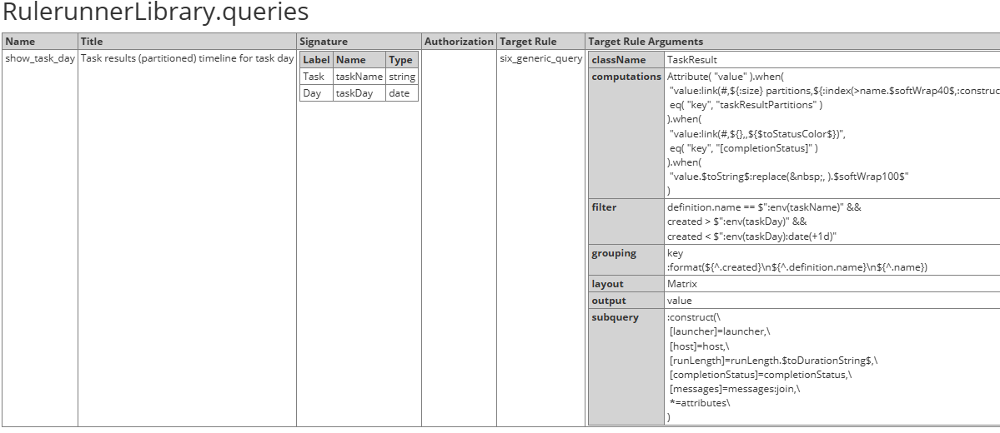
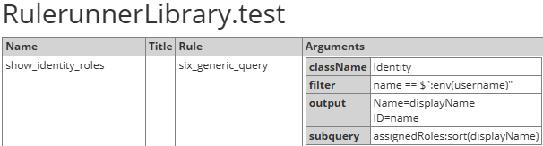
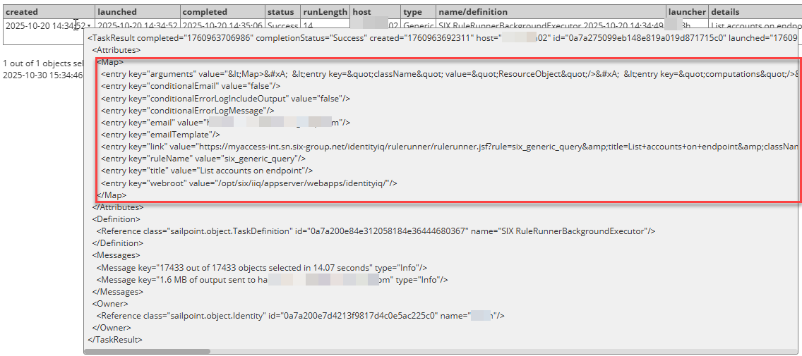
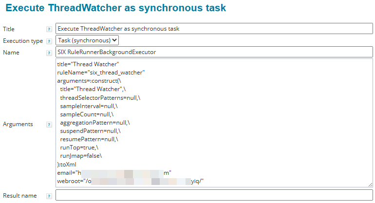
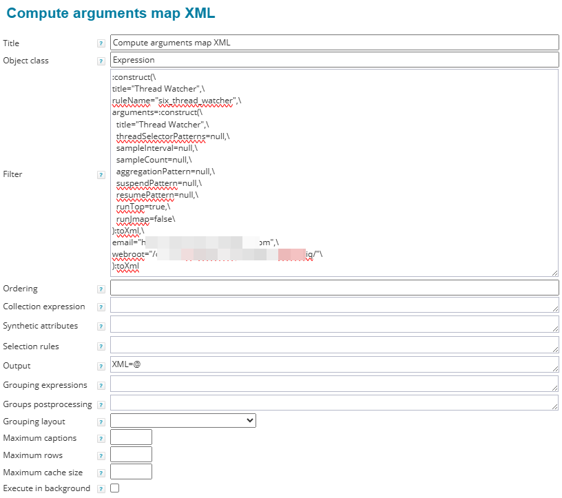

# Writing Rules for the Rule Runner

- [Overview](#overview)
- [Defining the rule signature](#defining-the-rule-signature)
  - [Rule Runner metaparameters](#rule-runner-metaparameters)
- [Using the rulerunnerOutput object](#using-the-rulerunneroutput-object)
  - [Writing output](#writing-output)
  - [Adding messages](#adding-messages)
  - [Controlling rule execution](#controlling-rule-execution)
- [The rulerunnerEnvironment](#the-rulerunnerenvironment)
- [Additional rule attributes and URL parameters](#additional-rule-attributes-and-url-parameters)
- [Implementing rules in Java](#implementing-rules-in-java)
- [Proxy Rules](#proxy-rules)
  - [Purpose](#purpose)
  - [Concept](#concept)
  - [Defining target rule arguments using the targetRuleArguments map](#defining-target-rule-arguments-using-the-targetrulearguments-map)
  - [Defining target rule arguments using CerberusLogic rules](#defining-target-rule-arguments-using-cerberuslogic-rules)
  - [Immediate and background execution](#immediate-and-background-execution)
  - [Tool support and recommended procedure for creating proxy rules](#tool-support-and-recommended-procedure-for-creating-proxy-rules)
    - [Recovering the encoded query](#recovering-the-encoded-query)
- [Rule Libraries](#rule-libraries)
- [Writing data source rules for the Generic Query](#writing-data-source-rules-for-the-generic-query)
- [Writing rules for Operational Monitoring](#writing-rules-for-operational-monitoring)
  - [Using the Generic Query for Operational Monitoring](#using-the-generic-query-for-operational-monitoring)
  - [Creating an Operational Monitoring TaskDefinition](#creating-an-operational-monitoring-taskdefinition)
- [Rule Runner authorization](#rule-runner-authorization)

# Overview

The Rule Runner provides a platform for running rules from the IIQ GUI and display their output. Enabling a rule to be used from the Rule Runner requires two steps:

1. Defining the rule arguments in a `<Signature>` element.  
   The Rule Runner will use these definitions to render an input form and on submit will provide the user input to the rule as *arguments*.
2. Having the rule write its output to the `rulerunnerOutput` object that is given to it by the Rule Runner.  
   The Rule Runner will transfer the output back to the Rule Runner form in the user's browser for display.

These steps will be explained in more detail in the first two sections of this document. For an upfront impression on how to enable rules to be executed on the Rule Runner platform, see the following *HelloWorld* example:

```xml
<Rule language="beanshell" name="hello_world">
    <Description>Demo rule</Description>
    <Signature>
        <Inputs>
            <Argument name="title" type="string">
                <Description>Descriptive name for the action performed upon submitting this form (metaparameter)</Description>
                <Prompt>Title</Prompt>
            </Argument>
            <Argument name="greeting" type="choice:,Good morning,Good afternoon,Good evening">
                <Description>Choose an alternative greeting</Description>
                <Prompt>Greeting</Prompt>
            </Argument>
            <Argument name="name" type="string">
                <Description>Enter the name which you want to be greeted with</Description>
                <Prompt>Enter your name</Prompt>
            </Argument>
        </Inputs>
    </Signature>
    <Source><![CDATA[
if (name.isEmpty())
{
    rulerunnerOutput.addError("Please enter a name and try again");
}
else
{
    rulerunnerOutput.printNoEscape("<h3>");
    rulerunnerOutput.print("%s %s!", (greeting == null) ? "Hello" : greeting, name);
    rulerunnerOutput.printNoEscape("</h3>");
    rulerunnerOutput.addMessage("Greeting took %.03f seconds", rulerunnerOutput.getDuration());
}
]]></Source>
</Rule>
```

When it is invoked for this rule, the Rule Runner will render the following form:



In addition to interactive use, rules can also be enabled to be used for [operational monitoring](#operational-monitoring) and as [data sources](#data-sources) for the [Generic Query](/spaces/OCA/pages/268671184/The+Generic+Query). Defining [authorization](/spaces/OCA/pages/279284142/Rule+Runner+Authorization) allows the rules to be invoked without SystemAdministrator privileges.

# Defining the rule signature

The rule arguments are defined in the Rule XML in a `<Signature>` element as known from IIQ:

```xml
	<Signature>
		<Inputs>
			<Argument name="someArgument" type="string">
				<Description>This is the help popup text</Description>
				<Prompt>This is the field label</Prompt>
			</Argument>
		</Inputs>
	</Signature>
```

From the signature, the Rule Runner generates the input form presented to the user to execute the rule. The following argument types are available:

| Type                                                                                                                                    | Rendered as                | Provided to the rule as type   | Value provided to the rule if the field was left empty                                                                                      |
|:----------------------------------------------------------------------------------------------------------------------------------------|:---------------------------|:-------------------------------|:--------------------------------------------------------------------------------------------------------------------------------------------|
| string                                                                                                                                  | text input field           | String                         | empty string <br/><br/>> [!IMPORTANT] In executions other than from the Rule Runner GUI, the argument may also be provided as `null`. <br/> |
| text                                                                                                                                    | multiline text input field | String                         | empty string <br/><br/>> [!IMPORTANT] In executions other than from the Rule Runner GUI, the argument may also be provided as `null`. <br/> |
| int                                                                                                                                     | text input field           | Integer                        | `null`                                                                                                                                      |
| boolean                                                                                                                                 | checkbox                   | Boolean                        | *n/a* <br/><br/>> [!IMPORTANT] In executions other than from the Rule Runner GUI, the argument may also be provided as `null`. <br/>        |
| date <br/> The input is expected in the format yyyy[-MM[-dd[ HH[:mm[:ss[.SSS]]]]]]                                                      | text input field           | Date                           | `null`                                                                                                                                      |
| choice:*option*,*option*,... <br/> Options can use a value=label syntax to display a different label to the user than the option value. | dropdown selector field    | String                         | `null`                                                                                                                                      |

When the filled-out form is submitted, all arguments defined in the signature are populated with the user's input (which may be empty) and provided to the rule.

## Rule Runner metaparameters

Rules can define the following arguments that are recognized by the Rule Runner. They need not consume the inputs themselves if they don't need them for their work:

| Name            | Type                  | Description                                                                                                                                                                                                                                                                                                                                                                                                                                                                                                                                                                                                           |
|:----------------|:----------------------|:----------------------------------------------------------------------------------------------------------------------------------------------------------------------------------------------------------------------------------------------------------------------------------------------------------------------------------------------------------------------------------------------------------------------------------------------------------------------------------------------------------------------------------------------------------------------------------------------------------------------|
| title           | string                | Gives a descriptive name to the action executed upon submitting this form. The Rule Runner uses this value as follows: <br/><ul><li data-uuid="c03b2b65-c7f3-4944-9c76-ebe503df7fcd">by setting it as the title of the browser tab, so it can be identified more easily</li><li data-uuid="2d804758-14b1-4fe8-82c2-828903ab372c">by using it as the link text for the generated links</li><li data-uuid="6d5219c1-ac2b-4b21-9c42-6508a6aa59ee">by using it for the file name when the rule output is returned as download or email</li></ul> If no title is given, the rule name will be used for the above purposes. |
| download        | boolean or other type | Causes the rule output to be returned to the browser as download instead of inline display if the value is either boolean `true` or a non-empty value of a different type. The latter can be used by rules to double-use the argument for specifying more download details, such as the file format (using e.g. an input of type `choice`).                                                                                                                                                                                                                                                                           |
| runInBackground | boolean               | Causes the rule to be executed as background task. When executed in background, no execution time limit is applied and the output size limit is lifted from 16 MB to 256 MB. (Note that the rule needs to [cooperate](#cooperate) to stop execution when requested.)                                                                                                                                                                                                                                                                                                                                                  |

> [!IMPORTANT]
> I call these arguments *meta*parameters since they give the Rule Runner information *about* the rule execution rather than giving input to the rule *itself*.

# Using the `rulerunnerOutput` object

When executing a rule, the Rule Runner provides it, besides its arguments as defined in the [signature](#signature), the obligatory `context` and two Rule Runner specific arguments – the `rulerunnerOutput` object and the `[rulerunnerEnvironment](#rulerunnerenvironment)` map. The primary purpose of the `rulerunnerOutput` object is to carry over the rule's output to the output pane of the Rule Runner page.

To fulfil this function, the `rulerunnerOutput` object is a `java.io.OutputStream`, enhanced with Rule Runner specific methods to make life easier to the rule authors. The additional methods are described in the following subsections.

## Writing output

The rulerunnerOutput object can be used directly as a `java.io.OutputStream`, using the methods provided by the JDK. Particularly, it can be given directly to Objects like `TabularData` to do their output. For use by rules, however, the following convenience methods have been added:

> [!IMPORTANT]
> When using the `OutputStream`'s native `write()` methods, keep in mind that you are required to write *valid HTML* and therefore to correctly escape what needs to be escaped.

| Method                                                                           | Description                                                                                                                                                                                                                                                              |
|:---------------------------------------------------------------------------------|:-------------------------------------------------------------------------------------------------------------------------------------------------------------------------------------------------------------------------------------------------------------------------|
| <br/>```<br/>public void print(String text, Object... args)<br/>```<br/>         | Writes `text` to the rule output with correct HTML escaping, optionally formatting-in the supplied `args` (see the JDK `String.format()` method). <br/> Note that no newline is implicitly written, similar to the behavior of `java.io.PrintStream`.                    |
| <br/>```<br/>public void printNoEscape(String text, Object... args)<br/>```<br/> | This is a variant of the above `print()` method that does *no* HTML escaping and therefore can be used to write HTML constructs.                                                                                                                                         |
| <br/>```<br/>public void setMimeType(String mimeType)<br/>```<br/>               | Sets the mime type of the output (Default: text/html). This needs to be done before doing any output. <br/> The mime type is used when the output needs to be converted into a file (for download or sending as mail attachment) and to control `print()` HTML escaping. |

## Adding messages

To provide messages about the rule execution to the user, the following methods are provided. All messages are collected and will be added to the end of the output after the rule finishes execution. This is a HTML-only feature, however when rules are executed in the background, the messages will be visible in the TaskResult.

| Method                                                                                             | Description                                                                                                                          |
|:---------------------------------------------------------------------------------------------------|:-------------------------------------------------------------------------------------------------------------------------------------|
| <br/>```<br/>public void addMessage(String message, Object... args)<br/>```<br/>                   | Add `message` to the output, optionally formatting-in the supplied `args` (see the JDK `String.format()` method).                    |
| <br/>```<br/>public void addError(String message, Object... args)<br/>```<br/>                     | Add `message` to the output with class *error*, optionally formatting-in the supplied `args` (see the JDK `String.format()` method). |
| <br/>```<br/>public void addError(Throwable exception)<br/>```<br/>                                | Convenience method to log an exception as error message                                                                              |
| <br/>```<br/>public void addMessage(boolean isErrror, String message, Object... args)<br/>```<br/> | Convenience method that invokes either `addMessage()` or `addError()` depending on the value of the first parameter                  |

## Controlling rule execution

The Rule Runner provides an infrastructure to control rule execution:

- **Monitoring execution time:** Monitoring rule execution time allows to:
  1. provide this information to the user in the output
  2. abort execution when the Rule Runner's allowed foreground execution time is exhausted
- **Handling termination requests:** When long-running rules are executed in the background as tasks, user requests for task termination must be respected. (This requires the cooperation of the rule.)

The following methods are provided:

| Method                                                                                      | Description                                                                                                                                                                                                                                                                                                                                                                                                                                                                                                                                                                                                                                                                                                                                                                                                                                                                                                                                                                            |
|:--------------------------------------------------------------------------------------------|:---------------------------------------------------------------------------------------------------------------------------------------------------------------------------------------------------------------------------------------------------------------------------------------------------------------------------------------------------------------------------------------------------------------------------------------------------------------------------------------------------------------------------------------------------------------------------------------------------------------------------------------------------------------------------------------------------------------------------------------------------------------------------------------------------------------------------------------------------------------------------------------------------------------------------------------------------------------------------------------|
| <br/>```<br/>public void startTimeMonitoring()<br/>```<br/>                                 | Resets the clock, at the same time disabling the Rule Runner's default *execution time reporting* by indicating to it that the rule is monitoring and reporting its time,                                                                                                                                                                                                                                                                                                                                                                                                                                                                                                                                                                                                                                                                                                                                                                                                              |
| <br/>```<br/>public boolean isTerminationRequested(boolean allowTimeExtension)<br/>```<br/> | Checks if the rule should terminate its execution. This may be requested in the following cases: <br/><ol><li data-uuid="d376c8d0-1fd6-4230-9d73-733609e3e23f">The rule is executing in the foreground and has reached the time limit. The <code>allowTimeExtension</code> parameter may be set to <code>true</code> to ask for a 10 seconds time extension. (This works only once and is intended to handle situations where the execution time was exhausted already on the first iteration of the rule's main loop.)</li><li data-uuid="cd9e8f2e-f1ed-4f0f-990c-611c82c573d4">The rule is executing in the background and task termination was requested by the operator.</li><li data-uuid="98e5e13e-1e1d-4869-9b8f-8a91bd0ac1b9">The rule has exceeded the maximum allowed output size.</li></ol> Rules that may execute for longer than a few seconds or can produce unpredictable amount of output should call this method regularly and finish execution if it returns `true`. |
| <br/>```<br/>public double getDuration()<br/>```<br/>                                       | Returns the rule execution time, at the same time disabling the Rule Runner's default *execution time reporting* by indicating to it that the rule is reporting its time,                                                                                                                                                                                                                                                                                                                                                                                                                                                                                                                                                                                                                                                                                                                                                                                                              |

# The `rulerunnerEnvironment`

When executing a rule, the Rule Runner provides it, besides its arguments as defined in the [signature](#signature), the obligatory `context` and two Rule Runner specific arguments – the `[rulerunnerOutput](#rulerunneroutput)` object and the `rulerunnerEnvironment` map. The `rulerunnerEnvironment` map provides the rule with information about the context it is running in:

- `baseurl` – the base URL of the Rule Runner page
- `hostname` – the hostname of the application server that is executing the rule
- `username` – the name of the Identity that submitted the rule form for execution

In addition, if the rule has been invoked by a [proxy rule](#proxy-rule), the `rulerunnerEnvironment` map contains also all arguments of the proxy rule.

# Additional rule attributes and URL parameters

The Rule Runner recognizes the following optional rule attributes:

- `title` – title to use for the rule's input form instead of the rule name, can be overridden by URL parameter
- `authorizingCapabilities` and `authorizingScopes` – [grant access](/spaces/OCA/pages/279284142/Rule+Runner+Authorization) to the rule to users without *SystemAdministator* privileges
- `runInBackground` – by setting this attribute to `true`, rules can set their execution mode to background unconditionally (they should not have a `runInBackground` input control in their signature in this case)
- `runImmediate` (for proxy rules only) – setting this attribute to `true` requests immediate rule execution upon loading the form without displaying it, setting it to `false` prevents requesting immediate execution via the URL parameter `runImmediate=on`

# Implementing rules in Java

For large rules, Beanshell is not an ideal implementation language. To support the implementation of rules directly in Java, the Rule Runner recognizes a special rule *language* `javanative`.

For `javanative` rules, the rule `source` specifies the Java class that implements the rule, optionally followed by a colon and the method name if the method is not `execute()`:

`qualified_class_name[:methodName]`

The method that implements the rule needs to take a single argument of type `sailpoint.object.JavaRuleContext`. While not specifically required by the Rule Runner, it is good practice to declare the implementing class as `implements JavaRuleExecutor`, what will at the same time request the implementation of the `execute()` method with the correct signature.

Example *javanative* rule definition ([Generic Query](/spaces/OCA/pages/268671184/The+Generic+Query)):

```xml
<Rule language="javanative" name="six_generic_query">
	<Description>The Swiss Army knife of the IIQ operator</Description>
	<Signature>
		<Inputs>
			<Argument name="title" type="string">
				<Description>Descriptive name for the query executed upon submitting this form (metaparameter)</Description>
				<Prompt>Title</Prompt>
			</Argument>
			...
			<Argument name="runInBackground" type="boolean">
				<Description>Enable for long-running queries to get the result sent by email</Description>
				<Prompt>Execute in background</Prompt>
			</Argument>
		</Inputs>
	</Signature>
	<Source>com.six.iam.iiq.rulerunner.rules.GenericQuery</Source>
</Rule>
```

The following code sample, also taken from the [Generic Query](/spaces/OCA/pages/268671184/The+Generic+Query), illustrates the common implementation pattern:

```java
public class GenericQuery implements JavaRuleExecutor
{
    public Object execute(JavaRuleContext ruleContext) throws Exception
	{
		var context = ruleContext.getContext();
		var arguments = ruleContext.getArguments();
		var rulerunnerOutput = (RuleRunnerBean.RuleRunnerOutput) arguments.get("rulerunnerOutput");
		var rulerunnerEnvironment = (Map<String, Object>) arguments.get("rulerunnerEnvironment");
		var className = arguments.getString("className");
        ...
        return ...
    }
}
```

# Proxy Rules

## Purpose

Rules written for the Rule Runner may be very technical and complex to use, or it might be even dangerous to give them to users. At the same time, they might be a good platform for quickly implementing functionality that is of value to users. An example is the [Generic Query](/spaces/OCA/pages/268671184/The+Generic+Query), which requires deep knowledge for creating queries, while some of the queries are interesting for users. This is where Rule Runner *Proxy Rules* come in.

> [!IMPORTANT]
> An important aspect here is that proxy rules, by defining their own authorization, can be used to permit the execution of higher privileged rules with trusted arguments and verified input. In conjunction with this, proxy rules limit the error details displayed to the user.

The second, and possibly even more important application of proxy rules is *linking to preconfigured Rule Runner invocations*. The main target here is, again, the [Generic Query](/spaces/OCA/pages/268671184/The+Generic+Query): By storing *prefabricated* queries as proxy rules, they can be referenced from other queries without embedding the target query into the referencing query. (This wouldn't be a generally viable approach anyway.)

> [!IMPORTANT]
> Another valuable aspect of proxy rules is that they provide a natural way to put preconfigured Rule Runner invocations (most importantly *Generic Queries*), which would otherwise live as URLs stored in browser bookmarks, Confluence pages and other random locations, under version control.

## Concept

Rule Runner *Proxy Rules* allow store *predefined rule invocations* with *customized input forms* as rules.

> [!IMPORTANT]
> Storing proxy rules
>
> While it is possible to store proxy rules as normal rules, it is recommended to store them exclusively in [Rule Libraries](#rule-libraries).

The concept of proxy rules is very simple:

A *Proxy Rule* is a rule that defines, like any rule runner rule, an [input signature](#input-signature) and [authorization](/spaces/OCA/pages/279284142/Rule+Runner+Authorization), but does not implement the functionality itself – instead it delegates the execution to a *target rule*.

When executing a proxy rule, the Rule Runner evaluates the target rule argument definitions specified by the proxy rule and invokes the target rule. (The target rule may be again a proxy rule, meaning that proxy rules can be *chained*.)

Proxy rules are identified by the special rule *language* `proxy`. Besides their input signature and authorization, the Rule Runner recognizes the following attributes:

- `title` – title to use for the rule's input form instead of the rule name (optional)
- `targetRuleName` – name of the target rule to execute (mandatory)
- `targetRuleArguments` – used for defining the target rule's arguments, see below

The Rule Runner provides two mechanisms to define the target rule arguments, which are described in the following subsections. Both mechanisms can be combined (but not for the same argument).

## Defining target rule arguments using the `targetRuleArguments` map

The simplest and therefore preferred way to specify the target rule arguments is to use the proxy rule's `targetRuleArguments` attribute. This attribute is a `Map`, mapping the target rule's argument names to the argument definitions. The following example shows a proxy rule that invokes the [Generic Query](/spaces/OCA/pages/268671184/The+Generic+Query) and specifies its arguments in the `targetRuleArguments` map (for brevity, lengthy definitions were abbreviated with ...):

```xml
<Rule language="proxy">
	<Description>Show task results for day</Description>
	<Signature>
		<Inputs>
			<Argument name="taskName" type="string">
				<Description>Task definition name</Description>
				<Prompt>Task</Prompt>
			</Argument>
			<Argument name="taskDay" type="date">
				<Description>Format: yyyy-MM-dd</Description>
				<Prompt>Day</Prompt>
			</Argument>
		</Inputs>
	</Signature>
	<Attributes>
		<Map>
			<entry key="title" value="Task results (partitioned) timeline for task day"/>
			<entry key="targetRuleName" value="six_generic_query"/>
			<entry key="targetRuleArguments">
				<value>
					<Attributes>
						<Map>
							<entry key="className" value="TaskResult"/>
							<entry key="filter" value="definition.name == $&quot;:env(taskName)&quot; &amp;&amp; created > $&quot;:env(taskDay)&quot; &amp;&amp; created < $&quot;:env(taskDay):date(+1d)&quot;"/>
                            <entry key="subquery" value="..."/>
							<entry key="computations" value="..."/>
							<entry key="output" value="..."/>
							<entry key="grouping" value="..."/>
							<entry key="layout" value="Matrix"/>
						</Map>
					</Attributes>
				</value>
			</entry>
		</Map>
	</Attributes>
</Rule>
```

How this works:

1. Arguments that have a *fixed value*, like the `className` and `layout` arguments in the above example, are encoded directly, that is, the argument definition *is* the argument value (represented as String).
2. To make the proxy rule's inputs available to the target rule, three mechanisms can be used:  
     
   1. The easiest approach is to reference a proxy rule argument using the special notation `$(proxy_rule_argument)`. This causes the target rule argument to receive the value of the proxy rule argument directly, *preserving its type*. Example:  
        
      `<entry key="maxRows" value="$(maxRows)"/>`
   2. Defining the target rule argument as a formatting template with embedded placeholders of the form `$(proxy_rule_argument)` or `$(proxy_rule_argument,default_value)`. The first form requires the proxy rule argument to be *non-null*. Example:  
        
      `<entry key="filter" value="name == &quot;$(name)&quot;"/>`  
      Note that this mechanism is prone to code injection and therefore not recommended. As a mitigation for the special case of placeholders being used in *quoted strings*, the Rule Runner escapes all double quotes by a backslash, so that escaping out of a quoted string is not possible. However, the Rule Runner cannot give protection for the general case since it is unaware of the syntax the placeholder is embedded within. Use this mechanism only when justified and you know what you are doing!
   3. Having the target rule *itself* pull the proxy rule's arguments from the `[rulerunnerEnvironment](#rulerunnerenvironment)`, if it supports that. This is done by embedding the constructs it uses for that in the argument definitions.  
        
      The above example shows this approach being used to access the proxy rule's `taskName` and `taskDay` arguments in the target rule's `filter` argument. Since in this field the Generic Query expects an OrionQL formatting template, the OrionQL *env()* instruction can be used to query the environment and embed the proxy rule's arguments into the `filter`:  
        
      `<entry key="filter" value="definition.name == $&quot;:env(taskName)&quot; && created > $&quot;:env(taskDay)&quot; && created < $&quot;:env(taskDay):date(+1d)&quot;"/>`  
        
      This is the recommended approach whenever the target rule allows it. (Note that from the Rule Runner's perspective, the argument is in this case a *fixed value* since it does not contain substitution placeholders.)

## Defining target rule arguments using CerberusLogic rules

In cases where the mechanisms explained in the previous section are insufficient – for instance if argument conversions or validations need to be done –, [CerberusLogic](/spaces/OCA/pages/218112789/CerberusLogic+Reference) attribute computation rules as known from the [Generic Query](/spaces/OCA/pages/269125092/Generic+Query+Reference) (see section *Synthetic Attributes*) can be used. In this case the proxy rule's `source` contains a CerberusLogic rule set specifying argument computation rules like follows:

`Argument( "targetRuleArgumentName" ).accept( "orionqlExpression"[, selectors] )`

By using OrionQL expressions and CerberusLogic selectors, elaborated argument computations and validations can be specified. The rules are evaluated on the *arguments map* of the proxy rule, so each proxy rule argument can be accessed by its name. Examples:

```javascript
// convert the proxy rule's boolean 'download' argument, if set, to the 'download' choice value "text/csv" expected by six_generic_query
Argument( "download" ).accept( "\"text/csv\"", eq( "download", true ) )

// validate the username format and copy the value unmodified
Argument( "username" ).fail( "Invalid format", ne( "username:size", 5 ) ).accept( "username" )
```

If the mechanisms described in the previous section are sufficient for handing over the arguments to the target rule, but validations need to be performed, a rule set can be crafted that contains only rules with validation (`fail()`) but no `accept()` clauses. This will cause the rule set to do the validations without computing argument values. Here is the example from the previous section with an added validation for `taskDay`:

```xml
<Rule language="proxy">
	...
	<Attributes>
		<Map>
			...
			<entry key="targetRuleArguments">
				<value>
					<Attributes>
						<Map>
							...
							<entry key="filter" value="definition.name == $&quot;:env(taskName)&quot; &amp;&amp; created > $&quot;:env(taskDay)&quot; &amp;&amp; created < $&quot;:env(taskDay):date(+1d)&quot;"/>
							...
						</Map>
					</Attributes>
				</value>
			</entry>
		</Map>
	</Attributes>
    <Source>Argument( "taskDay" ).fail( "Task day is in the future", gt( "taskDay", ref( ":now" ) ) )</Source>
</Rule>
```

## Immediate and background execution

Proxy rules allow immediate execution: If immediate execution is requested, the rule is executed immediately upon loading the form without displaying it. This can be used to create information pages that can be directly invoked by clicking on a link.

Immediate execution can be controlled by two mechanisms (see also [Additional rule attributes and URL parameters](#additional-rule-attributes-and-url-parameters)):

1. It can be *requested* by adding the URL parameter `runImmediate=on`.
2. It can be *enforced* by setting the rule attribute `runImmediate` to `true`.
3. It can be *prevented* by setting the rule attribute `runImmediate` to `false`.

In the last case, the URL parameter `runImmediate=on` has no effect.

As can be seen, there is a hierarchy between the two mechanisms:

- The rule attribute `runImmediate` is the master control. If it is defined, it determines if the rule executes immediately.
  > [!IMPORTANT]
  > This means that rules can control if users are *allowed* to see their input form, or if, at the opposite, users are *forced* to review the input form and *explicitly* execute the rule.
- Only if the rule does *not* define the attribute `runImmediate`, immediate execution can be controlled by the URL parameter.

Like other rules, proxy rules also react on the rule attribute `runInBackground`. If it is set to `true`, the rule will *always* be executed in background. (The rule signature must *not* define a `runInBackground` input control in this case.) Setting the attribute to `false` has no effect and is equivalent to not defining it.

## Tool support and recommended procedure for creating proxy rules

For composing the `targetRuleArguments` map the argument definitions encoded in proper XML, the rule [six\_encode\_query\_arguments](https://identitiq.localdomain.com/identityiq/rulerunner/rulerunner.jsf?rule=six_encode_query_arguments) has been created. It takes an URL as input and prints out a `Map` representation of the URL query arguments to be copied into the proxy rule's `targetRuleArguments` XML. It can also be directed to create a full proxy rule XML skeleton.

The recommended procedure for creating a proxy rule is therefore:

1. Instrument the target rule's input form with the necessary placeholders referencing the foreseen proxy rule's arguments and submit the form (rule execution will normally result in an error).
2. The page URL will now have all inputs encoded as query arguments.
3. Create the proxy rule skeleton from the URL by using [six\_encode\_query\_arguments](https://identitiq.localdomain.com/identityiq/rulerunner/rulerunner.jsf?rule=six_encode_query_arguments).
4. Define the signature and fill in other missing parts or remove the unused XML elements.
5. Save the rule to its [rule library](#rule-library).

If later changes need to be done to the target rule arguments, [six\_encode\_query\_arguments](https://identitiq.localdomain.com/identityiq/rulerunner/rulerunner.jsf?rule=six_encode_query_arguments) can be used to again – from an *updated* URL – encode the query arguments (no need to create a full skeleton again) for updating only the proxy rule's `targetRuleArguments` map.

**Example:** The following Generic Query has been instrumented in its filter field with `:env()` references to the proxy rule's arguments: [Task results (partitioned) timeline for...](https://identitiq.localdomain.com/identityiq/rulerunner/rulerunner.jsf?rule=six_generic_query&title=Task+results+%28partitioned%29+timeline+for...&className=TaskResult&filter=definition.name+%3D%3D+%24%22%3Aenv%28taskName%29%22+%26%26%0Acreated+%3E+%24%22%3Aenv%28taskDay%29%22+%26%26%0Acreated+%3C+%24%22%3Aenv%28taskDay%29%3Adate%28%2B1d%29%22&subquery=%3Aconstruct%28%5C%0A+%5Blauncher%5D%3Dlauncher%2C%5C%0A+%5Bhost%5D%3Dhost%2C%5C%0A+%5Bprogress%5D%3Dprogress%2C%5C%0A+%5BrunLength%5D%3DrunLength.%24toDurationString%24%2C%5C%0A+%5BcompletionStatus%5D%3DcompletionStatus%2C%5C%0A+%5Bmessages%5D%3Dmessages%3Ajoin%2C%5C%0A+*%3Dattributes%5C%0A%29&computations=Attribute%28+%22value%22+%29.when%28%0A+%22value%3Alink%28%23%2C%24%7B%3Asize%7D+partitions%2C%24%7B%3Aindex%28%3Ename.%24softWrap40%24%2C%3Aconstruct%28%5BcompletionStatus%5D%3DcompletionStatus%3Alink%28%23%2C%24%7B%7D%2C%2C%24%7B%24toStatusColor%24%7D%29%2C%5Bmessages%5D%3Dmessages%3Amap%28%24softWrap60%24%29%3Ajoin%2C*%3Dattributes%29%29%3Agrid%7D%29%22%2C%0A+eq%28+%22key%22%2C+%22taskResultPartitions%22+%29%0A%29.when%28%0A+%22value%3Alink%28%23%2C%24%7B%7D%2C%2C%24%7B%24toStatusColor%24%7D%29%22%2C%0A+eq%28+%22key%22%2C+%22%5BcompletionStatus%5D%22+%29%0A%29.when%28%0A+%22value.%24toString%24%3Areplace%28%26nbsp%3B%2C+%29.%24softWrap100%24%22%0A%29&output=value&grouping=key%0A%3Aformat%28%24%7B%5E.created%7D%5Cn%24%7B%5E.definition.name%7D%5Cn%24%7B%5E.name%7D%29&layout=Matrix):

|        |                                                                                                                        |
|:-------|:-----------------------------------------------------------------------------------------------------------------------|
| Filter | definition.name == **$":env(taskName)"** && created > **$":env(taskDay)"** && created < **$":env(taskDay)**:date(+1d)" |

To encode the query arguments in the URL, submit the form by pressing the *Execute* button.

> [!IMPORTANT]
> It is normal that executing an instrumented query results in an error, however to have the URL produced, it needs to be executed at least once.

After this, paste the page URL into the input field of [six\_encode\_query\_arguments](https://identitiq.localdomain.com/identityiq/rulerunner/rulerunner.jsf?rule=six_encode_query_arguments) and execute the rule, checking *Create rule template*. This will create the proxy rule XML:



### Recovering the encoded query

It is always possible to recover the cleartext representation of the XML-encoded arguments using a suitable query. For rules stored in [Rule Libraries](#rule-libraries) the following query does the job:



[RulerunnerLibrary](https://identitiq.localdomain.com/identityiq/rulerunner/rulerunner.jsf?rule=six_generic_query&title=RulerunnerLibrary&className=Configuration&filter=name.startsWith%28+%22RulerunnerLibrary%22+%29&subquery=attributes%3Asort%28key%29&output=Name%3Dkey%0ATitle%3Dvalue.title%0ASignature%3Dvalue.signature.arguments%3Atable%28Label%3D%3Alink%28-%2C%24%7BdisplayLabel%7D%2C%24%7Bdescription%7D%29%2CName%3Dname%2CType%3Dtype%3Amatch%28%5B%5E%3A%5D*%29%29%0AAuthorization%3Dvalue%3Aformat%28%24%7B%25s%5Cn%2CauthorizingCapabilities%2C%7D%24%7BauthorizingDynamicScopes%2C%7D%29%0ATarget+Rule%3Dvalue.targetRuleName%0ATarget+Rule+Arguments%3D%3Ahtml%28%24%7Bvalue.targetRuleArguments%3Aindex%28%3Ekey%23%22%22%2Cvalue%29%3Agrid%2C%7D%24%7Bvalue.source%2C%7D%29&grouping=%5E.name&layout=Multiple+tables)

# Rule Libraries

The Rule Runner allows to bundle rules in *rule libraries*. Apart from structuring the Rule Runner's rule space and easier deployment, this allows to avoid polluting the regular IIQ rule space with rules that are not used by IIQ (or even *cannot* be used by it *at all*, like proxy rules).

> [!IMPORTANT]
> It is recommended to store [proxy rules](#proxy-rules) exclusively in rule libraries.

Rule libraries are `Configuration` objects that contain the rules as their *attributes* and adhere to the following naming convention:

RulerunnerLibrary[.*libraryname*]

To reference a rule from a rule library, the rule name is prefixed with the library name as follows:

*libraryname*.*rulename*

The library without a *.libraryname* suffix is the default library, containing *unscoped* rules. It is consulted by the Rule Runner when a rule without a *.libraryname* prefix was not found in IIQs rule table. (Scoped rules, however, are *exclusively* loaded from their library.)

Since rules are referenced from rule libraries by the library name and the key under which the rule is stored, to avoid confusion the `Rule` element should *not* contain a `name` attribute. The following library example defines a proxy rule `test.show_identity_roles`, and the only attribute the `Rule` element contains is `language`:

```xml
<Configuration name="RulerunnerLibrary.test">
    <Attributes>
        <Map>
            <entry key="show_identity_roles">
                <value>
                    <Rule language="proxy">
                        <Description>Show identity roles (proxy rule)</Description> 
                        <Signature>
                            <Inputs>
                                <Argument name="username" type="string">
                                    <Description>User ID of identity</Description>
                                    <Prompt>User ID</Prompt>
                                </Argument>
                            </Inputs>
                        </Signature>
                        <Attributes>
                            <Map>
                                <entry key="targetRuleName" value="six_generic_query"/>
                                <entry key="targetRuleArguments">
                                    <value>
                                        <Attributes>
                                            <Map>
                                                <entry key="className" value="Identity"/>
                                                <entry key="filter" value="name == $&quot;:env(username)&quot;"/>
                                                <entry key="subquery" value="assignedRoles:sort(displayName)"/>
                                                <entry key="output" value="Name=displayName&#xA;ID=name"/>
                                            </Map>
                                        </Attributes>
                                    </value>
                                </entry>
                            </Map>
                        </Attributes>
                    </Rule>
                </value>
            </entry>
			...
        </Map>
    </Attributes>
</Configuration>
```

Rule libraries can be examined using the query [RulerunnerLibrary](https://identitiq.localdomain.com/identityiq/rulerunner/rulerunner.jsf?rule=six_generic_query&title=RulerunnerLibrary&className=Configuration&filter=name.startsWith%28+%22RulerunnerLibrary%22+%29&subquery=attributes%3Asort%28key%29&output=Name%3Dkey%0ATitle%3Dvalue.title%0ARule%3Dvalue.targetRuleName%0AArguments%3D%3Ahtml%28%24%7Bvalue.targetRuleArguments%3Aindex%28%3Ekey%23%22%22%2Cvalue%29%3Agrid%2C%7D%24%7Bvalue.source%2C%7D%29&grouping=%5E.name&layout=Multiple+tables), which displays the contained proxy rules in a readable format:



# Writing data source rules for the Generic Query

The [Generic Query](/spaces/OCA/pages/268671184/The+Generic+Query) is able to use rules as input data source: Whatever the rule returns will be used like a database result set to iterate over, yielding the *primary objects* (see [Generic Query Reference](/spaces/OCA/pages/269125092/Generic+Query+Reference)).

To enable a rule to be used as Generic Query input source, it needs to check if it has been provided a `rulerunnerOutput` object. If not, it is running under the Generic Query and should

1. Not try to use the `rulerunnerOutput` object
2. Return its result as something the Generic Query can iterate over, ideally an `Iterator`

# Writing rules for Operational Monitoring

The Rule Runner's background execution mechanism with its standard behavior of sending the rule output to the user who submitted the background execution can be used also for operational monitoring tasks. For this, it has been extended with the following features (in parentheses the controlling task arguments are given):

1. Conditional mail (`conditionalEmail`, `emailTemplate` and `email`)
2. Conditional error log (`conditionalErrorLogMessage` and `conditionalErrorLogIncludeOutput`)

The second option is provided to permit delegating the notification task to the SIEM system instead of sending mails from IIQ. It is a more robust approach, not only providing more configuration options but in addition being independent from email sending in IIQ working or not. However, sending mails may be an appropriate solution for daily checks such as notifying the Mainframe team about provisioning errors that need to be handled by them manually.

The conditional actions are controlled by what is returned by the rule:

- If the rule returns `null` (or nothing) or `false`, the conditional actions are skipped.
- If the rule returns a non-`null` and non-`false` value, the conditional actions are executed as requested by the task arguments.

> [!IMPORTANT]
> Note that the rule's return value is *not* its output – the output is written to the `rulerunnerOutput` stream.

Based on the rule's return value, the task arguments work in the following way:

|                       |                                                                                                                                                                                                                                                                                                                                                                                                                                                                                                               |
|:----------------------|:--------------------------------------------------------------------------------------------------------------------------------------------------------------------------------------------------------------------------------------------------------------------------------------------------------------------------------------------------------------------------------------------------------------------------------------------------------------------------------------------------------------|
| Conditional mail      | *Conditional mail* sending is activated by setting `conditionalEmail` to `true`. Any other value causes the default behavior of *unconditional* mail sending (mail is sent *always*). <br/> Mail sending can be *entirely* suppressed by setting `email` to `null`. (Use this if all you want is an error log.) <br/> A custom email template can be specified in `emailTemplate` to customize the email being sent.                                                                                          |
| Conditional error log | Setting `conditionalErrorLogMessage` to a `String` value activates conditional error logging. The provided string is used as the message to log, followed by a colon (:) and, on separate lines, all of the rule's [messages](#messages). <br/> If `conditionalErrorLogIncludeOutput` is set to `true`, the log message is further extended by the full output [written](#written) by the rule. For this to be useful, the rule should write only concise non-HTML output, setting the mime type accordingly. |

## Using the Generic Query for Operational Monitoring

The [Generic Query](/spaces/OCA/pages/268671184/The+Generic+Query) is *prepared* to be used for operational monitoring by returning `true` or `false` depending on the output *containing* or *not containing* any data. This means, you can turn any query that reports problematic data into an operational monitoring task to be scheduled for regular execution, and as soon as it again sees problematic data, you will be automatically notified as configured in the task arguments.

## Creating an Operational Monitoring TaskDefinition

Whether you use the Generic Query or a different rule to watch out for problematic conditions that you want to be notified of, the needed TaskDefinition can be created very easily:

1. Execute the rule in the Rule Runner, activating *Execute in background*. (See below for rules that do not provide this option.)
2. Examine the TaskResult of the execution. You may use this query: [Latest task results for...](https://identitiq.localdomain.com/identityiq/rulerunner/rulerunner.jsf?rule=six_generic_query&title=Latest%20task%20results%20for...&className=TaskResult&filter=definition.name.contains(%20%22SIX%20RuleRunnerBackgroundExecutor%22%20)&ordering=created%20desc&output=created%3D%3Alink(%23%2C%24%7Bcreated%7D%2C%24%7B%3AtoXml%7D)%0Alaunched%0Acompleted%0Astatus%3DcompletionStatus%7CworkflowSummary.step%7Cprogress%0ArunLength%0Ahost%0Atype%0Aname%2Fdefinition%3D%3Aformat(%24%7Bname%7D%5Cn%24%7BworkflowCaseId%3AWorkflowCase(%7Bname%7D)%7Cdefinition.name%7D)%0Alauncher%0Adetails%3Dattributes%3Alink(%23%2C%24%7Btitle%2Cattributes%7D%2C%24%7B%3Apprint%7D)%0Amessages%3D%3Aflatten(taskResultPartitions*%23messages)%3Amap(%3Aformat(%24%7B%3Aswitch(%5E.%5E%3F%2C.%3D%3Aformat(%5B%24%7B%5E.name%7D%5D%20)%2C%22%22)%7D%24%7BlocalizedMessage%7D))%3Ajoin&maxRows=10)
3. Create a new TaskDefinition that inherits from `SIX RuleRunnerBackgroundExecutor` using the following template:  

   ```
   <TaskDefinition name="..." progressInterval="5000" progressMode="String" resultAction="Rename" type="Generic">  
       <Attributes>  
           <Map>  
           </Map>  
       </Attributes>  
       <Description>...</Description>  
       <Parent>  
           <Reference class="sailpoint.object.TaskDefinition" name="SIX RuleRunnerBackgroundExecutor"/>  
       </Parent>  
   </TaskDefinition>
   ```
4. Copy the `<Map>` element from the TaskResult XML over to the TaskDefinition template, overwriting the empty placeholder in the `<Attributes>` element.:  
     
   
5. Edit the arguments controlling the conditional operations according to your requirements.
6. If you don't want the Rule Runner to add a link to the HTML output, remove the `link` argument.

If your rule does not provide an input control for background execution, you have several options to accomplish step 1 of the above procedure. They all exploit the fact that background execution is handled transparently by the Rule Runner and does not require cooperation from the rule:

1. The recommended way is to use the following browser [bookmarklet](https://en.wikipedia.org/wiki/Bookmarklet) to dynamically add the control to the input form:  
     

   |       |                                                                                                                                                                                                                                                                                                                                                                                                                                                                                                                                                                                                                                                                  |
   |:------|:-----------------------------------------------------------------------------------------------------------------------------------------------------------------------------------------------------------------------------------------------------------------------------------------------------------------------------------------------------------------------------------------------------------------------------------------------------------------------------------------------------------------------------------------------------------------------------------------------------------------------------------------------------------------|
   | Title | Add background execution checkbox                                                                                                                                                                                                                                                                                                                                                                                                                                                                                                                                                                                                                                |
   | URL   | javascript:(function(){var argsTable = document.getElementById("arguments"); var tbody = argsTable.querySelector("tbody"); var row = document.createElement("tr"); var labelCell = document.createElement("td"); labelCell.textContent = "Execute in background"; row.appendChild(labelCell); row.appendChild(document.createElement("td")); var inputCell = document.createElement("td"); var checkbox = document.createElement("input"); checkbox.type = "checkbox"; checkbox.name = "argumentsForm:runInBackground"; checkbox.id = "argumentsForm:runInBackground"; inputCell.appendChild(checkbox); row.appendChild(inputCell); tbody.appendChild(row);})(); |

     
   or
2. Temporarily edit the rule signature, adding the needed argument as follows:  

   ```
   <Argument name="runInBackground" type="boolean">  
       <Description>Enable for long-running queries to get the result sent by email</Description>  
       <Prompt>Execute in background</Prompt>  
   </Argument>
   ```

     
   or
3. Use [six\_launcher](https://identitiq.localdomain.com/identityiq/rulerunner/rulerunner.jsf?rule=six_launcher) to execute the rule as a task, specifying the task arguments as required. The following example launches the [Thread Watcher](https://identitiq.localdomain.com/identityiq/rulerunner/rulerunner.jsf?rule=six_thread_watcher) as a task:  
     
     
   [Execute ThreadWatcher as synchronous task](https://identitiq.localdomain.com/identityiq/rulerunner/rulerunner.jsf?rule=six_launcher&title=Execute%20ThreadWatcher%20as%20synchronous%20task&type=Task%20(synchronous)&name=SIX%20RuleRunnerBackgroundExecutor&argumentDefinitions=title%3D%22Thread%20Watcher%22%0AruleName%3D%22six_thread_watcher%22%0Aarguments%3D%3Aconstruct(%5C%0A%20%20title%3D%22Thread%20Watcher%22%2C%5C%0A%20%20threadSelectorPatterns%3Dnull%2C%5C%0A%20%20sampleInterval%3Dnull%2C%5C%0A%20%20sampleCount%3Dnull%2C%5C%0A%20%20aggregationPattern%3Dnull%2C%5C%0A%20%20suspendPattern%3Dnull%2C%5C%0A%20%20resumePattern%3Dnull%2C%5C%0A%20%20runTop%3Dtrue%2C%5C%0A%20%20runJmap%3Dfalse%5C%0A)%3AtoXml%0Aemail%3D%22john.doe%40localdomain.com%22%0Awebroot%3D%22%2Fopt%2Fwebapps%2Fidentityiq%2F%22)  
     
   > [!IMPORTANT]
   > There is no need to execute the task synchronously in the foreground as is done here. Background execution will work equally good for the purpose, as you are only interested in the TaskResult and not on which server it executes. *This* was, however, the requirement for the above Thread Watcher execution and you might want to remember this trick for later.

     
   or
4. *Not* execute the task at all but *compute* the arguments XML using the Generic Query, effectively using the same mechanism as above. Using the same data, this would look as follows:  
     
     
   [Compute arguments map XML](https://identitiq.localdomain.com/identityiq/rulerunner/rulerunner.jsf?rule=six_generic_query&title=Compute+arguments+map+XML&className=Expression&filter=%3Aconstruct%28%5C%0Atitle%3D%22Thread+Watcher%22%2C%5C%0AruleName%3D%22six_thread_watcher%22%2C%5C%0Aarguments%3D%3Aconstruct%28%5C%0A++title%3D%22Thread+Watcher%22%2C%5C%0A++threadSelectorPatterns%3Dnull%2C%5C%0A++sampleInterval%3Dnull%2C%5C%0A++sampleCount%3Dnull%2C%5C%0A++aggregationPattern%3Dnull%2C%5C%0A++suspendPattern%3Dnull%2C%5C%0A++resumePattern%3Dnull%2C%5C%0A++runTop%3Dtrue%2C%5C%0A++runJmap%3Dfalse%5C%0A%29%3AtoXml%2C%5C%0Aemail%3D%22john.doe%40localdomain.com%22%2C%5C%0Awebroot%3D%22%2Fopt%2Fwebapps%2Fidentityiq%2F%22%5C%0A%29%3AtoXml&output=XML%3D%40)

> [!IMPORTANT]
> The `webroot` argument is a purely technical one and must be given with the exact value shown to enable HTML output generation as a proper HTML document. It can be omitted if the rule doesn't produce HTML output,.

# Rule Runner authorization

The Rule Runner ensures, before invoking a rule, that the user has one of the [permissions required by the rule](/spaces/OCA/pages/279284142/Rule+Runner+Authorization). This means that if the rule is intended to be used by non-administrators, authorization information needs to be added to the rule as described in the linked document.

Beyond that, rules normally have no reason to worry about authorization. However, the `RuleRunnerBean`'s method `isAuthorized()` that checks the authorization can be used in program code where needed:

| Method                                                                                                               | Description                                                                                                                                                                                                                                                                                                                             |
|:---------------------------------------------------------------------------------------------------------------------|:----------------------------------------------------------------------------------------------------------------------------------------------------------------------------------------------------------------------------------------------------------------------------------------------------------------------------------------|
| <br/>```<br/>public static boolean isAuthorized(Identity identity, Rule rule, SailPointContext context)<br/>```<br/> | Returns true if `identity` has either the *SystemAdministrator* capability or one of the capabilities listed in the `rule`'s `authorizingCapabilities` attribute, or is member of one of the DynamicScopes listed in the rule's `authorizingDynamicScopes` attribute. <br/> If `rule` is `null`, only *SystemAdministrator* is checked. |

An example is the Generic Query, which uses this method when reading the output of a rule.
